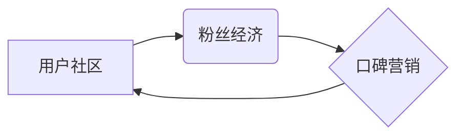

> AI创业公司, 用户社区, 粉丝经济, 口碑营销, 社区运营, 内容营销, 社交媒体, 数据分析, 算法推荐

## 1. 背景介绍

在当今数字时代，用户社区已成为AI创业公司发展的重要驱动力。用户社区不仅可以为企业提供宝贵的用户反馈和市场洞察，还能有效提升品牌知名度和用户粘性。而粉丝经济和口碑营销则是构建和运营用户社区的关键策略。

AI创业公司凭借其强大的技术优势，可以更有效地利用粉丝经济和口碑营销，打造活跃、粘性的用户社区。例如，AI驱动的个性化推荐算法可以帮助企业精准推送用户感兴趣的内容，增强用户参与度；AI语音助手和聊天机器人可以提供更便捷的用户服务，提升用户体验；AI数据分析工具可以帮助企业洞察用户行为，优化社区运营策略。

## 2. 核心概念与联系

### 2.1. 用户社区

用户社区是指由共享共同兴趣、目标或价值观的用户组成的网络平台。它是一个用户可以交流、分享、协作的虚拟空间，能够促进用户之间的互动和粘性。

### 2.2. 粉丝经济

粉丝经济是指以粉丝为核心，通过内容营销、互动营销等方式，建立粉丝与品牌之间的深度连接，从而实现商业价值的经济模式。

### 2.3. 口碑营销

口碑营销是指通过用户对产品或服务的真实评价和推荐，来影响其他用户的购买决策的营销方式。

**核心概念联系图:**



## 3. 核心算法原理 & 具体操作步骤

### 3.1. 算法原理概述

AI创业公司在用户社区运营中，可以利用多种算法来实现精准推荐、内容过滤、用户画像等功能。

* **协同过滤算法:** 通过分析用户历史行为数据，预测用户对特定内容的兴趣，实现个性化推荐。
* **内容过滤算法:** 基于内容的主题、标签、关键词等信息，推荐与用户兴趣相符的内容。
* **深度学习算法:** 利用神经网络模型，从海量用户数据中学习用户行为模式，实现更精准的推荐和预测。

### 3.2. 算法步骤详解

以协同过滤算法为例，其具体操作步骤如下：

1. **数据收集:** 收集用户行为数据，例如用户浏览记录、点赞记录、评论记录等。
2. **数据预处理:** 对数据进行清洗、去噪、格式转换等处理，确保数据质量。
3. **用户相似度计算:** 利用余弦相似度、皮尔逊相关系数等方法，计算用户之间的相似度。
4. **推荐算法:** 根据用户相似度和历史行为数据，推荐用户可能感兴趣的内容。

### 3.3. 算法优缺点

**协同过滤算法:**

* **优点:** 可以发现用户之间的隐性关联，推荐个性化内容。
* **缺点:** 数据稀疏性问题，新用户和新内容推荐效果较差。

**内容过滤算法:**

* **优点:** 可以根据内容本身特征进行推荐，推荐效果更精准。
* **缺点:** 容易陷入内容同质化问题，缺乏个性化。

### 3.4. 算法应用领域

* **电商平台:** 商品推荐、用户画像
* **社交媒体:** 内容推荐、用户匹配
* **视频网站:** 视频推荐、用户兴趣分析
* **音乐平台:** 音乐推荐、用户喜好分析

## 4. 数学模型和公式 & 详细讲解 & 举例说明

### 4.1. 数学模型构建

协同过滤算法的核心是用户-物品评分矩阵，其中每个元素代表用户对特定物品的评分。

**用户-物品评分矩阵:**

```
| 用户 | 物品1 | 物品2 | 物品3 |
|---|---|---|---|
| 用户1 | 5 | 3 | 4 |
| 用户2 | 4 | 5 | 2 |
| 用户3 | 3 | 4 | 5 |
```

### 4.2. 公式推导过程

**余弦相似度:**

$$
\text{相似度} = \frac{\mathbf{u} \cdot \mathbf{v}}{\|\mathbf{u}\| \|\mathbf{v}\|}
$$

其中:

* $\mathbf{u}$ 和 $\mathbf{v}$ 是两个用户的评分向量。
* $\cdot$ 表示向量点积。
* $\|\mathbf{u}\|$ 和 $\|\mathbf{v}\|$ 表示向量的模长。

### 4.3. 案例分析与讲解

假设有两个用户，用户1的评分向量为 [5, 3, 4]，用户2的评分向量为 [4, 5, 2]。

使用余弦相似度公式计算用户1和用户2的相似度:

$$
\text{相似度} = \frac{(5 \times 4) + (3 \times 5) + (4 \times 2)}{( \sqrt{5^2 + 3^2 + 4^2}) \times (\sqrt{4^2 + 5^2 + 2^2})} = 0.78
$$

相似度为0.78，表明用户1和用户2的兴趣偏好有一定的相似性。

## 5. 项目实践：代码实例和详细解释说明

### 5.1. 开发环境搭建

* Python 3.x
* scikit-learn 库
* Pandas 库
* NumPy 库

### 5.2. 源代码详细实现

```python
import pandas as pd
from sklearn.metrics.pairwise import cosine_similarity

# 加载用户-物品评分数据
data = pd.read_csv('ratings.csv')

# 构建用户-物品评分矩阵
user_item_matrix = data.pivot_table(index='user_id', columns='item_id', values='rating')

# 计算用户之间的余弦相似度
user_similarity = cosine_similarity(user_item_matrix)

# 获取用户1和用户2的相似度
user1_id = 1
user2_id = 2
similarity = user_similarity[user1_id, user2_id]

print(f'用户{user1_id}和用户{user2_id}的相似度为:{similarity}')
```

### 5.3. 代码解读与分析

* 代码首先加载用户-物品评分数据，并构建用户-物品评分矩阵。
* 然后使用scikit-learn库中的cosine_similarity函数计算用户之间的余弦相似度。
* 最后获取用户1和用户2的相似度，并打印输出。

### 5.4. 运行结果展示

运行代码后，会输出用户1和用户2的相似度值。

## 6. 实际应用场景

### 6.1. 内容推荐

AI创业公司可以利用用户行为数据和协同过滤算法，推荐用户可能感兴趣的内容，例如新闻、视频、文章等。

### 6.2. 个性化服务

AI创业公司可以利用用户画像和深度学习算法，提供个性化的服务，例如定制化产品推荐、个性化客服服务等。

### 6.3. 社区运营

AI创业公司可以利用数据分析工具，洞察用户行为，优化社区运营策略，例如内容策划、活动组织、用户管理等。

### 6.4. 未来应用展望

随着人工智能技术的不断发展，AI创业公司在用户社区运营中的应用场景将更加广泛，例如：

* 更精准的个性化推荐
* 更智能的社区管理
* 更丰富的用户互动体验

## 7. 工具和资源推荐

### 7.1. 学习资源推荐

* **书籍:**
    * 《推荐系统实践》
    * 《深度学习》
* **在线课程:**
    * Coursera: 机器学习
    * edX: 深度学习

### 7.2. 开发工具推荐

* **Python:** 
    * scikit-learn
    * Pandas
    * NumPy
* **云平台:**
    * AWS
    * Azure
    * Google Cloud

### 7.3. 相关论文推荐

* **协同过滤算法:**
    * "Collaborative Filtering for Implicit Feedback Datasets"
* **深度学习推荐系统:**
    * "Deep Learning for Recommender Systems"

## 8. 总结：未来发展趋势与挑战

### 8.1. 研究成果总结

AI创业公司在用户社区运营中取得了显著成果，例如精准推荐、个性化服务、智能社区管理等。

### 8.2. 未来发展趋势

* **更精准的个性化推荐:** 利用更先进的算法和数据分析技术，实现更精准的个性化推荐。
* **更智能的社区管理:** 利用人工智能技术，实现更智能的社区管理，例如自动识别和处理恶意评论、自动生成社区内容等。
* **更丰富的用户互动体验:** 利用虚拟现实、增强现实等技术，打造更丰富的用户互动体验。

### 8.3. 面临的挑战

* **数据隐私保护:** 如何保护用户数据隐私，是AI创业公司面临的重要挑战。
* **算法公平性:** 如何确保算法公平公正，避免算法歧视，也是AI创业公司需要关注的问题。
* **技术可解释性:** 如何提高算法的可解释性，让用户理解算法是如何工作的，也是AI创业公司需要解决的问题。

### 8.4. 研究展望

未来，AI创业公司将继续探索更先进的算法和技术，打造更活跃、粘性的用户社区，为用户提供更优质的服务和体验。

## 9. 附录：常见问题与解答

### 9.1. 如何提高算法推荐效果？

* 丰富用户数据，例如用户行为数据、用户画像数据等。
* 使用更先进的算法，例如深度学习算法。
* 结合多源数据进行推荐，例如用户行为数据、商品属性数据等。

### 9.2. 如何解决数据稀疏性问题？

* 使用矩阵分解算法，例如奇异值分解（SVD）。
* 使用协同过滤算法，例如基于内容的协同过滤算法。
* 使用混合推荐算法，例如基于内容和基于协同过滤的混合算法。

### 9.3. 如何保证算法公平性？

* 使用公平性评估指标，例如公平性、准确性、效率等。
* 使用公平性调整算法，例如正则化、加权平均等。
* 持续监控算法运行情况，及时发现和解决算法偏见问题。


作者：禅与计算机程序设计艺术 / Zen and the Art of Computer Programming 
<end_of_turn>