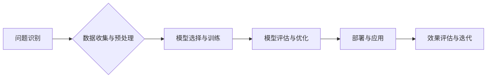

> 人工智能，垂直领域，创业机遇，深度学习，自然语言处理，计算机视觉，数据分析，行业应用

## 1. 背景介绍

人工智能（AI）技术近年来发展迅速，从学术研究走向了实际应用，并开始深刻地改变着我们的生活和工作方式。AI技术的广泛应用为各行各业带来了巨大的机遇，也催生了一批新的创业公司。

传统AI创业模式往往集中在通用型AI平台和基础技术研发，但随着AI技术的成熟，垂直领域应用逐渐成为新的热点。垂直领域AI是指将AI技术应用于特定行业或领域，针对特定问题提供定制化的解决方案。

## 2. 核心概念与联系

垂直领域AI创业的核心概念是将AI技术与特定行业或领域的业务需求相结合，打造具有针对性和实用性的解决方案。

**垂直领域AI创业的流程:**



**核心概念解释:**

* **问题识别:** 首先要明确特定行业或领域面临的痛点和挑战，并将其转化为AI可以解决的问题。
* **数据收集与预处理:** 搜集相关行业数据，并进行清洗、转换、格式化等预处理工作，为模型训练提供高质量的数据。
* **模型选择与训练:** 根据具体问题和数据特点，选择合适的AI模型，并进行训练和优化，使其能够准确地识别和预测目标。
* **模型评估与优化:** 对训练好的模型进行评估，并根据评估结果进行调整和优化，提高模型的性能和准确性。
* **部署与应用:** 将训练好的模型部署到实际应用场景中，并与现有系统或流程进行集成。
* **效果评估与迭代:** 持续监控模型的运行效果，并根据反馈进行迭代优化，不断提升模型的性能和价值。

## 3. 核心算法原理 & 具体操作步骤

### 3.1  算法原理概述

垂直领域AI创业中常用的算法包括深度学习、自然语言处理、计算机视觉等。

* **深度学习:** 深度学习是一种基于多层神经网络的机器学习算法，能够自动学习数据中的特征和模式，并进行预测或分类。
* **自然语言处理:** 自然语言处理是指让计算机能够理解和处理人类语言的技术，包括文本分类、情感分析、机器翻译等。
* **计算机视觉:** 计算机视觉是指让计算机能够“看”和理解图像的技术，包括图像识别、物体检测、图像分割等。

### 3.2  算法步骤详解

**以深度学习为例，其训练步骤如下:**

1. **数据准备:** 收集和预处理训练数据，包括数据清洗、格式化、标签标注等。
2. **模型选择:** 根据任务需求选择合适的深度学习模型，例如卷积神经网络（CNN）、循环神经网络（RNN）等。
3. **模型训练:** 使用训练数据训练模型，调整模型参数，使其能够准确地预测或分类目标。
4. **模型评估:** 使用测试数据评估模型的性能，例如准确率、召回率、F1-score等。
5. **模型优化:** 根据评估结果调整模型参数或结构，提高模型的性能。
6. **模型部署:** 将训练好的模型部署到实际应用场景中。

### 3.3  算法优缺点

**深度学习算法的优点:**

* 能够自动学习数据中的特征，无需人工特征工程。
* 性能优异，在许多任务中取得了突破性进展。
* 可处理大规模数据。

**深度学习算法的缺点:**

* 训练数据量要求高。
* 训练时间长，计算资源消耗大。
* 模型解释性差，难以理解模型的决策过程。

### 3.4  算法应用领域

深度学习、自然语言处理、计算机视觉等算法广泛应用于各个行业，例如：

* **医疗保健:** 疾病诊断、药物研发、医疗影像分析。
* **金融服务:** 风险评估、欺诈检测、客户服务自动化。
* **制造业:** 质量控制、预测性维护、生产优化。
* **零售业:** 商品推荐、个性化营销、库存管理。
* **教育:** 智能辅导、个性化学习、自动批改作业。

## 4. 数学模型和公式 & 详细讲解 & 举例说明

### 4.1  数学模型构建

深度学习模型的数学基础是神经网络，其核心是多层神经元之间的连接和激活函数。

**神经网络模型:**

```latex
y = f(W_L * a_{L-1} + b_L)
```

其中:

* $y$ 是输出值
* $a_{L-1}$ 是上一层神经元的输出值
* $W_L$ 是当前层神经元权重矩阵
* $b_L$ 是当前层神经元的偏置项
* $f$ 是激活函数

### 4.2  公式推导过程

深度学习模型的训练过程是通过反向传播算法来优化模型参数。

**反向传播算法:**

1. 计算模型输出与真实值的误差。
2. 根据误差反向传播，计算各层神经元的梯度。
3. 使用梯度下降算法更新模型参数。

### 4.3  案例分析与讲解

**举例说明:**

假设我们训练一个图像分类模型，目标是识别猫和狗的图片。

* **输入数据:** 猫和狗的图片数据。
* **模型结构:** 使用卷积神经网络（CNN）作为模型架构。
* **训练过程:** 使用反向传播算法训练模型，优化模型参数，使其能够准确地识别猫和狗的图片。
* **评估结果:** 使用测试数据评估模型的准确率，例如90%的准确率表示模型能够正确识别90%的猫和狗图片。

## 5. 项目实践：代码实例和详细解释说明

### 5.1  开发环境搭建

* **操作系统:** Ubuntu 20.04 LTS
* **编程语言:** Python 3.8
* **深度学习框架:** TensorFlow 2.0
* **其他工具:** Jupyter Notebook、Git

### 5.2  源代码详细实现

```python
import tensorflow as tf

# 定义模型结构
model = tf.keras.models.Sequential([
    tf.keras.layers.Conv2D(32, (3, 3), activation='relu', input_shape=(28, 28, 1)),
    tf.keras.layers.MaxPooling2D((2, 2)),
    tf.keras.layers.Conv2D(64, (3, 3), activation='relu'),
    tf.keras.layers.MaxPooling2D((2, 2)),
    tf.keras.layers.Flatten(),
    tf.keras.layers.Dense(10, activation='softmax')
])

# 编译模型
model.compile(optimizer='adam',
              loss='sparse_categorical_crossentropy',
              metrics=['accuracy'])

# 训练模型
model.fit(x_train, y_train, epochs=5)

# 评估模型
loss, accuracy = model.evaluate(x_test, y_test)
print('Test loss:', loss)
print('Test accuracy:', accuracy)
```

### 5.3  代码解读与分析

* **模型结构:** 代码定义了一个简单的卷积神经网络模型，包含两层卷积层、两层最大池化层、一层全连接层和一层输出层。
* **模型编译:** 使用Adam优化器、交叉熵损失函数和准确率作为评估指标编译模型。
* **模型训练:** 使用训练数据训练模型，训练5个epoch。
* **模型评估:** 使用测试数据评估模型的性能，输出测试损失和准确率。

### 5.4  运行结果展示

训练完成后，模型的准确率通常会达到较高的水平，例如90%以上。

## 6. 实际应用场景

### 6.1  医疗保健

* **疾病诊断:** 利用深度学习算法分析医学影像数据，辅助医生诊断疾病，例如癌症、心血管疾病等。
* **药物研发:** 利用机器学习算法分析药物分子结构和生物活性数据，加速药物研发过程。
* **医疗影像分析:** 利用计算机视觉算法分析医学影像数据，例如X光片、CT扫描、MRI等，辅助医生进行诊断和治疗。

### 6.2  金融服务

* **风险评估:** 利用机器学习算法分析客户的财务数据，评估其信用风险和投资风险。
* **欺诈检测:** 利用机器学习算法分析交易数据，识别和预防欺诈行为。
* **客户服务自动化:** 利用自然语言处理算法构建智能客服系统，自动回答客户的常见问题。

### 6.3  制造业

* **质量控制:** 利用计算机视觉算法分析产品图像，识别缺陷和异常情况。
* **预测性维护:** 利用机器学习算法分析设备运行数据，预测设备故障，进行提前维护。
* **生产优化:** 利用机器学习算法优化生产流程，提高生产效率和降低成本。

### 6.4  未来应用展望

随着AI技术的不断发展，垂直领域AI创业将迎来更大的发展机遇。未来，AI将更加深入地融入各个行业，为人类社会带来更多价值。

## 7. 工具和资源推荐

### 7.1  学习资源推荐

* **在线课程:** Coursera、edX、Udacity等平台提供丰富的AI课程。
* **书籍:** 《深度学习》、《机器学习》、《自然语言处理》等经典书籍。
* **博客和论坛:** TensorFlow、PyTorch等深度学习框架的官方博客和论坛。

### 7.2  开发工具推荐

* **深度学习框架:** TensorFlow、PyTorch、Keras等。
* **数据处理工具:** Pandas、NumPy等。
* **可视化工具:** Matplotlib、Seaborn等。

### 7.3  相关论文推荐

* **深度学习:** 《ImageNet Classification with Deep Convolutional Neural Networks》
* **自然语言处理:** 《Attention Is All You Need》
* **计算机视觉:** 《YOLO: You Only Look Once》

## 8. 总结：未来发展趋势与挑战

### 8.1  研究成果总结

垂直领域AI创业取得了显著的成果，在医疗保健、金融服务、制造业等领域应用广泛。

### 8.2  未来发展趋势

* **模型更加智能化:** AI模型将更加智能化，能够更好地理解和处理复杂问题。
* **数据更加丰富:** AI模型将训练于更加丰富的数据集，提高模型的准确性和泛化能力。
* **应用更加广泛:** AI将应用于更多领域，为人类社会带来更多价值。

### 8.3  面临的挑战

* **数据安全和隐私保护:** AI模型训练需要大量数据，如何保证数据安全和隐私保护是一个重要挑战。
* **算法解释性和可信度:** AI模型的决策过程往往难以解释，如何提高算法的解释性和可信度是一个重要问题。
* **人才短缺:** AI领域人才需求量大，如何培养更多AI人才是一个重要挑战。

### 8.4  研究展望

未来，垂直领域AI创业将继续发展，并面临新的挑战和机遇。我们需要不断探索新的算法、新的应用场景，并解决数据安全、算法解释性等问题，推动AI技术更好地服务于人类社会。

## 9. 附录：常见问题与解答

**常见问题:**

* **什么是垂直领域AI？**

垂直领域AI是指将AI技术应用于特定行业或领域，针对特定问题提供定制化的解决方案。

* **垂直领域AI创业有哪些优势？**

垂直领域AI创业可以更好地满足特定行业或领域的实际需求，更容易获得市场认可和商业价值。

* **垂直领域AI创业有哪些挑战？**

垂直领域AI创业需要深入了解特定行业或领域的业务需求，并解决数据安全、算法解释性等问题。

**解答:**

* **什么是垂直领域AI？**

垂直领域AI是指将AI技术应用于特定行业或领域，针对特定问题提供定制化的解决方案。

* **垂直领域AI创业有哪些优势？**

垂直领域AI创业可以更好地满足特定行业或领域的实际需求，更容易获得市场认可和商业价值。

*