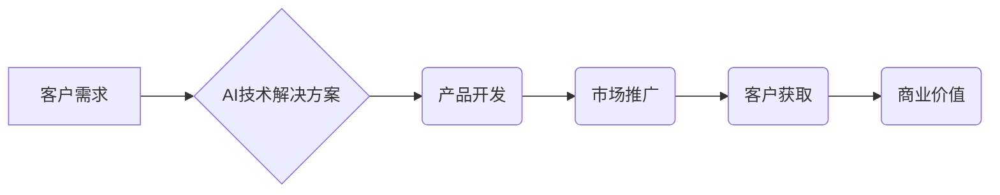

> AI创业,客户获取,投资者融资,商业模式,技术验证,市场分析,产品开发,团队建设,风险控制

## 1. 背景介绍

人工智能（AI）技术近年来发展迅速，已渗透到各个行业，为企业带来了巨大的机遇。许多创业者看到了AI的潜力，纷纷涌入AI创业领域。然而，AI创业并非易事，需要克服许多挑战，才能成功吸引客户和投资者。

## 2. 核心概念与联系

**2.1 AI创业的核心概念**

AI创业是指利用人工智能技术开发和商业化的创业活动。它涵盖了从AI算法研发、数据采集和处理到产品开发、市场推广和商业模式创新的全过程。

**2.2 AI创业与传统创业的联系与区别**

AI创业与传统创业在某些方面存在相似之处，例如都需要明确的商业目标、有效的市场策略和优秀的团队。但AI创业也存在一些独特的特点：

* **技术驱动:** AI创业的核心是人工智能技术，需要具备强大的技术实力和研发能力。
* **数据依赖:** AI算法的训练和优化需要大量的数据，数据获取和处理是AI创业的关键环节。
* **迭代发展:** AI技术不断发展，AI创业需要具备持续学习和迭代的能力，不断改进产品和服务。

**2.3 AI创业的商业模式**

AI创业的商业模式多种多样，例如：

* **SaaS模式:** 提供基于云计算的AI服务，用户按需付费使用。
* **平台模式:** 建立AI平台，连接开发者和用户，通过交易佣金或广告收入盈利。
* **定制开发模式:** 为企业提供定制化的AI解决方案，例如智能客服、智能推荐等。

**2.4 AI创业的风险与挑战**

AI创业也面临着一些风险和挑战，例如：

* **技术风险:** AI技术发展迅速，需要不断学习和更新知识，才能保持竞争力。
* **数据风险:** 数据安全和隐私保护是AI创业面临的重要挑战。
* **市场风险:** AI市场竞争激烈，需要找到独特的市场定位和竞争优势。

**2.5 Mermaid 流程图**



## 3. 核心算法原理 & 具体操作步骤

**3.1 算法原理概述**

深度学习是AI创业中常用的算法之一，它能够从海量数据中学习复杂的模式和关系。深度学习算法的核心是多层神经网络，通过不断训练，神经网络能够自动提取特征，并进行预测或分类。

**3.2 算法步骤详解**

1. **数据预处理:** 将原始数据清洗、转换和格式化，使其适合深度学习算法的训练。
2. **模型构建:** 设计和构建多层神经网络模型，包括输入层、隐藏层和输出层。
3. **模型训练:** 使用训练数据训练神经网络模型，调整模型参数，使其能够准确地预测或分类数据。
4. **模型评估:** 使用测试数据评估模型的性能，例如准确率、召回率和F1-score。
5. **模型部署:** 将训练好的模型部署到生产环境中，用于实际应用。

**3.3 算法优缺点**

**优点:**

* 能够学习复杂的模式和关系。
* 性能优于传统机器学习算法。
* 可应用于多种领域，例如图像识别、自然语言处理和语音识别。

**缺点:**

* 需要大量的数据进行训练。
* 训练时间长，计算资源消耗大。
* 模型解释性差，难以理解模型的决策过程。

**3.4 算法应用领域**

深度学习算法已广泛应用于各个领域，例如：

* **图像识别:** 人脸识别、物体检测、图像分类。
* **自然语言处理:** 机器翻译、文本摘要、情感分析。
* **语音识别:** 语音转文本、语音助手。
* **推荐系统:** 商品推荐、内容推荐。

## 4. 数学模型和公式 & 详细讲解 & 举例说明

**4.1 数学模型构建**

深度学习模型通常采用多层感知机（MLP）或卷积神经网络（CNN）等结构。

**4.2 公式推导过程**

深度学习模型的训练过程基于梯度下降算法，其核心公式为：

$$
\theta = \theta - \alpha \nabla L(\theta)
$$

其中：

* $\theta$ 是模型参数。
* $\alpha$ 是学习率。
* $L(\theta)$ 是损失函数，用于衡量模型预测结果与真实值的差异。
* $\nabla L(\theta)$ 是损失函数对模型参数的梯度。

**4.3 案例分析与讲解**

例如，在图像分类任务中，损失函数通常采用交叉熵损失函数，其公式为：

$$
L(\theta) = -\sum_{i=1}^{N} y_i \log(p_i)
$$

其中：

* $N$ 是样本数量。
* $y_i$ 是真实标签。
* $p_i$ 是模型预测的概率。

通过梯度下降算法，不断更新模型参数，使损失函数最小化，从而提高模型的分类准确率。

## 5. 项目实践：代码实例和详细解释说明

**5.1 开发环境搭建**

使用Python语言和深度学习框架TensorFlow或PyTorch进行开发。

**5.2 源代码详细实现**

```python
import tensorflow as tf

# 定义模型结构
model = tf.keras.models.Sequential([
    tf.keras.layers.Conv2D(32, (3, 3), activation='relu', input_shape=(28, 28, 1)),
    tf.keras.layers.MaxPooling2D((2, 2)),
    tf.keras.layers.Conv2D(64, (3, 3), activation='relu'),
    tf.keras.layers.MaxPooling2D((2, 2)),
    tf.keras.layers.Flatten(),
    tf.keras.layers.Dense(10, activation='softmax')
])

# 编译模型
model.compile(optimizer='adam',
              loss='sparse_categorical_crossentropy',
              metrics=['accuracy'])

# 训练模型
model.fit(x_train, y_train, epochs=5)

# 评估模型
loss, accuracy = model.evaluate(x_test, y_test)
print('Test loss:', loss)
print('Test accuracy:', accuracy)
```

**5.3 代码解读与分析**

这段代码定义了一个简单的卷积神经网络模型，用于手写数字识别任务。

* `tf.keras.models.Sequential` 创建了一个顺序模型，层级结构清晰。
* `tf.keras.layers.Conv2D` 定义卷积层，用于提取图像特征。
* `tf.keras.layers.MaxPooling2D` 定义最大池化层，用于降维和提高模型鲁棒性。
* `tf.keras.layers.Flatten` 将多维特征转换为一维向量。
* `tf.keras.layers.Dense` 定义全连接层，用于分类。
* `model.compile` 编译模型，指定优化器、损失函数和评价指标。
* `model.fit` 训练模型，使用训练数据进行迭代训练。
* `model.evaluate` 评估模型，使用测试数据计算损失和准确率。

**5.4 运行结果展示**

训练完成后，模型能够准确识别手写数字。

## 6. 实际应用场景

**6.1 智能客服**

AI创业可以开发智能客服系统，自动回答客户常见问题，提高客户服务效率。

**6.2 智能推荐**

AI创业可以开发智能推荐系统，根据用户的行为和偏好，推荐个性化的商品或内容。

**6.3 自动化决策**

AI创业可以开发自动化决策系统，例如信用评分、风险评估等，提高决策效率和准确性。

**6.4 未来应用展望**

AI创业的应用场景还在不断扩展，未来将应用于更多领域，例如医疗、教育、金融等。

## 7. 工具和资源推荐

**7.1 学习资源推荐**

* **在线课程:** Coursera、edX、Udacity等平台提供丰富的AI课程。
* **书籍:** 《深度学习》、《机器学习实战》等书籍是AI学习的经典教材。
* **开源项目:** TensorFlow、PyTorch等开源项目提供了丰富的代码示例和学习资源。

**7.2 开发工具推荐**

* **深度学习框架:** TensorFlow、PyTorch、Keras等框架提供了高效的深度学习开发工具。
* **云计算平台:** AWS、Azure、GCP等云计算平台提供了强大的计算资源和AI服务。
* **数据处理工具:** Pandas、NumPy等工具提供了高效的数据处理和分析能力。

**7.3 相关论文推荐**

* **ImageNet Classification with Deep Convolutional Neural Networks**
* **Attention Is All You Need**
* **BERT: Pre-training of Deep Bidirectional Transformers for Language Understanding**

## 8. 总结：未来发展趋势与挑战

**8.1 研究成果总结**

近年来，AI技术取得了长足的进步，在图像识别、自然语言处理、语音识别等领域取得了突破性进展。

**8.2 未来发展趋势**

* **模型规模化:** 模型规模将继续扩大，训练数据量和计算资源将进一步增加。
* **模型泛化能力:** 研究将更加注重模型的泛化能力，使其能够适应更多场景和数据分布。
* **模型解释性:** 研究将更加注重模型的解释性，使其能够更好地理解模型的决策过程。

**8.3 面临的挑战**

* **数据安全和隐私保护:** AI模型的训练和应用需要大量的数据，如何保证数据安全和隐私保护是重要的挑战。
* **算法公平性和可解释性:** AI算法可能存在偏见和不可解释性，如何确保算法公平性和可解释性是重要的伦理问题。
* **人才短缺:** AI领域人才需求量大，如何培养和吸引AI人才是重要的挑战。

**8.4 研究展望**

未来，AI研究将更加注重模型的鲁棒性、泛化能力和解释性，并将更加深入地探索AI与人类的协同工作模式。

## 9. 附录：常见问题与解答

**9.1 如何选择合适的AI算法？**

选择合适的AI算法需要根据具体任务和数据特点进行选择。例如，图像识别任务可以使用卷积神经网络，文本分类任务可以使用循环神经网络。

**9.2 如何处理不平衡数据？**

不平衡数据是指训练数据中某些类别样本数量远少于其他类别样本数量。可以使用数据增广、权重调整等方法处理不平衡数据。

**9.3 如何评估AI模型的性能？**

可以使用准确率、召回率、F1-score等指标评估AI模型的性能。

**9.4 如何部署AI模型？**

可以使用云计算平台、容器技术等方式部署AI模型。


作者：禅与计算机程序设计艺术 / Zen and the Art of Computer Programming 
<end_of_turn>