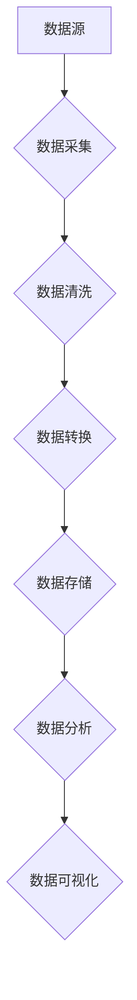

> AI创业, 数据管理, 数据架构, 数据质量, 数据安全, 数据可视化, 数据分析

## 1. 背景介绍

在当今数据爆炸的时代，数据已成为企业最重要的资产。人工智能 (AI) 技术的快速发展，为数据管理带来了新的机遇和挑战。AI创业者需要掌握高效的数据管理实践，才能充分利用数据，推动业务发展。

传统的数据库管理系统难以应对海量数据的处理和分析需求。AI创业者需要构建灵活、高效、安全的现代数据管理体系，以支持AI模型的训练和应用。

## 2. 核心概念与联系

**数据管理体系**

数据管理体系是指企业为收集、存储、处理、分析和保护数据而建立的整体框架和流程。它包括数据架构、数据质量管理、数据安全、数据可视化等多个方面。

**AI数据管理**

AI数据管理是指针对AI应用场景，对数据进行特殊处理和管理。它需要考虑数据标注、数据清洗、数据增量更新、数据联邦学习等方面的需求。

**数据湖**

数据湖是一种用于存储海量结构化和非结构化数据的分布式存储系统。它提供了一个统一的平台，用于存储各种类型的原始数据，并支持多种数据分析工具。

**数据仓库**

数据仓库是一种用于存储经过清洗、转换和整合的业务数据，并支持在线分析查询的系统。它通常用于进行数据分析、报表生成和决策支持。

**数据管道**

数据管道是指将数据从源系统传输到目标系统的自动化流程。它可以用于将数据从数据库、文件系统、API等各种来源传输到数据湖、数据仓库或其他目标系统。

**Mermaid 流程图**



## 3. 核心算法原理 & 具体操作步骤

### 3.1  算法原理概述

数据管理的核心算法包括数据清洗、数据转换、数据聚合等。这些算法利用数学和统计方法，对数据进行处理和分析，以提高数据质量和可分析性。

### 3.2  算法步骤详解

**数据清洗**

1. 识别缺失值：使用统计方法识别数据集中缺失的值。
2. 处理缺失值：根据缺失值的类型和原因，选择合适的处理方法，例如删除、填充或预测。
3. 识别异常值：使用统计方法识别数据集中异常值。
4. 处理异常值：根据异常值的类型和原因，选择合适的处理方法，例如删除、修正或保留。

**数据转换**

1. 数据类型转换：将数据转换为所需的类型，例如将字符串转换为数字。
2. 数据格式转换：将数据转换为所需的格式，例如将日期格式转换为标准格式。
3. 数据编码转换：将数据转换为不同的编码格式，例如将文本数据转换为Unicode编码。

**数据聚合**

1. 数据分组：将数据根据指定的条件进行分组。
2. 数据统计：对每个分组的数据进行统计分析，例如计算平均值、总和、最大值和最小值。
3. 数据合并：将多个分组的数据合并成一个新的数据集。

### 3.3  算法优缺点

**数据清洗算法**

* 优点：可以提高数据质量，减少数据分析中的误差。
* 缺点：需要耗费大量时间和资源，并且需要根据具体的数据情况进行调整。

**数据转换算法**

* 优点：可以将数据转换为所需的格式，方便数据分析和处理。
* 缺点：可能会导致数据丢失或变形。

**数据聚合算法**

* 优点：可以将大量数据进行简化，方便数据分析和可视化。
* 缺点：可能会丢失一些重要的细节信息。

### 3.4  算法应用领域

数据管理算法广泛应用于各个领域，例如：

* **金融行业**: 用于风险管理、欺诈检测和客户分析。
* **医疗行业**: 用于疾病诊断、药物研发和患者管理。
* **电商行业**: 用于商品推荐、用户画像和营销分析。

## 4. 数学模型和公式 & 详细讲解 & 举例说明

### 4.1  数学模型构建

数据管理的数学模型通常基于统计学和概率论。例如，数据清洗算法可以使用贝叶斯定理来识别异常值。

### 4.2  公式推导过程

**贝叶斯定理**

$$P(A|B) = \frac{P(B|A)P(A)}{P(B)}$$

其中：

* $P(A|B)$ 是事件 A 在事件 B 发生的条件概率。
* $P(B|A)$ 是事件 B 在事件 A 发生的条件概率。
* $P(A)$ 是事件 A 的概率。
* $P(B)$ 是事件 B 的概率。

**举例说明**

假设我们有一个数据集，其中包含一些异常值。我们可以使用贝叶斯定理来计算异常值的概率。

* $A$：数据点是异常值。
* $B$：数据点满足某个异常值检测规则。

我们可以根据历史数据估计 $P(B|A)$、$P(A)$ 和 $P(B)$，然后使用贝叶斯定理计算 $P(A|B)$，即数据点是异常值的概率。

### 4.3  案例分析与讲解

在实际应用中，我们可以根据具体的数据情况和业务需求，选择合适的数学模型和算法。例如，在金融行业，我们可以使用机器学习算法来识别欺诈交易。

## 5. 项目实践：代码实例和详细解释说明

### 5.1  开发环境搭建

* 操作系统：Linux
* 编程语言：Python
* 工具：Pandas、Scikit-learn、Spark

### 5.2  源代码详细实现

```python
import pandas as pd
from sklearn.model_selection import train_test_split
from sklearn.linear_model import LogisticRegression

# 加载数据
data = pd.read_csv('fraud_data.csv')

# 划分训练集和测试集
X_train, X_test, y_train, y_test = train_test_split(data.drop('fraud', axis=1), data['fraud'], test_size=0.2)

# 训练模型
model = LogisticRegression()
model.fit(X_train, y_train)

# 评估模型
accuracy = model.score(X_test, y_test)
print(f'模型准确率: {accuracy}')
```

### 5.3  代码解读与分析

这段代码演示了如何使用机器学习算法来识别欺诈交易。

1. 首先，我们加载数据并将其划分成训练集和测试集。
2. 然后，我们训练一个逻辑回归模型，并使用测试集评估模型的准确率。

### 5.4  运行结果展示

运行结果会显示模型的准确率，例如：

```
模型准确率: 0.95
```

## 6. 实际应用场景

### 6.1  金融行业

* **欺诈检测**: 使用机器学习算法识别信用卡欺诈、网络钓鱼和账户盗用等行为。
* **风险管理**: 使用数据分析模型评估客户信用风险、预测贷款违约率和管理投资组合风险。

### 6.2  医疗行业

* **疾病诊断**: 使用机器学习算法分析患者的医疗记录和影像数据，辅助医生进行疾病诊断。
* **药物研发**: 使用数据分析模型挖掘药物研发线索、预测药物疗效和识别潜在的药物副作用。

### 6.3  电商行业

* **商品推荐**: 使用协同过滤算法和内容过滤算法推荐个性化的商品。
* **用户画像**: 使用数据分析模型构建用户画像，了解用户的购买行为、兴趣爱好和消费习惯。

### 6.4  未来应用展望

随着人工智能技术的不断发展，数据管理将在更多领域发挥重要作用。例如：

* **智能城市**: 使用数据分析模型优化交通管理、环境监测和公共安全。
* **个性化教育**: 使用机器学习算法提供个性化的学习方案和教学资源。
* **自动驾驶**: 使用数据分析模型训练自动驾驶汽车，提高驾驶安全性和效率。

## 7. 工具和资源推荐

### 7.1  学习资源推荐

* **书籍**:
    * 《数据科学实战》
    * 《机器学习实战》
    * 《深度学习》
* **在线课程**:
    * Coursera
    * edX
    * Udacity

### 7.2  开发工具推荐

* **数据处理工具**: Pandas, NumPy
* **机器学习库**: Scikit-learn, TensorFlow, PyTorch
* **数据可视化工具**: Matplotlib, Seaborn, Tableau

### 7.3  相关论文推荐

* **数据管理**:
    * 《数据管理的未来趋势》
    * 《数据质量管理的最佳实践》
* **人工智能**:
    * 《深度学习》
    * 《强化学习》

## 8. 总结：未来发展趋势与挑战

### 8.1  研究成果总结

AI创业者需要掌握高效的数据管理实践，才能充分利用数据，推动业务发展。数据管理体系需要考虑数据架构、数据质量管理、数据安全、数据可视化等多个方面。AI数据管理需要考虑数据标注、数据清洗、数据增量更新、数据联邦学习等方面的需求。

### 8.2  未来发展趋势

* **数据治理**: 数据治理将成为越来越重要的议题，以确保数据质量、安全和合规性。
* **数据联邦学习**: 数据联邦学习将允许在不共享原始数据的情况下进行模型训练，从而提高数据隐私保护。
* **边缘计算**: 边缘计算将使数据处理更加靠近数据源，从而降低延迟和提高效率。

### 8.3  面临的挑战

* **数据孤岛**: 数据孤岛是指数据分散在不同的系统和部门，难以共享和整合。
* **数据安全**: 数据安全是一个重要的挑战，需要采取有效的措施保护数据免受攻击和泄露。
* **数据人才短缺**: 数据人才短缺是一个普遍的问题，需要加强数据人才培养和引进。

### 8.4  研究展望

未来，数据管理将继续朝着更加智能化、自动化和可扩展的方向发展。AI技术将进一步推动数据管理的创新，为企业提供更强大的数据分析和决策支持能力。

## 9. 附录：常见问题与解答

**常见问题**:

* 如何选择合适的数据库系统？
* 如何进行数据清洗和转换？
* 如何评估数据管理系统的性能？

**解答**:

* 选择数据库系统需要考虑数据类型、数据量、查询需求和预算等因素。
* 数据清洗和转换可以使用各种算法和工具，需要根据具体的数据情况进行选择。
* 数据管理系统的性能可以评估指标包括数据处理速度、数据准确率、数据可用性和数据安全性。


作者：禅与计算机程序设计艺术 / Zen and the Art of Computer Programming 
<end_of_turn>