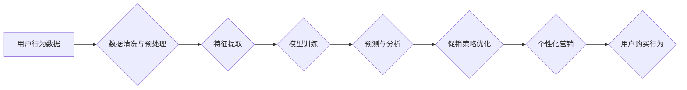

>  电商促销、人工智能、机器学习、推荐系统、个性化营销、预测分析、数据挖掘

## 1. 背景介绍

在当今数字化时代，电商行业竞争日益激烈。为了在激烈的市场竞争中脱颖而出，电商平台需要不断探索新的营销策略，提升用户体验，提高转化率。人工智能（AI）作为一种新兴技术，正在深刻地改变着电商促销的模式。

传统的电商促销策略往往依赖于经验和规则，缺乏针对性和个性化。而AI技术能够通过对海量数据的分析和学习，挖掘用户行为模式，精准预测用户需求，从而实现更精准、更有效的促销策略。

## 2. 核心概念与联系

**2.1 核心概念**

* **电商促销:** 指电商平台通过各种手段，如打折、满减、优惠券、限时抢购等，刺激用户购买商品的行为。
* **人工智能 (AI):**  模拟人类智能的计算机系统，能够通过学习和推理，完成复杂的认知任务。
* **机器学习 (ML):** AI的一个子领域，通过算法训练模型，使模型能够从数据中学习，并做出预测或决策。
* **推荐系统:** 基于用户行为和商品特征，推荐用户可能感兴趣的商品。
* **个性化营销:** 根据用户的个人特征和行为，定制化的营销策略和内容。

**2.2 核心概念联系**

AI技术可以应用于电商促销的各个环节，例如：

* **用户画像:** 利用机器学习算法分析用户行为数据，构建用户画像，了解用户的兴趣、偏好、购买习惯等。
* **商品推荐:** 建立推荐系统，根据用户的兴趣和历史购买记录，推荐相关的商品。
* **促销策略优化:** 利用预测分析模型，预测用户购买行为，优化促销策略，提高转化率。
* **个性化营销:** 根据用户的个性化需求，定制化的促销内容和优惠活动。

**2.3  流程图**



## 3. 核心算法原理 & 具体操作步骤

**3.1 算法原理概述**

在电商促销中，常用的AI算法包括：

* **协同过滤:** 基于用户的相似性或商品的相似性，推荐商品。
* **内容过滤:** 根据商品的特征和用户兴趣，推荐商品。
* **深度学习:** 利用神经网络模型，学习用户行为模式，进行预测和分析。

**3.2 算法步骤详解**

以协同过滤算法为例，其具体步骤如下：

1. **数据收集:** 收集用户行为数据，例如用户购买记录、浏览记录、评分等。
2. **数据预处理:** 清洗数据，处理缺失值，转化数据格式。
3. **用户和商品相似度计算:** 计算用户之间的相似度和商品之间的相似度。
4. **推荐算法:** 根据用户和商品的相似度，推荐用户可能感兴趣的商品。

**3.3 算法优缺点**

* **协同过滤:**
    * **优点:** 可以发现隐含的用户偏好，推荐个性化商品。
    * **缺点:** 数据稀疏性问题，冷启动问题。
* **内容过滤:**
    * **优点:** 不需要用户历史数据，可以推荐新商品。
    * **缺点:** 难以捕捉用户隐含的偏好。
* **深度学习:**
    * **优点:** 可以学习更复杂的特征，提高推荐准确率。
    * **缺点:** 需要大量数据训练，计算资源消耗大。

**3.4 算法应用领域**

* **电商推荐:** 推荐商品、优惠券、促销活动等。
* **内容推荐:** 推荐新闻、视频、音乐等内容。
* **社交推荐:** 推荐好友、群组、活动等。

## 4. 数学模型和公式 & 详细讲解 & 举例说明

**4.1 数学模型构建**

协同过滤算法的数学模型可以表示为用户-商品评分矩阵，其中每个元素表示用户对商品的评分。

**4.2 公式推导过程**

用户相似度计算可以使用余弦相似度公式：

$$
\text{相似度} = \frac{\mathbf{u} \cdot \mathbf{v}}{\|\mathbf{u}\| \|\mathbf{v}\|},
$$

其中：

* $\mathbf{u}$ 和 $\mathbf{v}$ 是两个用户的评分向量。
* $\cdot$ 表示向量点积。
* $\|\mathbf{u}\|$ 和 $\|\mathbf{v}\|$ 表示向量的模长。

**4.3 案例分析与讲解**

假设有两个用户 A 和 B，他们的评分向量分别为：

* $\mathbf{u}_A = [5, 4, 3, 2, 1]$
* $\mathbf{u}_B = [4, 3, 2, 1, 5]$

则它们的余弦相似度为：

$$
\text{相似度} = \frac{(5 \times 4) + (4 \times 3) + (3 \times 2) + (2 \times 1) + (1 \times 5)}{\sqrt{5^2 + 4^2 + 3^2 + 2^2 + 1^2} \sqrt{4^2 + 3^2 + 2^2 + 1^2 + 5^2}} = 0.8
$$

该结果表明，用户 A 和 B 的评分偏好相似度较高。

## 5. 项目实践：代码实例和详细解释说明

**5.1 开发环境搭建**

* Python 3.x
* TensorFlow 或 PyTorch
* Jupyter Notebook

**5.2 源代码详细实现**

```python
import pandas as pd
from sklearn.metrics.pairwise import cosine_similarity

# 加载用户评分数据
ratings_data = pd.read_csv('ratings.csv')

# 计算用户相似度
user_similarity = cosine_similarity(ratings_data.T)

# 获取用户 A 的相似用户
user_A_id = 1
similar_users = user_similarity[user_A_id].argsort()[:-6:-1]

# 推荐商品
recommended_items = ratings_data.iloc[similar_users].mean().sort_values(ascending=False)
```

**5.3 代码解读与分析**

* 首先，加载用户评分数据。
* 然后，使用 `cosine_similarity` 函数计算用户之间的相似度。
* 接着，获取用户 A 的相似用户，并根据相似用户的评分平均值，推荐商品。

**5.4 运行结果展示**

运行代码后，将输出用户 A 的相似用户和推荐商品列表。

## 6. 实际应用场景

**6.1 个性化推荐**

电商平台可以根据用户的兴趣和购买历史，推荐个性化的商品，提高用户体验和转化率。

**6.2 促销活动优化**

AI可以分析用户行为数据，预测用户购买行为，优化促销活动，提高活动效果。

**6.3 营销策略分析**

AI可以分析用户画像和市场趋势，帮助电商平台制定更有效的营销策略。

**6.4 未来应用展望**

* **更精准的个性化推荐:** 利用深度学习等更先进的算法，实现更精准的个性化推荐。
* **实时动态调整促销策略:** 基于实时用户行为数据，动态调整促销策略，提高促销效果。
* **虚拟试衣间:** 利用AR/VR技术，实现虚拟试衣间，提升用户购物体验。

## 7. 工具和资源推荐

**7.1 学习资源推荐**

* **书籍:**
    * 《深度学习》
    * 《机器学习实战》
* **在线课程:**
    * Coursera
    * edX
    * Udemy

**7.2 开发工具推荐**

* **Python:** 
* **TensorFlow:** 
* **PyTorch:** 
* **Scikit-learn:** 

**7.3 相关论文推荐**

* **Collaborative Filtering for Recommender Systems**
* **Deep Learning for Recommender Systems**

## 8. 总结：未来发展趋势与挑战

**8.1 研究成果总结**

AI技术在电商促销领域取得了显著的成果，例如：

* 个性化推荐的准确率提高
* 促销活动效果提升
* 营销策略分析更加精准

**8.2 未来发展趋势**

* 更精准的个性化推荐
* 实时动态调整促销策略
* 虚拟试衣间等新技术应用

**8.3 面临的挑战**

* 数据隐私保护
* 模型解释性
* 算法公平性

**8.4 研究展望**

未来，AI技术在电商促销领域将继续发展，并带来更多创新应用。

## 9. 附录：常见问题与解答

**9.1 如何解决数据稀疏性问题？**

可以使用矩阵分解等方法，从稀疏的用户-商品评分矩阵中学习潜在的特征。

**9.2 如何评估推荐系统的效果？**

可以使用准确率、召回率、F1-score等指标评估推荐系统的效果。

**9.3 如何保证模型的公平性？**

需要关注模型训练数据是否具有偏见，并采取措施避免模型产生歧视性结果。


作者：禅与计算机程序设计艺术 / Zen and the Art of Computer Programming 
<end_of_turn>