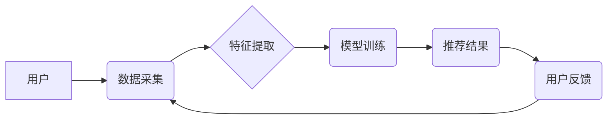

>  人工智能、电商、推荐系统、个性化、机器学习、深度学习

## 1. 背景介绍

电子商务行业近年来发展迅速，用户数量不断增长，商品种类日益丰富。然而，随着市场竞争的加剧，电商平台面临着如何提升用户体验、提高转化率、挖掘潜在商机等一系列挑战。人工智能（AI）技术作为一种新兴技术，凭借其强大的数据处理能力和智能决策能力，为电商行业带来了新的机遇和可能性。

AI技术在电商领域的应用已初具规模，涵盖了推荐系统、个性化营销、智能客服、物流优化等多个方面。其中，推荐系统是AI技术在电商领域应用最广泛的场景之一。通过分析用户的历史购买记录、浏览行为、兴趣偏好等数据，AI算法可以精准推荐用户感兴趣的商品，提高用户购物体验和转化率。

## 2. 核心概念与联系

**2.1 核心概念**

* **人工智能 (AI):** 人工智能是指模拟人类智能行为的计算机系统。它包括机器学习、深度学习、自然语言处理等多个分支领域。
* **电商平台:** 电子商务平台是指提供商品展示、交易、支付等服务的在线平台。
* **推荐系统:** 推荐系统是一种利用数据挖掘和机器学习算法，根据用户的历史行为和偏好，推荐用户感兴趣的商品或内容的系统。

**2.2 架构图**



**2.3 联系**

AI技术与电商平台的结合，使得推荐系统能够更加精准、个性化。通过AI算法的分析和学习，电商平台可以更好地理解用户的需求，并提供更符合用户偏好的商品推荐，从而提升用户体验和转化率。

## 3. 核心算法原理 & 具体操作步骤

**3.1 算法原理概述**

推荐系统常用的算法包括协同过滤、内容过滤、基于知识的推荐等。

* **协同过滤:** 基于用户的历史行为和商品的相似性进行推荐。
* **内容过滤:** 基于商品的属性和用户的兴趣偏好进行推荐。
* **基于知识的推荐:** 基于商品的类别、属性、用户评论等知识进行推荐。

**3.2 算法步骤详解**

以协同过滤算法为例，其具体步骤如下：

1. **数据收集:** 收集用户的历史购买记录、浏览记录、评分等数据，以及商品的属性信息。
2. **数据预处理:** 对收集到的数据进行清洗、转换、填充等预处理操作，以确保数据的质量和一致性。
3. **相似度计算:** 计算用户之间的相似度和商品之间的相似度。常用的相似度计算方法包括余弦相似度、皮尔逊相关系数等。
4. **推荐生成:** 根据用户的相似用户和商品的相似商品，生成推荐结果。

**3.3 算法优缺点**

* **优点:** 能够推荐用户可能感兴趣但未曾接触过的商品，提高推荐的惊喜感。
* **缺点:** 当数据量较少时，算法效果可能不佳，容易出现冷启动问题。

**3.4 算法应用领域**

协同过滤算法广泛应用于电商平台的商品推荐、电影推荐、音乐推荐等场景。

## 4. 数学模型和公式 & 详细讲解 & 举例说明

**4.1 数学模型构建**

协同过滤算法的核心是计算用户之间的相似度和商品之间的相似度。常用的相似度计算方法是余弦相似度。

**4.2 公式推导过程**

设用户 $u$ 和用户 $v$ 的特征向量分别为 $u$ 和 $v$，则用户 $u$ 和用户 $v$ 的余弦相似度为：

$$
\text{相似度}(u, v) = \frac{u \cdot v}{||u|| ||v||}
$$

其中，$u \cdot v$ 表示 $u$ 和 $v$ 的点积，$||u||$ 和 $||v||$ 分别表示 $u$ 和 $v$ 的模长。

**4.3 案例分析与讲解**

假设有两个用户 $u$ 和 $v$，他们的特征向量分别为：

* $u = (1, 2, 3)$
* $v = (2, 3, 1)$

则用户 $u$ 和用户 $v$ 的余弦相似度为：

$$
\text{相似度}(u, v) = \frac{(1 \times 2) + (2 \times 3) + (3 \times 1)}{ \sqrt{1^2 + 2^2 + 3^2} \times \sqrt{2^2 + 3^2 + 1^2}} = \frac{11}{\sqrt{14} \times \sqrt{14}} = \frac{11}{14}
$$

结果表明，用户 $u$ 和用户 $v$ 的相似度为 0.786，说明这两个用户有一定的相似性。

## 5. 项目实践：代码实例和详细解释说明

**5.1 开发环境搭建**

* Python 3.x
* scikit-learn
* pandas
* numpy

**5.2 源代码详细实现**

```python
import pandas as pd
from sklearn.metrics.pairwise import cosine_similarity

# 加载数据
data = pd.read_csv('user_item_data.csv')

# 提取用户特征和商品特征
user_features = data.groupby('user_id')['item_id'].apply(list).reset_index()
item_features = data.groupby('item_id')['user_id'].apply(list).reset_index()

# 计算用户之间的余弦相似度
user_similarity = cosine_similarity(user_features['item_id'].apply(set).values)

# 计算商品之间的余弦相似度
item_similarity = cosine_similarity(item_features['user_id'].apply(set).values)

# 生成推荐结果
def recommend_items(user_id, top_n=5):
    # 获取用户相似用户
    similar_users = user_similarity[user_id].argsort()[:-top_n-1:-1]
    # 获取相似用户喜欢的商品
    recommended_items = set()
    for user in similar_users:
        recommended_items.update(user_features.loc[user, 'item_id'])
    # 去除用户已购买的商品
    recommended_items = recommended_items - set(data[data['user_id'] == user_id]['item_id'].values)
    # 返回推荐结果
    return list(recommended_items)[:top_n]

# 示例推荐
user_id = 1
recommendations = recommend_items(user_id)
print(f'推荐给用户 {user_id} 的商品：{recommendations}')
```

**5.3 代码解读与分析**

* 代码首先加载用户-商品交互数据，并提取用户特征和商品特征。
* 然后，使用余弦相似度计算用户之间的相似度和商品之间的相似度。
* 最后，定义一个 `recommend_items` 函数，根据用户的相似用户和商品相似度，生成推荐结果。

**5.4 运行结果展示**

运行代码后，将输出给指定用户 $user_id$ 的商品推荐列表。

## 6. 实际应用场景

**6.1 商品推荐**

电商平台可以利用AI技术，根据用户的浏览历史、购买记录、评分等数据，推荐用户可能感兴趣的商品。

**6.2 个性化营销**

AI技术可以帮助电商平台进行个性化营销，例如根据用户的兴趣爱好、购买习惯，推送个性化的优惠券、促销信息等。

**6.3 智能客服**

AI技术可以用于构建智能客服系统，自动回答用户的常见问题，提高客户服务效率。

**6.4 物流优化**

AI技术可以用于优化物流配送路线，提高配送效率和降低成本。

**6.5 未来应用展望**

未来，AI技术在电商领域的应用将更加广泛和深入，例如：

* **更精准的推荐:** 利用深度学习等更先进的算法，实现更精准的商品推荐。
* **更个性化的体验:** 利用AI技术，为用户提供更个性化的购物体验，例如虚拟试衣间、个性化商品搭配等。
* **更智能的客服:** 利用自然语言处理技术，构建更智能的客服系统，能够理解用户的复杂需求，并提供更精准的帮助。

## 7. 工具和资源推荐

**7.1 学习资源推荐**

* **书籍:**
    * 《深度学习》
    * 《机器学习实战》
* **在线课程:**
    * Coursera
    * edX
    * Udemy

**7.2 开发工具推荐**

* **Python:** 
    * scikit-learn
    * TensorFlow
    * PyTorch

**7.3 相关论文推荐**

* **协同过滤算法:**
    * "Collaborative Filtering for Implicit Feedback Datasets"
    * "Matrix Factorization Techniques for Recommender Systems"
* **深度学习推荐系统:**
    * "Deep Learning for Recommender Systems"
    * "Neural Collaborative Filtering"

## 8. 总结：未来发展趋势与挑战

**8.1 研究成果总结**

AI技术在电商领域的应用取得了显著成果，例如推荐系统、个性化营销、智能客服等方面都取得了突破。

**8.2 未来发展趋势**

未来，AI技术在电商领域的应用将更加深入和广泛，例如：

* **更精准的推荐:** 利用深度学习等更先进的算法，实现更精准的商品推荐。
* **更个性化的体验:** 利用AI技术，为用户提供更个性化的购物体验，例如虚拟试衣间、个性化商品搭配等。
* **更智能的客服:** 利用自然语言处理技术，构建更智能的客服系统，能够理解用户的复杂需求，并提供更精准的帮助。

**8.3 面临的挑战**

* **数据质量:** AI算法的性能依赖于数据的质量，而电商平台的数据往往存在不完整、不准确、不一致等问题。
* **算法解释性:** 许多AI算法是黑箱模型，难以解释其决策过程，这可能会导致用户对推荐结果的信任度降低。
* **隐私保护:** AI算法的训练和应用可能会涉及用户的隐私信息，需要采取有效的措施保护用户的隐私安全。

**8.4 研究展望**

未来，需要进一步研究如何提高AI算法的鲁棒性、解释性、隐私保护能力，以及如何将AI技术与其他技术融合，例如区块链技术、物联网技术等，以更好地服务于电商行业的发展。

## 9. 附录：常见问题与解答

**9.1 如何解决冷启动问题？**

冷启动问题是指当数据量较少时，AI算法效果不佳。解决冷启动问题的常用方法包括：

* 利用用户画像、商品属性等信息进行初始化。
* 利用其他数据源，例如社交网络数据、用户评论数据等，补充数据。
* 使用迁移学习技术，将已训练好的模型迁移到新的领域。

**9.2 如何评估推荐系统的效果？**

常用的推荐系统评估指标包括：

* 点击率 (CTR)
* 点击转化率 (CVR)
* 平均评分 (Average Rating)
* 用户满意度 (User Satisfaction)

**9.3 如何保护用户的隐私安全？**

在使用AI技术进行推荐时，需要采取以下措施保护用户的隐私安全：

*  anonymize 用户数据，去除用户个人识别信息。
* 使用联邦学习等隐私保护技术，避免将用户数据集中存储。
* 明确告知用户数据的使用目的和方式，并获得用户的同意。


作者：禅与计算机程序设计艺术 / Zen and the Art of Computer Programming 
<end_of_turn>