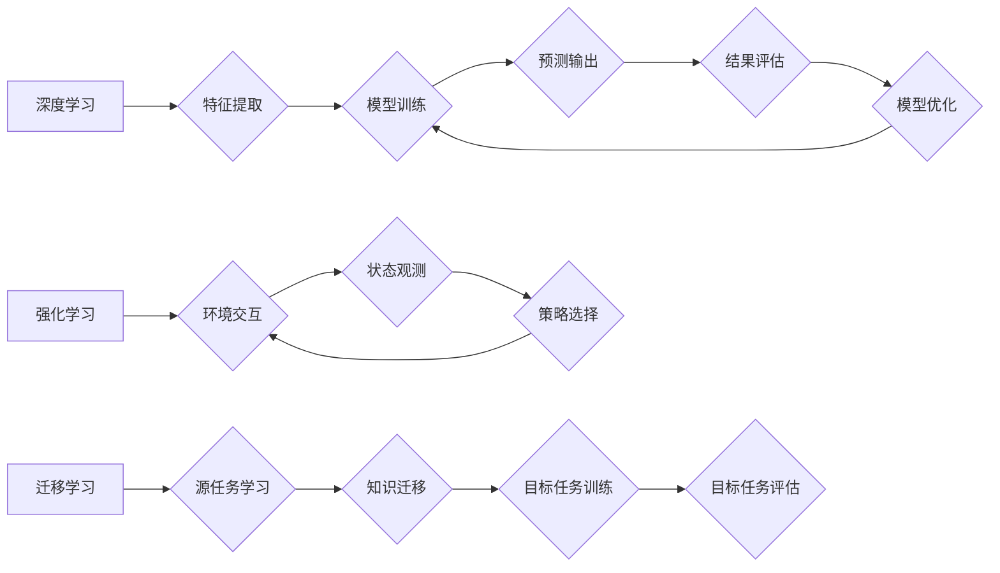

> 深度学习、强化学习、迁移学习、生成对抗网络、自然语言处理、计算机视觉、机器人学习、伦理问题

## 1. 背景介绍

人工智能（AI）作为科技发展的重要方向，近年来取得了令人瞩目的进展。从语音识别、图像识别到自动驾驶、医疗诊断，AI技术已渗透到各个领域，深刻地改变着人们的生活方式和工作模式。

随着计算能力的提升和数据量的爆炸式增长，深度学习等机器学习算法取得了突破性进展，推动了AI技术的快速发展。然而，AI技术的发展也面临着诸多挑战，例如数据安全、算法偏见、伦理道德等问题。

## 2. 核心概念与联系

**2.1 深度学习**

深度学习是一种基于多层神经网络的机器学习方法。它能够从海量数据中自动学习特征，并进行复杂的模式识别和预测。

**2.2 强化学习**

强化学习是一种基于试错的机器学习方法。它通过奖励机制，引导智能体在环境中学习最优策略。

**2.3 迁移学习**

迁移学习是一种利用已学习知识迁移到新任务的方法。它可以有效降低新任务的训练成本和时间。

**2.4 生成对抗网络 (GAN)**

生成对抗网络是一种由生成器和鉴别器组成的对抗性网络结构。生成器试图生成逼真的数据，而鉴别器试图区分真实数据和生成数据。

**2.5 自然语言处理 (NLP)**

自然语言处理是指计算机理解和处理人类语言的技术。它包括文本分类、情感分析、机器翻译等应用。

**2.6 计算机视觉 (CV)**

计算机视觉是指计算机模拟人类视觉系统，理解和解释图像和视频的技术。它包括图像识别、目标检测、图像分割等应用。

**2.7 机器人学习**

机器人学习是指机器人通过学习和适应环境，自主完成任务的技术。它结合了机器学习、控制理论和机器人技术。

**2.8 伦理问题**

AI技术的快速发展也引发了伦理问题，例如算法偏见、数据隐私、工作岗位替代等问题。

**Mermaid 流程图**



## 3. 核心算法原理 & 具体操作步骤

### 3.1  算法原理概述

深度学习算法的核心是多层神经网络。神经网络由多个层组成，每层包含多个神经元。每个神经元接收来自上一层的输入，并通过激活函数进行处理，输出到下一层。

### 3.2  算法步骤详解

1. **数据预处理:** 将原始数据转换为深度学习模型可以理解的格式。
2. **网络结构设计:** 根据任务需求设计神经网络的层数、神经元数量等参数。
3. **权值初始化:** 为神经网络的权值赋予初始值。
4. **前向传播:** 将输入数据通过神经网络进行处理，得到输出结果。
5. **反向传播:** 计算输出结果与真实值的误差，并根据误差调整神经网络的权值。
6. **训练迭代:** 重复前向传播和反向传播的过程，直到模型达到预期的性能。

### 3.3  算法优缺点

**优点:**

* 能够自动学习特征，无需人工特征工程。
* 能够处理海量数据，学习复杂模式。
* 在图像识别、语音识别等领域取得了突破性进展。

**缺点:**

* 训练成本高，需要大量的计算资源和数据。
* 容易过拟合，模型泛化能力差。
* 缺乏可解释性，难以理解模型的决策过程。

### 3.4  算法应用领域

* **图像识别:** 人脸识别、物体检测、图像分类
* **语音识别:** 语音转文本、语音助手
* **自然语言处理:** 机器翻译、文本摘要、情感分析
* **推荐系统:** 商品推荐、内容推荐
* **医疗诊断:** 病情预测、疾病诊断

## 4. 数学模型和公式 & 详细讲解 & 举例说明

### 4.1  数学模型构建

深度学习模型通常使用神经网络来表示。神经网络由多个层组成，每层包含多个神经元。每个神经元接收来自上一层的输入，并通过激活函数进行处理，输出到下一层。

**神经元模型:**

$$
y = f(w^T x + b)
$$

其中：

* $y$ 是神经元的输出
* $x$ 是神经元的输入
* $w$ 是神经元的权重
* $b$ 是神经元的偏置
* $f$ 是激活函数

**激活函数:**

常用的激活函数包括 sigmoid 函数、ReLU 函数、tanh 函数等。

**损失函数:**

损失函数用于衡量模型预测结果与真实值的差异。常用的损失函数包括均方误差 (MSE)、交叉熵损失 (Cross-Entropy Loss) 等。

### 4.2  公式推导过程

反向传播算法用于更新神经网络的权值。其核心思想是通过计算梯度，将误差反向传播到各层神经元，并根据梯度调整权值。

**梯度下降算法:**

$$
w = w - \alpha \frac{\partial L}{\partial w}
$$

其中：

* $w$ 是权值
* $\alpha$ 是学习率
* $\frac{\partial L}{\partial w}$ 是损失函数对权值的梯度

### 4.3  案例分析与讲解

**图像分类:**

假设我们有一个图像分类任务，目标是将图像分类为不同的类别。我们可以使用卷积神经网络 (CNN) 来解决这个问题。CNN 可以自动学习图像特征，并进行分类。

**训练过程:**

1. 将图像数据预处理，并将其分成训练集和测试集。
2. 设计 CNN 的网络结构，并初始化权值。
3. 将训练集数据输入 CNN，并计算损失函数。
4. 使用反向传播算法更新 CNN 的权值。
5. 重复步骤 3 和 4，直到模型达到预期的性能。
6. 使用测试集数据评估模型的性能。

## 5. 项目实践：代码实例和详细解释说明

### 5.1  开发环境搭建

* Python 3.x
* TensorFlow 或 PyTorch
* Jupyter Notebook

### 5.2  源代码详细实现

```python
import tensorflow as tf

# 定义模型结构
model = tf.keras.models.Sequential([
    tf.keras.layers.Conv2D(32, (3, 3), activation='relu', input_shape=(28, 28, 1)),
    tf.keras.layers.MaxPooling2D((2, 2)),
    tf.keras.layers.Conv2D(64, (3, 3), activation='relu'),
    tf.keras.layers.MaxPooling2D((2, 2)),
    tf.keras.layers.Flatten(),
    tf.keras.layers.Dense(10, activation='softmax')
])

# 编译模型
model.compile(optimizer='adam',
              loss='sparse_categorical_crossentropy',
              metrics=['accuracy'])

# 训练模型
model.fit(x_train, y_train, epochs=5)

# 评估模型
loss, accuracy = model.evaluate(x_test, y_test)
print('Test loss:', loss)
print('Test accuracy:', accuracy)
```

### 5.3  代码解读与分析

* **模型结构:** 该代码定义了一个简单的卷积神经网络 (CNN) 模型，用于图像分类任务。
* **层类型:** 模型包含卷积层 (Conv2D)、最大池化层 (MaxPooling2D)、扁平化层 (Flatten) 和全连接层 (Dense)。
* **激活函数:** 使用 ReLU 激活函数，可以提高模型的学习能力。
* **损失函数:** 使用交叉熵损失函数，适合多分类任务。
* **优化器:** 使用 Adam 优化器，可以快速收敛。

### 5.4  运行结果展示

训练完成后，可以将模型应用于新的图像数据进行分类。

## 6. 实际应用场景

### 6.1  医疗诊断

AI技术可以辅助医生进行疾病诊断，例如通过分析医学影像识别肿瘤、预测患者的风险等。

### 6.2  金融风险控制

AI技术可以用于识别金融欺诈、评估信用风险、预测市场趋势等。

### 6.3  智能制造

AI技术可以提高生产效率、降低生产成本，例如通过机器视觉识别缺陷、机器人进行自动化操作等。

### 6.4  未来应用展望

AI技术将在未来各个领域得到更广泛的应用，例如自动驾驶、个性化教育、智能家居等。

## 7. 工具和资源推荐

### 7.1  学习资源推荐

* **书籍:**
    * 深度学习 (Deep Learning) - Ian Goodfellow, Yoshua Bengio, Aaron Courville
    * 人工智能：一种现代方法 (Artificial Intelligence: A Modern Approach) - Stuart Russell, Peter Norvig
* **在线课程:**
    * Coursera: 深度学习 Specialization
    * Udacity: AI Programming with Python Nanodegree
* **博客和网站:**
    * TensorFlow Blog
    * PyTorch Blog
    * Towards Data Science

### 7.2  开发工具推荐

* **TensorFlow:** 开源深度学习框架
* **PyTorch:** 开源深度学习框架
* **Keras:** 高级深度学习API

### 7.3  相关论文推荐

* **ImageNet Classification with Deep Convolutional Neural Networks** - Alex Krizhevsky, Ilya Sutskever, Geoffrey E. Hinton
* **Attention Is All You Need** - Ashish Vaswani, Noam Shazeer, Niki Parmar, Jakob Uszkoreit, Llion Jones, Aidan N. Gomez, Łukasz Kaiser, Illia Polosukhin

## 8. 总结：未来发展趋势与挑战

### 8.1  研究成果总结

近年来，AI技术取得了显著进展，例如在图像识别、语音识别、自然语言处理等领域取得了突破性进展。

### 8.2  未来发展趋势

* **更强大的模型:** 研究更深、更广的网络结构，提高模型的性能和泛化能力。
* **更有效的训练方法:** 研究更有效的训练算法，降低训练成本和时间。
* **更广泛的应用:** 将 AI 技术应用于更多领域，例如医疗、教育、金融等。
* **更安全的 AI:** 研究如何确保 AI 系统的安全性和可靠性。

### 8.3  面临的挑战

* **数据获取和隐私问题:** AI 模型需要大量数据进行训练，如何获取高质量数据并保护用户隐私是一个挑战。
* **算法偏见:** AI 模型可能存在算法偏见，导致不公平的结果。
* **解释性问题:** AI 模型的决策过程难以解释，这可能导致信任问题。
* **伦理问题:** AI 技术的快速发展引发了伦理问题，例如工作岗位替代、人工智能的控制等问题。

### 8.4  研究展望

未来，AI 研究将继续朝着更智能、更安全、更可解释的方向发展。

## 9. 附录：常见问题与解答

**Q1: 什么是深度学习？**

A1: 深度学习是一种基于多层神经网络的机器学习方法。它能够从海量数据中自动学习特征，并进行复杂的模式识别和预测。

**Q2: 深度学习有哪些应用场景？**

A2: 深度学习的应用场景非常广泛，例如图像识别、语音识别、自然语言处理、推荐系统等。

**Q3: 如何学习深度学习？**

A3: 可以通过阅读书籍、在线课程、博客等方式学习深度学习。

**作者：禅与计算机程序设计艺术 / Zen