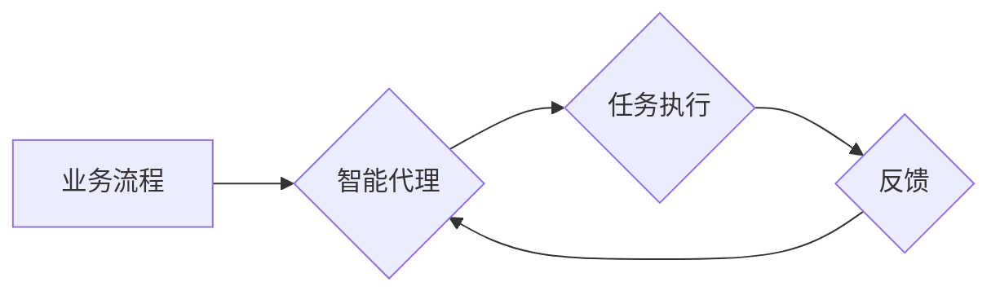

> Agentic Workflow, 自动化, 效率提升, 质量保证, 智能化, 流程优化, 协作

## 1. 背景介绍

在当今数字化时代，企业面临着日益复杂的业务流程和不断增长的工作量。传统的流程管理方式难以满足快速变化的需求，导致效率低下、质量参差不齐，甚至出现人为错误。为了解决这些问题，Agentic Workflow（智能化工作流）应运而生。

Agentic Workflow是一种基于人工智能（AI）的智能化工作流管理方法，它能够自动识别、理解和优化业务流程，并根据实际情况动态调整流程执行路径，从而提高效率、保证质量，并增强团队协作能力。

## 2. 核心概念与联系

Agentic Workflow的核心概念是将工作流程视为一个智能代理（Agent），每个代理都具有自主决策和执行能力，能够根据预设规则和环境反馈自动完成任务。

**Agentic Workflow 架构**



**核心概念联系：**

* **智能代理（Agent）：** 负责执行特定任务的独立单元，具备自主决策和执行能力。
* **任务执行（Task Execution）：** 代理根据规则和环境信息执行具体任务。
* **反馈（Feedback）：** 任务执行结果反馈给代理，用于调整后续执行策略。
* **业务流程（Business Process）：** 由多个任务组成的整体流程，通过代理的协作完成。

## 3. 核心算法原理 & 具体操作步骤

### 3.1  算法原理概述

Agentic Workflow的核心算法基于强化学习（Reinforcement Learning）和决策树（Decision Tree）的原理。

* **强化学习：** 代理通过与环境交互，学习最佳的执行策略，以获得最大的奖励。
* **决策树：** 将任务执行流程分解成一系列决策节点，每个节点对应不同的执行路径，通过决策树算法选择最优路径。

### 3.2  算法步骤详解

1. **流程建模：** 将业务流程抽象成一个图结构，其中节点代表任务，边代表任务之间的依赖关系。
2. **代理初始化：** 为每个任务创建智能代理，并赋予初始策略和奖励机制。
3. **强化学习训练：** 代理通过与环境交互，执行任务并获得奖励反馈，不断调整策略，以最大化奖励。
4. **决策树构建：** 根据代理的执行经验，构建决策树，用于指导后续任务执行。
5. **流程执行：** 根据决策树的指导，代理自动执行任务，并根据反馈信息动态调整执行路径。

### 3.3  算法优缺点

**优点：**

* **自动化：** 自动识别、理解和优化流程，减少人工干预。
* **智能化：** 基于AI算法，能够根据实际情况动态调整流程执行路径。
* **效率提升：** 减少重复工作，提高任务执行速度。
* **质量保证：** 减少人为错误，提高流程执行质量。

**缺点：**

* **建模复杂：** 需要对业务流程进行深入分析和建模。
* **数据依赖：** 需要大量数据进行训练，才能保证算法的准确性。
* **部署成本：** 需要投入一定的成本进行系统部署和维护。

### 3.4  算法应用领域

Agentic Workflow 广泛应用于各个行业，例如：

* **金融行业：** 自动化贷款审批、风险评估等流程。
* **制造业：** 自动化生产调度、质量控制等流程。
* **医疗行业：** 自动化病历处理、预约挂号等流程。
* **电商行业：** 自动化订单处理、物流配送等流程。

## 4. 数学模型和公式 & 详细讲解 & 举例说明

### 4.1  数学模型构建

Agentic Workflow 的核心数学模型是基于马尔可夫决策过程（Markov Decision Process，MDP）。

MDP 定义了一个状态空间、动作空间、状态转移概率和奖励函数。代理在每个状态下选择一个动作，根据状态转移概率进入下一个状态，并获得相应的奖励。代理的目标是找到一个策略，使得在长期的交互过程中获得最大的总奖励。

### 4.2  公式推导过程

MDP 的核心公式包括：

* **状态转移概率：** $P(s' | s, a)$，表示从状态 $s$ 执行动作 $a$ 后进入状态 $s'$ 的概率。
* **奖励函数：** $R(s, a)$，表示在状态 $s$ 执行动作 $a$ 后获得的奖励。
* **价值函数：** $V(s)$，表示从状态 $s$ 开始执行最优策略的期望总奖励。

通过 Bellman 方程，可以迭代计算价值函数：

$$V(s) = \max_a \left[ R(s, a) + \gamma \sum_{s'} P(s' | s, a) V(s') \right]$$

其中，$\gamma$ 是折扣因子，表示未来奖励的权重。

### 4.3  案例分析与讲解

例如，在自动驾驶场景中，状态空间可以是车辆的位置、速度、周围环境等信息，动作空间可以是加速、减速、转向等操作。

代理的目标是找到一个策略，使得车辆能够安全到达目的地，同时尽量节省时间。通过强化学习算法，代理可以从大量的驾驶数据中学习，并不断调整策略，以获得最大的奖励（即安全到达目的地并节省时间）。

## 5. 项目实践：代码实例和详细解释说明

### 5.1  开发环境搭建

Agentic Workflow 的开发环境通常包括：

* **编程语言：** Python 是最常用的编程语言，因为它拥有丰富的 AI 库和工具。
* **AI 库：** TensorFlow、PyTorch 等深度学习框架可以用于构建强化学习模型。
* **流程引擎：** Apache Airflow、Camunda 等流程引擎可以用于管理和执行工作流。

### 5.2  源代码详细实现

以下是一个简单的 Agentic Workflow 代码示例，演示如何使用 Python 和 TensorFlow 构建一个简单的代理：

```python
import tensorflow as tf

# 定义状态空间和动作空间
state_size = 10
action_size = 5

# 创建代理模型
model = tf.keras.Sequential([
    tf.keras.layers.Dense(64, activation='relu', input_shape=(state_size,)),
    tf.keras.layers.Dense(action_size)
])

# 定义奖励函数
def reward_function(state, action):
    # 根据状态和动作计算奖励
    return ...

# 训练代理
for episode in range(1000):
    state = ...
    while True:
        action = model.predict(state)[0]
        next_state, reward = ...
        model.fit(state, action, epochs=1)
        state = next_state
        if reward == 1:
            break

```

### 5.3  代码解读与分析

* 代码首先定义了状态空间和动作空间，然后创建了一个代理模型。
* 代理模型是一个简单的多层感知机，用于预测最佳动作。
* 奖励函数根据状态和动作计算奖励，用于指导代理的学习。
* 训练过程是一个循环，代理在每个状态下选择动作，执行动作，并根据奖励更新模型参数。

### 5.4  运行结果展示

训练完成后，代理能够根据输入状态预测最佳动作，并执行相应的任务。

## 6. 实际应用场景

Agentic Workflow 在各个行业都有广泛的应用场景：

### 6.1  金融行业

* **自动贷款审批：** 根据客户的信用评分、收入等信息，自动审批贷款申请，提高审批效率和准确性。
* **风险评估：** 分析客户的交易行为和财务状况，自动评估风险等级，帮助金融机构防范风险。

### 6.2  制造业

* **生产调度：** 根据生产计划和设备状态，自动安排生产任务，优化生产效率和资源利用率。
* **质量控制：** 利用机器视觉和传感器数据，自动检测产品缺陷，提高产品质量。

### 6.3  医疗行业

* **病历处理：** 自动提取病历中的关键信息，辅助医生诊断和治疗。
* **预约挂号：** 自动处理患者的预约挂号请求，提高医院的预约效率。

### 6.4  未来应用展望

随着人工智能技术的不断发展，Agentic Workflow 将在更多领域得到应用，例如：

* **智能客服：** 自动处理客户的咨询和投诉，提高客户服务效率。
* **个性化推荐：** 根据用户的行为和偏好，自动推荐个性化产品和服务。
* **自动驾驶：** 帮助车辆自动驾驶，提高交通安全和效率。

## 7. 工具和资源推荐

### 7.1  学习资源推荐

* **书籍：**
    * Reinforcement Learning: An Introduction by Richard S. Sutton and Andrew G. Barto
    * Deep Learning by Ian Goodfellow, Yoshua Bengio, and Aaron Courville
* **在线课程：**
    * Coursera: Reinforcement Learning Specialization
    * Udacity: Deep Learning Nanodegree

### 7.2  开发工具推荐

* **编程语言：** Python
* **AI 库：** TensorFlow、PyTorch
* **流程引擎：** Apache Airflow、Camunda

### 7.3  相关论文推荐

* **Deep Reinforcement Learning for Robotics**
* **A Survey of Deep Reinforcement Learning**
* **Agentic Workflow: A Framework for Intelligent Process Automation**

## 8. 总结：未来发展趋势与挑战

### 8.1  研究成果总结

Agentic Workflow 作为一种智能化工作流管理方法，取得了显著的成果，能够有效提高工作效率、保证流程质量，并增强团队协作能力。

### 8.2  未来发展趋势

未来，Agentic Workflow 将朝着以下方向发展：

* **更智能化：** 利用更先进的 AI 算法，例如迁移学习和联邦学习，提高代理的学习能力和泛化能力。
* **更自动化：** 自动识别和优化流程，减少人工干预，实现真正的无人工干预工作流。
* **更协作性：** 支持多代理协作，实现更复杂的流程执行。

### 8.3  面临的挑战

Agentic Workflow 还面临一些挑战：

* **数据依赖：** 需要大量数据进行训练，才能保证算法的准确性。
* **模型复杂性：** 代理模型的训练和部署需要一定的技术难度。
* **伦理问题：** 智能代理的决策可能会受到偏见的影响，需要考虑伦理问题。

### 8.4  研究展望

未来，我们将继续研究 Agentic Workflow 的理论基础和应用方法，努力解决上述挑战，推动 Agentic Workflow 技术的快速发展和应用推广。

## 9. 附录：常见问题与解答

**常见问题：**

* **Agentic Workflow 和传统工作流管理有什么区别？**

**解答：**

Agentic Workflow 基于 AI 算法，能够自动识别、理解和优化流程，而传统工作流管理则需要人工设计和维护流程。

* **Agentic Workflow 需要哪些技术基础？**

**解答：**

Agentic Workflow 需要掌握 AI、机器学习、流程引擎等相关技术。

* **Agentic Workflow 的应用场景有哪些？**

**解答：**

Agentic Workflow 广泛应用于各个行业，例如金融、制造、医疗等。

**作者：禅与计算机程序设计艺术 / Zen and the Art of Computer Programming**<end_of_turn>