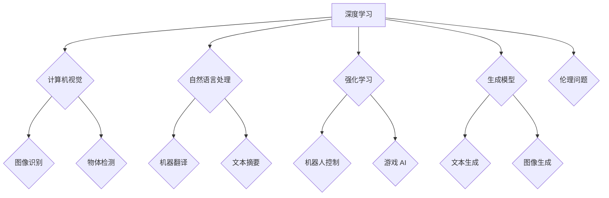

> 人工智能，深度学习，计算机视觉，自然语言处理，强化学习，生成模型，伦理问题，未来趋势

## 1. 背景介绍

人工智能（AI）正以惊人的速度发展，深刻地改变着我们的世界。从自动驾驶汽车到智能语音助手，AI技术已渗透到我们生活的方方面面。作为AI领域的领军人物之一，Andrej Karpathy 始终走在技术前沿，他对AI未来的发展趋势有着深刻的洞察力。

Andrej Karpathy 是一位享誉世界的计算机科学家，曾担任特斯拉自动驾驶团队的负责人，现任英伟达的副总裁兼人工智能研究实验室主任。他以其在深度学习、计算机视觉和强化学习方面的杰出贡献而闻名。他的研究成果和技术洞察力对推动AI发展起着至关重要的作用。

## 2. 核心概念与联系

**2.1 深度学习**

深度学习是人工智能领域的一个重要分支，它利用多层神经网络来模拟人类大脑的学习过程。通过训练大量的样本数据，深度学习模型能够自动学习特征和模式，从而实现对复杂问题的解决。

**2.2 计算机视觉**

计算机视觉是让计算机“看”和理解图像和视频的技术。深度学习在计算机视觉领域取得了突破性的进展，例如图像识别、物体检测、图像分割等。

**2.3 自然语言处理**

自然语言处理（NLP）是让计算机理解和处理人类语言的技术。深度学习在NLP领域也取得了显著的成果，例如机器翻译、文本摘要、情感分析等。

**2.4 强化学习**

强化学习是一种机器学习方法，它通过奖励和惩罚机制来训练智能体，使其在特定环境中做出最优决策。强化学习在机器人控制、游戏 AI 等领域有着广泛的应用。

**2.5 生成模型**

生成模型能够从训练数据中学习到数据分布，并生成新的数据样本。例如，GPT-3 是一种强大的文本生成模型，能够生成逼真的文章、对话和代码。

**2.6 伦理问题**

随着AI技术的快速发展，其伦理问题也日益凸显。例如，AI算法的偏见、数据隐私保护、AI的责任归属等问题都需要认真思考和解决。

**Mermaid 流程图**



## 3. 核心算法原理 & 具体操作步骤

### 3.1 算法原理概述

深度学习算法的核心是多层神经网络。神经网络由多个层组成，每层包含多个神经元。每个神经元接收来自上一层的输入信号，并对其进行处理，然后将处理后的信号传递到下一层。通过训练大量的样本数据，神经网络能够学习到数据的特征和模式，从而实现对复杂问题的解决。

### 3.2 算法步骤详解

1. **数据预处理:** 将原始数据转换为深度学习模型可以理解的格式。
2. **网络结构设计:** 根据具体任务选择合适的网络结构。
3. **参数初始化:** 为神经网络中的参数赋予初始值。
4. **前向传播:** 将输入数据通过神经网络进行处理，得到输出结果。
5. **损失函数计算:** 计算模型输出结果与真实值的差异。
6. **反向传播:** 根据损失函数的梯度，调整神经网络的参数。
7. **迭代训练:** 重复前向传播、损失函数计算和反向传播的过程，直到模型性能达到预期水平。

### 3.3 算法优缺点

**优点:**

* 能够自动学习特征和模式，无需人工特征工程。
* 能够处理海量数据，并从数据中提取有价值的信息。
* 在图像识别、自然语言处理等领域取得了突破性的进展。

**缺点:**

* 训练深度学习模型需要大量的计算资源和时间。
* 深度学习模型的解释性较差，难以理解模型的决策过程。
* 深度学习模型容易受到数据偏差的影响。

### 3.4 算法应用领域

深度学习算法已广泛应用于各个领域，例如：

* **计算机视觉:** 图像识别、物体检测、图像分割、人脸识别等。
* **自然语言处理:** 机器翻译、文本摘要、情感分析、聊天机器人等。
* **语音识别:** 语音转文本、语音助手等。
* **医疗诊断:** 病理图像分析、疾病预测等。
* **金融分析:** 欺诈检测、风险评估等。

## 4. 数学模型和公式 & 详细讲解 & 举例说明

### 4.1 数学模型构建

深度学习模型通常采用多层感知机（MLP）或卷积神经网络（CNN）等结构。

**4.1.1 多层感知机（MLP）**

MLP 由多个全连接层组成，每层神经元之间全连接。

**4.1.2 卷积神经网络（CNN）**

CNN 利用卷积层和池化层来提取图像特征。卷积层通过卷积核对图像进行卷积运算，提取图像局部特征。池化层对卷积层的输出进行降维，减少计算量。

### 4.2 公式推导过程

深度学习模型的训练过程基于梯度下降算法。

**4.2.1 损失函数**

损失函数用于衡量模型预测结果与真实值的差异。常见的损失函数包括均方误差（MSE）、交叉熵损失（Cross-Entropy Loss）等。

**4.2.2 梯度下降算法**

梯度下降算法通过迭代更新模型参数，使损失函数最小化。

**公式:**

$$
\theta = \theta - \alpha \nabla L(\theta)
$$

其中：

* $\theta$ 是模型参数
* $\alpha$ 是学习率
* $\nabla L(\theta)$ 是损失函数对参数 $\theta$ 的梯度

### 4.3 案例分析与讲解

**4.3.1 图像分类**

使用 CNN 模型对图像进行分类。

**4.3.2 文本生成**

使用 GPT-3 模型生成文本。

## 5. 项目实践：代码实例和详细解释说明

### 5.1 开发环境搭建

使用 Python 语言和 TensorFlow 或 PyTorch 深度学习框架。

### 5.2 源代码详细实现

```python
# 使用 TensorFlow 实现一个简单的多层感知机模型

import tensorflow as tf

# 定义模型结构
model = tf.keras.models.Sequential([
    tf.keras.layers.Dense(128, activation='relu', input_shape=(784,)),
    tf.keras.layers.Dense(10, activation='softmax')
])

# 编译模型
model.compile(optimizer='adam',
              loss='sparse_categorical_crossentropy',
              metrics=['accuracy'])

# 训练模型
model.fit(x_train, y_train, epochs=10)

# 评估模型
loss, accuracy = model.evaluate(x_test, y_test)
print('Loss:', loss)
print('Accuracy:', accuracy)
```

### 5.3 代码解读与分析

* 使用 `tf.keras.models.Sequential` 创建一个顺序模型。
* 使用 `tf.keras.layers.Dense` 创建全连接层。
* 使用 `activation='relu'` 设置激活函数为 ReLU。
* 使用 `optimizer='adam'` 设置优化器为 Adam。
* 使用 `loss='sparse_categorical_crossentropy'` 设置损失函数为类别交叉熵。
* 使用 `metrics=['accuracy']` 设置评估指标为准确率。
* 使用 `model.fit()` 训练模型。
* 使用 `model.evaluate()` 评估模型。

### 5.4 运行结果展示

训练完成后，打印出模型的损失值和准确率。

## 6. 实际应用场景

### 6.1 自动驾驶

深度学习算法在自动驾驶领域应用广泛，例如：

* **图像识别:** 识别道路标志、交通信号灯、行人等。
* **物体检测:** 检测周围车辆、障碍物等。
* **路径规划:** 规划行驶路线。

### 6.2 医疗诊断

深度学习算法在医疗诊断领域也有着重要的应用，例如：

* **病理图像分析:** 识别肿瘤、骨折等病变。
* **疾病预测:** 根据患者的症状和病史预测疾病风险。

### 6.3 金融分析

深度学习算法在金融分析领域应用于：

* **欺诈检测:** 检测信用卡欺诈、网络钓鱼等。
* **风险评估:** 评估投资风险、信用风险等。

### 6.4 未来应用展望

随着AI技术的不断发展，其应用场景将更加广泛，例如：

* **个性化教育:** 根据学生的学习情况提供个性化的学习方案。
* **智能客服:** 提供24小时在线客服服务。
* **科学研究:** 加速科学研究的进程。

## 7. 工具和资源推荐

### 7.1 学习资源推荐

* **课程:**
    * 深度学习 Specialization (Coursera)
    * fast.ai
* **书籍:**
    * 深度学习 (Ian Goodfellow)
    * 构建深度学习模型 (François Chollet)

### 7.2 开发工具推荐

* **Python:** 
* **TensorFlow:** 
* **PyTorch:** 
* **Keras:** 

### 7.3 相关论文推荐

* **ImageNet Classification with Deep Convolutional Neural Networks (AlexNet)**
* **Attention Is All You Need (Transformer)**
* **Generative Pre-trained Transformer 3 (GPT-3)**

## 8. 总结：未来发展趋势与挑战

### 8.1 研究成果总结

深度学习算法取得了显著的成果，在计算机视觉、自然语言处理等领域取得了突破性的进展。

### 8.2 未来发展趋势

* **模型规模和能力的提升:** 模型参数规模将继续扩大，模型能力将进一步提升。
* **模型解释性和可解释性的增强:** 研究更可解释的深度学习模型，以便更好地理解模型的决策过程。
* **跨模态学习:** 研究能够处理多种模态数据（例如文本、图像、音频）的模型。
* **联邦学习:** 研究隐私保护的深度学习方法，例如联邦学习。

### 8.3 面临的挑战

* **数据获取和标注:** 深度学习模型需要大量的训练数据，数据获取和标注成本较高。
* **计算资源:** 训练大型深度学习模型需要大量的计算资源。
* **伦理问题:** 深度学习算法的偏见、数据隐私保护等伦理问题需要认真思考和解决。

### 8.4 研究展望

未来，深度学习研究将继续朝着更强大、更安全、更可解释的方向发展。


## 9. 附录：常见问题与解答

**9.1 什么是深度学习？**

深度学习是一种机器学习方法，它利用多层神经网络来模拟人类大脑的学习过程。

**9.2 深度学习有哪些应用场景？**

深度学习已广泛应用于各个领域，例如计算机视觉、自然语言处理、语音识别、医疗诊断、金融分析等。

**9.3 如何学习深度学习？**

可以通过在线课程、书籍、开源项目等方式学习深度学习。

**9.4 深度学习有哪些挑战？**

深度学习面临着数据获取、计算资源、伦理问题等挑战。


作者：禅与计算机程序设计艺术 / Zen and the Art of Computer Programming 
<end_of_turn>