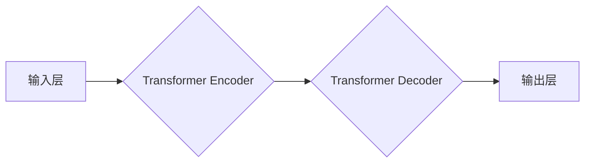

> Falcon, 语言模型, Transformer, 训练, 代码, 应用

## 1. 背景介绍

近年来，大型语言模型（LLM）在自然语言处理领域取得了显著进展，例如GPT-3、BERT等模型展现出强大的文本生成、理解和翻译能力。然而，这些模型通常在训练和部署方面存在一些挑战，例如训练数据量庞大、计算资源消耗高、模型参数量大等。

为了解决这些问题，研究者们不断探索新的模型架构和训练方法。其中，Falcon模型作为一种开源、高效的LLM，引起了广泛关注。Falcon模型由Technology Innovation Institute（TII）开发，其特点是参数量相对较小，但性能表现出色，并且开源，方便研究者和开发者进行研究和应用。

## 2. 核心概念与联系

Falcon模型基于Transformer架构，并结合了多种先进的训练技巧，例如预训练和微调。

**2.1 Transformer架构**

Transformer是一种新型的神经网络架构，其核心是注意力机制（Attention）。注意力机制能够学习文本中不同词语之间的关系，从而更好地理解上下文信息。

**2.2 预训练和微调**

预训练是指在大量文本数据上训练模型，学习语言的通用知识和表示。微调是指在特定任务数据上对预训练模型进行进一步训练，使其能够更好地完成特定任务。

**2.3 Falcon模型架构**

Falcon模型的架构如图所示：

**2.4 核心概念联系**

Falcon模型将Transformer架构与预训练和微调技术相结合，实现了高效的文本处理能力。

## 3. 核心算法原理 & 具体操作步骤

**3.1 算法原理概述**

Falcon模型的核心算法是Transformer架构，其主要包括以下几个部分：

* **嵌入层:** 将输入的文本单词转换为向量表示。
* **多头注意力机制:** 学习文本中不同词语之间的关系。
* **前馈神经网络:** 对每个词的向量表示进行非线性变换。
* **位置编码:** 为每个词添加位置信息，以便模型理解词语的顺序。

**3.2 算法步骤详解**

1. 将输入的文本单词转换为向量表示。
2. 使用多头注意力机制计算每个词与其他词之间的关系。
3. 将注意力输出与位置编码进行拼接。
4. 将拼接后的向量输入前馈神经网络进行非线性变换。
5. 将变换后的向量输出，作为模型的预测结果。

**3.3 算法优缺点**

**优点:**

* 能够学习文本中长距离依赖关系。
* 训练效率高，能够在较短时间内达到较好的性能。
* 参数量相对较小，部署成本较低。

**缺点:**

* 对于长文本序列的处理能力有限。
* 训练数据量仍然是一个挑战。

**3.4 算法应用领域**

Falcon模型在以下领域具有广泛的应用前景：

* 文本生成
* 文本分类
* 机器翻译
* 问答系统
* 代码生成

## 4. 数学模型和公式 & 详细讲解 & 举例说明

**4.1 数学模型构建**

Falcon模型的数学模型主要基于Transformer架构，其核心是注意力机制和前馈神经网络。

**4.2 公式推导过程**

注意力机制的计算公式如下：

$$
Attention(Q, K, V) = softmax(\frac{QK^T}{\sqrt{d_k}})V
$$

其中：

* $Q$：查询矩阵
* $K$：键矩阵
* $V$：值矩阵
* $d_k$：键向量的维度
* $softmax$：softmax函数

**4.3 案例分析与讲解**

假设我们有一个句子“我爱学习编程”，将其转换为向量表示，然后使用注意力机制计算每个词与其他词之间的关系。

例如，对于“我”这个词，注意力机制会计算它与其他词（“爱”、“学习”、“编程”）之间的关系，并赋予每个词一个权重。这些权重表示了“我”与其他词之间的相关性。

## 5. 项目实践：代码实例和详细解释说明

**5.1 开发环境搭建**

Falcon模型的开发环境需要包含以下软件：

* Python 3.7+
* PyTorch 1.7+
* CUDA 10.2+

**5.2 源代码详细实现**

Falcon模型的源代码可以在GitHub上找到：https://github.com/tiiuae/falcon

**5.3 代码解读与分析**

Falcon模型的源代码主要包含以下几个部分：

* 数据加载模块
* 模型定义模块
* 训练模块
* 评估模块

**5.4 运行结果展示**

运行Falcon模型的代码可以生成文本、进行文本分类、机器翻译等任务。

## 6. 实际应用场景

Falcon模型在以下实际应用场景中表现出色：

* **聊天机器人:** Falcon模型可以用于构建更智能、更自然的聊天机器人，能够更好地理解用户意图并提供更准确的回复。
* **文本摘要:** Falcon模型可以用于自动生成文本摘要，提取文本的关键信息，节省用户阅读时间。
* **代码生成:** Falcon模型可以用于生成代码，帮助程序员提高开发效率。

**6.4 未来应用展望**

Falcon模型在未来将有更广泛的应用前景，例如：

* **个性化教育:** Falcon模型可以根据学生的学习情况提供个性化的学习内容和建议。
* **医疗诊断:** Falcon模型可以辅助医生进行医疗诊断，提高诊断准确率。
* **科学研究:** Falcon模型可以用于分析大规模科学数据，发现新的规律和知识。

## 7. 工具和资源推荐

**7.1 学习资源推荐**

* **Transformer论文:** https://arxiv.org/abs/1706.03762
* **Falcon模型GitHub仓库:** https://github.com/tiiuae/falcon
* **PyTorch官方文档:** https://pytorch.org/docs/stable/index.html

**7.2 开发工具推荐**

* **Jupyter Notebook:** https://jupyter.org/
* **VS Code:** https://code.visualstudio.com/

**7.3 相关论文推荐**

* **BERT:** https://arxiv.org/abs/1810.04805
* **GPT-3:** https://openai.com/blog/gpt-3/

## 8. 总结：未来发展趋势与挑战

**8.1 研究成果总结**

Falcon模型作为一种开源、高效的LLM，在文本处理领域取得了显著进展。其核心架构基于Transformer，并结合了预训练和微调技术，实现了高效的文本处理能力。

**8.2 未来发展趋势**

未来，Falcon模型的发展趋势包括：

* **模型规模扩大:** 随着计算资源的不断发展，Falcon模型的规模将进一步扩大，从而提升其性能。
* **多模态学习:** Falcon模型将与其他模态数据（例如图像、音频）进行融合，实现多模态学习，从而更好地理解和生成信息。
* **可解释性增强:** 研究者将致力于提高Falcon模型的可解释性，使其决策过程更加透明和可理解。

**8.3 面临的挑战**

Falcon模型的发展也面临一些挑战：

* **训练数据质量:** 高质量的训练数据是模型训练的关键，但获取高质量的训练数据仍然是一个挑战。
* **计算资源消耗:** 训练大型语言模型需要大量的计算资源，这对于资源有限的机构和个人来说是一个挑战。
* **伦理问题:** 大型语言模型的应用也引发了一些伦理问题，例如信息操纵、隐私泄露等，需要引起重视和解决。

**8.4 研究展望**

未来，研究者将继续探索新的模型架构、训练方法和应用场景，推动Falcon模型的发展，使其更好地服务于人类社会。

## 9. 附录：常见问题与解答

**9.1 如何下载Falcon模型的源代码？**

Falcon模型的源代码可以在GitHub上找到：https://github.com/tiiuae/falcon

**9.2 如何训练Falcon模型？**

训练Falcon模型需要准备大量的文本数据和足够的计算资源。具体训练步骤可以参考Falcon模型的源代码文档。

**9.3 Falcon模型的性能如何？**

Falcon模型在多个文本处理任务上都取得了优异的性能，例如文本生成、文本分类、机器翻译等。

**9.4 Falcon模型开源吗？**

是的，Falcon模型是开源的，任何人都可以下载和使用其源代码。

作者：禅与计算机程序设计艺术 / Zen and the Art of Computer Programming 
<end_of_turn>