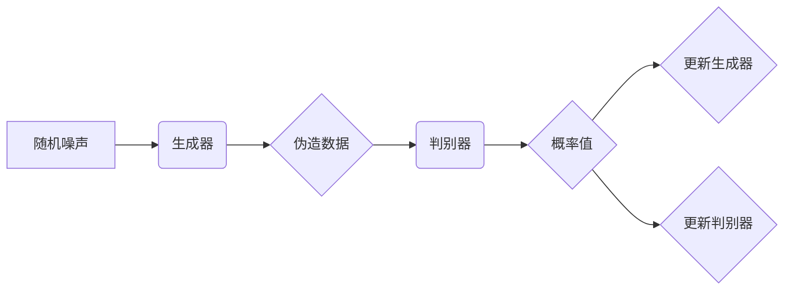

> GAN, 生成对抗网络, 生成器, 判别器, 生成模型, 深度学习, 代码实例

## 1. 背景介绍

在深度学习领域，生成模型一直是研究的热点之一。生成模型的目标是学习数据分布，并能够生成与真实数据相似的样本。传统的生成模型，例如变分自编码器 (VAE)，通常需要对数据进行编码和解码，但其生成的样本往往缺乏多样性和真实性。

生成对抗网络 (GAN) 是一种新兴的生成模型，由生成器 (Generator) 和判别器 (Discriminator) 两个网络组成。生成器负责生成伪造数据，而判别器负责区分真实数据和伪造数据。两者在对抗博弈中相互竞争，最终使得生成器能够生成逼真的样本。

GAN 的出现为生成模型带来了革命性的变化，在图像生成、文本生成、语音合成等领域取得了显著的成果。

## 2. 核心概念与联系

GAN 由两个神经网络组成：

* **生成器 (Generator):** 负责生成伪造数据，输入随机噪声，输出与真实数据相似的样本。
* **判别器 (Discriminator):** 负责区分真实数据和伪造数据，输入数据样本，输出一个概率值，表示该样本是真实数据还是伪造数据。

GAN 的训练过程是一个对抗博弈的过程：

1. 生成器生成伪造数据，并将其输入判别器。
2. 判别器对输入数据进行判断，输出概率值。
3. 根据判别器的输出结果，生成器和判别器分别进行更新，以提高各自的性能。

**Mermaid 流程图:**



## 3. 核心算法原理 & 具体操作步骤

### 3.1  算法原理概述

GAN 的核心原理是通过生成器和判别器的对抗博弈来学习数据分布。生成器试图生成逼真的样本，而判别器试图区分真实数据和伪造数据。两者在不断竞争中相互提升，最终使得生成器能够生成与真实数据相似的样本。

### 3.2  算法步骤详解

1. **初始化:** 生成器和判别器网络参数随机初始化。
2. **训练判别器:** 使用真实数据和生成器生成的伪造数据训练判别器。判别器的目标是尽可能准确地区分真实数据和伪造数据。
3. **训练生成器:** 使用判别器对生成器生成的伪造数据进行评估，并根据判别器的输出结果更新生成器的参数。生成器的目标是生成能够欺骗判别器的样本。
4. **重复步骤 2 和 3:** 循环进行判别器和生成器的训练，直到生成器能够生成逼真的样本。

### 3.3  算法优缺点

**优点:**

* 可以生成逼真的样本，在图像、文本、语音等领域取得了显著的成果。
* 不需要事先定义数据分布，能够学习复杂的数据分布。

**缺点:**

* 训练过程不稳定，容易出现模式崩溃等问题。
* 难以评估生成模型的质量，需要依赖主观评价或其他指标。

### 3.4  算法应用领域

* **图像生成:** 生成逼真的图像，例如人脸、风景、物体等。
* **文本生成:** 生成自然语言文本，例如文章、故事、对话等。
* **语音合成:** 生成逼真的语音，例如人声、音乐等。
* **数据增强:** 生成新的训练数据，提高模型的泛化能力。

## 4. 数学模型和公式 & 详细讲解 & 举例说明

### 4.1  数学模型构建

GAN 的数学模型主要包括生成器和判别器的损失函数。

* **判别器损失函数:** 判别器的目标是区分真实数据和伪造数据，其损失函数通常采用二分类交叉熵损失函数：

$$
L_D(D, X, G) = -\frac{1}{m} \sum_{i=1}^{m} \left[ y_i \log(D(x_i)) + (1-y_i) \log(1-D(G(z_i))) \right]
$$

其中：

* $D$ 是判别器网络
* $X$ 是真实数据样本集
* $G$ 是生成器网络
* $z_i$ 是随机噪声
* $y_i$ 是真实标签，为 1 表示真实数据，为 0 表示伪造数据
* $m$ 是样本数量

* **生成器损失函数:** 生成器的目标是生成能够欺骗判别器的样本，其损失函数通常采用负判别器输出的概率作为损失：

$$
L_G(G, D) = -\frac{1}{m} \sum_{i=1}^{m} \log(D(G(z_i)))
$$

### 4.2  公式推导过程

判别器损失函数的推导过程如下：

1. 判别器的目标是最大化正确分类的概率，即最大化真实数据被正确分类的概率和伪造数据被正确分类的概率。
2. 使用交叉熵损失函数来衡量分类错误的程度，交叉熵损失函数的最小值对应于分类准确率最大。
3. 因此，判别器的损失函数可以表示为真实数据被正确分类的概率和伪造数据被正确分类的概率的负对数的平均值。

### 4.3  案例分析与讲解

假设我们训练一个生成人脸图像的 GAN 模型。

* **判别器:** 判别器网络接受人脸图像作为输入，输出一个概率值，表示该图像是否为真实人脸。
* **生成器:** 生成器网络接受随机噪声作为输入，输出一张人脸图像。

在训练过程中，判别器会不断学习区分真实人脸和伪造人脸的特征，而生成器会不断调整参数，生成能够欺骗判别器的伪造人脸。最终，生成器能够生成逼真的人脸图像。

## 5. 项目实践：代码实例和详细解释说明

### 5.1  开发环境搭建

* Python 3.6+
* TensorFlow 或 PyTorch 深度学习框架
* CUDA 和 cuDNN (可选，用于 GPU 加速)

### 5.2  源代码详细实现

以下是一个使用 TensorFlow 实现简单 GAN 的代码示例：

```python
import tensorflow as tf

# 定义生成器网络
def generator(z):
  # ... 生成器网络结构 ...
  return output

# 定义判别器网络
def discriminator(x):
  # ... 判别器网络结构 ...
  return output

# 定义损失函数和优化器
optimizer_G = tf.keras.optimizers.Adam(learning_rate=0.0002, beta_1=0.5)
optimizer_D = tf.keras.optimizers.Adam(learning_rate=0.0002, beta_1=0.5)
loss_fn = tf.keras.losses.BinaryCrossentropy()

# 训练循环
for epoch in range(num_epochs):
  for batch in dataset:
    # 训练判别器
    with tf.GradientTape() as tape_D:
      real_output = discriminator(real_data)
      fake_output = discriminator(generator(noise))
      d_loss_real = loss_fn(tf.ones_like(real_output), real_output)
      d_loss_fake = loss_fn(tf.zeros_like(fake_output), fake_output)
      d_loss = d_loss_real + d_loss_fake
    gradients_D = tape_D.gradient(d_loss, discriminator.trainable_variables)
    optimizer_D.apply_gradients(zip(gradients_D, discriminator.trainable_variables))

    # 训练生成器
    with tf.GradientTape() as tape_G:
      fake_output = discriminator(generator(noise))
      g_loss = loss_fn(tf.ones_like(fake_output), fake_output)
    gradients_G = tape_G.gradient(g_loss, generator.trainable_variables)
    optimizer_G.apply_gradients(zip(gradients_G, generator.trainable_variables))

  # 打印训练进度
  print(f"Epoch {epoch+1}/{num_epochs}, D loss: {d_loss.numpy()}, G loss: {g_loss.numpy()}")

```

### 5.3  代码解读与分析

* **生成器网络:** 生成器网络接受随机噪声作为输入，并通过多层神经网络结构生成人脸图像。
* **判别器网络:** 判别器网络接受人脸图像作为输入，并输出一个概率值，表示该图像是否为真实人脸。
* **损失函数:** 判别器损失函数和生成器损失函数分别用于训练判别器和生成器。
* **优化器:** Adam 优化器用于更新判别器和生成器的参数。
* **训练循环:** 训练循环迭代训练判别器和生成器，直到生成器能够生成逼真的人脸图像。

### 5.4  运行结果展示

训练完成后，可以将生成器生成的图像保存下来，并与真实人脸图像进行比较。

## 6. 实际应用场景

GAN 在各个领域都有着广泛的应用场景：

* **图像生成:** 生成逼真的图像，例如人脸、风景、物体等，用于游戏、电影、广告等领域。
* **文本生成:** 生成自然语言文本，例如文章、故事、对话等，用于写作辅助、聊天机器人等领域。
* **语音合成:** 生成逼真的语音，例如人声、音乐等，用于语音助手、语音识别等领域。
* **数据增强:** 生成新的训练数据，提高模型的泛化能力，例如在图像分类、目标检测等领域。

### 6.4  未来应用展望

随着 GAN 技术的不断发展，其应用场景将会更加广泛，例如：

* **医疗领域:** 生成医学图像，辅助医生诊断和治疗。
* **艺术领域:** 生成艺术作品，例如绘画、音乐等。
* **教育领域:** 生成个性化学习内容，提高学习效率。

## 7. 工具和资源推荐

### 7.1  学习资源推荐

* **书籍:**
    * "Generative Deep Learning" by David Foster
    * "Deep Learning" by Ian Goodfellow, Yoshua Bengio, and Aaron Courville
* **论文:**
    * "Generative Adversarial Networks" by Ian Goodfellow et al.
    * "Improved Techniques for Training GANs" by Alec Radford et al.
* **在线课程:**
    * Coursera: "Deep Learning Specialization" by Andrew Ng
    * Udacity: "Deep Learning Nanodegree"

### 7.2  开发工具推荐

* **TensorFlow:** https://www.tensorflow.org/
* **PyTorch:** https://pytorch.org/
* **Keras:** https://keras.io/

### 7.3  相关论文推荐

* **Generative Adversarial Networks (GANs):** https://arxiv.org/abs/1406.2661
* **Improved Techniques for Training GANs:** https://arxiv.org/abs/1606.03498
* **Wasserstein GAN:** https://arxiv.org/abs/1701.07875

## 8. 总结：未来发展趋势与挑战

### 8.1  研究成果总结

GAN 技术在过去几年取得了显著的进展，在图像生成、文本生成、语音合成等领域取得了突破性的成果。

### 8.2  未来发展趋势

* **模型架构创新:** 研究更强大的 GAN 模型架构，例如 StyleGAN、BigGAN 等。
* **训练稳定性提升:** 研究更稳定的 GAN 训练方法，例如 WGAN、Progressive