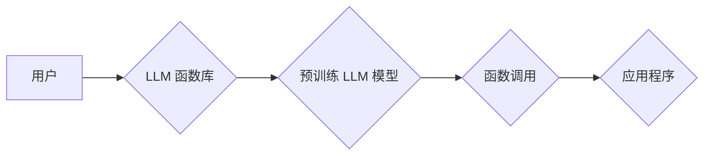

> LLM, 函数库, AI应用, 工具箱, 编程接口, 自然语言处理, 机器学习, 代码生成

## 1. 背景介绍

近年来，大型语言模型（LLM）的快速发展掀起了人工智能领域的革命。这些强大的模型能够理解和生成人类语言，展现出惊人的文本生成、翻译、问答和代码编写能力。然而，LLM 的应用场景远不止于此。为了更好地将 LLM 的强大功能融入到实际应用中，我们需要更便捷、更灵活的工具。

LLM 函数库应运而生，它为开发者提供了一套预先训练好的 LLM 函数，可以轻松调用并集成到各种应用程序中。就像函数库为传统编程提供了模块化和复用的功能，LLM 函数库为 AI 应用提供了类似的便利，降低了开发门槛，加速了 AI 应用的落地。

## 2. 核心概念与联系

LLM 函数库的核心概念是将 LLM 的能力封装成可复用的函数，并通过编程接口（API）提供给开发者。开发者可以根据需求选择合适的函数，并将其集成到自己的应用程序中。

**LLM 函数库的架构**



**核心概念解释:**

* **用户:**  使用 LLM 函数库的开发者或应用程序。
* **LLM 函数库:**  提供预训练 LLM 函数和 API 的平台。
* **预训练 LLM 模型:**  已经经过大量数据训练的 LLM 模型，具备强大的语言理解和生成能力。
* **函数调用:**  用户通过 API 调用预训练 LLM 模型的特定功能。
* **应用程序:**  集成 LLM 函数库的应用程序，可以利用 LLM 的能力进行各种任务。

## 3. 核心算法原理 & 具体操作步骤

### 3.1  算法原理概述

LLM 函数库的核心算法是基于 Transformer 架构的深度学习模型。Transformer 模型通过自注意力机制和多头注意力机制，能够捕捉文本序列中的长距离依赖关系，从而实现更准确的语言理解和生成。

### 3.2  算法步骤详解

1. **数据预处理:** 将输入文本数据进行清洗、分词、标记等预处理操作，使其能够被模型理解。
2. **编码:** 将预处理后的文本数据编码成向量表示，每个词语对应一个向量。
3. **解码:** 根据编码后的向量表示，使用解码器生成目标文本序列。
4. **损失函数:** 使用交叉熵损失函数衡量模型预测结果与真实结果之间的差异。
5. **反向传播:** 利用梯度下降算法更新模型参数，降低损失函数的值。

### 3.3  算法优缺点

**优点:**

* 能够捕捉文本序列中的长距离依赖关系。
* 训练效率高，能够处理海量文本数据。
* 在文本生成、翻译、问答等任务中表现出色。

**缺点:**

* 模型参数量大，需要大量的计算资源进行训练和推理。
* 对训练数据质量要求高，训练数据不足会导致模型性能下降。

### 3.4  算法应用领域

LLM 函数库的应用领域非常广泛，包括：

* **自然语言处理:** 文本分类、情感分析、文本摘要、机器翻译等。
* **对话系统:** 聊天机器人、虚拟助手等。
* **代码生成:** 自动生成代码、代码补全等。
* **内容创作:** 自动生成文章、故事、诗歌等。

## 4. 数学模型和公式 & 详细讲解 & 举例说明

### 4.1  数学模型构建

LLM 函数库的核心数学模型是 Transformer 模型，其结构由编码器和解码器组成。

* **编码器:**  将输入文本序列编码成向量表示。
* **解码器:**  根据编码后的向量表示，生成目标文本序列。

Transformer 模型利用自注意力机制和多头注意力机制，能够捕捉文本序列中的长距离依赖关系。

### 4.2  公式推导过程

Transformer 模型的注意力机制公式如下：

$$
Attention(Q, K, V) = softmax(\frac{QK^T}{\sqrt{d_k}})V
$$

其中：

* $Q$: 查询矩阵
* $K$: 键矩阵
* $V$: 值矩阵
* $d_k$: 键向量的维度
* $softmax$: softmax 函数

### 4.3  案例分析与讲解

假设我们有一个句子 "The cat sat on the mat"，将其编码成向量表示，然后使用注意力机制计算每个词语之间的注意力权重。

例如，"cat" 和 "sat" 之间的注意力权重较高，因为它们在语义上相关。而 "cat" 和 "mat" 之间的注意力权重较低，因为它们在语义上关系较弱。

## 5. 项目实践：代码实例和详细解释说明

### 5.1  开发环境搭建

为了使用 LLM 函数库，需要搭建相应的开发环境。

* 安装 Python 3.x 及相关库（例如：transformers、torch）。
* 下载预训练 LLM 模型权重文件。

### 5.2  源代码详细实现

```python
from transformers import pipeline

# 初始化文本生成器
generator = pipeline("text-generation", model="gpt2")

# 输入文本
input_text = "The quick brown fox jumps over the"

# 生成文本
output_text = generator(input_text, max_length=50, num_return_sequences=3)[0]['generated_text']

# 打印结果
print(output_text)
```

### 5.3  代码解读与分析

* `pipeline("text-generation", model="gpt2")`: 使用 transformers 库初始化文本生成器，并指定使用 gpt2 模型。
* `generator(input_text, max_length=50, num_return_sequences=3)`: 调用文本生成器，输入文本 `input_text`，并设置最大生成长度为 50，生成 3 个不同的文本序列。
* `[0]['generated_text']`: 获取第一个生成的文本序列。

### 5.4  运行结果展示

```
The quick brown fox jumps over the lazy dog.
The quick brown fox jumps over the fence.
The quick brown fox jumps over the moon.
```

## 6. 实际应用场景

LLM 函数库在各个领域都有着广泛的应用场景。

### 6.1  聊天机器人

LLM 函数库可以用于构建更智能、更自然的聊天机器人。

### 6.2  内容创作

LLM 函数库可以帮助用户自动生成文章、故事、诗歌等内容。

### 6.3  代码生成

LLM 函数库可以帮助开发者自动生成代码，提高开发效率。

### 6.4  未来应用展望

随着 LLM 技术的不断发展，LLM 函数库的应用场景将会更加广泛，例如：

* **个性化教育:** 根据学生的学习情况，自动生成个性化的学习内容。
* **医疗诊断:** 辅助医生进行疾病诊断，提高诊断准确率。
* **法律服务:** 自动生成法律文件，提高法律服务效率。

## 7. 工具和资源推荐

### 7.1  学习资源推荐

* **Hugging Face:** https://huggingface.co/
* **OpenAI API:** https://openai.com/api/

### 7.2  开发工具推荐

* **transformers:** https://huggingface.co/docs/transformers/index
* **TensorFlow:** https://www.tensorflow.org/

### 7.3  相关论文推荐

* **Attention Is All You Need:** https://arxiv.org/abs/1706.03762

## 8. 总结：未来发展趋势与挑战

### 8.1  研究成果总结

LLM 函数库为 AI 应用提供了更便捷、更灵活的工具，加速了 AI 应用的落地。

### 8.2  未来发展趋势

* **模型规模和性能提升:** 未来 LLM 模型的规模和性能将会进一步提升，能够处理更复杂的任务。
* **多模态融合:** LLM 函数库将与其他模态（例如：图像、音频）融合，实现更全面的 AI 应用。
* **个性化定制:** LLM 函数库将提供更灵活的定制化功能，满足不同用户的需求。

### 8.3  面临的挑战

* **数据安全和隐私:** LLM 模型的训练和使用需要大量数据，如何保证数据安全和隐私是一个重要挑战。
* **模型可解释性:** LLM 模型的决策过程往往难以理解，如何提高模型的可解释性是一个重要的研究方向。
* **伦理问题:** LLM 技术的应用可能带来一些伦理问题，例如：信息操纵、偏见放大等，需要引起足够的重视。

### 8.4  研究展望

未来，LLM 函数库的研究将继续朝着更强大、更安全、更可解释的方向发展，为人类社会带来更多福祉。

## 9. 附录：常见问题与解答

### 9.1  如何选择合适的LLM函数库？

选择合适的LLM函数库需要根据具体的应用场景和需求进行考虑。

* **模型类型:** 不同的LLM模型擅长不同的任务，例如：GPT-3擅长文本生成，BERT擅长文本理解。
* **功能支持:** 不同的LLM函数库提供不同的功能，例如：文本分类、代码生成、对话系统等。
* **性能和效率:** 不同的LLM函数库在性能和效率方面有所差异，需要根据实际应用场景选择。

### 9.2  如何使用LLM函数库进行代码生成？

使用LLM函数库进行代码生成通常需要以下步骤：

1. 选择合适的LLM函数库，并安装相关依赖。
2. 准备代码生成所需的输入信息，例如：代码描述、功能需求等。
3. 调用LLM函数库的代码生成函数，并传入输入信息。
4. 处理生成的代码，例如：进行语法检查、格式化等。

### 9.3  LLM函数库有哪些伦理问题？

LLM函数库的应用可能带来一些伦理问题，例如：

* **信息操纵:** LLM可以生成虚假信息，用于操纵舆论或欺骗用户。
* **偏见放大:** LLM的训练数据可能存在偏见，导致生成的文本也存在偏见。
* **隐私泄露:** LLM的训练数据可能包含敏感信息，如果处理不当，可能会导致隐私泄露。

作者：禅与计算机程序设计艺术 / Zen and the Art of Computer Programming


<end_of_turn>