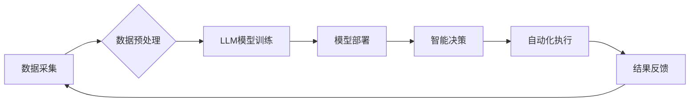

> LLM, 智能供应链, 预测分析, 优化算法, 机器学习, 自然语言处理, 供应链可视化

## 1. 背景介绍

在当今全球化经济的背景下，供应链管理已成为企业核心竞争力的关键因素。传统的供应链管理模式往往面临着信息孤岛、决策效率低、风险控制不足等挑战。随着人工智能技术的快速发展，特别是大型语言模型（LLM）的出现，为供应链管理带来了新的机遇和可能性。LLM 凭借其强大的自然语言处理能力和知识推理能力，能够有效解决传统供应链管理中的痛点，推动供应链管理向智能化、自动化、精准化方向发展。

## 2. 核心概念与联系

**2.1 智能供应链管理**

智能供应链管理是指利用人工智能、大数据、物联网等先进技术，对供应链各个环节进行智能化感知、分析、决策和控制，实现供应链的协同优化、风险预警和高效运营。

**2.2 大型语言模型（LLM）**

大型语言模型（LLM）是一种基于深度学习的强大人工智能模型，通过训练海量文本数据，能够理解和生成人类语言，并具备强大的文本处理能力，例如文本分类、文本摘要、机器翻译、问答系统等。

**2.3 核心概念联系**

LLM 可以为智能供应链管理提供以下关键功能：

* **数据分析与预测:** LLM 可以分析海量供应链数据，识别潜在的趋势和模式，并进行预测分析，例如预测需求、库存、物流成本等。
* **智能决策支持:** LLM 可以根据分析结果和预警信息，为供应链决策提供智能建议，例如优化采购策略、调整生产计划、选择最佳物流方案等。
* **自动化流程:** LLM 可以自动完成一些重复性的供应链任务，例如订单处理、物流跟踪、客户服务等，提高效率和降低成本。
* **协同沟通:** LLM 可以帮助不同供应链参与者进行更有效的沟通和协作，例如自动生成报告、翻译文档、解答问题等。

**2.4 核心架构**



## 3. 核心算法原理 & 具体操作步骤

**3.1 算法原理概述**

LLM 的核心算法原理是基于 Transformer 架构的深度神经网络。Transformer 架构能够有效捕捉文本序列中的长距离依赖关系，从而实现更准确的文本理解和生成。

**3.2 算法步骤详解**

1. **数据预处理:** 收集和清洗供应链数据，将其转换为 LLM 可以理解的格式。
2. **模型训练:** 使用预处理后的数据训练 LLM 模型，例如 BERT、GPT-3 等。
3. **模型评估:** 使用测试数据评估模型的性能，例如准确率、召回率、F1-score 等。
4. **模型部署:** 将训练好的模型部署到生产环境中，用于实际应用。

**3.3 算法优缺点**

**优点:**

* 强大的文本处理能力
* 能够捕捉长距离依赖关系
* 可迁移学习，可以应用于不同的供应链场景

**缺点:**

* 训练成本高
* 需要大量的数据进行训练
* 对于结构化数据处理能力有限

**3.4 算法应用领域**

* 需求预测
* 库存优化
* 物流路线规划
* 风险预警
* 供应链协同

## 4. 数学模型和公式 & 详细讲解 & 举例说明

**4.1 数学模型构建**

LLM 的训练过程可以看作是一个优化问题，目标是找到一个模型参数，使得模型在训练数据上的损失函数最小。损失函数通常是交叉熵损失函数，用于衡量模型预测结果与真实标签之间的差异。

**4.2 公式推导过程**

交叉熵损失函数的公式如下：

$$
H(p, q) = - \sum_{i=1}^{n} p(i) \log q(i)
$$

其中：

* $p(i)$ 是真实标签的概率分布
* $q(i)$ 是模型预测的概率分布

**4.3 案例分析与讲解**

假设我们有一个预测需求的 LLm 模型，训练数据包含历史需求数据和相关特征数据。模型的目标是预测未来某个时间段的需求量。

我们可以使用交叉熵损失函数来衡量模型预测结果与真实需求之间的差异。训练过程中，模型会不断调整参数，使得损失函数最小化，从而提高预测准确率。

## 5. 项目实践：代码实例和详细解释说明

**5.1 开发环境搭建**

* Python 3.7+
* TensorFlow 或 PyTorch
* CUDA 和 cuDNN (可选，用于 GPU 加速)

**5.2 源代码详细实现**

```python
import tensorflow as tf

# 定义模型结构
model = tf.keras.Sequential([
    tf.keras.layers.Embedding(input_dim=vocab_size, output_dim=embedding_dim),
    tf.keras.layers.LSTM(units=lstm_units),
    tf.keras.layers.Dense(units=1)
])

# 编译模型
model.compile(optimizer='adam', loss='mse')

# 训练模型
model.fit(x_train, y_train, epochs=10)

# 评估模型
loss, accuracy = model.evaluate(x_test, y_test)
print('Loss:', loss)
print('Accuracy:', accuracy)
```

**5.3 代码解读与分析**

* 代码首先定义了一个简单的 LSTM 模型，用于预测需求量。
* 模型输入是历史需求数据，输出是未来需求量。
* 模型使用 Adam 优化器和均方误差损失函数进行训练。
* 训练完成后，模型可以用于预测新的需求量。

**5.4 运行结果展示**

训练完成后，我们可以使用模型预测新的需求量，并与实际需求进行比较，评估模型的性能。

## 6. 实际应用场景

**6.1 需求预测**

LLM 可以分析历史销售数据、市场趋势、季节性因素等，预测未来一段时间内的产品需求，帮助企业优化库存管理和生产计划。

**6.2 库存优化**

LLM 可以根据预测需求、库存水平、采购成本等因素，优化库存策略，减少库存积压和缺货风险。

**6.3 物流路线规划**

LLM 可以分析物流网络、交通状况、运输成本等因素，规划最优的物流路线，提高运输效率和降低物流成本。

**6.4 风险预警**

LLM 可以分析供应链数据，识别潜在的风险因素，例如供应商风险、自然灾害风险、政策风险等，及时预警并采取措施降低风险。

**6.5 供应链协同**

LLM 可以帮助不同供应链参与者进行更有效的沟通和协作，例如自动生成报告、翻译文档、解答问题等，提高供应链协同效率。

**6.6 未来应用展望**

随着人工智能技术的不断发展，LLM 在供应链管理领域的应用将更加广泛和深入。未来，LLM 可能能够实现以下应用：

* 更精准的预测分析
* 更智能的决策支持
* 更自动化和高效的流程
* 更强的供应链协同能力
* 更智能的风险管理

## 7. 工具和资源推荐

**7.1 学习资源推荐**

* **书籍:**
    * 《深度学习》
    * 《自然语言处理》
    * 《Transformer 详解》
* **在线课程:**
    * Coursera: 深度学习
    * edX: 自然语言处理
    * fast.ai: 深度学习

**7.2 开发工具推荐**

* **TensorFlow:** 开源深度学习框架
* **PyTorch:** 开源深度学习框架
* **Hugging Face:** 提供预训练的 LLm 模型和工具

**7.3 相关论文推荐**

* 《Attention Is All You Need》
* 《BERT: Pre-training of Deep Bidirectional Transformers for Language Understanding》
* 《GPT-3: Language Models are Few-Shot Learners》

## 8. 总结：未来发展趋势与挑战

**8.1 研究成果总结**

LLM 在智能供应链管理领域取得了显著的成果，例如需求预测、库存优化、物流路线规划等方面都取得了较好的效果。

**8.2 未来发展趋势**

* 模型规模和能力的提升
* 算法效率和鲁棒性的增强
* 多模态数据融合
* 隐私保护和安全保障

**8.3 面临的挑战**

* 数据获取和质量问题
* 模型解释性和可信度问题
* 伦理和社会影响问题

**8.4 研究展望**

未来，LLM 在智能供应链管理领域的应用将更加广泛和深入，需要进一步加强算法研究、数据积累和应用场景探索，推动智能供应链管理的健康发展。

## 9. 附录：常见问题与解答

**9.1 如何选择合适的 LLm 模型？**

选择合适的 LLm 模型需要根据具体的应用场景和需求进行评估，例如模型规模、参数量、训练数据、性能指标等。

**9.2 如何处理供应链数据中的噪声和缺失值？**

数据预处理是 LLm 模型训练的关键步骤，需要对供应链数据进行清洗、去噪和填充缺失值，以提高模型的训练效果。

**9.3 如何评估 LLm 模型的性能？**

可以使用多种指标来评估 LLm 模型的性能，例如准确率、召回率、F1-score、AUC 等。

**9.4 LLm 模型的安全性如何保障？**

需要采取相应的安全措施来保障 LLm 模型的安全性，例如数据加密、模型保护、攻击检测等。


作者：禅与计算机程序设计艺术 / Zen and the Art of Computer Programming 
<end_of_turn>