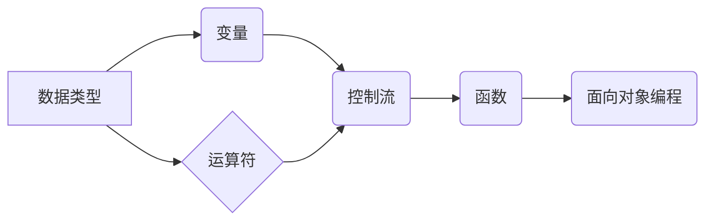

> Python, 语言基础, 代码实战, 数据结构, 算法,  面向对象,  编程实践

## 1. 背景介绍

Python 作为一种简洁、易读、功能强大的编程语言，近年来在人工智能、数据科学、Web 开发等领域获得了广泛应用。其简洁的语法和丰富的库函数，使得 Python 成为初学者入门编程的理想选择，同时也为经验丰富的程序员提供了高效的开发工具。

本篇文章将深入探讨 Python 的基础原理，从语法结构、数据类型、控制流到面向对象编程，并结合实际案例，讲解 Python 的核心算法和应用场景。通过对 Python 的深入理解，读者将能够掌握 Python 的编程技巧，并将其应用于实际项目开发。

## 2. 核心概念与联系

Python 的核心概念包括：

* **数据类型:** Python 支持多种数据类型，包括数字类型（整数、浮点数）、字符串类型、布尔类型、列表、元组、字典等。
* **变量:** 变量是用来存储数据的容器，Python 使用动态类型，这意味着变量的类型在运行时才会确定。
* **运算符:** Python 提供各种运算符，用于对数据进行操作，例如算术运算符、比较运算符、逻辑运算符等。
* **控制流:** 控制流决定了程序执行的顺序，Python 提供了条件语句（if、elif、else）、循环语句（for、while）等控制流语句。
* **函数:** 函数是用来封装代码块的机制，可以提高代码的可读性和可复用性。
* **面向对象编程:** Python 支持面向对象编程，包括类、对象、继承、多态等概念。

**Python 核心概念关系图:**



## 3. 核心算法原理 & 具体操作步骤

### 3.1  算法原理概述

算法是解决特定问题的步骤序列，是计算机程序的核心。Python 提供了丰富的库函数，可以实现各种算法，例如排序算法、搜索算法、图算法等。

### 3.2  算法步骤详解

**示例：冒泡排序算法**

冒泡排序是一种简单而直观的排序算法，其原理是通过多次比较相邻元素，将较大的元素“冒泡”到数组的末尾。

**步骤：**

1. 从数组的第一个元素开始，与相邻元素进行比较。
2. 如果相邻元素的顺序错误，则交换它们的位置。
3. 重复步骤 1 和 2，直到整个数组排序完成。

**Python 代码实现：**

```python
def bubble_sort(arr):
    n = len(arr)
    for i in range(n):
        for j in range(0, n-i-1):
            if arr[j] > arr[j+1]:
                arr[j], arr[j+1] = arr[j+1], arr[j]
    return arr

# 测试代码
arr = [64, 34, 25, 12, 22, 11, 90]
sorted_arr = bubble_sort(arr)
print("排序后的数组:", sorted_arr)
```

### 3.3  算法优缺点

**优点：**

* 实现简单，易于理解和实现。
* 稳定排序，相同元素的相对顺序不会改变。

**缺点：**

* 时间复杂度较高，对于大规模数据排序效率较低。

### 3.4  算法应用领域

冒泡排序算法常用于教育和教学，以演示基本排序算法的原理。在实际应用中，由于其时间复杂度较高，通常不推荐用于大规模数据排序。

## 4. 数学模型和公式 & 详细讲解 & 举例说明

### 4.1  数学模型构建

**示例：线性回归模型**

线性回归模型是一种用于预测连续变量的机器学习算法，其核心思想是找到一条直线，使得这条直线与数据点之间的距离最小。

**数学模型：**

```latex
y = mx + c
```

其中：

* $y$ 是预测值
* $x$ 是输入变量
* $m$ 是斜率
* $c$ 是截距

### 4.2  公式推导过程

线性回归模型的参数 $m$ 和 $c$ 可以通过最小二乘法求解。最小二乘法是指找到一条直线，使得这条直线与数据点之间的平方误差最小。

**平方误差公式：**

```latex
SSE = \sum_{i=1}^{n}(y_i - \hat{y_i})^2
```

其中：

* $SSE$ 是平方误差和
* $n$ 是数据点的数量
* $y_i$ 是第 $i$ 个数据点的真实值
* $\hat{y_i}$ 是第 $i$ 个数据点的预测值

通过对 $SSE$ 进行求导，并令其等于零，可以得到 $m$ 和 $c$ 的解。

### 4.3  案例分析与讲解

**示例：预测房价**

假设我们有一组房价数据，包括房屋面积和房价。我们可以使用线性回归模型来预测房屋价格。

**数据：**

| 房屋面积 (平方米) | 房价 (万元) |
|---|---|
| 60 | 1.2 |
| 80 | 1.5 |
| 100 | 1.8 |
| 120 | 2.1 |

**模型训练：**

使用上述数据训练线性回归模型，得到 $m$ 和 $c$ 的值。

**预测：**

对于一个面积为 90 平方米的房屋，可以使用训练好的模型预测其价格。

## 5. 项目实践：代码实例和详细解释说明

### 5.1  开发环境搭建

* 安装 Python 语言环境
* 安装必要的库函数，例如 NumPy、Pandas、Matplotlib 等。

### 5.2  源代码详细实现

```python
import numpy as np
import pandas as pd
from sklearn.linear_model import LinearRegression

# 导入数据
data = pd.read_csv("house_data.csv")

# 将房屋面积作为特征，房价作为目标变量
X = data["面积"].values.reshape(-1, 1)
y = data["房价"].values

# 创建线性回归模型
model = LinearRegression()

# 训练模型
model.fit(X, y)

# 预测房价
new_area = 90
new_price = model.predict([[new_area]])
print("预测房价:", new_price[0])
```

### 5.3  代码解读与分析

* 导入必要的库函数。
* 导入数据，并将其转换为 NumPy 数组。
* 创建线性回归模型。
* 使用 `fit()` 方法训练模型。
* 使用 `predict()` 方法预测房价。

### 5.4  运行结果展示

运行代码后，将输出预测的房价。

## 6. 实际应用场景

### 6.1  数据分析与预测

线性回归模型广泛应用于数据分析和预测，例如预测销售额、股票价格、客户流失率等。

### 6.2  机器学习

线性回归模型是机器学习的基础算法，也是许多更复杂机器学习算法的基础。

### 6.3  其他应用场景

线性回归模型还可以应用于图像处理、自然语言处理等领域。

### 6.4  未来应用展望

随着数据量的不断增长，线性回归模型将继续在数据分析和预测领域发挥重要作用。

## 7. 工具和资源推荐

### 7.1  学习资源推荐

* Python 官方文档：https://docs.python.org/
* Python 教程：https://www.w3schools.com/python/
* 数据科学与机器学习课程：https://www.coursera.org/

### 7.2  开发工具推荐

* PyCharm：https://www.jetbrains.com/pycharm/
* VS Code：https://code.visualstudio.com/

### 7.3  相关论文推荐

* The Elements of Statistical Learning: Data Mining, Inference, and Prediction
* Introduction to Machine Learning

## 8. 总结：未来发展趋势与挑战

### 8.1  研究成果总结

Python 作为一种功能强大、易于学习的编程语言，在人工智能、数据科学、Web 开发等领域取得了显著的成就。

### 8.2  未来发展趋势

Python 将继续保持其在人工智能和数据科学领域的领先地位，并不断扩展到其他领域，例如区块链、量子计算等。

### 8.3  面临的挑战

Python 的发展也面临着一些挑战，例如代码可读性和可维护性、性能优化等。

### 8.4  研究展望

未来，Python 的发展将更加注重代码质量、性能优化和生态系统建设。

## 9. 附录：常见问题与解答

**常见问题：**

* 如何安装 Python？
* 如何使用 Python 进行数据分析？
* 如何学习 Python？

**解答：**

* Python 的安装方法可以参考官方文档。
* Python 提供了丰富的库函数，例如 NumPy、Pandas、Scikit-learn 等，可以用于数据分析。
* 可以通过在线课程、书籍、教程等方式学习 Python。


作者：禅与计算机程序设计艺术 / Zen and the Art of Computer Programming 
<end_of_turn>