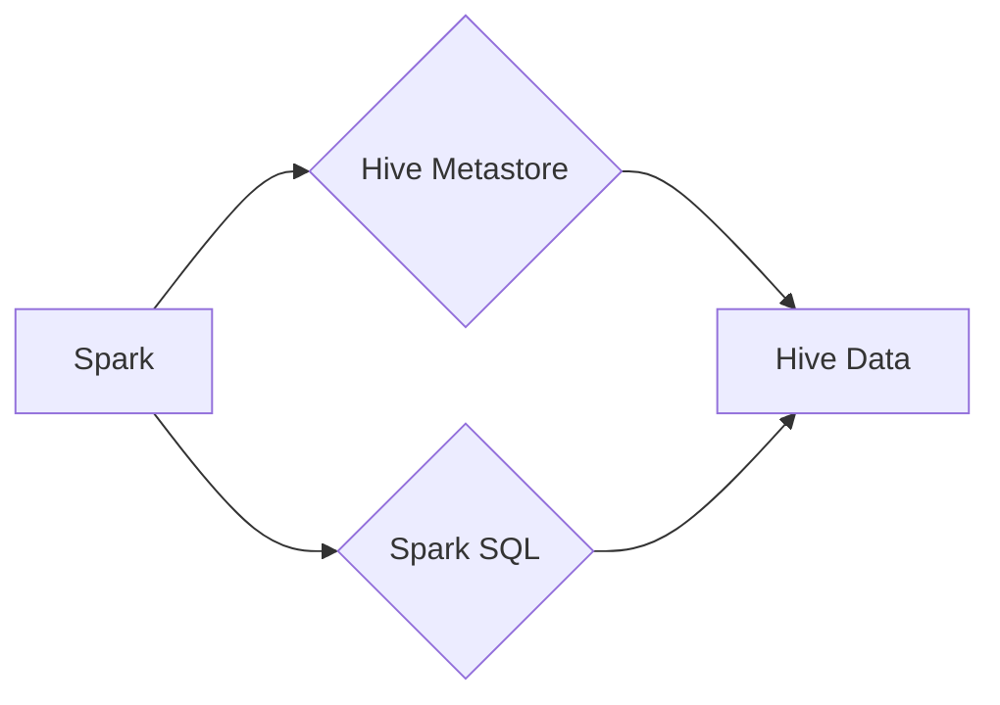

> Spark, Hive, 数据处理, 集群计算, 大数据, ETL, SQL, Scala

## 1. 背景介绍

在当今数据爆炸的时代，海量数据的存储和处理成为企业发展的重要挑战。Apache Spark 和 Apache Hive 作为开源的大数据处理框架，分别以其高性能和易用性在数据处理领域占据重要地位。Spark 以其快速处理能力和内存计算优势，能够高效地处理实时数据流和批处理任务；而 Hive 以其 SQL-like 查询语言和数据仓库特性，能够方便地对海量数据进行分析和挖掘。

将 Spark 和 Hive 整合在一起，可以充分发挥两者各自的优势，构建一个高效、灵活的数据处理平台。这种整合方式能够实现数据从 Hive 元数据仓库的读取到 Spark 的内存计算，再将结果回写到 Hive 中，从而实现数据 ETL（Extract, Transform, Load）流程的自动化和优化。

## 2. 核心概念与联系

### 2.1 Spark 和 Hive 的核心概念

* **Spark:**  一个通用且高性能的分布式计算框架，支持多种编程语言，如 Scala、Java、Python 和 R。Spark 的核心特点是内存计算，能够将数据加载到内存中进行处理，从而大幅提升计算速度。

* **Hive:**  一个基于 Hadoop 的数据仓库系统，提供 SQL-like 查询语言（HiveQL）来访问和管理数据。Hive 将数据存储在 Hadoop 文件系统（HDFS）中，并提供元数据管理和查询优化功能。

### 2.2 Spark 和 Hive 的联系

Spark 和 Hive 可以通过以下方式进行整合：

* **Spark SQL:** Spark 提供了 Spark SQL 模块，能够直接读取 Hive 元数据并执行 HiveQL 查询。
* **Hive Thrift Server:** Hive 提供了 Thrift 服务器，允许 Spark 通过 Thrift 协议与 Hive 元数据和数据交互。
* **Spark-Hive Connector:**  一些第三方工具，如 Spark-Hive Connector，提供了更便捷的 Spark 和 Hive 整合方式。

### 2.3 Spark-Hive 整合架构



## 3. 核心算法原理 & 具体操作步骤

### 3.1 算法原理概述

Spark-Hive 整合的核心算法原理是将 HiveQL 查询转换为 Spark SQL 语句，然后在 Spark 集群上执行。

* **HiveQL 解析:** Spark SQL 模块会解析 HiveQL 查询语句，并将其转换为 Spark SQL 语句。
* **Spark SQL 执行:** Spark SQL 模块会将 Spark SQL 语句转换为底层的执行计划，并将其提交到 Spark 集群上执行。
* **结果回写:** Spark 集群执行完成后，结果会回写到 Hive 元数据仓库中。

### 3.2 算法步骤详解

1. **连接 Hive Metastore:** Spark 程序首先需要连接到 Hive 元数据仓库，获取表结构和数据位置信息。
2. **解析 HiveQL 查询:** Spark SQL 模块会解析 HiveQL 查询语句，并将其转换为 Spark SQL 语句。
3. **生成执行计划:** Spark SQL 模块会根据 Spark SQL 语句生成执行计划，并将其提交到 Spark 集群上执行。
4. **执行查询:** Spark 集群会根据执行计划，从 Hive 数据仓库中读取数据，并进行计算和处理。
5. **回写结果:** Spark 集群执行完成后，结果会回写到 Hive 元数据仓库中。

### 3.3 算法优缺点

**优点:**

* **高效性:** Spark 的内存计算能力能够大幅提升数据处理速度。
* **易用性:** HiveQL 查询语言易于学习和使用，能够方便地对数据进行分析和挖掘。
* **灵活性:** Spark 支持多种编程语言，能够满足不同的开发需求。

**缺点:**

* **复杂性:** Spark-Hive 整合需要一定的技术积累，需要对 Spark 和 Hive 的原理和配置有一定的了解。
* **依赖性:** Spark-Hive 整合需要依赖于 Hadoop 和 Hive 环境。

### 3.4 算法应用领域

Spark-Hive 整合在以下领域具有广泛的应用：

* **数据仓库:** 将数据从各种数据源导入 Hive 数据仓库，并使用 Spark 进行数据清洗、转换和分析。
* **实时数据处理:** 使用 Spark 处理实时数据流，并将其写入 Hive 数据仓库进行持久化存储和分析。
* **机器学习:** 使用 Spark 进行机器学习模型训练和预测，并将结果存储到 Hive 数据仓库中。

## 4. 数学模型和公式 & 详细讲解 & 举例说明

### 4.1 数学模型构建

Spark-Hive 整合的数学模型可以抽象为一个数据流处理模型，其中数据从 Hive 元数据仓库流向 Spark 集群，经过计算和处理后，最终回写到 Hive 数据仓库。

### 4.2 公式推导过程

由于 Spark-Hive 整合涉及多个算法和组件，其数学模型的推导过程较为复杂，需要结合具体的算法和场景进行分析。

### 4.3 案例分析与讲解

假设我们有一个 Hive 表 `users`，包含用户 ID、姓名和年龄等信息。我们想要使用 Spark 计算每个用户的平均年龄。

**HiveQL 查询:**

```sql
SELECT AVG(age) FROM users;
```

**Spark SQL 查询:**

```scala
val df = spark.read.format("hive").load("users")
val avgAge = df.agg(avg("age")).collect().head(0)
println(s"平均年龄: $avgAge")
```

## 5. 项目实践：代码实例和详细解释说明

### 5.1 开发环境搭建

* 安装 Hadoop 和 Hive
* 安装 Spark
* 配置 Spark 和 Hive 的连接信息

### 5.2 源代码详细实现

```scala
import org.apache.spark.sql.SparkSession

object SparkHiveIntegration {
  def main(args: Array[String]): Unit = {
    val spark = SparkSession.builder()
      .appName("SparkHiveIntegration")
      .enableHiveSupport()
      .getOrCreate()

    // 读取 Hive 表
    val df = spark.sql("SELECT * FROM users")

    // 计算平均年龄
    val avgAge = df.agg(avg("age")).collect().head(0)

    // 打印结果
    println(s"平均年龄: $avgAge")

    spark.stop()
  }
}
```

### 5.3 代码解读与分析

* `SparkSession.builder()`: 创建 SparkSession 对象，这是 Spark 的入口点。
* `.appName("SparkHiveIntegration")`: 设置 Spark 应用名称。
* `.enableHiveSupport()`: 开启 Hive 支持，允许 Spark 与 Hive 元数据仓库交互。
* `.getOrCreate()`: 获取或创建 SparkSession 对象。
* `spark.sql("SELECT * FROM users")`: 使用 Spark SQL 语句读取 Hive 表 `users`。
* `df.agg(avg("age"))`: 使用聚合函数 `avg()` 计算 `age` 列的平均值。
* `collect()`: 将结果集从分布式计算环境中收集到本地。
* `head(0)`: 获取结果集中的第一条记录。
* `spark.stop()`: 关闭 SparkSession 对象。

### 5.4 运行结果展示

运行代码后，将输出用户的平均年龄。

## 6. 实际应用场景

### 6.1 数据仓库构建

Spark-Hive 整合可以用于构建数据仓库，将数据从各种数据源导入 Hive 数据仓库，并使用 Spark 进行数据清洗、转换和分析。

### 6.2 实时数据处理

Spark-Hive 整合可以用于处理实时数据流，将数据写入 Hive 数据仓库进行持久化存储和分析。

### 6.3 机器学习

Spark-Hive 整合可以用于机器学习，使用 Spark 进行机器学习模型训练和预测，并将结果存储到 Hive 数据仓库中。

### 6.4 未来应用展望

随着大数据技术的不断发展，Spark-Hive 整合将会有更广泛的应用场景，例如：

* **实时数据分析:** 使用 Spark 进行实时数据分析，为企业决策提供实时支持。
* **人工智能:** 使用 Spark 和 Hive 构建人工智能平台，进行大规模数据训练和预测。
* **物联网:** 使用 Spark-Hive 整合处理物联网数据，进行设备监控和故障诊断。

## 7. 工具和资源推荐

### 7.1 学习资源推荐

* Apache Spark 官方文档: https://spark.apache.org/docs/latest/
* Apache Hive 官方文档: https://hive.apache.org/docs/
* Spark-Hive Connector: https://github.com/databricks/spark-hive-connector

### 7.2 开发工具推荐

* IntelliJ IDEA
* Eclipse
* PyCharm

### 7.3 相关论文推荐

* Spark SQL: Relational Query Processing in Spark
* Hive: A Data Warehouse System on Top of Hadoop

## 8. 总结：未来发展趋势与挑战

### 8.1 研究成果总结

Spark-Hive 整合为大数据处理提供了高效、灵活的解决方案，能够满足企业对数据处理和分析的需求。

### 8.2 未来发展趋势

* **更强大的性能:** Spark 和 Hive 的性能将不断提升，能够处理更大的数据规模和更复杂的查询。
* **更丰富的功能:** Spark 和 Hive 将会添加更多的新功能，例如支持更丰富的数据类型和更复杂的查询操作。
* **更易于使用:** Spark 和 Hive 的使用门槛将不断降低，能够更方便地被普通用户使用。

### 8.3 面临的挑战

* **复杂性:** Spark-Hive 整合的配置和维护相对复杂，需要一定的技术积累。
* **兼容性:** Spark 和 Hive 的版本兼容性需要不断维护，以确保系统稳定运行。
* **安全:** Spark-Hive 整合需要考虑数据安全问题，确保数据不被非法访问和篡改。

### 8.4 研究展望

未来，Spark-Hive 整合将继续朝着更高效、更灵活、更易于使用的方向发展，并将应用于更多领域，例如人工智能、物联网等。


## 9. 附录：常见问题与解答

### 9.1 如何连接 Hive 元数据仓库？

Spark 可以通过配置 `hive.metastore.uris` 属性连接到 Hive 元数据仓库。

### 9.2 如何解决 Spark-Hive 整合的兼容性问题？

需要确保 Spark 和 Hive 的版本兼容，并参考官方文档进行配置。

### 9.3 如何提高 Spark-Hive 整合的性能？

可以优化 Spark 和 Hive 的配置参数，例如设置分区数、缓存策略等。

作者：禅与计算机程序设计艺术 / Zen and the Art of Computer Programming


<end_of_turn>