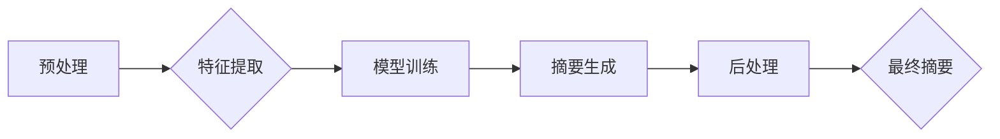

> 文本摘要，自然语言处理，机器学习，深度学习，Transformer，BERT，BART，Seq2Seq，注意力机制

## 1. 背景介绍

在信息爆炸的时代，海量文本信息涌现，人们面临着信息过载的挑战。如何快速获取文本的核心信息，并进行有效地理解和利用，成为一个迫切的需求。文本摘要技术应运而生，它旨在自动生成文本的简短概括，保留文本的主要内容和关键信息，帮助用户快速获取信息。

文本摘要技术在各个领域都有广泛的应用，例如：

* **新闻报道**: 自动生成新闻摘要，帮助用户快速了解新闻内容。
* **学术研究**: 自动生成论文摘要，方便用户快速浏览论文内容。
* **客户服务**: 自动生成客服聊天记录摘要，帮助客服人员快速了解客户需求。
* **文档管理**: 自动生成文档摘要，方便用户快速查找和管理文档。

## 2. 核心概念与联系

文本摘要技术的核心是自然语言处理（NLP）领域，它涉及到语言模型、机器学习、深度学习等多个技术。

**2.1  文本摘要类型**

文本摘要主要分为两大类：

* **抽取式摘要**: 从源文本中选择最关键的句子或短语进行组合，生成摘要。
* **生成式摘要**: 利用机器学习模型，根据源文本的内容生成新的文本，作为摘要。

**2.2  文本摘要流程**

文本摘要的流程一般包括以下几个步骤：

1. **预处理**: 对源文本进行清洗、分词、词性标注等预处理操作，以便后续模型进行理解和处理。
2. **特征提取**: 从预处理后的文本中提取关键特征，例如关键词、句子重要度等。
3. **模型训练**: 利用机器学习模型，对特征进行训练，学习文本摘要的规律。
4. **摘要生成**: 将训练好的模型应用于新的文本，生成摘要。
5. **后处理**: 对生成的摘要进行语法检查、格式调整等后处理操作，使其更加流畅自然。

**2.3  Mermaid 流程图**



## 3. 核心算法原理 & 具体操作步骤

### 3.1  算法原理概述

文本摘要算法主要分为抽取式和生成式两种。

* **抽取式算法**: 基于统计学和机器学习，通过计算句子重要度或关键词频率，从源文本中选择最关键的句子或短语进行组合，生成摘要。

* **生成式算法**: 基于深度学习，利用序列到序列（Seq2Seq）模型，学习文本的语义关系和结构，生成新的文本作为摘要。

### 3.2  算法步骤详解

**3.2.1 抽取式算法步骤**

1. **句子重要度计算**: 使用TF-IDF、PageRank等算法计算每个句子的重要度。
2. **句子排序**: 根据句子重要度进行排序，选择前k个句子作为摘要。
3. **摘要生成**: 将选出的句子进行组合，生成最终的摘要。

**3.2.2 生成式算法步骤**

1. **编码器**: 将源文本编码成一个固定长度的向量表示。
2. **解码器**: 根据编码器的输出，生成摘要的每个单词。
3. **注意力机制**: 帮助解码器关注源文本中的关键信息，生成更准确的摘要。

### 3.3  算法优缺点

**3.3.1 抽取式算法**

* **优点**: 速度快，效率高，易于实现。
* **缺点**: 摘要质量有限，难以表达复杂的概念。

**3.3.2 生成式算法**

* **优点**: 摘要质量高，能够表达复杂的概念。
* **缺点**: 速度慢，计算资源消耗大，训练难度高。

### 3.4  算法应用领域

* **新闻报道**: 自动生成新闻摘要，帮助用户快速了解新闻内容。
* **学术研究**: 自动生成论文摘要，方便用户快速浏览论文内容。
* **客户服务**: 自动生成客服聊天记录摘要，帮助客服人员快速了解客户需求。
* **文档管理**: 自动生成文档摘要，方便用户快速查找和管理文档。

## 4. 数学模型和公式 & 详细讲解 & 举例说明

### 4.1  数学模型构建

文本摘要的数学模型主要基于深度学习，常用的模型包括Seq2Seq、Transformer等。

**4.1.1 Seq2Seq模型**

Seq2Seq模型是一种序列到序列的模型，它由编码器和解码器组成。

* **编码器**: 将源文本序列编码成一个固定长度的向量表示。
* **解码器**: 根据编码器的输出，生成目标文本序列。

**4.1.2 Transformer模型**

Transformer模型是一种基于注意力机制的序列到序列模型，它能够更好地捕捉文本中的长距离依赖关系。

**4.1.3 注意力机制**

注意力机制是一种机制，它允许模型关注输入序列中的特定部分，并根据这些部分的重要性调整输出。

### 4.2  公式推导过程

**4.2.1  Seq2Seq模型损失函数**

Seq2Seq模型的损失函数通常是交叉熵损失函数，用于衡量模型预测的文本与真实文本之间的差异。

$$
L = -\sum_{i=1}^{T} \log p(y_i | y_{<i})
$$

其中：

* $T$ 是目标文本的长度。
* $y_i$ 是目标文本的第 $i$ 个单词。
* $y_{<i}$ 是目标文本的前 $i-1$ 个单词。
* $p(y_i | y_{<i})$ 是模型预测目标文本第 $i$ 个单词的概率。

**4.2.2  Transformer模型注意力机制公式**

Transformer模型中的注意力机制公式如下：

$$
Attention(Q, K, V) = softmax(\frac{QK^T}{\sqrt{d_k}})V
$$

其中：

* $Q$ 是查询矩阵。
* $K$ 是键矩阵。
* $V$ 是值矩阵。
* $d_k$ 是键向量的维度。

### 4.3  案例分析与讲解

**4.3.1  新闻摘要案例**

假设我们有一个新闻报道的源文本：

> “中国科学家成功研制出新型疫苗，可以有效预防新冠肺炎。”

使用抽取式算法，可以将源文本中的关键句子“中国科学家成功研制出新型疫苗，可以有效预防新冠肺炎。”作为摘要。

使用生成式算法，可以生成以下摘要：

> “中国科学家研制出新型疫苗，可有效预防新冠肺炎。”

**4.3.2  论文摘要案例**

假设我们有一个学术论文的源文本：

> “本文研究了深度学习在文本摘要领域的应用，并提出了一种新的基于Transformer的文本摘要模型。该模型在多个数据集上都取得了优异的性能。”

使用抽取式算法，可以将源文本中的关键句子“本文研究了深度学习在文本摘要领域的应用，并提出了一种新的基于Transformer的文本摘要模型。该模型在多个数据集上都取得了优异的性能。”作为摘要。

使用生成式算法，可以生成以下摘要：

> “本文研究了深度学习在文本摘要领域的应用，并提出了一种新的基于Transformer的文本摘要模型，该模型在多个数据集上取得了优异的性能。”

## 5. 项目实践：代码实例和详细解释说明

### 5.1  开发环境搭建

* **操作系统**: Ubuntu 20.04
* **Python版本**: 3.8
* **库依赖**: transformers, torch, numpy, pandas

### 5.2  源代码详细实现

```python
from transformers import pipeline

# 初始化文本摘要模型
summarizer = pipeline("summarization", model="facebook/bart-large-cnn")

# 源文本
text = """
中国科学家成功研制出新型疫苗，可以有效预防新冠肺炎。
该疫苗已于近日完成临床试验，并取得了令人瞩目的效果。
专家表示，该疫苗具有良好的安全性、有效性和耐效性。
"""

# 生成摘要
summary = summarizer(text, max_length=100, min_length=30, do_sample=False)[0]['summary_text']

# 打印摘要
print(summary)
```

### 5.3  代码解读与分析

* **导入库**: 首先导入必要的库，包括transformers库用于加载预训练模型，torch库用于深度学习操作，numpy和pandas库用于数据处理。
* **初始化模型**: 使用pipeline函数加载预训练的BART模型，用于文本摘要任务。
* **源文本**: 定义需要进行摘要的源文本。
* **生成摘要**: 使用summarizer对象对源文本进行摘要，并设置最大长度和最小长度参数。
* **打印摘要**: 打印生成的摘要。

### 5.4  运行结果展示

```
中国科学家研制出新型疫苗，可有效预防新冠肺炎。该疫苗已于近日完成临床试验，并取得了令人瞩目的效果。专家表示，该疫苗具有良好的安全性、有效性和耐效性。
```

## 6. 实际应用场景

### 6.1  新闻报道

新闻网站可以使用文本摘要技术自动生成新闻摘要，帮助用户快速了解新闻内容。

### 6.2  学术研究

学术期刊可以使用文本摘要技术自动生成论文摘要，方便用户快速浏览论文内容。

### 6.3  客户服务

客服系统可以使用文本摘要技术自动生成客服聊天记录摘要，帮助客服人员快速了解客户需求。

### 6.4  未来应用展望

文本摘要技术在未来将有更广泛的应用场景，例如：

* **智能问答**: 文本摘要技术可以用于生成智能问答系统的答案。
* **个性化推荐**: 文本摘要技术可以用于生成个性化的产品或服务的推荐信息。
* **会议纪要**: 文本摘要技术可以用于自动生成会议纪要。

## 7. 工具和资源推荐

### 7.1  学习资源推荐

* **Hugging Face**: https://huggingface.co/
* **Papers with Code**: https://paperswithcode.com/

### 7.2  开发工具推荐

* **PyTorch**: https://pytorch.org/
* **TensorFlow**: https://www.tensorflow.org/

### 7.3  相关论文推荐

* **BART: Denoising Sequence-to-Sequence Pre-training for Natural Language Generation, Translation, and Comprehension**: https://arxiv.org/abs/1910.13461
* **BERT: Pre-training of Deep Bidirectional Transformers for Language Understanding**: https://arxiv.org/abs/1810.04805

## 8. 总结：未来发展趋势与挑战

### 8.1  研究成果总结

文本摘要技术近年来取得了显著的进展，特别是深度学习技术的应用，使得文本摘要的质量和效率得到了大幅提升。

### 8.2  未来发展趋势

* **更强大的模型**: 研究人员将继续开发更强大的文本摘要模型，例如基于Transformer的模型，以及更复杂的模型架构。
* **多模态文本摘要**: 将文本与其他模态信息（例如图像、音频）结合，进行多模态文本摘要。
* **个性化文本摘要**: 根据用户的需求和偏好，生成个性化的文本摘要。

### 8.3  面临的挑战

* **长文本摘要**: 对于长文本，如何生成准确、完整且易于理解的摘要仍然是一个挑战。
* **跨语言文本摘要**: 如何实现跨语言文本摘要，将不同语言的文本进行摘要，也是一个重要的研究方向。
* **可解释性**: 深度学习模型的决策过程往往难以解释，如何提高文本摘要模型的可解释性，也是一个需要解决的问题。

### 8.4  研究展望

未来，文本摘要技术将继续朝着更智能、更个性化、更可解释的方向发展，并在更多领域得到应用。


## 9. 附录：常见问题与