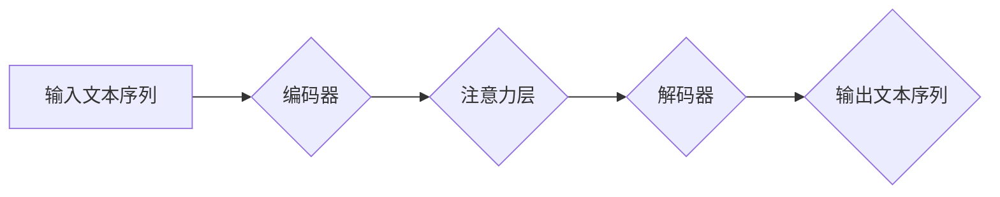

> Transformer, 大模型, 数据集, 训练, 自然语言处理, 深度学习, 机器学习

## 1. 背景介绍

近年来，深度学习在自然语言处理 (NLP) 领域取得了显著进展，其中 Transformer 架构扮演着至关重要的角色。自 2017 年 Google 发布论文《Attention Is All You Need》以来，Transformer 模型凭借其强大的能力和高效的训练方式，在机器翻译、文本摘要、问答系统等众多任务上取得了突破性的成果。

然而，Transformer 模型的训练需要海量的数据集和强大的计算资源。随着模型规模的不断扩大，训练成本也随之增加，这对于许多研究机构和企业来说是一个巨大的挑战。

为了降低训练成本，提高模型效率，研究者们提出了许多优化方法，例如：

* **知识蒸馏:** 利用预训练模型的知识，训练更小的模型。
* **参数共享:** 在多个任务上共享模型参数，减少训练数据需求。
* **数据增强:** 通过对现有数据进行变换，增加训练数据的规模和多样性。

本文将重点探讨如何利用更多的数据集进行 Transformer 模型训练，从而提升模型性能和泛化能力。

## 2. 核心概念与联系

Transformer 模型的核心思想是利用注意力机制来捕捉文本序列中的长距离依赖关系。

**2.1 Transformer 架构**

Transformer 模型由以下主要部分组成：

* **编码器 (Encoder):** 用于将输入文本序列编码成固定长度的向量表示。
* **解码器 (Decoder):** 用于根据编码后的向量表示生成目标文本序列。
* **注意力机制:** 用于捕捉文本序列中不同词之间的关系。

**2.2 注意力机制**

注意力机制是一种机制，它允许模型关注输入序列中与当前任务最相关的部分。

**2.3 Mermaid 流程图**



## 3. 核心算法原理 & 具体操作步骤

### 3.1  算法原理概述

Transformer 模型的训练基于深度学习的监督学习框架。训练目标是让模型能够准确地预测目标文本序列。

训练过程可以概括为以下步骤：

1. 将输入文本序列和目标文本序列分别编码成向量表示。
2. 利用注意力机制和多头注意力机制，捕捉文本序列中不同词之间的关系。
3. 通过编码器和解码器，将编码后的向量表示转换为目标文本序列。
4. 计算模型预测结果与真实目标文本序列之间的损失函数值。
5. 利用反向传播算法，更新模型参数，降低损失函数值。

### 3.2  算法步骤详解

1. **数据预处理:** 将文本数据进行清洗、分词、词嵌入等预处理操作，以便模型能够理解和处理文本信息。
2. **模型构建:** 根据 Transformer 架构，构建模型结构，包括编码器、解码器、注意力层等。
3. **模型训练:** 使用训练数据，训练模型参数，降低模型损失函数值。
4. **模型评估:** 使用验证数据，评估模型性能，例如准确率、困惑度等。
5. **模型调优:** 根据评估结果，调整模型超参数，例如学习率、批处理大小等，进一步提高模型性能。

### 3.3  算法优缺点

**优点:**

* 能够捕捉长距离依赖关系，提升文本理解能力。
* 并行训练效率高，训练速度快。
* 模型结构灵活，可以根据任务需求进行调整。

**缺点:**

* 训练成本高，需要海量数据和强大的计算资源。
* 模型参数量大，部署成本较高。

### 3.4  算法应用领域

Transformer 模型在 NLP 领域有着广泛的应用，例如：

* 机器翻译
* 文本摘要
* 问答系统
* 情感分析
* 代码生成

## 4. 数学模型和公式 & 详细讲解 & 举例说明

### 4.1  数学模型构建

Transformer 模型的数学模型主要基于线性变换、注意力机制和多层感知机 (MLP)。

**4.1.1 线性变换:**

线性变换用于将输入向量映射到输出向量。

**公式:**

$$
y = Wx + b
$$

其中，$x$ 是输入向量，$W$ 是权重矩阵，$b$ 是偏置向量，$y$ 是输出向量。

**4.1.2 注意力机制:**

注意力机制用于计算输入序列中不同词之间的权重，并根据权重对输入序列进行加权求和。

**公式:**

$$
Attention(Q, K, V) = softmax(\frac{QK^T}{\sqrt{d_k}})V
$$

其中，$Q$ 是查询矩阵，$K$ 是键矩阵，$V$ 是值矩阵，$d_k$ 是键向量的维度。

**4.1.3 多层感知机 (MLP):**

MLP 是一个多层神经网络，用于对输入向量进行非线性变换。

**公式:**

$$
MLP(x) = ReLU(W_1x + b_1)W_2 + b_2
$$

其中，$ReLU$ 是 ReLU 激活函数，$W_1$ 和 $W_2$ 是权重矩阵，$b_1$ 和 $b_2$ 是偏置向量。

### 4.2  公式推导过程

注意力机制的 softmax 函数用于计算每个词的权重，使得权重之和为 1。

### 4.3  案例分析与讲解

假设我们有一个句子 "The cat sat on the mat"，我们想要计算 "cat" 和 "mat" 之间的注意力权重。

我们可以将句子中的每个词都转换为向量表示，然后计算查询向量和键向量的点积，再通过 softmax 函数得到注意力权重。

## 5. 项目实践：代码实例和详细解释说明

### 5.1  开发环境搭建

* Python 3.6+
* TensorFlow 或 PyTorch
* CUDA 和 cuDNN

### 5.2  源代码详细实现

```python
import tensorflow as tf

# 定义 Transformer 模型
class Transformer(tf.keras.Model):
    def __init__(self, vocab_size, embedding_dim, num_heads, num_layers):
        super(Transformer, self).__init__()
        self.embedding = tf.keras.layers.Embedding(vocab_size, embedding_dim)
        self.encoder = tf.keras.layers.StackedRNNCells([tf.keras.layers.LSTM(embedding_dim) for _ in range(num_layers)])
        self.decoder = tf.keras.layers.StackedRNNCells([tf.keras.layers.LSTM(embedding_dim) for _ in range(num_layers)])
        self.attention = tf.keras.layers.MultiHeadAttention(num_heads=num_heads, key_dim=embedding_dim)

    def call(self, inputs):
        # 嵌入输入序列
        embedded_inputs = self.embedding(inputs)
        # 编码输入序列
        encoded_inputs = self.encoder(embedded_inputs)
        # 解码输入序列
        decoded_inputs = self.decoder(encoded_inputs)
        # 计算注意力权重
        attention_weights = self.attention(encoded_inputs, encoded_inputs)
        # 返回解码后的输出序列
        return decoded_inputs

# 实例化 Transformer 模型
model = Transformer(vocab_size=10000, embedding_dim=128, num_heads=8, num_layers=6)

# 训练模型
model.compile(optimizer='adam', loss='sparse_categorical_crossentropy', metrics=['accuracy'])
model.fit(x_train, y_train, epochs=10)

```

### 5.3  代码解读与分析

* 代码首先定义了一个 Transformer 模型类，包含嵌入层、编码器、解码器和注意力层。
* 嵌入层将输入词转换为向量表示。
* 编码器和解码器分别使用 LSTM 层对输入序列进行编码和解码。
* 注意力层用于计算输入序列中不同词之间的注意力权重。
* 代码然后实例化 Transformer 模型，并使用 Adam 优化器、交叉熵损失函数和准确率指标进行训练。

### 5.4  运行结果展示

训练完成后，可以使用验证数据评估模型性能，例如准确率、困惑度等。

## 6. 实际应用场景

Transformer 模型在 NLP 领域有着广泛的应用场景，例如：

* **机器翻译:** Transformer 模型能够准确地翻译不同语言之间的文本。
* **文本摘要:** Transformer 模型能够生成文本的简洁摘要。
* **问答系统:** Transformer 模型能够理解用户的问题，并给出准确的答案。
* **情感分析:** Transformer 模型能够分析文本的情感倾向。
* **代码生成:** Transformer 模型能够根据自然语言描述生成代码。

### 6.4  未来应用展望

随着 Transformer 模型的不断发展，其应用场景将会更加广泛，例如：

* **对话系统:** Transformer 模型能够构建更加自然流畅的对话系统。
* **文本创作:** Transformer 模型能够辅助人类进行文本创作，例如诗歌、小说等。
* **知识图谱构建:** Transformer 模型能够帮助构建更加完善的知识图谱。

## 7. 工具和资源推荐

### 7.1  学习资源推荐

* **论文:**
    * Attention Is All You Need
    * BERT: Pre-training of Deep Bidirectional Transformers for Language Understanding
    * GPT-3: Language Models are Few-Shot Learners
* **博客:**
    * Jay Alammar's Blog
    * The Gradient
* **在线课程:**
    * DeepLearning.AI
    * fast.ai

### 7.2  开发工具推荐

* **TensorFlow:** 开源深度学习框架
* **PyTorch:** 开源深度学习框架
* **Hugging Face Transformers:** Transformer 模型库

### 7.3  相关论文推荐

* Transformer-XL: Attentive Language Models with Long-Range Context
* RoBERTa: A Robustly Optimized BERT Pretraining Approach
* ALBERT: A Lite BERT for Self-supervised Learning of Language Representations

## 8. 总结：未来发展趋势与挑战

### 8.1  研究成果总结

Transformer 模型在 NLP 领域取得了显著的成果，其强大的能力和高效的训练方式推动了 NLP 领域的发展。

### 8.2  未来发展趋势

Transformer 模型的未来发展趋势包括：

* **模型规模的进一步扩大:** 随着计算资源的不断提升，Transformer 模型的规模将会进一步扩大，从而提升模型性能。
* **模型效率的提升:** 研究者们将继续探索新的模型架构和训练方法，以提高 Transformer 模型的训练效率和推理速度。
* **跨模态学习:** Transformer 模型将被应用于跨模态学习，例如文本-图像、文本-音频等。

### 8.3  面临的挑战

Transformer 模型也面临着一些挑战，例如：

* **训练成本高:** 训练大型 Transformer 模型需要海量数据和强大的计算资源，这对于许多研究机构和企业来说是一个巨大的挑战。
* **模型解释性差:** Transformer 模型的内部机制比较复杂，难以解释模型的决策过程。
* **数据偏见:** Transformer 模型的训练数据可能存在偏见，这会导致模型输出结果存在偏差。

### 8.4  研究展望

未来，研究者们将继续探索 Transformer 模型的潜力，解决其面临的挑战，并将其应用于更多领域。

## 9. 附录：常见问题与解答

**Q1: Transformer 模型的注意力机制是如何工作的？**

**A1:** 注意力机制是一种机制，它允许模型关注输入序列中与当前任务最相关的部分。

**Q2: Transformer 模型的训练成本高吗？**

**A2:** 是的，训练大型 Transformer 模型需要海量数据和强大的计算资源。

**Q3: Transformer 模型的模型解释性如何？**

**A3:** Transformer 模型的内部机制比较复杂，难以解释模型的决策过程。


作者：禅与计算机程序设计艺术 / Zen and the Art of Computer Programming 
<end_of_turn>