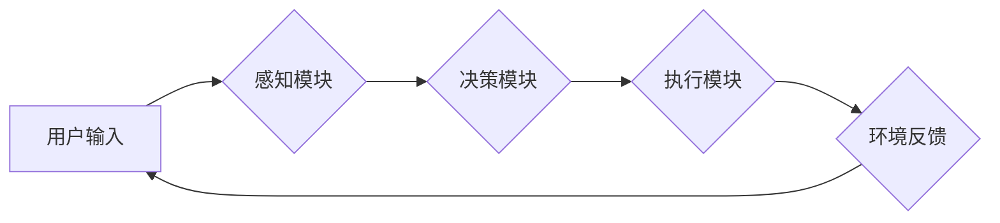

> 大模型、AI Agent、应用开发、实例创建、模型训练、模型部署、实践案例

## 1. 背景介绍

近年来，大模型技术蓬勃发展，其强大的泛化能力和应用潜力引发了广泛关注。大模型能够处理海量数据，学习复杂的模式，并生成高质量的文本、图像、代码等内容。 

AI Agent 作为大模型的应用场景之一，是指能够自主学习、决策、执行任务的智能代理。它可以理解用户需求，并根据上下文进行智能交互，从而提供更便捷、更智能的服务。

然而，对于许多开发者来说，如何将大模型应用于实际场景，构建自己的AI Agent仍然是一个挑战。本文将深入探讨大模型应用开发的流程，并通过实例创建，帮助读者理解如何构建自己的AI Agent。

## 2. 核心概念与联系

### 2.1 大模型

大模型是指参数量巨大、训练数据庞大的人工智能模型。其强大的学习能力使其能够在各种任务中表现出色，例如：

* **自然语言处理 (NLP)：** 文本生成、机器翻译、问答系统等。
* **计算机视觉 (CV)：** 图像识别、物体检测、图像生成等。
* **语音识别 (ASR)：** 语音转文本、语音合成等。

### 2.2 AI Agent

AI Agent 是一个能够感知环境、做出决策并执行行动的智能体。它通常由以下几个部分组成：

* **感知模块：** 收集环境信息，例如传感器数据、文本数据、图像数据等。
* **决策模块：** 根据感知到的信息，做出最佳的行动决策。
* **执行模块：** 执行决策，与环境进行交互。

### 2.3 大模型与AI Agent的联系

大模型可以为AI Agent提供强大的能力，例如：

* **自然语言理解：** 大模型可以理解用户的自然语言指令，并将其转换为可执行的行动。
* **知识推理：** 大模型可以根据已有的知识库，进行逻辑推理，帮助AI Agent做出更准确的决策。
* **行为规划：** 大模型可以帮助AI Agent规划执行任务的步骤，提高效率和准确性。

**Mermaid 流程图**



## 3. 核心算法原理 & 具体操作步骤

### 3.1 算法原理概述

构建AI Agent的核心算法通常是基于深度学习的强化学习算法。强化学习算法的核心思想是通过奖励机制，引导AI Agent学习最优的行为策略。

在强化学习中，AI Agent与环境进行交互，根据环境的反馈，获得奖励或惩罚。AI Agent的目标是最大化累积的奖励。

### 3.2 算法步骤详解

1. **环境建模：** 建立AI Agent与环境的交互模型，定义环境状态、动作空间和奖励函数。
2. **策略初始化：** 初始化AI Agent的行为策略，例如随机策略或贪婪策略。
3. **交互学习：** AI Agent与环境进行交互，根据策略选择动作，并根据环境反馈获得奖励。
4. **策略更新：** 使用强化学习算法，例如Q学习或深度Q网络，更新AI Agent的行为策略，使其能够获得更高的奖励。
5. **重复步骤3和4：** 持续与环境交互，更新策略，直到AI Agent达到预设的目标或性能指标。

### 3.3 算法优缺点

**优点：**

* 可以学习复杂的决策策略。
* 不需要事先定义所有规则，能够适应动态变化的环境。

**缺点：**

* 训练过程可能需要大量的时间和计算资源。
* 奖励函数的设计对算法性能至关重要。

### 3.4 算法应用领域

* **机器人控制：** 训练机器人完成复杂的任务，例如导航、抓取、组装等。
* **游戏 AI：** 构建智能游戏对手，提高游戏体验。
* **个性化推荐：** 根据用户的行为数据，推荐个性化的商品或服务。

## 4. 数学模型和公式 & 详细讲解 & 举例说明

### 4.1 数学模型构建

强化学习的数学模型通常包括以下几个关键要素：

* **状态空间 (S)：** 环境可能存在的全部状态。
* **动作空间 (A)：** AI Agent可以执行的所有动作。
* **奖励函数 (R)：** 评估AI Agent在特定状态下执行特定动作的奖励。
* **价值函数 (V)：** 评估特定状态下AI Agent的长期奖励期望。
* **策略 (π)：** 决定AI Agent在特定状态下选择动作的规则。

### 4.2 公式推导过程

**Q学习算法**

Q学习算法的目标是学习一个Q函数，Q(s, a)表示在状态s下执行动作a的期望奖励。

Q学习算法的更新规则如下：

$$Q(s, a) \leftarrow Q(s, a) + \alpha [r + \gamma \max_{a'} Q(s', a') - Q(s, a)]$$

其中：

* $\alpha$ 是学习率，控制学习速度。
* $r$ 是在状态s下执行动作a获得的奖励。
* $\gamma$ 是折扣因子，控制未来奖励的权重。
* $s'$ 是执行动作a后进入的下一个状态。
* $a'$ 是在下一个状态$s'$下选择执行的动作。

### 4.3 案例分析与讲解

假设我们有一个简单的环境，AI Agent需要学习如何玩一个简单的游戏。

* 状态空间：游戏中的棋盘状态。
* 动作空间：AI Agent可以移动到棋盘上不同的位置。
* 奖励函数：当AI Agent赢得游戏时获得最大奖励，否则获得较小的奖励。

使用Q学习算法，AI Agent可以学习到在不同棋盘状态下，选择哪个动作可以获得更高的奖励，最终学会玩这个游戏。

## 5. 项目实践：代码实例和详细解释说明

### 5.1 开发环境搭建

* Python 3.x
* TensorFlow 或 PyTorch 等深度学习框架
* OpenAI Gym 或其他强化学习环境

### 5.2 源代码详细实现

```python
import gym
import numpy as np
from tensorflow.keras.models import Sequential
from tensorflow.keras.layers import Dense

# 定义环境
env = gym.make('CartPole-v1')

# 定义神经网络模型
model = Sequential()
model.add(Dense(128, activation='relu', input_shape=(env.observation_space.shape[0],)))
model.add(Dense(64, activation='relu'))
model.add(Dense(env.action_space.n))

# 定义损失函数和优化器
model.compile(loss='mse', optimizer='adam')

# 训练模型
for episode in range(1000):
    state = env.reset()
    done = False
    total_reward = 0

    while not done:
        # 选择动作
        action = np.argmax(model.predict(state[None, :]))

        # 执行动作
        next_state, reward, done, _ = env.step(action)

        # 更新模型
        target = reward
        if not done:
            target = reward + 0.99 * np.max(model.predict(next_state[None, :]))
        model.fit(state[None, :], target, epochs=1, verbose=0)

        # 更新状态
        state = next_state

        # 更新总奖励
        total_reward += reward

    print(f'Episode {episode+1}, Total Reward: {total_reward}')

# 保存模型
model.save('cartpole_agent.h5')
```

### 5.3 代码解读与分析

* 代码首先定义了环境和神经网络模型。
* 然后，使用Q学习算法训练模型，通过与环境交互，更新模型参数。
* 训练完成后，保存模型，以便后续使用。

### 5.4 运行结果展示

训练完成后，AI Agent能够在CartPole环境中保持平衡，并获得较高的奖励。

## 6. 实际应用场景

### 6.1 智能客服

AI Agent可以作为智能客服，理解用户的自然语言问题，并提供准确的答案或解决方案。

### 6.2 个性化推荐

AI Agent可以根据用户的行为数据，推荐个性化的商品或服务，提高用户体验。

### 6.3 自动化办公

AI Agent可以自动化完成一些重复性的办公任务，例如邮件回复、日程安排等，提高工作效率。

### 6.4 未来应用展望

随着大模型技术的不断发展，AI Agent的应用场景将会更加广泛，例如：

* **医疗诊断：** AI Agent可以辅助医生进行诊断，提高诊断准确率。
* **教育辅助：** AI Agent可以为学生提供个性化的学习辅导，提高学习效率。
* **金融风险控制：** AI Agent可以帮助金融机构识别和控制风险。

## 7. 工具和资源推荐

### 7.1 学习资源推荐

* **书籍：**
    * 深度强化学习
    * 强化学习：算法、策略和应用
* **在线课程：**
    * Coursera 强化学习课程
    * Udacity 强化学习课程

### 7.2 开发工具推荐

* **TensorFlow：** 开源深度学习框架
* **PyTorch：** 开源深度学习框架
* **OpenAI Gym：** 强化学习环境

### 7.3 相关论文推荐

* Deep Reinforcement Learning with Double Q-learning
* Proximal Policy Optimization Algorithms

## 8. 总结：未来发展趋势与挑战

### 8.1 研究成果总结

近年来，大模型与AI Agent的结合取得了显著进展，在多个领域展现出巨大的应用潜力。

### 8.2 未来发展趋势

* **模型规模和能力的提升：** 大模型的规模和能力将继续提升，从而赋予AI Agent更强大的能力。
* **多模态交互：** AI Agent将能够理解和处理多种模态信息，例如文本、图像、语音等。
* **可解释性增强：** 研究者将致力于提高AI Agent的透明度和可解释性，使其决策过程更加可理解。

### 8.3 面临的挑战

* **数据获取和标注：** 训练大模型需要海量数据，而数据获取和标注成本较高。
* **计算资源需求：** 训练大模型需要大量的计算资源，这对于资源有限的机构或个人来说是一个挑战。
* **伦理和安全问题：** AI Agent的应用可能带来一些伦理和安全问题，例如偏见、隐私泄露等，需要引起重视。

### 8.4 研究展望

未来，大模型与AI Agent的结合将继续是一个重要的研究方向，需要进一步探索模型架构、算法优化、数据标注、伦理规范等方面。


## 9. 附录：常见问题与解答

**Q1：如何选择合适的强化学习算法？**

**A1：** 选择合适的强化学习算法取决于具体的应用场景和任务需求。例如，对于离散动作空间的任务，Q学习算法是一个不错的选择；对于连续动作空间的任务，深度Q网络算法更适用。

**Q2：如何解决数据标注问题？**

**A2：** 数据标注是一个重要的环节，可以考虑使用数据增强技术、迁移学习等方法来减少数据标注成本。

**Q3：如何评估AI Agent的性能？**

**A3：** 可以使用奖励函数、成功率、平均回报等指标来评估AI Agent的性能。

**Q4：如何避免AI Agent出现偏见？**

**A4：** 在训练数据中尽量避免偏见，并使用公平性评估指标来监测AI Agent的公平性。


作者：禅与计算机程序设计艺术 / Zen and the Art of Computer Programming 
<end_of_turn>