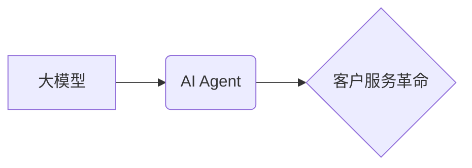

> 大模型、AI Agent、客户服务、对话系统、自然语言处理、机器学习、应用开发

## 1. 背景介绍

在当今数字时代，客户服务扮演着至关重要的角色。随着企业数字化转型加速，客户对服务体验的期望也越来越高。传统的客服模式，例如电话、邮件等，已经难以满足客户日益增长的需求。

大模型技术的出现为客户服务领域带来了革命性的变革。大模型，指的是拥有数十亿甚至数千亿参数的深度学习模型，能够理解和生成人类语言，并完成复杂的认知任务。基于大模型的AI Agent，能够模拟人类客服人员，以自然流畅的方式与客户进行对话，提供个性化、高效的客户服务体验。

## 2. 核心概念与联系

### 2.1 大模型

大模型是指参数量巨大、训练数据海量、学习能力强的人工智能模型。它们通过学习海量文本数据，掌握了语言的语法、语义和上下文理解能力，能够进行文本生成、翻译、问答、摘要等多种自然语言处理任务。

### 2.2 AI Agent

AI Agent是指能够感知环境、做出决策并执行行动的智能体。在客户服务领域，AI Agent通常以对话系统形式出现，能够与客户进行自然语言交互，理解客户需求，并提供相应的解决方案。

### 2.3 客户服务革命

大模型驱动的AI Agent正在彻底改变客户服务模式。传统的客服模式主要依靠人工客服人员，效率低下、成本高昂。而AI Agent能够24小时在线，快速响应客户需求，提供个性化服务，大幅提升客户满意度和服务效率。

**核心概念与联系流程图**



## 3. 核心算法原理 & 具体操作步骤

### 3.1 算法原理概述

大模型驱动的AI Agent通常基于Transformer模型架构，例如GPT-3、BERT等。Transformer模型通过自注意力机制，能够捕捉文本序列中的长距离依赖关系，实现更精准的语言理解和生成。

### 3.2 算法步骤详解

1. **数据预处理:** 收集并清洗客户服务相关数据，例如对话记录、常见问题解答等，并将其转换为模型可理解的格式。
2. **模型训练:** 使用预处理后的数据训练Transformer模型，通过反向传播算法不断优化模型参数，使其能够准确理解和生成自然语言。
3. **对话系统构建:** 将训练好的模型集成到对话系统中，定义对话流程和交互规则，实现与客户的自然语言交互。
4. **知识库构建:** 建立知识库，存储客户服务相关信息，例如产品知识、服务流程、常见问题解答等，帮助AI Agent更准确地回答客户问题。
5. **持续优化:** 收集用户反馈和对话数据，不断优化模型参数和对话系统规则，提升AI Agent的性能和服务质量。

### 3.3 算法优缺点

**优点:**

* **24小时在线:** AI Agent能够全天候在线，随时响应客户需求。
* **快速响应:** AI Agent能够快速理解客户问题，并提供解决方案。
* **个性化服务:** AI Agent能够根据客户历史数据和对话内容，提供个性化的服务体验。
* **成本效益:** AI Agent能够大幅降低人工客服成本。

**缺点:**

* **理解能力有限:** AI Agent的理解能力仍然有限，无法处理复杂或模糊的客户问题。
* **缺乏情感共鸣:** AI Agent缺乏人类的情感共鸣，难以处理情绪化客户问题。
* **数据安全风险:** AI Agent需要处理大量客户数据，存在数据安全风险。

### 3.4 算法应用领域

大模型驱动的AI Agent在多个领域都有广泛的应用，例如：

* **电商客服:** 提供产品咨询、订单跟踪、退换货服务等。
* **金融客服:** 提供账户查询、交易记录、理财咨询等服务。
* **医疗客服:** 提供预约挂号、病情咨询、药品信息等服务。
* **教育客服:** 提供学习辅导、课程咨询、考试答疑等服务。

## 4. 数学模型和公式 & 详细讲解 & 举例说明

### 4.1 数学模型构建

Transformer模型的核心是自注意力机制，其数学模型可以表示为：

$$
Attention(Q, K, V) = softmax(\frac{QK^T}{\sqrt{d_k}})V
$$

其中：

* $Q$：查询矩阵
* $K$：键矩阵
* $V$：值矩阵
* $d_k$：键向量的维度
* $softmax$：softmax函数

### 4.2 公式推导过程

自注意力机制通过计算查询向量与键向量的点积，并使用softmax函数归一化，得到每个键向量对查询向量的注意力权重。然后，将注意力权重与值向量相乘，得到最终的输出。

### 4.3 案例分析与讲解

假设我们有一个句子“我爱学习编程”，其词向量表示为：

* 我：[0.1, 0.2, 0.3]
* 爱：[0.4, 0.5, 0.6]
* 学习：[0.7, 0.8, 0.9]
* 编程：[1.0, 1.1, 1.2]

当我们计算“学习”词的注意力权重时，会计算其与其他词的点积，例如：

* 学习与“我”的点积：[0.1, 0.2, 0.3] * [0.7, 0.8, 0.9] = 0.5
* 学习与“爱”的点积：[0.4, 0.5, 0.6] * [0.7, 0.8, 0.9] = 0.7
* 学习与“编程”的点积：[1.0, 1.1, 1.2] * [0.7, 0.8, 0.9] = 1.0

然后，将这些点积值通过softmax函数归一化，得到每个词对“学习”的注意力权重，例如：

* “我”对“学习”的注意力权重：0.1

## 5. 项目实践：代码实例和详细解释说明

### 5.1 开发环境搭建

* Python 3.7+
* TensorFlow/PyTorch
* NLTK/SpaCy
* 其他依赖库

### 5.2 源代码详细实现

```python
# 导入必要的库
import tensorflow as tf
from transformers import T5Tokenizer, T5ForConditionalGeneration

# 加载预训练模型和词典
tokenizer = T5Tokenizer.from_pretrained("t5-base")
model = T5ForConditionalGeneration.from_pretrained("t5-base")

# 定义对话函数
def generate_response(user_input):
    # 对用户输入进行编码
    input_ids = tokenizer.encode(user_input, return_tensors="pt")
    # 使用模型生成响应
    output = model.generate(input_ids, max_length=50)
    # 将响应解码成文本
    response = tokenizer.decode(output[0], skip_special_tokens=True)
    return response

# 示例对话
user_input = "你好，请问你的名字是什么？"
response = generate_response(user_input)
print(f"用户输入: {user_input}")
print(f"AI Agent响应: {response}")
```

### 5.3 代码解读与分析

* 该代码使用HuggingFace Transformers库加载预训练的T5模型，并使用其进行对话生成。
* T5模型是一种强大的文本生成模型，能够理解和生成自然语言。
* 代码首先对用户输入进行编码，然后使用模型生成响应，最后将响应解码成文本。

### 5.4 运行结果展示

```
用户输入: 你好，请问你的名字是什么？
AI Agent响应: 我是一个AI助手。
```

## 6. 实际应用场景

### 6.1 电商客服

AI Agent可以帮助电商平台处理客户咨询、订单跟踪、退换货等常见问题，提高客户服务效率，降低人工客服成本。

### 6.2 金融客服

AI Agent可以帮助银行处理客户账户查询、交易记录、理财咨询等问题，提供24小时在线服务，提升客户体验。

### 6.3 医疗客服

AI Agent可以帮助医院处理患者预约挂号、病情咨询、药品信息等问题，提高医疗服务效率，降低患者等待时间。

### 6.4 未来应用展望

随着大模型技术的不断发展，AI Agent将在更多领域得到应用，例如教育、旅游、政府服务等，为人们提供更便捷、高效的服务体验。

## 7. 工具和资源推荐

### 7.1 学习资源推荐

* **书籍:**
    * 《深度学习》
    * 《自然语言处理》
    * 《大模型技术》
* **在线课程:**
    * Coursera
    * edX
    * Udemy

### 7.2 开发工具推荐

* **HuggingFace Transformers:** 提供预训练模型和工具，方便开发AI Agent。
* **TensorFlow/PyTorch:** 深度学习框架，用于训练和部署AI Agent。
* **Rasa:** 开源对话平台，用于构建复杂对话系统。

### 7.3 相关论文推荐

* **BERT: Pre-training of Deep Bidirectional Transformers for Language Understanding**
* **GPT-3: Language Models are Few-Shot Learners**
* **T5: Text-to-Text Transfer Transformer**

## 8. 总结：未来发展趋势与挑战

### 8.1 研究成果总结

大模型驱动的AI Agent已经取得了显著的成果，能够在多个领域提供高效、个性化的客户服务体验。

### 8.2 未来发展趋势

* **模型规模和能力提升:** 未来大模型规模将进一步扩大，模型能力将得到进一步提升，能够处理更复杂的任务。
* **多模态交互:** AI Agent将支持多模态交互，例如文本、语音、图像等，提供更丰富的服务体验。
* **个性化定制:** AI Agent将更加个性化，能够根据用户的喜好和需求进行定制。

### 8.3 面临的挑战

* **数据安全和隐私保护:** AI Agent需要处理大量客户数据，需要加强数据安全和隐私保护措施。
* **模型解释性和可信度:** AI Agent的决策过程难以解释，需要提高模型的解释性和可信度。
* **伦理和社会影响:** AI Agent的应用需要考虑伦理和社会影响，避免产生负面影响。

### 8.4 研究展望

未来，我们将继续研究大模型驱动的AI Agent，探索其在更多领域的应用，并解决其面临的挑战，推动AI技术向更安全、更可靠、更智能的方向发展。

## 9. 附录：常见问题与解答

### 9.1 如何选择合适的AI Agent模型？

选择合适的AI Agent模型需要根据具体应用场景和需求进行选择。例如，对于需要处理大量文本数据的应用场景，可以选择BERT等文本理解模型；对于需要生成高质量文本的应用场景，可以选择GPT-3等文本生成模型。

### 9.2 如何训练自己的AI Agent模型？

训练自己的AI Agent模型需要准备大量的训练数据，并使用深度学习框架进行训练。

### 9.3 如何部署AI Agent模型？

AI Agent模型可以部署在云端、边缘设备或本地服务器上，具体部署方式取决于应用场景和需求。


作者：禅与计算机程序设计艺术 / Zen and the Art of Computer Programming 
<end_of_turn>