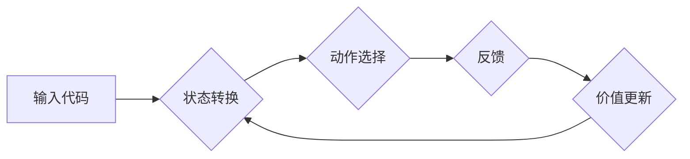

> AI、Q-learning、缺陷检测、机器学习、软件工程

## 1. 背景介绍

在当今软件开发日益快速、复杂化的时代，缺陷检测已成为软件工程中至关重要的环节。传统的缺陷检测方法主要依赖于人工审查，效率低下且容易受到主观因素的影响。随着人工智能技术的快速发展，机器学习（Machine Learning）逐渐成为缺陷检测领域的新兴技术，并取得了显著的成果。

其中，Q-learning作为一种强化学习算法，凭借其能够学习复杂环境、并通过试错不断优化策略的优势，在缺陷检测领域展现出巨大的潜力。

## 2. 核心概念与联系

**2.1 Q-learning算法原理**

Q-learning是一种基于价值函数的强化学习算法，其核心思想是通过不断地与环境交互，学习一个状态-动作价值函数Q(s,a)，该函数估计在状态s下执行动作a所能获得的长期回报。

**2.2 缺陷检测与Q-learning的联系**

在缺陷检测领域，我们可以将软件代码视为环境，缺陷视为状态，检测策略视为动作。Q-learning算法可以学习一个状态-动作价值函数，该函数估计在特定代码状态下执行特定检测策略所能获得的缺陷检测准确率。

**2.3  流程图**



**2.4  核心概念总结**

* **状态(State):** 软件代码的特定片段或特征。
* **动作(Action):** 检测策略，例如使用特定规则或算法进行检测。
* **奖励(Reward):** 检测结果，例如正确检测到缺陷或未检测到缺陷。
* **价值函数(Value Function):** 估计在特定状态下执行特定动作所能获得的长期回报。

## 3. 核心算法原理 & 具体操作步骤

### 3.1  算法原理概述

Q-learning算法的核心思想是通过迭代更新状态-动作价值函数Q(s,a)，使得该函数能够反映出在每个状态下执行每个动作所能获得的长期回报。

算法的更新规则如下：

$$Q(s,a) = Q(s,a) + \alpha [r + \gamma \max_{a'} Q(s',a') - Q(s,a)]$$

其中：

* $Q(s,a)$: 状态s下执行动作a的价值函数。
* $\alpha$: 学习率，控制学习速度。
* $r$: 当前状态下获得的奖励。
* $\gamma$: 折扣因子，控制未来回报的权重。
* $s'$: 执行动作a后进入的下一个状态。
* $a'$: 在下一个状态s'下执行的动作。

### 3.2  算法步骤详解

1. 初始化状态-动作价值函数Q(s,a)，将其设置为一个小的常数。
2. 从初始状态开始，随机选择一个动作执行。
3. 根据执行的动作，进入下一个状态并获得奖励。
4. 更新状态-动作价值函数Q(s,a)根据公式进行更新。
5. 重复步骤2-4，直到算法收敛。

### 3.3  算法优缺点

**优点:**

* 能够学习复杂环境下的策略。
* 不需要事先知道环境模型。
* 可以处理离散和连续状态。

**缺点:**

* 训练时间较长。
* 需要大量的训练数据。
* 容易陷入局部最优解。

### 3.4  算法应用领域

Q-learning算法在许多领域都有应用，例如：

* 机器人控制
* 游戏人工智能
* 医疗诊断
* 缺陷检测

## 4. 数学模型和公式 & 详细讲解 & 举例说明

### 4.1  数学模型构建

在缺陷检测领域，我们可以构建一个状态-动作-奖励的数学模型来描述缺陷检测过程。

* **状态(s):** 软件代码的特定片段或特征，例如代码行数、代码复杂度、代码注释等。
* **动作(a):** 检测策略，例如使用特定规则或算法进行检测。
* **奖励(r):** 检测结果，例如正确检测到缺陷或未检测到缺陷。

### 4.2  公式推导过程

Q-learning算法的核心是更新状态-动作价值函数Q(s,a)。

$$Q(s,a) = Q(s,a) + \alpha [r + \gamma \max_{a'} Q(s',a') - Q(s,a)]$$

其中：

* $Q(s,a)$: 状态s下执行动作a的价值函数。
* $\alpha$: 学习率，控制学习速度。
* $r$: 当前状态下获得的奖励。
* $\gamma$: 折扣因子，控制未来回报的权重。
* $s'$: 执行动作a后进入的下一个状态。
* $a'$: 在下一个状态s'下执行的动作。

### 4.3  案例分析与讲解

假设我们有一个软件代码片段，其状态特征包括代码行数和代码复杂度。我们使用Q-learning算法学习一个检测策略，该策略可以根据代码状态特征判断是否存在缺陷。

在训练过程中，我们随机选择一些代码片段进行检测，并根据检测结果获得奖励。例如，如果检测到缺陷，则奖励为正值；否则，奖励为负值。

通过不断地训练和更新状态-动作价值函数，Q-learning算法最终能够学习出一个能够有效检测缺陷的策略。

## 5. 项目实践：代码实例和详细解释说明

### 5.1  开发环境搭建

* Python 3.x
* TensorFlow 或 PyTorch
* 其他必要的库，例如 NumPy、Pandas 等

### 5.2  源代码详细实现

```python
import numpy as np
from tensorflow.keras.models import Sequential
from tensorflow.keras.layers import Dense

# 定义Q-learning算法
class QLearningAgent:
    def __init__(self, state_size, action_size, learning_rate=0.1, discount_factor=0.9):
        self.state_size = state_size
        self.action_size = action_size
        self.learning_rate = learning_rate
        self.discount_factor = discount_factor
        self.q_table = np.zeros((state_size, action_size))

    def choose_action(self, state):
        # 使用epsilon-greedy策略选择动作
        if np.random.uniform() < 0.1:
            return np.random.randint(self.action_size)
        else:
            return np.argmax(self.q_table[state])

    def update_q_table(self, state, action, reward, next_state):
        # 更新Q-table
        self.q_table[state, action] = self.q_table[state, action] + self.learning_rate * (
            reward + self.discount_factor * np.max(self.q_table[next_state]) - self.q_table[state, action]
        )

# ... 其他代码实现 ...
```

### 5.3  代码解读与分析

* **QLearningAgent类:** 定义了Q-learning算法的实现。
* **choose_action方法:** 使用epsilon-greedy策略选择动作。
* **update_q_table方法:** 更新Q-table。

### 5.4  运行结果展示

* 通过训练和测试，可以评估Q-learning算法在缺陷检测方面的性能。
* 可以使用准确率、召回率、F1-score等指标来衡量算法的性能。

## 6. 实际应用场景

### 6.1  代码审查自动化

Q-learning可以用于自动化代码审查，识别潜在的缺陷和代码质量问题。

### 6.2  缺陷预测

Q-learning可以学习代码的历史缺陷数据，预测未来代码中可能出现的缺陷。

### 6.3  测试用例生成

Q-learning可以用于生成测试用例，提高软件测试的覆盖率和效率。

### 6.4  未来应用展望

* **更精准的缺陷检测:** 通过结合其他机器学习算法和深度学习模型，提高缺陷检测的准确率和效率。
* **个性化缺陷检测:** 根据不同的软件项目和开发团队的特点，定制个性化的缺陷检测策略。
* **缺陷预防:** 通过分析代码缺陷的成因，提出改进建议，预防缺陷的发生。

## 7. 工具和资源推荐

### 7.1  学习资源推荐

* **书籍:**
    * Reinforcement Learning: An Introduction by Richard S. Sutton and Andrew G. Barto
    * Deep Reinforcement Learning Hands-On by Maxim Lapan
* **在线课程:**
    * Coursera: Reinforcement Learning Specialization
    * Udacity: Deep Reinforcement Learning Nanodegree

### 7.2  开发工具推荐

* **TensorFlow:** 开源深度学习框架
* **PyTorch:** 开源深度学习框架
* **OpenAI Gym:** 强化学习环境库

### 7.3  相关论文推荐

* **Deep Q-Network (DQN):** Mnih et al., 2015
* **Double DQN:** Hasselt et al., 2015
* **Prioritized Experience Replay:** Schaul et al., 2015

## 8. 总结：未来发展趋势与挑战

### 8.1  研究成果总结

Q-learning算法在缺陷检测领域取得了显著的成果，能够有效地识别潜在的缺陷和代码质量问题。

### 8.2  未来发展趋势

* **更精准的缺陷检测:** 通过结合其他机器学习算法和深度学习模型，提高缺陷检测的准确率和效率。
* **个性化缺陷检测:** 根据不同的软件项目和开发团队的特点，定制个性化的缺陷检测策略。
* **缺陷预防:** 通过分析代码缺陷的成因，提出改进建议，预防缺陷的发生。

### 8.3  面临的挑战

* **数据获取和标注:** 缺陷检测需要大量的缺陷标注数据，获取和标注这些数据成本较高。
* **算法复杂度:** Q-learning算法的训练过程比较复杂，需要大量的计算资源。
* **解释性:** Q-learning算法的决策过程比较难以解释，难以理解算法是如何做出决策的。

### 8.4  研究展望

未来，我们将继续研究Q-learning算法在缺陷检测领域的应用，探索更精准、更个性化、更有效的缺陷检测方法。

## 9. 附录：常见问题与解答

* **Q: Q-learning算法的学习率如何设置？**
* **A:** 学习率控制着学习速度，过大容易导致震荡，过小容易导致学习缓慢。一般建议从0.1开始，根据实际情况进行调整。
* **Q: Q-learning算法的折扣因子如何设置？**
* **A:** 折扣因子控制着未来回报的权重，一般设置为0.9或0.99。
* **Q: Q-learning算法如何处理连续状态？**

* **A:** 可以使用函数逼近方法，例如神经网络，将连续状态映射到离散状态。


作者：禅与计算机程序设计艺术 / Zen and the Art of Computer Programming 
<end_of_turn>