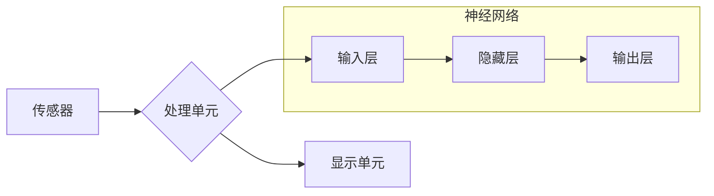

> 增强现实(AR)、神经网络、深度学习、计算机视觉、映射、物体识别、场景理解

## 1. 背景介绍

增强现实(AR)技术正在迅速发展，它将虚拟信息叠加到现实世界中，为用户提供一种全新的交互体验。AR的应用场景广泛，涵盖游戏、教育、医疗、零售等领域。而神经网络作为机器学习领域的核心技术，在AR应用中发挥着越来越重要的作用。

传统的AR系统主要依赖于规则-基于的算法，例如特征匹配和模板匹配，这些算法在识别简单场景和物体时效果较好，但对于复杂场景和物体识别能力有限。随着深度学习技术的快速发展，基于神经网络的AR系统逐渐成为研究热点。

神经网络能够学习复杂的特征表示，并对图像进行更精准的理解，这使得它们在AR应用中具有巨大的潜力。例如，神经网络可以用于物体识别、场景理解、人脸识别、手势识别等任务，从而为用户提供更智能、更自然的AR体验。

## 2. 核心概念与联系

**2.1 增强现实(AR)**

增强现实(AR)是一种交互式技术，它将虚拟信息叠加到现实世界中，为用户提供一种增强现实体验。AR系统通常由以下几个关键组件组成：

* **传感器:** 用于获取现实世界的信息，例如摄像头、麦克风、陀螺仪等。
* **处理单元:** 用于处理传感器获取的信息，并生成虚拟信息。
* **显示单元:** 用于将虚拟信息叠加到现实世界中，例如手机屏幕、AR眼镜等。

**2.2 神经网络**

神经网络是一种模仿人脑神经网络结构的算法模型。它由多个层组成，每一层包含多个神经元。神经元之间通过连接进行信息传递，每个连接都有一个权重。通过训练，神经网络可以学习到这些权重，从而实现对数据的学习和预测。

**2.3 映射关系**

在AR应用中，神经网络可以用于建立现实世界和虚拟世界之间的映射关系。例如，神经网络可以学习到物体在现实世界中的外观特征，并将其映射到虚拟世界中的虚拟物体。

**2.4 架构图**



## 3. 核心算法原理 & 具体操作步骤

### 3.1 算法原理概述

在AR应用中，神经网络可以用于多种任务，例如物体识别、场景理解、人脸识别等。这些任务的核心都是建立现实世界和虚拟世界之间的映射关系。

例如，在物体识别任务中，神经网络可以学习到物体在现实世界中的外观特征，并将其映射到虚拟世界中的物体类别。

### 3.2 算法步骤详解

1. **数据收集和预处理:** 收集大量包含物体图像和标签的数据，并对数据进行预处理，例如图像裁剪、尺寸调整、数据增强等。
2. **模型构建:** 选择合适的深度学习模型，例如卷积神经网络(CNN)，并根据任务需求进行调整。
3. **模型训练:** 使用训练数据训练模型，通过反向传播算法更新模型参数，使模型能够准确识别物体。
4. **模型评估:** 使用测试数据评估模型的性能，例如准确率、召回率、F1-score等。
5. **模型部署:** 将训练好的模型部署到AR系统中，用于实时识别物体。

### 3.3 算法优缺点

**优点:**

* 能够学习复杂的特征表示，识别精度高。
* 能够处理大规模数据，适应复杂场景。
* 能够进行端到端的训练，简化开发流程。

**缺点:**

* 训练数据量大，需要大量计算资源。
* 模型复杂度高，推理速度较慢。
* 对数据质量要求高，容易受到噪声影响。

### 3.4 算法应用领域

* **物体识别:** 在AR游戏中，识别现实世界中的物体，并将其映射到虚拟物体。
* **场景理解:** 理解现实世界中的场景结构，为AR应用提供上下文信息。
* **人脸识别:** 在AR社交应用中，识别用户的身份，并将其映射到虚拟角色。
* **手势识别:** 通过识别用户的手势，控制AR应用中的虚拟物体。

## 4. 数学模型和公式 & 详细讲解 & 举例说明

### 4.1 数学模型构建

在AR应用中，神经网络通常采用卷积神经网络(CNN)作为模型架构。CNN模型由多个卷积层、池化层和全连接层组成。

**卷积层:** 用于提取图像特征，通过卷积核对图像进行滑动计算，生成特征图。

**池化层:** 用于降低特征图的维度，并提高模型的鲁棒性。

**全连接层:** 用于将特征图映射到输出类别。

### 4.2 公式推导过程

**卷积操作:**

$$
y_{i,j} = \sum_{m=0}^{M-1} \sum_{n=0}^{N-1} x_{i+m,j+n} * w_{m,n} + b
$$

其中:

* $y_{i,j}$ 是卷积核输出的特征图元素。
* $x_{i+m,j+n}$ 是输入图像的元素。
* $w_{m,n}$ 是卷积核的权重。
* $b$ 是偏置项。

**池化操作:**

$$
y_{i,j} = \max(x_{i,j}, x_{i+1,j}, x_{i,j+1}, x_{i+1,j+1})
$$

其中:

* $y_{i,j}$ 是池化后的特征图元素。
* $x_{i,j}$ 是输入特征图的元素。

### 4.3 案例分析与讲解

例如，在物体识别任务中，我们可以使用CNN模型识别图像中的猫。

1. 将图像输入到CNN模型中。
2. CNN模型的卷积层提取图像的特征，例如边缘、纹理等。
3. 池化层降低特征图的维度，提高模型的鲁棒性。
4. 全连接层将特征图映射到输出类别，例如“猫”，“狗”，“鸟”等。
5. 模型输出概率分布，例如“猫”的概率为0.9，则模型预测图像中包含一只猫。

## 5. 项目实践：代码实例和详细解释说明

### 5.1 开发环境搭建

* 操作系统: Ubuntu 20.04
* Python 版本: 3.8
* 深度学习框架: TensorFlow 2.0

### 5.2 源代码详细实现

```python
import tensorflow as tf

# 定义模型架构
model = tf.keras.models.Sequential([
    tf.keras.layers.Conv2D(32, (3, 3), activation='relu', input_shape=(224, 224, 3)),
    tf.keras.layers.MaxPooling2D((2, 2)),
    tf.keras.layers.Conv2D(64, (3, 3), activation='relu'),
    tf.keras.layers.MaxPooling2D((2, 2)),
    tf.keras.layers.Flatten(),
    tf.keras.layers.Dense(10, activation='softmax')
])

# 编译模型
model.compile(optimizer='adam',
              loss='sparse_categorical_crossentropy',
              metrics=['accuracy'])

# 训练模型
model.fit(x_train, y_train, epochs=10)

# 评估模型
loss, accuracy = model.evaluate(x_test, y_test)
print('Test loss:', loss)
print('Test accuracy:', accuracy)
```

### 5.3 代码解读与分析

* **模型架构:** 该模型采用经典的CNN架构，包含卷积层、池化层和全连接层。
* **卷积层:** 用于提取图像特征，例如边缘、纹理等。
* **池化层:** 用于降低特征图的维度，并提高模型的鲁棒性。
* **全连接层:** 用于将特征图映射到输出类别。
* **编译模型:** 使用Adam优化器、交叉熵损失函数和准确率作为评估指标。
* **训练模型:** 使用训练数据训练模型，训练10个epoch。
* **评估模型:** 使用测试数据评估模型的性能。

### 5.4 运行结果展示

训练完成后，模型可以用于识别图像中的物体。例如，将一张猫的图像输入到模型中，模型会输出“猫”的概率。

## 6. 实际应用场景

### 6.1 AR游戏

AR游戏可以将虚拟物体叠加到现实世界中，为玩家提供更沉浸式的游戏体验。例如，Pokemon Go就是一款利用AR技术的热门游戏。

### 6.2 AR教育

AR教育可以将虚拟模型叠加到现实世界中，帮助学生更好地理解抽象概念。例如，学生可以使用AR应用程序学习人体解剖结构。

### 6.3 AR医疗

AR医疗可以帮助医生进行手术指导、诊断疾病和培训医护人员。例如，医生可以使用AR应用程序在手术过程中查看患者的内部器官结构。

### 6.4 未来应用展望

随着神经网络技术的不断发展，AR应用将更加智能、更加广泛。例如，未来AR系统将能够更准确地理解场景、更自然地与用户交互，并为用户提供更加个性化的体验。

## 7. 工具和资源推荐

### 7.1 学习资源推荐

* **书籍:**
    * 深度学习
    * 计算机视觉
* **在线课程:**
    * Coursera: 深度学习
    * Udacity: 计算机视觉
* **博客:**
    * TensorFlow Blog
    * PyTorch Blog

### 7.2 开发工具推荐

* **深度学习框架:** TensorFlow, PyTorch
* **AR开发平台:** ARKit, ARCore
* **图像处理库:** OpenCV

### 7.3 相关论文推荐

* **Object Detection with Deep Learning**
* **ImageNet Classification with Deep Convolutional Neural Networks**
* **Deep Learning for Computer Vision**

## 8. 总结：未来发展趋势与挑战

### 8.1 研究成果总结

神经网络在AR应用中取得了显著的成果，例如物体识别、场景理解、人脸识别等任务的性能得到了大幅提升。

### 8.2 未来发展趋势

* **更强大的神经网络模型:** 研究更强大的神经网络模型，例如Transformer、BERT等，以提高AR应用的性能。
* **更有效的训练方法:** 研究更有效的训练方法，例如迁移学习、联邦学习等，以降低训练成本和数据需求。
* **更丰富的交互方式:** 研究更丰富的交互方式，例如语音交互、手势交互等，以提高AR应用的用户体验。

### 8.3 面临的挑战

* **数据获取和标注:** AR应用需要大量高质量的数据进行训练，数据获取和标注成本较高。
* **模型推理速度:** 现有的神经网络模型推理速度较慢，难以满足实时AR应用的需求。
* **隐私和安全:** AR应用涉及到用户的隐私和安全问题，需要采取相应的措施进行保护。

### 8.4 研究展望

未来，神经网络在AR应用领域将继续发挥重要作用，推动AR技术的发展和应用。

## 9. 附录：常见问题与解答

**Q1: 如何选择合适的深度学习模型？**

**A1:** 选择合适的深度学习模型需要根据具体的应用场景和数据特点进行选择。例如，对于物体识别任务，可以使用CNN模型；对于自然语言处理任务，可以使用Transformer模型。

**Q2: 如何解决数据获取和标注问题？**

**A2:** 可以利用公开数据集、数据增强技术和自动化标注工具来解决数据获取和标注问题。

**Q3: 如何提高模型推理速度？**

**A3:** 可以使用模型压缩、量化和并行计算等技术来提高模型推理速度。


作者：禅与计算机程序设计艺术 / Zen