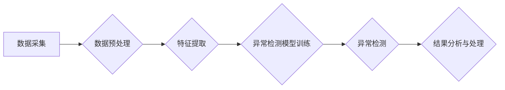

> 异常检测，机器学习，数据挖掘，模式识别，人工智能，数据分析，预测建模

## 1. 背景介绍

在数据爆炸的时代，海量数据蕴藏着丰富的价值，但同时也隐藏着潜在的风险。异常检测作为一种重要的数据挖掘技术，旨在识别数据集中与众不同的数据点，即异常值或异常事件。这些异常值可能代表着系统故障、欺诈行为、网络攻击等，对其及时发现和处理至关重要。

传统异常检测方法通常依赖于预先定义的规则或阈值，但随着数据复杂性和多样性的增加，这些方法显得越来越难以适应。而机器学习算法凭借其强大的学习能力和模式识别能力，为异常检测提供了新的思路和方法。

## 2. 核心概念与联系

异常检测的核心概念是识别数据集中与众不同的数据点。这些数据点可能在某些方面与其他数据点显著不同，例如：

* **数值异常:** 数据点的值远高于或远低于其他数据点的范围。
* **模式异常:** 数据点不符合预期的模式或规则。
* **上下文异常:** 数据点在特定时间或环境下显得异常。

异常检测与其他数据挖掘技术，如聚类分析、分类算法等，密切相关。例如，聚类分析可以将数据点分组，而异常检测可以识别出与其他分组相分离的数据点。

**Mermaid 流程图**



## 3. 核心算法原理 & 具体操作步骤

### 3.1  算法原理概述

常见的异常检测算法包括：

* **基于统计的算法:** 这些算法基于数据分布的统计特征，例如均值、标准差、方差等，将数据点离群程度进行量化，识别出异常值。
* **基于机器学习的算法:** 这些算法利用机器学习模型学习数据中的模式，将正常数据点和异常数据点区分开来。常见的机器学习算法包括：
    * **k-近邻算法:** 
    * **支持向量机算法:** 
    * **决策树算法:** 
    * **随机森林算法:** 
    * **深度学习算法:** 

### 3.2  算法步骤详解

以k-近邻算法为例，其步骤如下：

1. **数据预处理:** 对数据进行清洗、转换、归一化等处理，使其适合算法训练。
2. **特征提取:** 从原始数据中提取特征，例如数值特征、文本特征、图像特征等。
3. **模型训练:** 利用训练数据训练k-近邻模型，学习数据中的模式。
4. **异常检测:** 将新数据点输入模型，计算其与其他数据点的距离，如果距离超过预设阈值，则判定为异常值。

### 3.3  算法优缺点

**k-近邻算法**

* **优点:** 算法简单易懂，易于实现，无需假设数据分布。
* **缺点:** 
    * 对于高维数据，计算距离复杂度较高。
    * 
    * 

### 3.4  算法应用领域

异常检测算法广泛应用于各个领域，例如：

* **金融领域:** 识别欺诈交易、信用风险评估。
* **网络安全领域:** 检测网络攻击、入侵行为。
* **医疗领域:** 识别异常医疗数据、疾病诊断。
* **工业领域:** 预测设备故障、监控生产过程。

## 4. 数学模型和公式 & 详细讲解 & 举例说明

### 4.1  数学模型构建

k-近邻算法的数学模型可以描述为：

$$
d(x, y) = \sqrt{\sum_{i=1}^{n}(x_i - y_i)^2}
$$

其中：

* $x$ 和 $y$ 是两个数据点。
* $n$ 是数据点的维度。
* $x_i$ 和 $y_i$ 是数据点 $x$ 和 $y$ 的第 $i$ 个特征值。

### 4.2  公式推导过程

k-近邻算法的核心思想是将新数据点与其他数据点进行距离计算，如果新数据点与最近的 $k$ 个数据点的距离都比较大，则判定为异常值。

### 4.3  案例分析与讲解

假设我们有一组数据点，其中包含一些异常值。我们可以使用k-近邻算法来识别这些异常值。

**数据示例:**

```
数据点1: (1, 2)
数据点2: (2, 3)
数据点3: (3, 4)
数据点4: (10, 12)
数据点5: (11, 13)
```

如果我们选择 $k = 3$，则对于数据点 (10, 12)，其最近的三个数据点是 (1, 2), (2, 3), (3, 4)。这些数据点的距离都比较远，因此我们可以判定数据点 (10, 12) 为异常值。

## 5. 项目实践：代码实例和详细解释说明

### 5.1  开发环境搭建

* Python 3.x
* scikit-learn 库

### 5.2  源代码详细实现

```python
from sklearn.neighbors import KNeighborsClassifier
from sklearn.model_selection import train_test_split
from sklearn.metrics import classification_report

# 数据加载
# ...

# 数据预处理
# ...

# 特征提取
# ...

# 数据分割
X_train, X_test, y_train, y_test = train_test_split(X, y, test_size=0.2, random_state=42)

# 模型训练
knn = KNeighborsClassifier(n_neighbors=3)
knn.fit(X_train, y_train)

# 异常检测
y_pred = knn.predict(X_test)

# 评估模型性能
print(classification_report(y_test, y_pred))
```

### 5.3  代码解读与分析

* **数据加载:** 加载原始数据，例如从CSV文件读取数据。
* **数据预处理:** 对数据进行清洗、转换、归一化等处理，使其适合算法训练。
* **特征提取:** 从原始数据中提取特征，例如数值特征、文本特征、图像特征等。
* **数据分割:** 将数据分为训练集和测试集，用于模型训练和评估。
* **模型训练:** 使用KNeighborsClassifier类训练k-近邻模型，指定k值。
* **异常检测:** 将新数据点输入模型，预测其类别，如果预测类别为异常值，则判定为异常点。
* **评估模型性能:** 使用分类报告评估模型的性能，例如准确率、召回率、F1-score等。

### 5.4  运行结果展示

运行代码后，会输出模型的性能评估结果，例如分类报告。

## 6. 实际应用场景

### 6.1  金融领域

* **欺诈检测:** 识别信用卡欺诈交易、网络银行欺诈行为。
* **信用风险评估:** 评估客户的信用风险，判断其是否值得贷款。
* **反洗钱:** 检测可疑的资金流向，识别洗钱行为。

### 6.2  网络安全领域

* **入侵检测:** 检测网络攻击、恶意软件入侵。
* **DDoS攻击防御:** 识别和防御分布式拒绝服务攻击。
* **用户行为分析:** 分析用户的网络行为，识别异常行为，例如账号被盗用。

### 6.3  医疗领域

* **疾病诊断:** 识别疾病的异常症状，辅助医生诊断。
* **医疗影像分析:** 检测医疗影像中的异常区域，例如肿瘤、骨折等。
* **药物不良反应监测:** 识别药物不良反应的异常信号，及时采取措施。

### 6.4  未来应用展望

随着人工智能技术的不断发展，异常检测技术将应用于更多领域，例如：

* **智能制造:** 预测设备故障、监控生产过程。
* **智慧城市:** 检测交通拥堵、识别犯罪行为。
* **个性化推荐:** 识别用户的异常行为，提供更精准的推荐。

## 7. 工具和资源推荐

### 7.1  学习资源推荐

* **书籍:**
    * "异常检测" by  
    * "机器学习实战" by  
* **在线课程:**
    * Coursera: "Machine Learning" by Andrew Ng
    * edX: "Introduction to Artificial Intelligence" by Columbia University

### 7.2  开发工具推荐

* **Python:** 
* **scikit-learn:** 
* **TensorFlow:** 
* **PyTorch:** 

### 7.3  相关论文推荐

* "Anomaly Detection: A Survey" by  
* "One-Class SVM for Anomaly Detection" by  

## 8. 总结：未来发展趋势与挑战

### 8.1  研究成果总结

异常检测技术在过去几十年取得了显著进展，从传统的统计方法到现在的机器学习算法，不断提升了异常检测的准确性和效率。

### 8.2  未来发展趋势

* **深度学习:** 深度学习算法在异常检测领域展现出巨大的潜力，能够学习更复杂的模式，提高异常检测的准确率。
* **迁移学习:** 迁移学习可以利用已训练好的模型，在新的数据上进行异常检测，降低模型训练成本。
* **联邦学习:** 联邦学习可以保护数据隐私，在分布式环境下进行异常检测。

### 8.3  面临的挑战

* **数据质量:** 异常检测算法对数据质量要求较高，数据噪声、缺失值等问题会影响模型性能。
* **异常类型多样性:** 现实世界中的异常类型多样，难以用单一的算法进行检测。
* **解释性:** 一些机器学习算法的决策过程难以解释，这使得异常检测结果难以被信任。

### 8.4  研究展望

未来研究方向包括：

* 开发更鲁棒、更有效的异常检测算法。
* 研究异常检测在不同领域的应用。
* 提高异常检测算法的解释性。


## 9. 附录：常见问题与解答

* **Q1: 什么是异常值？**
* **A1:** 异常值是指与其他数据点显著不同的数据点，可能代表着系统故障、欺诈行为、网络攻击等。

* **Q2: 常见的异常检测算法有哪些？**
* **A2:** 常见的异常检测算法包括基于统计的算法和基于机器学习的算法，例如k-近邻算法、支持向量机算法、决策树算法等。

* **Q3: 如何选择合适的异常检测算法？**
* **A3:** 选择合适的异常检测算法需要考虑数据的类型、异常类型的特点、模型的复杂度等因素。

* **Q4: 如何评估异常检测模型的性能？**
* **A4:** 可以使用分类报告、ROC曲线等指标来评估异常检测模型的性能。

* **Q5: 异常检测技术有哪些应用场景？**
* **A5:** 异常检测技术广泛应用于金融、网络安全、医疗、工业等各个领域。


作者：禅与计算机程序设计艺术 / Zen and the Art of Computer Programming 
<end_of_turn>