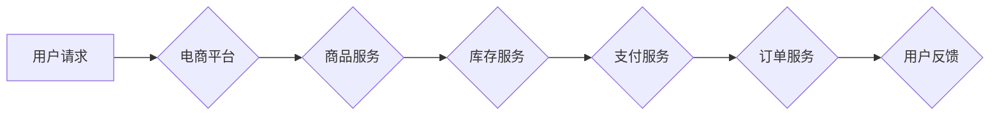

>  电商平台、O2O模式、支付系统、微服务架构、分布式系统、高可用性、数据处理、云计算

## 1. 背景介绍

随着互联网技术的快速发展和移动互联网的普及，电商、O2O、支付等泛交易领域蓬勃发展，用户对交易体验、安全性和效率的要求越来越高。中大型的交易平台需要处理海量用户数据、订单信息和支付请求，对系统架构和技术能力提出了更高的要求。

传统的单体架构难以满足这些需求，微服务架构逐渐成为中大型交易平台的最佳选择。微服务架构将系统分解为多个独立的服务，每个服务负责特定的业务功能，通过轻量级的通信协议进行交互。这种架构模式具有高可扩展性、高可用性和高弹性，能够更好地应对交易平台的快速增长和突发流量。

## 2. 核心概念与联系

### 2.1  电商平台

电商平台是指提供商品信息、交易平台和支付服务的在线商业平台。它连接了商家和消费者，为用户提供便捷的购物体验。

### 2.2  O2O模式

O2O模式是指线上线下相结合的商业模式。它利用线上平台吸引用户，引导用户到线下门店消费。

### 2.3  支付系统

支付系统是指处理用户支付交易的系统。它负责验证用户身份、处理资金转账和保障交易安全。

### 2.4  微服务架构

微服务架构是一种将大型应用程序分解为多个小型、独立的服务的架构模式。每个服务专注于特定的业务功能，并通过轻量级的通信协议进行交互。

**Mermaid 流程图**



## 3. 核心算法原理 & 具体操作步骤

### 3.1  算法原理概述

在电商、O2O、支付等泛交易领域，许多核心算法用于处理用户数据、订单信息和支付请求。例如：

* **推荐算法:** 根据用户的历史行为和偏好，推荐相关的商品或服务。
* **搜索算法:** 根据用户的搜索关键词，快速检索相关商品或服务。
* **排序算法:** 根据商品的销量、价格、评价等因素，对商品进行排序。
* **支付安全算法:** 用于验证用户身份、加密支付信息和防止欺诈行为。

### 3.2  算法步骤详解

以推荐算法为例，其基本步骤如下：

1. **数据收集:** 收集用户的历史购买记录、浏览记录、评价记录等数据。
2. **数据预处理:** 对收集到的数据进行清洗、转换和特征提取。
3. **模型训练:** 使用机器学习算法，训练推荐模型。
4. **模型评估:** 使用测试数据评估模型的性能。
5. **模型部署:** 将训练好的模型部署到线上环境，为用户提供个性化推荐。

### 3.3  算法优缺点

不同的算法具有不同的优缺点，需要根据实际应用场景选择合适的算法。例如：

* **协同过滤算法:** 优点是能够发现隐含的关联关系，缺点是数据稀疏性问题。
* **内容过滤算法:** 优点是能够根据商品的属性进行推荐，缺点是容易陷入局部最优。
* **基于知识的推荐算法:** 优点是能够利用商品的知识图谱进行推荐，缺点是需要构建复杂的知识图谱。

### 3.4  算法应用领域

推荐算法广泛应用于电商平台、视频网站、音乐平台等领域，帮助用户发现感兴趣的内容和商品。

## 4. 数学模型和公式 & 详细讲解 & 举例说明

### 4.1  数学模型构建

在推荐算法中，可以使用协同过滤算法构建数学模型。协同过滤算法基于用户的行为相似性进行推荐。

假设用户集合为U，商品集合为I，用户对商品的评分矩阵为R。

### 4.2  公式推导过程

协同过滤算法的目标是预测用户对商品的评分。可以使用以下公式进行预测：

$$
\hat{r}_{u,i} = \bar{r}_u + \frac{\sum_{v \in N(u)} (r_{v,i} - \bar{r}_v) * sim(u,v)}{\sum_{v \in N(u)} sim(u,v)}
$$

其中：

* $\hat{r}_{u,i}$: 用户u对商品i的预测评分
* $\bar{r}_u$: 用户u的平均评分
* $r_{v,i}$: 用户v对商品i的评分
* $N(u)$: 用户u的邻居用户集合
* $sim(u,v)$: 用户u和用户v之间的相似度

### 4.3  案例分析与讲解

假设用户A和用户B都对商品1和商品2进行了评分，用户A对商品1的评分为5，对商品2的评分为4，用户B对商品1的评分为4，对商品2的评分为5。

如果我们使用协同过滤算法进行预测，可以计算出用户A对商品3的预测评分。

## 5. 项目实践：代码实例和详细解释说明

### 5.1  开发环境搭建

* 操作系统：Linux
* 编程语言：Python
* 框架：Flask
* 数据库：MySQL

### 5.2  源代码详细实现

```python
from flask import Flask, request, jsonify

app = Flask(__name__)

# 模拟用户评分数据
ratings = {
    'user1': {'item1': 5, 'item2': 4},
    'user2': {'item1': 4, 'item2': 5},
}

@app.route('/predict', methods=['POST'])
def predict():
    data = request.get_json()
    user_id = data['user_id']
    item_id = data['item_id']

    # 计算预测评分
    predicted_rating = calculate_predicted_rating(user_id, item_id)

    return jsonify({'predicted_rating': predicted_rating})

def calculate_predicted_rating(user_id, item_id):
    # ... 协同过滤算法实现 ...

if __name__ == '__main__':
    app.run(debug=True)
```

### 5.3  代码解读与分析

* 代码使用Flask框架构建了一个简单的API接口。
* `/predict`接口接收用户ID和商品ID作为参数，返回预测评分。
* `calculate_predicted_rating`函数实现协同过滤算法，计算预测评分。

### 5.4  运行结果展示

当用户向API接口发送请求时，服务器会根据协同过滤算法计算出用户对商品的预测评分，并返回给用户。

## 6. 实际应用场景

### 6.1  电商平台推荐

电商平台可以使用推荐算法推荐商品给用户，提高用户购物体验和转化率。

### 6.2  O2O模式营销

O2O模式可以使用推荐算法推荐附近的商家和优惠活动，引导用户到线下门店消费。

### 6.3  支付安全保障

支付系统可以使用支付安全算法验证用户身份、加密支付信息和防止欺诈行为，保障用户资金安全。

### 6.4  未来应用展望

随着人工智能技术的不断发展，泛交易领域将更加智能化和个性化。

## 7. 工具和资源推荐

### 7.1  学习资源推荐

* **书籍:**
    * 《推荐系统实践》
    * 《机器学习》
* **在线课程:**
    * Coursera: Machine Learning
    * edX: Artificial Intelligence

### 7.2  开发工具推荐

* **编程语言:** Python
* **框架:** Flask, Django
* **数据库:** MySQL, MongoDB

### 7.3  相关论文推荐

* **协同过滤算法:**
    * "Collaborative Filtering: A User-Based Approach"
    * "Memory-Based Collaborative Filtering"
* **推荐算法:**
    * "A Survey on Recommender Systems"
    * "Top-N Recommendation Algorithms: A Survey"

## 8. 总结：未来发展趋势与挑战

### 8.1  研究成果总结

中大型交易平台的架构和技术能力不断提升，微服务架构、分布式系统、高可用性等技术已经成为主流。

### 8.2  未来发展趋势

* **人工智能:** 人工智能技术将更加广泛地应用于泛交易领域，例如个性化推荐、智能客服、欺诈检测等。
* **云计算:** 云计算将成为中大型交易平台的标准部署方式，提供弹性、可扩展和成本效益高的服务。
* **区块链:** 区块链技术将为交易平台提供更加安全、透明和可信赖的交易环境。

### 8.3  面临的挑战

* **数据安全:** 交易平台处理大量用户数据，数据安全和隐私保护面临严峻挑战。
* **系统稳定性:** 交易平台需要保证高可用性和稳定性，应对突发流量和故障。
* **技术迭代:** 互联网技术发展迅速，交易平台需要不断迭代和升级技术架构，才能保持竞争力。

### 8.4  研究展望

未来，研究人员将继续探索新的技术和架构，为中大型交易平台提供更加安全、高效和智能的解决方案。

## 9. 附录：常见问题与解答

### 9.1  常见问题

* **微服务架构的优点是什么？**
* **如何实现高可用性？**
* **如何保障数据安全？**

### 9.2  解答

* **微服务架构的优点:** 高可扩展性、高可用性、高弹性、独立部署、技术栈自由选择。
* **高可用性实现:** 冗余部署、负载均衡、故障转移、健康检查。
* **数据安全保障:** 数据加密、访问控制、安全审计、数据备份和恢复。


作者：禅与计算机程序设计艺术 / Zen and the Art of Computer Programming 
<end_of_turn>