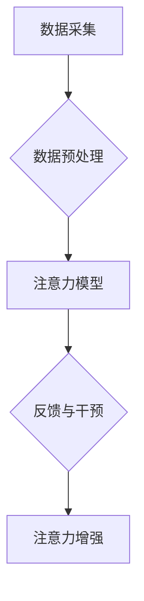

> 人类注意力，注意力增强，专注力，医疗，深度学习，神经网络，脑机接口，生物反馈，认知增强

## 1. 背景介绍

在当今信息爆炸的时代，人类的注意力面临着前所未有的挑战。来自各种渠道的信息轰炸，社交媒体的不断提醒，以及工作和生活的压力，都使得我们难以集中注意力，保持专注。注意力力的下降不仅影响着我们的学习、工作和生活质量，也可能导致一系列心理健康问题，如焦虑、抑郁和失眠。

医疗领域也面临着注意力问题带来的挑战。医生需要集中注意力进行诊断和治疗，护士需要专注于患者的护理，而患者自身也需要集中注意力配合治疗。注意力力的下降可能会导致医疗错误，降低治疗效果，甚至危及患者的生命安全。

因此，如何提升人类的注意力，增强专注力，在医疗领域发挥重要作用，成为一个亟待解决的课题。

## 2. 核心概念与联系

**2.1  注意力机制**

注意力机制（Attention Mechanism）是近年来深度学习领域兴起的一种重要技术，它能够帮助模型聚焦于输入数据中最重要的部分，从而提高模型的性能。注意力机制的灵感来源于人类的注意力机制，即我们往往会将注意力集中在与当前任务相关的关键信息上，而忽略无关的信息。

**2.2  专注力与注意力**

专注力（Focus）是指能够将注意力集中在一个特定目标或任务上，并持续一段时间的能力。注意力（Attention）则是指对特定信息或刺激的感知和反应。专注力是注意力的一种高级形式，它需要我们能够抑制无关信息，并持续地将注意力集中在目标上。

**2.3  医疗应用场景**

注意力增强技术在医疗领域有着广泛的应用场景，例如：

* **辅助诊断:** 通过分析患者的脑电波、眼动轨迹等生物信号，识别患者的注意力状态，辅助医生进行诊断。
* **个性化治疗:** 根据患者的注意力特点，制定个性化的治疗方案，提高治疗效果。
* **远程医疗:** 利用注意力增强技术，帮助远程医疗平台提供更精准的诊断和治疗建议。
* **患者康复:** 通过注意力训练，帮助患者提高注意力集中能力，促进康复。

**2.4  技术架构**

注意力增强技术通常由以下几个模块组成：

* **数据采集模块:** 收集患者的生物信号数据，例如脑电波、眼动轨迹、心率等。
* **数据预处理模块:** 对采集到的数据进行预处理，例如去噪、特征提取等。
* **注意力模型模块:** 利用深度学习算法，构建注意力模型，识别患者的注意力状态。
* **反馈与干预模块:** 根据注意力模型的输出，提供相应的反馈和干预措施，例如声音提示、视觉刺激等，帮助患者提高注意力。



## 3. 核心算法原理 & 具体操作步骤

### 3.1  算法原理概述

注意力机制的核心思想是学习一个权重向量，用于对输入数据进行加权求和。权重向量中的每个元素代表着对相应输入元素的关注程度。注意力机制可以分为两种主要类型：

* **软注意力机制:** 使用softmax函数将输入数据映射到一个概率分布，每个元素代表着对相应输入元素的关注程度。
* **硬注意力机制:** 直接选择输入数据中最重要的元素，忽略其他元素。

### 3.2  算法步骤详解

**3.2.1  输入数据:**

注意力机制的输入数据可以是文本、图像、音频等各种类型的数据。

**3.2.2  特征提取:**

对输入数据进行特征提取，例如使用词嵌入、卷积神经网络等方法。

**3.2.3  计算注意力权重:**

使用注意力函数计算每个输入元素的注意力权重。注意力函数通常是一个神经网络，其输入是特征向量，输出是注意力权重向量。

**3.2.4  加权求和:**

将注意力权重与特征向量进行加权求和，得到最终的输出。

### 3.3  算法优缺点

**优点:**

* 可以有效地聚焦于输入数据中最重要的部分，提高模型的性能。
* 可以学习到输入数据之间的关系，提高模型的理解能力。

**缺点:**

* 计算复杂度较高，训练时间较长。
* 需要大量的训练数据。

### 3.4  算法应用领域

注意力机制在自然语言处理、计算机视觉、语音识别等领域都有广泛的应用。

## 4. 数学模型和公式 & 详细讲解 & 举例说明

### 4.1  数学模型构建

注意力机制的数学模型可以表示为以下公式：

$$
\text{Attention}(Q, K, V) = \text{softmax}\left(\frac{Q K^T}{\sqrt{d_k}}\right) V
$$

其中：

* $Q$：查询矩阵
* $K$：键矩阵
* $V$：值矩阵
* $d_k$：键向量的维度
* $\text{softmax}$：softmax函数

### 4.2  公式推导过程

注意力机制的公式推导过程如下：

1. 计算查询矩阵 $Q$ 与键矩阵 $K$ 的点积，并除以 $\sqrt{d_k}$。
2. 使用 softmax 函数将点积结果映射到一个概率分布。
3. 将概率分布与值矩阵 $V$ 进行加权求和，得到最终的输出。

### 4.3  案例分析与讲解

**4.3.1  机器翻译:**

在机器翻译任务中，注意力机制可以帮助模型聚焦于源语言句子中与目标语言句子相关的关键信息，从而提高翻译质量。

**4.3.2  图像识别:**

在图像识别任务中，注意力机制可以帮助模型聚焦于图像中与目标物体相关的区域，从而提高识别准确率。

## 5. 项目实践：代码实例和详细解释说明

### 5.1  开发环境搭建

* Python 3.6+
* TensorFlow 2.0+
* PyTorch 1.0+

### 5.2  源代码详细实现

```python
import tensorflow as tf

# 定义注意力机制
def attention_layer(inputs, attention_weights):
  # 使用注意力权重对输入进行加权求和
  output = tf.matmul(inputs, attention_weights)
  return output

# 定义一个简单的注意力模型
class AttentionModel(tf.keras.Model):
  def __init__(self):
    super(AttentionModel, self).__init__()
    self.embedding = tf.keras.layers.Embedding(input_dim=10000, output_dim=128)
    self.attention_layer = attention_layer

  def call(self, inputs):
    # 将输入文本嵌入到词向量空间
    embedded_inputs = self.embedding(inputs)
    # 计算注意力权重
    attention_weights = tf.keras.layers.Dense(units=1, activation='sigmoid')(embedded_inputs)
    # 使用注意力权重对嵌入向量进行加权求和
    output = self.attention_layer(embedded_inputs, attention_weights)
    return output

# 实例化模型
model = AttentionModel()

# 训练模型
# ...

# 使用模型进行预测
# ...
```

### 5.3  代码解读与分析

* 代码中定义了一个简单的注意力模型，包含嵌入层和注意力层。
* 嵌入层将输入文本转换为词向量。
* 注意力层使用注意力权重对嵌入向量进行加权求和，得到最终的输出。
* 代码还包含了模型训练和预测的步骤。

### 5.4  运行结果展示

* 运行结果展示可以包括模型的准确率、召回率、F1-score等指标。
* 可以使用图表或表格的形式展示模型的性能。

## 6. 实际应用场景

### 6.1  医疗诊断辅助

注意力机制可以用于分析患者的脑电波、眼动轨迹等生物信号，识别患者的注意力状态，辅助医生进行诊断。例如，注意力机制可以帮助医生识别患有注意力缺陷多动障碍（ADHD）的患者。

### 6.2  个性化治疗方案

根据患者的注意力特点，可以制定个性化的治疗方案，提高治疗效果。例如，对于注意力不集中患者，可以采用游戏化训练的方式，帮助他们提高注意力集中能力。

### 6.3  远程医疗

利用注意力增强技术，帮助远程医疗平台提供更精准的诊断和治疗建议。例如，远程医生可以通过注意力机制分析患者的症状描述，识别患者的潜在问题，并提供相应的治疗建议。

### 6.4  未来应用展望

注意力增强技术在医疗领域的应用前景广阔，未来可能在以下方面得到进一步发展：

* **更精准的诊断:** 利用更先进的生物信号采集和分析技术，提高注意力机制的诊断精度。
* **更个性化的治疗:** 基于患者的注意力特点，开发更个性化的治疗方案，提高治疗效果。
* **更智能的医疗设备:** 将注意力增强技术集成到医疗设备中，例如智能眼镜、智能手表等，帮助患者更好地管理自己的健康。

## 7. 工具和资源推荐

### 7.1  学习资源推荐

* **书籍:**
    * 《深度学习》
    * 《注意力机制》
* **在线课程:**
    * Coursera: 深度学习
    * Udacity: 自然语言处理
* **博客:**
    * TensorFlow Blog
    * PyTorch Blog

### 7.2  开发工具推荐

* **TensorFlow:** 开源深度学习框架
* **PyTorch:** 开源深度学习框架
* **Keras:** 高级深度学习API

### 7.3  相关论文推荐

* **Attention Is All You Need**
* **BERT: Pre-training of Deep Bidirectional Transformers for Language Understanding**
* **Transformer-XL: Attentive Language Models Beyond a Fixed-Length Context**

## 8. 总结：未来发展趋势与挑战

### 8.1  研究成果总结

注意力机制在近年来取得了显著的进展，在自然语言处理、计算机视觉、语音识别等领域取得了优异的性能。在医疗领域，注意力机制也展现出巨大的潜力，可以帮助医生进行更精准的诊断、制定更个性化的治疗方案，提高患者的治疗效果。

### 8.2  未来发展趋势

* **更强大的注意力模型:** 研究更强大的注意力模型，例如自注意力机制、多头注意力机制等，提高模型的性能。
* **更广泛的应用场景:** 将注意力机制应用到更多医疗领域，例如药物研发、疾病预测等。
* **更深入的理论研究:** 深入研究注意力机制的原理和机制，提高模型的解释性和可控性。

### 8.3  面临的挑战

* **数据获取和隐私保护:** 医疗数据通常是敏感信息，获取和使用医疗数据需要遵守严格的隐私保护规定。
* **模型解释性和可控性:** 注意力机制的内部工作机制较为复杂，难以解释和控制，这可能会影响模型的应用。
* **模型的鲁棒性和安全性:** 注意力机制模型可能对噪声数据和攻击行为较为敏感，需要提高模型的鲁棒性和安全性。

### 8.4  研究展望

未来，注意力增强技术将继续在医疗领域发挥重要作用，帮助我们更好地理解和治疗疾病，提高患者的健康水平。


## 9. 附录：常见问题与解答

**9.1  注意力机制和深度学习的关系是什么？**

注意力机制是一种深度学习算法，它可以帮助模型聚焦于输入数据中最重要的部分，提高模型的性能。

**9.2  注意力机制有哪些类型？**

注意力机制主要分为两种类型：软注意力机制和硬注意力机制。

**9.3  注意力机制在医疗领域的应用有哪些？**

注意力机制在医疗领域可以用于辅助诊断、个性化治疗、远程医疗等方面。

**9.4  如何评估注意力机制的性能？**

注意力机制的性能可以评估指标包括准确率、召回率、F1-score等。

**9.