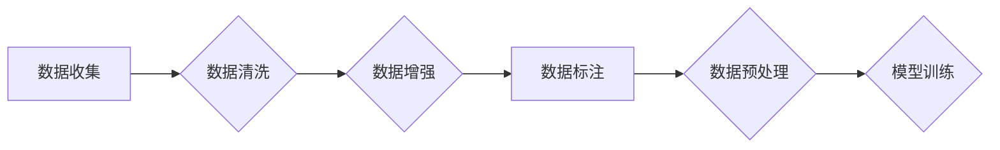

> 大模型、数据准备、数据清洗、数据增强、数据标注、微调、预训练模型

## 1. 背景介绍

近年来，深度学习在各个领域取得了突破性的进展，其中大模型的出现更是推动了人工智能的发展。大模型是指参数量庞大的深度学习模型，通常拥有数十亿甚至数千亿个参数。这些模型通过海量数据的预训练，能够学习到丰富的语言表示和知识，并应用于各种下游任务，例如自然语言处理、计算机视觉、语音识别等。

然而，大模型的开发和应用并非易事。其中，数据准备阶段至关重要。高质量的数据是训练大模型的关键要素，它直接影响模型的性能和泛化能力。

## 2. 核心概念与联系

大模型的训练和微调依赖于海量高质量的数据。数据准备流程通常包括以下几个步骤：

* **数据收集:** 从各种来源收集相关数据，例如文本、图像、音频等。
* **数据清洗:** 去除数据中的噪声、错误和重复信息，确保数据质量。
* **数据增强:** 通过对数据进行一定的变换，例如文本的 synonym replacement、图像的旋转和缩放等，增加数据的多样性，提高模型的鲁棒性。
* **数据标注:** 为特定任务标注数据，例如文本分类、情感分析、图像识别等，为模型提供训练所需的标签信息。

**数据准备流程图:**



## 3. 核心算法原理 & 具体操作步骤

### 3.1  算法原理概述

数据准备阶段涉及多种算法和技术，例如文本处理、图像处理、数据挖掘等。这些算法和技术旨在有效地处理和转换原始数据，使其能够被模型理解和利用。

### 3.2  算法步骤详解

* **文本处理:** 
    * **分词:** 将文本分割成单词或词语。
    * **词干提取:** 将词语还原到其基本形式。
    * **词向量化:** 将词语映射到向量空间，捕捉词语之间的语义关系。
* **图像处理:**
    * **图像预处理:** 对图像进行尺寸调整、色彩校正、噪声去除等操作。
    * **特征提取:** 使用卷积神经网络等算法提取图像的特征。
* **数据挖掘:**
    * **聚类:** 将数据点根据相似性进行分组。
    * **关联规则挖掘:** 发现数据中存在的关联关系。

### 3.3  算法优缺点

不同的算法和技术各有优缺点，需要根据具体任务和数据特点进行选择。例如，对于文本数据，词向量化技术能够有效地捕捉词语之间的语义关系，但计算量较大。

### 3.4  算法应用领域

数据准备算法广泛应用于各个领域，例如：

* **自然语言处理:** 文本分类、情感分析、机器翻译等。
* **计算机视觉:** 图像识别、目标检测、图像分割等。
* **语音识别:** 语音转文本、语音合成等。

## 4. 数学模型和公式 & 详细讲解 & 举例说明

### 4.1  数学模型构建

数据准备阶段涉及多种数学模型，例如：

* **词向量模型:** Word2Vec、GloVe等模型将词语映射到向量空间，捕捉词语之间的语义关系。
* **图像特征提取模型:** CNN等模型能够提取图像的特征，用于图像识别、目标检测等任务。

### 4.2  公式推导过程

例如，Word2Vec模型使用负采样技术来训练词向量。负采样目标函数如下：

$$
J(\theta) = -\frac{1}{T} \sum_{t=1}^{T} \sum_{i=1}^{N} \log \sigma(w_i^T h_t)
$$

其中：

* $\theta$ 是模型参数。
* $T$ 是训练样本数量。
* $N$ 是负采样数量。
* $w_i$ 是词向量。
* $h_t$ 是上下文向量。
* $\sigma$ 是 sigmoid 函数。

### 4.3  案例分析与讲解

例如，使用 Word2Vec 模型训练词向量，可以发现“国王”和“皇后”之间的语义关系，因为它们在向量空间中距离较近。

## 5. 项目实践：代码实例和详细解释说明

### 5.1  开发环境搭建

使用 Python 语言和相关的库，例如 TensorFlow、PyTorch、NLTK 等，搭建开发环境。

### 5.2  源代码详细实现

```python
# 使用 Word2Vec 模型训练词向量
from gensim.models import Word2Vec

# 准备训练数据
sentences = [['这', '是', '一个', '句子'], ['这是一个', '另一个', '句子']]

# 训练 Word2Vec 模型
model = Word2Vec(sentences, vector_size=100, window=5, min_count=5)

# 保存模型
model.save('word2vec_model.bin')
```

### 5.3  代码解读与分析

* `Word2Vec` 类用于训练 Word2Vec 模型。
* `vector_size` 参数指定词向量的维度。
* `window` 参数指定上下文窗口大小。
* `min_count` 参数指定词频阈值。

### 5.4  运行结果展示

训练完成后，可以使用模型获取词向量的表示，并进行语义相似度计算。

## 6. 实际应用场景

数据准备技术广泛应用于各种实际场景，例如：

* **搜索引擎:** 使用文本处理技术对用户查询进行分析，并返回相关结果。
* **电商平台:** 使用图像处理技术识别商品图像，并进行分类和推荐。
* **医疗诊断:** 使用数据挖掘技术分析患者数据，辅助医生进行诊断。

### 6.4  未来应用展望

随着人工智能技术的不断发展，数据准备技术将更加智能化和自动化。例如，使用机器学习算法自动完成数据清洗、数据增强和数据标注等任务。

## 7. 工具和资源推荐

### 7.1  学习资源推荐

* **书籍:**
    * 《自然语言处理》
    * 《深度学习》
* **在线课程:**
    * Coursera: 自然语言处理
    * edX: 深度学习

### 7.2  开发工具推荐

* **Python:** 
* **TensorFlow:** 深度学习框架
* **PyTorch:** 深度学习框架
* **NLTK:** 自然语言处理库

### 7.3  相关论文推荐

* **Word2Vec: A Simple and Efficient Model for Learning Word Representations**
* **GloVe: Global Vectors for Word Representation**

## 8. 总结：未来发展趋势与挑战

### 8.1  研究成果总结

数据准备技术在人工智能领域取得了显著进展，例如：

* **自动数据标注:** 使用机器学习算法自动完成数据标注任务。
* **数据增强:** 使用生成对抗网络等技术生成新的数据样本。
* **数据联邦学习:** 在不共享原始数据的情况下，进行模型训练和微调。

### 8.2  未来发展趋势

未来数据准备技术将更加智能化、自动化和隐私保护。例如：

* **基于知识图谱的数据准备:** 利用知识图谱进行数据清洗、数据增强和数据标注。
* **联邦学习下的数据准备:** 在不共享原始数据的情况下，进行数据准备和模型训练。
* **可解释性数据准备:** 提高数据准备过程的可解释性，帮助用户理解数据准备过程中的决策。

### 8.3  面临的挑战

数据准备技术也面临一些挑战，例如：

* **数据质量问题:** 现实世界的数据往往存在噪声、错误和不完整等问题。
* **数据标注成本高:** 数据标注是一个耗时和费力的任务。
* **数据隐私问题:** 如何保护用户数据隐私是数据准备技术面临的重要挑战。

### 8.4  研究展望

未来研究方向包括：

* **开发更智能、更自动的数据准备算法。**
* **降低数据标注成本，提高数据标注效率。**
* **研究数据隐私保护技术，保障用户数据安全。**

## 9. 附录：常见问题与解答

* **Q: 如何处理文本中的停用词？**
* **A:** 可以使用 NLTK 库中的停用词列表进行过滤。
* **Q: 如何进行图像数据增强？**
* **A:** 可以使用 OpenCV 库进行图像旋转、缩放、裁剪等操作。
* **Q: 如何评估数据准备效果？**
* **A:** 可以使用模型性能指标，例如准确率、召回率等，评估数据准备效果。


作者：禅与计算机程序设计艺术 / Zen and the Art of Computer Programming 
<end_of_turn>