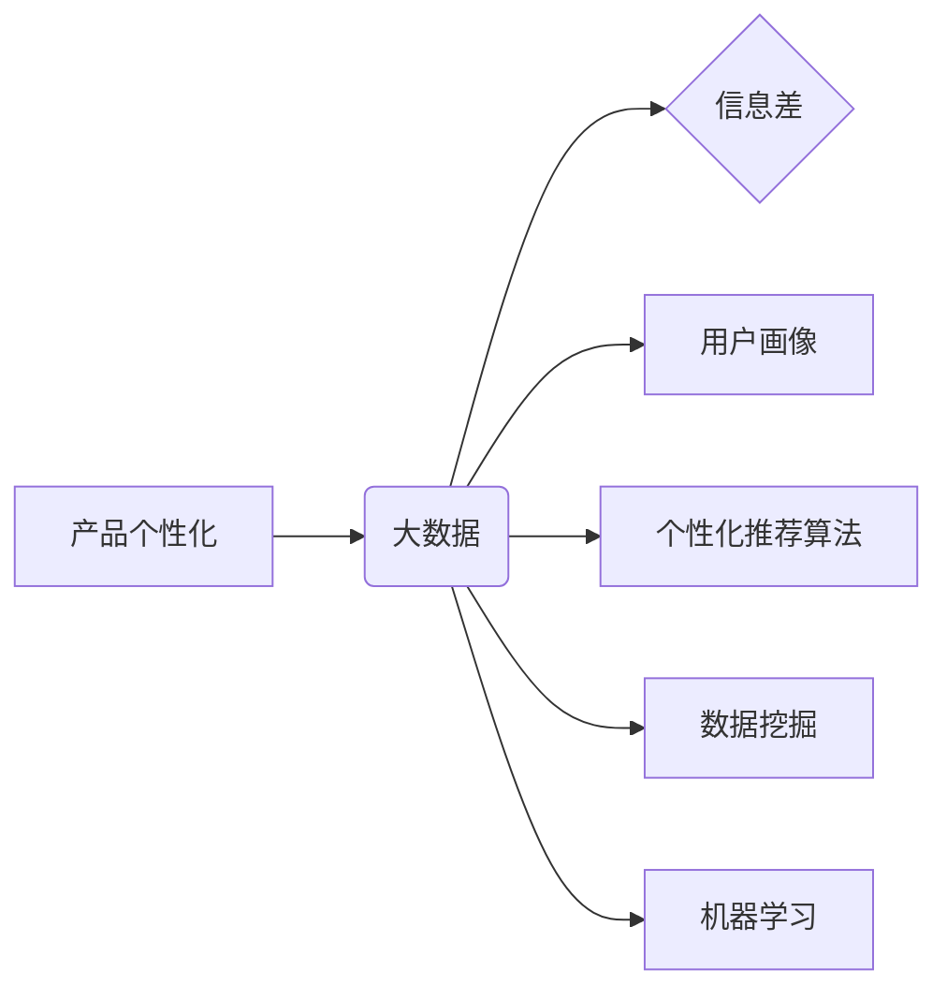

> 产品个性化, 大数据, 信息差, 用户画像, 推荐算法, 个性化推荐, 算法模型, 数据挖掘, 机器学习

## 1. 背景介绍

在当今数据爆炸的时代，用户对产品个性化的需求日益增长。传统的产品设计模式往往采用“一刀切”的策略，无法满足用户多样化的需求。而大数据技术的出现为产品个性化提供了强大的支撑。通过对海量用户数据的分析和挖掘，我们可以构建精准的用户画像，并利用个性化推荐算法，为每个用户提供定制化的产品体验。

信息差是推动产品个性化的关键驱动力。用户在面对海量信息时，往往难以找到自己真正需要的产品或服务。而通过大数据分析，我们可以识别用户的需求和偏好，并精准地将相关产品推荐给用户，从而缩小信息差，提升用户体验。

## 2. 核心概念与联系

**2.1 产品个性化**

产品个性化是指根据用户的需求和偏好，定制化产品功能、内容、体验等，以满足用户的个性化需求。

**2.2 大数据**

大数据是指海量、高速度、高多样性的数据。大数据分析是指通过对大数据的挖掘和分析，发现隐藏的规律和价值。

**2.3 信息差**

信息差是指用户获取信息的能力和需求之间的差距。

**2.4 用户画像**

用户画像是指对用户的行为、兴趣、偏好等进行分析和总结，形成的用户描述模型。

**2.5 个性化推荐算法**

个性化推荐算法是指根据用户的历史行为、兴趣偏好等信息，预测用户可能感兴趣的产品或服务，并进行推荐的算法。

**2.6 数据挖掘**

数据挖掘是指从海量数据中发现隐藏的模式、规律和知识。

**2.7 机器学习**

机器学习是指通过算法训练，使计算机能够从数据中学习，并进行预测或决策。

**2.8  核心概念关系图**



## 3. 核心算法原理 & 具体操作步骤

### 3.1  算法原理概述

个性化推荐算法的核心是根据用户的历史行为、兴趣偏好等信息，预测用户可能感兴趣的产品或服务。常用的个性化推荐算法包括：

* **基于内容的推荐算法:** 根据产品的特征和用户的兴趣偏好进行匹配。
* **基于协同过滤的推荐算法:** 根据用户的历史行为和与用户相似用户的行为进行推荐。
* **基于深度学习的推荐算法:** 利用深度学习模型，从用户的行为数据中学习用户兴趣和偏好，进行推荐。

### 3.2  算法步骤详解

以基于协同过滤的推荐算法为例，其具体操作步骤如下：

1. **数据收集:** 收集用户的历史行为数据，例如用户购买记录、浏览记录、评分记录等。
2. **用户相似度计算:** 计算用户之间的相似度，可以使用余弦相似度、皮尔逊相关系数等方法。
3. **推荐生成:** 根据用户与其他用户的相似度，推荐用户可能感兴趣的产品或服务。

### 3.3  算法优缺点

**优点:**

* 可以推荐用户可能感兴趣但从未接触过的产品或服务。
* 可以根据用户的兴趣偏好进行个性化推荐。

**缺点:**

* 需要大量的用户行为数据才能训练出准确的推荐模型。
* 当用户数量较少或用户行为数据稀疏时，算法效果可能较差。

### 3.4  算法应用领域

个性化推荐算法广泛应用于电商、视频网站、音乐平台、社交媒体等领域，例如：

* **电商平台:** 推荐用户可能感兴趣的商品。
* **视频网站:** 推荐用户可能喜欢的视频。
* **音乐平台:** 推荐用户可能喜欢的音乐。
* **社交媒体:** 推荐用户可能感兴趣的朋友或话题。

## 4. 数学模型和公式 & 详细讲解 & 举例说明

### 4.1  数学模型构建

基于协同过滤的推荐算法可以构建如下数学模型：

* **用户-物品评分矩阵:** 用矩阵 $R$ 表示用户-物品评分矩阵，其中 $R_{ui}$ 表示用户 $u$ 对物品 $i$ 的评分。

* **用户相似度矩阵:** 用矩阵 $S$ 表示用户相似度矩阵，其中 $S_{uv}$ 表示用户 $u$ 与用户 $v$ 的相似度。

### 4.2  公式推导过程

推荐算法的核心是预测用户 $u$ 对物品 $i$ 的评分 $R_{ui}$。可以使用以下公式进行预测：

$$R_{ui} = \sum_{v \in N(u)} S_{uv} \cdot R_{vi}$$

其中，$N(u)$ 表示与用户 $u$ 相似的用户集合。

### 4.3  案例分析与讲解

假设有三个用户 $u_1$, $u_2$, $u_3$ 和三个物品 $i_1$, $i_2$, $i_3$，用户-物品评分矩阵 $R$ 和用户相似度矩阵 $S$ 分别如下：

$$R = \begin{bmatrix}
5 & 3 & 4 \\
4 & 5 & 2 \\
3 & 2 & 5
\end{bmatrix}$$

$$S = \begin{bmatrix}
1 & 0.8 & 0.6 \\
0.8 & 1 & 0.7 \\
0.6 & 0.7 & 1
\end{bmatrix}$$

假设用户 $u_1$ 想要预测对物品 $i_3$ 的评分，可以根据公式进行计算：

$$R_{u_1i_3} = S_{u_1u_2} \cdot R_{u_2i_3} + S_{u_1u_3} \cdot R_{u_3i_3}$$

$$R_{u_1i_3} = 0.8 \cdot 2 + 0.6 \cdot 5 = 1.6 + 3 = 4.6$$

因此，预测用户 $u_1$ 对物品 $i_3$ 的评分为 4.6。

## 5. 项目实践：代码实例和详细解释说明

### 5.1  开发环境搭建

* 操作系统: Ubuntu 20.04
* Python 版本: 3.8
* 必要的库: pandas, numpy, scikit-learn

### 5.2  源代码详细实现

```python
import pandas as pd
from sklearn.metrics.pairwise import cosine_similarity

# 加载用户-物品评分数据
ratings_data = pd.read_csv('ratings.csv')

# 计算用户相似度矩阵
user_similarity = cosine_similarity(ratings_data)

# 预测用户对物品的评分
def predict_rating(user_id, item_id):
    # 获取用户相似用户
    similar_users = user_similarity[user_id].argsort()[:-10:-1]
    # 计算预测评分
    predicted_rating = 0
    for user in similar_users:
        if ratings_data.loc[user, item_id] is not None:
            predicted_rating += user_similarity[user_id][user] * ratings_data.loc[user, item_id]
    return predicted_rating

# 示例
user_id = 0
item_id = 2
predicted_rating = predict_rating(user_id, item_id)
print(f'用户 {user_id} 对物品 {item_id} 的预测评分为: {predicted_rating}')
```

### 5.3  代码解读与分析

* 代码首先加载用户-物品评分数据，并使用 cosine_similarity 函数计算用户相似度矩阵。
* predict_rating 函数用于预测用户对物品的评分。
* 函数首先获取用户相似用户，然后根据用户相似度和相似用户的评分计算预测评分。

### 5.4  运行结果展示

运行代码后，会输出用户对特定物品的预测评分。

## 6. 实际应用场景

### 6.1  电商平台

电商平台可以利用个性化推荐算法，推荐用户可能感兴趣的商品，提高用户购买率。例如，淘宝、京东等电商平台都使用个性化推荐算法，为用户推荐个性化的商品。

### 6.2  视频网站

视频网站可以利用个性化推荐算法，推荐用户可能喜欢的视频，提高用户观看时长和用户粘性。例如，YouTube、Bilibili等视频网站都使用个性化推荐算法，为用户推荐个性化的视频。

### 6.3  音乐平台

音乐平台可以利用个性化推荐算法，推荐用户可能喜欢的音乐，提高用户听歌时长和用户活跃度。例如，Spotify、网易云音乐等音乐平台都使用个性化推荐算法，为用户推荐个性化的音乐。

### 6.4  未来应用展望

随着大数据技术的不断发展，个性化推荐算法将应用于更多领域，例如：

* **教育:** 为学生推荐个性化的学习资源。
* **医疗:** 为患者推荐个性化的医疗方案。
* **金融:** 为用户推荐个性化的金融产品。

## 7. 工具和资源推荐

### 7.1  学习资源推荐

* **书籍:**
    * 《推荐系统实践》
    * 《机器学习》
* **在线课程:**
    * Coursera: Recommender Systems
    * edX: Machine Learning

### 7.2  开发工具推荐

* **Python:** 
    * pandas
    * numpy
    * scikit-learn
* **Spark:** 
    * Apache Spark

### 7.3  相关论文推荐

* **Collaborative Filtering for Implicit Feedback Datasets**
* **Matrix Factorization Techniques for Recommender Systems**

## 8. 总结：未来发展趋势与挑战

### 8.1  研究成果总结

大数据技术和个性化推荐算法的结合，为产品个性化提供了强大的支撑。通过对海量用户数据的分析和挖掘，我们可以构建精准的用户画像，并利用个性化推荐算法，为每个用户提供定制化的产品体验。

### 8.2  未来发展趋势

未来，个性化推荐算法将朝着以下方向发展：

* **更精准的推荐:** 利用更先进的机器学习算法，提高推荐的精准度。
* **更个性化的体验:** 结合用户的情感、行为、环境等多方面因素，提供更个性化的产品体验。
* **更智能的交互:** 利用自然语言处理、语音识别等技术，实现更智能的个性化推荐交互。

### 8.3  面临的挑战

个性化推荐算法也面临一些挑战：

* **数据隐私:** 如何保护用户数据隐私，是个性化推荐算法面临的重要挑战。
* **算法公平性:** 如何避免算法产生偏见，确保推荐结果公平公正，也是一个需要解决的问题。
* **算法可解释性:** 如何提高算法的可解释性，让用户理解推荐结果背后的逻辑，也是一个重要的研究方向。

### 8.4  研究展望

未来，个性化推荐算法的研究将更加注重数据隐私保护、算法公平性、算法可解释性等方面，以更好地服务于用户，推动产品个性化发展。

## 9. 附录：常见问题与解答

**1. 什么是协同过滤？**

协同过滤是一种推荐算法，它基于用户的历史行为数据，预测用户可能感兴趣的物品。

**2. 协同过滤算法有哪些类型？**

协同过滤算法主要分为基于用户的协同过滤和基于物品的协同过滤两种类型。

**3. 如何评估个性化推荐算法的性能？**

常用的评估指标包括准确率、召回率、F1-score等。

**4. 如何解决数据稀疏性问题？**

数据稀疏性是协同过滤算法面临的一个常见问题，可以通过以下方法解决：

* 使用矩阵分解技术。
* 利用其他数据源，例如用户画像、物品特征等。
* 使用混合推荐算法，结合协同过滤算法和其他推荐算法。


作者：禅与计算机程序设计艺术 / Zen and the Art of