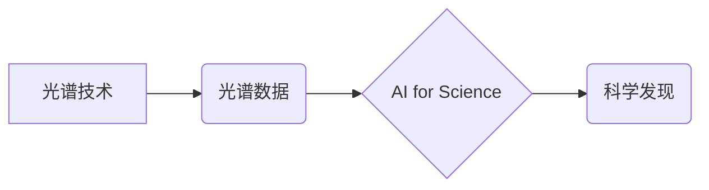

> 光谱技术，AI for Science，机器学习，深度学习，数据分析，科学发现

## 1. 背景介绍

科学研究的本质是探索未知，揭示自然规律。传统科学研究往往依赖于人类经验和直觉，耗时费力，效率低下。近年来，人工智能（AI）技术蓬勃发展，为科学研究带来了革命性的变革。AI for Science，即人工智能助力科学研究，利用人工智能技术加速科学发现，已经成为一个重要的研究方向。

光谱技术作为一种重要的分析手段，在化学、物理、生物等领域有着广泛的应用。它通过分析物质的吸收、发射或散射光谱，可以揭示物质的结构、组成、性质等信息。然而，光谱数据的分析通常需要复杂的数学模型和大量的专业知识，这对于非专业人员来说是一个很大的挑战。

## 2. 核心概念与联系

**2.1 光谱技术概述**

光谱技术是指利用物质与光相互作用的现象，通过分析物质对不同波长的光的吸收、发射或散射特性，来研究物质的结构、组成、性质等信息。光谱技术可以分为吸收光谱、发射光谱、散射光谱等多种类型。

**2.2 AI for Science概述**

AI for Science是指利用人工智能技术，例如机器学习、深度学习等，来加速科学发现的过程。AI for Science可以应用于各个科学领域，例如药物研发、材料科学、天文学等。

**2.3 光谱技术与AI for Science的结合**

将光谱技术与AI for Science结合起来，可以有效地解决光谱数据分析的难题。AI算法可以自动学习光谱数据的特征，并建立模型来预测物质的性质，从而提高分析效率和准确性。

**2.4 核心概念关系图**



## 3. 核心算法原理 & 具体操作步骤

**3.1 算法原理概述**

在光谱数据分析中，常用的AI算法包括：

* **机器学习算法:** 
    * **支持向量机 (SVM):** 用于分类和回归问题，可以有效地识别光谱数据中的不同类别。
    * **决策树:** 用于分类问题，可以根据光谱数据的特征构建决策树模型，预测物质的类别。
    * **随机森林:** 结合多个决策树，提高分类和回归的准确性。
* **深度学习算法:**
    * **卷积神经网络 (CNN):** 擅长处理图像数据，可以用于分析光谱图像，识别物质的特征。
    * **循环神经网络 (RNN):** 擅长处理序列数据，可以用于分析光谱的时间序列数据，预测物质的动态变化。

**3.2 算法步骤详解**

1. **数据收集和预处理:** 收集光谱数据，并进行预处理，例如归一化、去噪等。
2. **特征提取:** 从光谱数据中提取特征，例如峰值、波长、强度等。
3. **模型训练:** 使用机器学习或深度学习算法，训练模型，并评估模型的性能。
4. **模型预测:** 使用训练好的模型，对新的光谱数据进行预测，例如识别物质的类别或预测物质的性质。

**3.3 算法优缺点**

* **机器学习算法:**
    * **优点:** 算法简单易懂，易于实现，对数据要求不高。
    * **缺点:** 难以处理复杂的数据，泛化能力较差。
* **深度学习算法:**
    * **优点:** 能够处理复杂的数据，泛化能力强。
    * **缺点:** 算法复杂，需要大量的训练数据，训练时间长。

**3.4 算法应用领域**

* **药物研发:** 利用光谱技术和AI算法，可以快速筛选药物候选物，提高药物研发的效率。
* **材料科学:** 利用光谱技术和AI算法，可以预测材料的性能，设计新型材料。
* **环境监测:** 利用光谱技术和AI算法，可以监测环境污染物，保护环境。

## 4. 数学模型和公式 & 详细讲解 & 举例说明

**4.1 数学模型构建**

在光谱数据分析中，常用的数学模型包括：

* **线性回归模型:** 用于预测连续变量，例如物质的浓度。
* **逻辑回归模型:** 用于分类问题，例如识别物质的类别。
* **支持向量机 (SVM) 模型:** 用于分类和回归问题，可以有效地识别光谱数据中的不同类别。

**4.2 公式推导过程**

例如，线性回归模型的公式如下：

$$y = mx + c$$

其中：

* $y$ 是预测变量
* $x$ 是自变量
* $m$ 是回归系数
* $c$ 是截距

**4.3 案例分析与讲解**

假设我们有一组光谱数据，其中包含物质的浓度和对应的吸收峰值强度。我们可以使用线性回归模型来预测物质的浓度。首先，我们需要收集数据并进行预处理。然后，我们可以使用线性回归算法来训练模型，并评估模型的性能。最后，我们可以使用训练好的模型来预测新的光谱数据的浓度。

## 5. 项目实践：代码实例和详细解释说明

**5.1 开发环境搭建**

* 操作系统: Ubuntu 20.04
* Python 版本: 3.8
* 必要的库: numpy, pandas, scikit-learn, matplotlib

**5.2 源代码详细实现**

```python
import numpy as np
from sklearn.linear_model import LinearRegression
from sklearn.model_selection import train_test_split
import matplotlib.pyplot as plt

# 载入光谱数据
data = np.loadtxt('spectrum_data.csv', delimiter=',')

# 分割数据
X = data[:, 1:]  # 特征
y = data[:, 0]  # 目标变量

# 将数据分成训练集和测试集
X_train, X_test, y_train, y_test = train_test_split(X, y, test_size=0.2, random_state=42)

# 创建线性回归模型
model = LinearRegression()

# 训练模型
model.fit(X_train, y_train)

# 预测测试集数据
y_pred = model.predict(X_test)

# 评估模型性能
from sklearn.metrics import mean_squared_error
mse = mean_squared_error(y_test, y_pred)
print(f'Mean Squared Error: {mse}')

# 可视化结果
plt.scatter(y_test, y_pred)
plt.xlabel('Actual Values')
plt.ylabel('Predicted Values')
plt.title('Linear Regression Results')
plt.show()
```

**5.3 代码解读与分析**

* 首先，我们载入光谱数据，并将其分成特征和目标变量。
* 然后，我们使用 `train_test_split` 函数将数据分成训练集和测试集。
* 接下来，我们创建线性回归模型，并使用 `fit` 方法训练模型。
* 训练完成后，我们可以使用 `predict` 方法预测测试集数据的浓度。
* 最后，我们使用 `mean_squared_error` 函数评估模型的性能，并使用 matplotlib 库可视化结果。

**5.4 运行结果展示**

运行代码后，会输出模型的均方误差值，以及预测值与实际值的散点图。

## 6. 实际应用场景

**6.1 药物研发**

光谱技术可以用于分析药物的结构和性质，AI算法可以帮助筛选药物候选物，提高药物研发的效率。例如，可以使用光谱技术分析药物的吸收、分布、代谢和排泄特性，AI算法可以预测药物的药效和毒性。

**6.2 材料科学**

光谱技术可以用于分析材料的组成和结构，AI算法可以帮助设计新型材料。例如，可以使用光谱技术分析材料的晶体结构、缺陷类型和电子结构，AI算法可以预测材料的力学性能、导电性、光学性能等。

**6.3 环境监测**

光谱技术可以用于监测环境污染物，AI算法可以帮助识别和定量分析污染物。例如，可以使用光谱技术分析水、土壤和空气中的污染物，AI算法可以识别污染物的种类和浓度。

**6.4 未来应用展望**

随着光谱技术的不断发展和AI技术的进步，光谱技术在AI for Science中的应用将更加广泛和深入。例如，可以利用光谱技术和AI算法进行疾病诊断、精准医疗、新材料设计、环境保护等方面的研究。

## 7. 工具和资源推荐

**7.1 学习资源推荐**

* **书籍:**
    * "Deep Learning" by Ian Goodfellow, Yoshua Bengio, and Aaron Courville
    * "Hands-On Machine Learning with Scikit-Learn, Keras & TensorFlow" by Aurélien Géron
* **在线课程:**
    * Coursera: Machine Learning by Andrew Ng
    * edX: Deep Learning by Andrew Ng

**7.2 开发工具推荐**

* **Python:** 
    * NumPy: 科学计算库
    * Pandas: 数据分析库
    * Scikit-learn: 机器学习库
    * TensorFlow: 深度学习库
    * Keras: 深度学习库
* **数据可视化工具:**
    * Matplotlib
    * Seaborn

**7.3 相关论文推荐**

* "Deep Learning for Spectroscopy" by J. R. Kitchin et al.
* "Machine Learning for Chemical Analysis" by J. C. Lee et al.

## 8. 总结：未来发展趋势与挑战

**8.1 研究成果总结**

光谱技术与AI for Science的结合取得了显著的成果，在药物研发、材料科学、环境监测等领域展现了巨大的应用潜力。

**8.2 未来发展趋势**

* **算法创新:** 开发更先进的AI算法，例如迁移学习、强化学习等，提高光谱数据分析的精度和效率。
* **数据共享:** 加强光谱数据的共享和开放，促进AI for Science的共同发展。
* **硬件加速:** 利用GPU等硬件加速器，提高AI算法的训练速度和预测速度。

**8.3 面临的挑战**

* **数据质量:** 光谱数据往往存在噪声、干扰等问题，需要进行有效的预处理和清洗。
* **算法解释性:** 许多AI算法的决策过程难以解释，这对于科学研究来说是一个挑战。
* **伦理问题:** AI for Science的应用可能带来一些伦理问题，例如数据隐私、算法偏见等，需要引起重视。

**8.4 研究展望**

未来，光谱技术与AI for Science的结合将继续深入发展，为科学研究带来更多新的发现和突破。


## 9. 附录：常见问题与解答

**9.1 如何处理光谱数据中的噪声？**

可以使用多种方法处理光谱数据中的噪声，例如平滑滤波、去噪算法等。

**9.2 如何选择合适的AI算法？**

选择合适的AI算法取决于具体的应用场景和数据特点。例如，对于分类问题，可以使用支持向量机或决策树算法；对于回归问题，可以使用线性回归或神经网络算法。

**9.3 如何评估AI模型的性能？**

可以使用多种指标评估AI模型的性能，例如准确率、召回率、F1-score、均方误差等。

作者：禅与计算机程序设计艺术 / Zen and the Art of Computer Programming 


<end_of_turn>