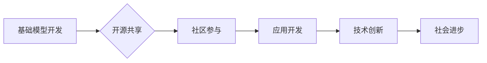

> 基础模型、社会合作、技术创新、人工智能、机器学习、深度学习、开源

## 1. 背景介绍

人工智能（AI）技术近年来取得了飞速发展，基础模型作为AI领域的新兴技术，正在深刻地改变着我们与技术交互的方式，并推动着社会各领域的创新。基础模型是指在海量数据上预训练的大规模深度学习模型，具备强大的泛化能力和适应性，能够应用于各种下游任务，例如自然语言处理、计算机视觉、语音识别等。

传统的AI开发模式往往需要针对特定任务进行模型训练，这需要大量的标注数据和专业知识，且模型的泛化能力有限。基础模型的出现打破了这一局限性，通过预训练的方式学习到通用的知识和表示，可以显著降低下游任务的开发成本和时间，并提升模型的性能。

## 2. 核心概念与联系

**2.1 基础模型的定义**

基础模型是指在海量数据上进行预训练的大规模深度学习模型，其核心特征包括：

* **规模庞大:** 基础模型通常拥有数亿甚至数十亿个参数，拥有强大的计算能力和存储能力。
* **预训练:** 基础模型在未标记数据上进行预训练，学习到通用的知识和表示，为下游任务提供良好的初始化。
* **泛化能力强:** 基础模型能够应用于多种下游任务，并表现出良好的泛化能力。

**2.2 社会合作与技术创新的关系**

社会合作与技术创新是相互促进、相互依存的关系。社会合作可以为技术创新提供资源、人才和市场需求，而技术创新则可以推动社会进步，改善人们的生活。

**2.3 基础模型与社会合作与技术创新的关系**

基础模型作为一种新兴技术，可以促进社会合作与技术创新，其主要作用机制包括：

* **降低技术门槛:** 基础模型的开源和易用性降低了技术门槛，使得更多人能够参与到AI开发中，促进社会合作。
* **加速技术创新:** 基础模型的预训练能力可以显著加速下游任务的开发，促进技术创新。
* **促进知识共享:** 基础模型的开源和共享可以促进知识共享，加速技术进步。

**2.4 基础模型的社会合作与技术创新架构**



## 3. 核心算法原理 & 具体操作步骤

**3.1 算法原理概述**

基础模型的训练主要基于深度学习算法，其中Transformer模型是目前最流行的架构之一。Transformer模型利用自注意力机制学习文本序列之间的关系，能够捕捉长距离依赖关系，并具有强大的文本理解和生成能力。

**3.2 算法步骤详解**

1. **数据预处理:** 将原始文本数据进行清洗、分词、词嵌入等预处理操作，使其能够被模型理解。
2. **模型训练:** 使用预训练数据集对Transformer模型进行训练，训练目标通常是预测下一个词或句子。
3. **模型评估:** 使用验证集评估模型的性能，并根据评估结果调整模型参数和训练策略。
4. **模型微调:** 将预训练好的模型应用于特定下游任务，对模型进行微调，使其能够更好地适应目标任务。

**3.3 算法优缺点**

**优点:**

* 强大的泛化能力
* 能够捕捉长距离依赖关系
* 训练效率高

**缺点:**

* 计算资源需求高
* 训练数据量大
* 容易过拟合

**3.4 算法应用领域**

* 自然语言处理：文本分类、情感分析、机器翻译、文本摘要等
* 计算机视觉：图像识别、目标检测、图像分割等
* 语音识别：语音转文本、语音合成等

## 4. 数学模型和公式 & 详细讲解 & 举例说明

**4.1 数学模型构建**

Transformer模型的核心是自注意力机制，其数学模型可以表示为：

$$
Attention(Q, K, V) = \frac{exp(Q \cdot K^T / \sqrt{d_k})}{exp(Q \cdot K^T / \sqrt{d_k})} \cdot V
$$

其中：

* $Q$：查询矩阵
* $K$：键矩阵
* $V$：值矩阵
* $d_k$：键向量的维度

**4.2 公式推导过程**

自注意力机制通过计算查询向量与键向量的点积，并使用softmax函数进行归一化，得到每个键向量的权重，然后将权重与值向量相乘，得到最终的输出。

**4.3 案例分析与讲解**

假设我们有一个句子“我爱学习编程”，其词嵌入表示为：

* 我：[0.1, 0.2, 0.3]
* 爱：[0.4, 0.5, 0.6]
* 学习：[0.7, 0.8, 0.9]
* 编程：[1.0, 1.1, 1.2]

当我们计算“学习”词的注意力权重时，会计算其与其他词的点积，例如：

* 学习与“我”的点积：[0.1, 0.2, 0.3] * [0.7, 0.8, 0.9] = 0.5
* 学习与“爱”的点积：[0.4, 0.5, 0.6] * [0.7, 0.8, 0.9] = 0.7

然后使用softmax函数对点积进行归一化，得到每个词的注意力权重，例如：

* 学习与“我”的注意力权重：exp(0.5) / sum(exp(点积))

## 5. 项目实践：代码实例和详细解释说明

**5.1 开发环境搭建**

* Python 3.7+
* PyTorch 1.7+
* CUDA 10.2+

**5.2 源代码详细实现**

```python
import torch
import torch.nn as nn

class Transformer(nn.Module):
    def __init__(self, vocab_size, embedding_dim, num_heads, num_layers):
        super(Transformer, self).__init__()
        self.embedding = nn.Embedding(vocab_size, embedding_dim)
        self.transformer_layers = nn.ModuleList([
            nn.TransformerEncoderLayer(embedding_dim, num_heads)
            for _ in range(num_layers)
        ])
        self.linear = nn.Linear(embedding_dim, vocab_size)

    def forward(self, x):
        x = self.embedding(x)
        for layer in self.transformer_layers:
            x = layer(x)
        x = self.linear(x)
        return x
```

**5.3 代码解读与分析**

* `__init__` 方法初始化模型参数，包括词嵌入层、Transformer编码器层和线性输出层。
* `forward` 方法定义模型的正向传播过程，将输入序列经过词嵌入层、Transformer编码器层和线性输出层，最终得到输出序列。

**5.4 运行结果展示**

使用预训练好的Transformer模型进行下游任务，例如文本分类、机器翻译等，并评估模型的性能。

## 6. 实际应用场景

**6.1 自然语言处理**

* **机器翻译:** 基于基础模型的机器翻译系统能够实现更高质量的翻译，并支持更多语言对。
* **文本摘要:** 基于基础模型的文本摘要系统能够自动生成高质量的文本摘要，节省人工时间和成本。
* **对话系统:** 基于基础模型的对话系统能够进行更自然、更流畅的对话，并提供更个性化的服务。

**6.2 计算机视觉**

* **图像识别:** 基于基础模型的图像识别系统能够识别更复杂、更细粒度的物体，并提高识别准确率。
* **目标检测:** 基于基础模型的目标检测系统能够准确地定位图像中的目标，并进行分类。
* **图像分割:** 基于基础模型的图像分割系统能够将图像分割成不同的区域，并进行相应的处理。

**6.3 语音识别**

* **语音转文本:** 基于基础模型的语音转文本系统能够实现更准确、更流畅的语音转文本。
* **语音合成:** 基于基础模型的语音合成系统能够生成更自然、更逼真的语音。

**6.4 未来应用展望**

基础模型的应用场景还在不断扩展，未来将应用于更多领域，例如：

* **医疗保健:** 基于基础模型的医疗诊断系统能够辅助医生进行诊断，提高诊断准确率。
* **教育:** 基于基础模型的教育系统能够提供个性化的学习体验，并提高学习效率。
* **金融:** 基于基础模型的金融风险管理系统能够识别和评估金融风险，降低金融风险。

## 7. 工具和资源推荐

**7.1 学习资源推荐**

* **书籍:**
    * 《深度学习》
    * 《自然语言处理》
    * 《计算机视觉》
* **在线课程:**
    * Coursera
    * edX
    * Udacity

**7.2 开发工具推荐**

* **PyTorch:** 深度学习框架
* **TensorFlow:** 深度学习框架
* **HuggingFace:** 基于Transformer模型的开源库

**7.3 相关论文推荐**

* 《Attention Is All You Need》
* 《BERT: Pre-training of Deep Bidirectional Transformers for Language Understanding》
* 《GPT-3: Language Models are Few-Shot Learners》

## 8. 总结：未来发展趋势与挑战

**8.1 研究成果总结**

基础模型在人工智能领域取得了显著的进展，其强大的泛化能力和适应性推动了AI技术的广泛应用。

**8.2 未来发展趋势**

* **模型规模的进一步扩大:** 未来基础模型的规模将继续扩大，拥有更多的参数和更强的计算能力。
* **多模态学习:** 基础模型将从单模态扩展到多模态，例如文本、图像、音频等。
* **可解释性增强:** 研究人员将致力于提高基础模型的可解释性，使其能够更好地解释其决策过程。

**8.3 面临的挑战**

* **数据安全和隐私:** 基础模型的训练需要大量数据，如何保证数据安全和隐私是一个重要的挑战。
* **模型偏见:** 基础模型可能存在偏见，需要采取措施 mitigating 偏见的影响。
* **计算资源需求:** 基础模型的训练需要大量的计算资源，如何降低计算成本是一个重要的挑战。

**8.4 研究展望**

未来研究将集中在以下几个方面：

* 开发更强大的基础模型
* 提高基础模型的可解释性和鲁棒性
* 探索基础模型在更多领域的应用


## 9. 附录：常见问题与解答

**9.1 如何选择合适的基础模型？**

选择合适的基础模型需要根据具体的应用场景和需求进行考虑，例如：

* **任务类型:** 不同的任务类型需要不同的基础模型，例如文本分类需要使用文本处理能力强的模型，图像识别需要使用图像处理能力强的模型。
* **数据规模:** 数据规模越大，可以选择规模更大的基础模型。
* **计算资源:** 计算资源有限的情况下，可以选择规模较小的基础模型。

**9.2 如何进行基础模型的微调？**

基础模型的微调需要使用少量标注数据，调整模型参数，使其能够更好地适应目标任务。

**9.3 如何评估基础模型的性能？**

基础模型的性能可以通过各种指标进行评估，例如准确率、召回率、F1-score等。

作者：禅与计算机程序设计艺术 / Zen and the Art of Computer Programming 


<end_of_turn>