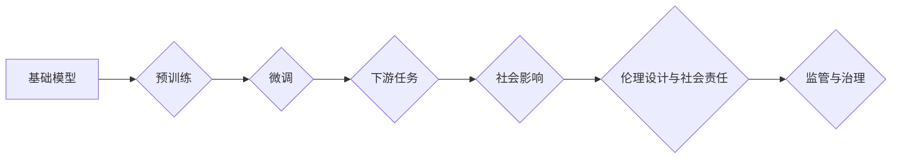

> 基础模型、人工智能、伦理设计、社会影响、可解释性、公平性、隐私保护、监管

## 1. 背景介绍

近年来，人工智能（AI）技术取得了飞速发展，基础模型作为AI领域的新兴技术，展现出强大的学习和泛化能力，在自然语言处理、计算机视觉、语音识别等领域取得了突破性进展。基础模型通常是指在海量数据上预训练的大规模神经网络模型，能够通过微调适应各种下游任务，极大地降低了模型训练成本和时间。

然而，基础模型的强大能力也带来了新的挑战和风险。其潜在的社会影响和伦理问题日益受到关注。例如，基础模型可能被用于生成虚假信息、传播偏见、侵犯隐私等方面，因此，我们需要认真思考基础模型的伦理设计和社会责任。

## 2. 核心概念与联系

**2.1 基础模型概述**

基础模型是指在海量数据上进行预训练的大规模神经网络模型，其核心特点是：

* **规模庞大:** 基础模型通常拥有数十亿甚至数千亿个参数，拥有强大的学习能力。
* **通用性强:** 基础模型能够适应多种下游任务，例如文本生成、图像识别、语音合成等。
* **可迁移性高:** 基础模型可以迁移到不同的领域和应用场景，降低了模型训练成本和时间。

**2.2 基础模型与社会影响**

基础模型的强大能力对社会产生深远影响，既有积极的方面，也有潜在的风险：

* **积极影响:** 基础模型可以推动科技进步，提高生产效率，改善人们的生活质量。例如，在医疗领域，基础模型可以辅助医生诊断疾病、预测患者风险；在教育领域，基础模型可以个性化学习辅导、提高教育效率。
* **潜在风险:** 基础模型也可能被用于恶意目的，例如生成虚假信息、传播偏见、侵犯隐私等。例如，基础模型可以被用于生成逼真的假新闻、合成虚假视频，造成社会混乱；基础模型也可能学习到数据中的偏见，导致歧视和不公平。

**2.3 伦理设计与社会责任**

为了确保基础模型的健康发展，我们需要认真思考其伦理设计和社会责任。

* **可解释性:** 提高基础模型的可解释性，让其决策过程更加透明，帮助人们理解模型的运作机制，从而增强人们对模型的信任。
* **公平性:** 确保基础模型不产生歧视和偏见，公平地对待所有用户。
* **隐私保护:** 保护用户隐私数据，防止基础模型被用于侵犯用户隐私。
* **安全性和可靠性:** 确保基础模型的安全性和可靠性，防止其被恶意利用。

**2.4 监管与治理**

政府、行业组织和学术界需要加强合作，制定相应的监管政策和治理机制，引导基础模型的健康发展，防止其带来的潜在风险。

**Mermaid 流程图**



## 3. 核心算法原理 & 具体操作步骤

**3.1 算法原理概述**

基础模型通常基于深度学习算法，例如Transformer模型，其核心原理是通过多层神经网络结构，学习数据中的复杂模式和关系。

**3.2 算法步骤详解**

1. **数据预处理:** 将原始数据进行清洗、格式化、编码等处理，使其适合模型训练。
2. **模型构建:** 根据任务需求，选择合适的深度学习模型架构，例如Transformer模型。
3. **预训练:** 在海量数据上进行模型预训练，学习数据中的通用知识和表示。
4. **微调:** 将预训练模型微调到特定下游任务，例如文本分类、机器翻译等。
5. **评估和优化:** 对模型性能进行评估，并根据评估结果进行模型优化，例如调整模型参数、增加训练数据等。

**3.3 算法优缺点**

* **优点:**
    * 强大的学习能力，能够学习到数据中的复杂模式和关系。
    * 通用性强，可以适应多种下游任务。
    * 可迁移性高，可以迁移到不同的领域和应用场景。
* **缺点:**
    * 训练成本高，需要海量数据和强大的计算资源。
    * 可解释性差，模型决策过程难以理解。
    * 容易受到数据偏差的影响，可能产生歧视和偏见。

**3.4 算法应用领域**

基础模型在各个领域都有广泛的应用，例如：

* **自然语言处理:** 文本生成、机器翻译、问答系统、文本摘要等。
* **计算机视觉:** 图像识别、物体检测、图像分割、图像生成等。
* **语音识别:** 语音转文本、语音合成、语音助手等。
* **其他领域:** 药物研发、金融预测、天气预报等。

## 4. 数学模型和公式 & 详细讲解 & 举例说明

**4.1 数学模型构建**

基础模型通常基于神经网络模型，其数学模型可以表示为一个多层感知机，其中每个层包含多个神经元，每个神经元接收来自上一层的输入，并通过激活函数进行处理，输出到下一层。

**4.2 公式推导过程**

神经网络模型的输出可以表示为：

$$
y = f(W_L x_L + b_L)
$$

其中：

* $y$ 是模型输出
* $f$ 是激活函数
* $W_L$ 是最后一层的权重矩阵
* $x_L$ 是最后一层的输入
* $b_L$ 是最后一层的偏置向量

**4.3 案例分析与讲解**

例如，在文本分类任务中，基础模型可以将文本序列映射到一个低维空间，然后使用softmax函数将文本分类到不同的类别。

**举例说明:**

假设我们有一个文本分类任务，需要将文本分类到“正面”和“负面”两个类别。我们可以使用一个两层的Transformer模型，其中第一层负责提取文本的语义特征，第二层负责将语义特征分类到不同的类别。

## 5. 项目实践：代码实例和详细解释说明

**5.1 开发环境搭建**

* 操作系统: Ubuntu 20.04
* Python 版本: 3.8
* 深度学习框架: PyTorch 1.8

**5.2 源代码详细实现**

```python
import torch
import torch.nn as nn

class Transformer(nn.Module):
    def __init__(self, input_size, hidden_size, num_layers, num_heads):
        super(Transformer, self).__init__()
        self.encoder = nn.TransformerEncoder(nn.TransformerEncoderLayer(d_model=hidden_size, nhead=num_heads), num_layers)
        self.fc = nn.Linear(hidden_size, 2)

    def forward(self, x):
        x = self.encoder(x)
        x = self.fc(x[:, 0, :])  # 取最后一个时间步的输出
        return x

# 实例化模型
model = Transformer(input_size=100, hidden_size=512, num_layers=6, num_heads=8)

# 定义损失函数和优化器
criterion = nn.CrossEntropyLoss()
optimizer = torch.optim.Adam(model.parameters(), lr=0.001)

# 训练模型
for epoch in range(10):
    # ... 训练代码 ...
```

**5.3 代码解读与分析**

* 代码定义了一个Transformer模型，包含编码器和全连接层。
* 编码器使用多层TransformerEncoderLayer进行编码，每个层包含多头注意力机制和前馈神经网络。
* 全连接层将编码器的输出映射到两个类别。
* 训练代码使用交叉熵损失函数和Adam优化器进行模型训练。

**5.4 运行结果展示**

训练完成后，可以评估模型的性能，例如使用准确率、召回率、F1-score等指标。

## 6. 实际应用场景

**6.1 自然语言处理**

* **文本生成:** 基于基础模型的文本生成模型可以用于生成各种类型的文本，例如小说、诗歌、新闻报道等。
* **机器翻译:** 基于基础模型的机器翻译模型可以实现更高质量的机器翻译，例如将中文翻译成英文。
* **问答系统:** 基于基础模型的问答系统可以理解用户的问题，并从知识库中找到相应的答案。

**6.2 计算机视觉**

* **图像识别:** 基于基础模型的图像识别模型可以识别图像中的物体、场景和人物。
* **图像分割:** 基于基础模型的图像分割模型可以将图像分割成不同的区域，例如将图像中的前景和背景分割开来。
* **图像生成:** 基于基础模型的图像生成模型可以生成逼真的图像，例如生成人物肖像、风景画等。

**6.3 语音识别**

* **语音转文本:** 基于基础模型的语音转文本模型可以将语音转换为文本，例如将语音会议转换为文字记录。
* **语音合成:** 基于基础模型的语音合成模型可以将文本转换为语音，例如将文字稿转换为语音朗读。
* **语音助手:** 基于基础模型的语音助手可以理解用户的语音指令，并执行相应的操作。

**6.4 未来应用展望**

基础模型的应用场景还在不断扩展，未来可能会应用于更多领域，例如：

* **医疗诊断:** 基于基础模型的医疗诊断系统可以辅助医生诊断疾病，提高诊断准确率。
* **个性化教育:** 基于基础模型的个性化教育系统可以根据学生的学习情况提供个性化的学习辅导。
* **自动驾驶:** 基于基础模型的自动驾驶系统可以帮助车辆感知周围环境，并做出安全驾驶决策。

## 7. 工具和资源推荐

**7.1 学习资源推荐**

* **书籍:**
    * 深度学习
    * 自然语言处理
    * 计算机视觉
* **在线课程:**
    * Coursera
    * edX
    * Udacity

**7.2 开发工具推荐**

* **深度学习框架:** PyTorch, TensorFlow
* **编程语言:** Python
* **云计算平台:** AWS, Google Cloud, Azure

**7.3 相关论文推荐**

* Attention Is All You Need
* BERT: Pre-training of Deep Bidirectional Transformers for Language Understanding
* GPT-3: Language Models are Few-Shot Learners

## 8. 总结：未来发展趋势与挑战

**8.1 研究成果总结**

基础模型在人工智能领域取得了显著进展，展现出强大的学习能力和泛化能力，在各个领域都有广泛的应用。

**8.2 未来发展趋势**

* **模型规模进一步扩大:** 未来基础模型的规模将会进一步扩大，拥有更多的参数和更强的学习能力。
* **多模态学习:** 基础模型将能够处理多种模态数据，例如文本、图像、音频等，实现跨模态的理解和生成。
* **可解释性增强:** 研究者将致力于提高基础模型的可解释性，让其决策过程更加透明，增强人们对模型的信任。

**8.3 面临的挑战**

* **数据安全和隐私保护:** 基础模型的训练需要海量数据，如何确保数据安全和隐私保护是一个重要的挑战。
* **算法偏见和公平性:** 基础模型可能学习到数据中的偏见，导致歧视和不公平，需要采取措施 mitigating 算法偏见。
* **模型安全性:** 基础模型可能被恶意利用，例如生成虚假信息、攻击网络系统，需要加强模型安全性研究。

**8.4 研究展望**

未来基础模型的研究将更加注重伦理设计、社会责任和可持续发展，确保基础模型的健康发展，造福人类社会。

## 9. 附录：常见问题与解答

**9.1 如何选择合适的基础模型？**

选择合适的基础模型需要根据具体的应用场景和任务需求进行选择。例如，对于文本生成任务，可以选择GPT-3等文本生成模型；对于图像识别任务，可以选择ResNet、