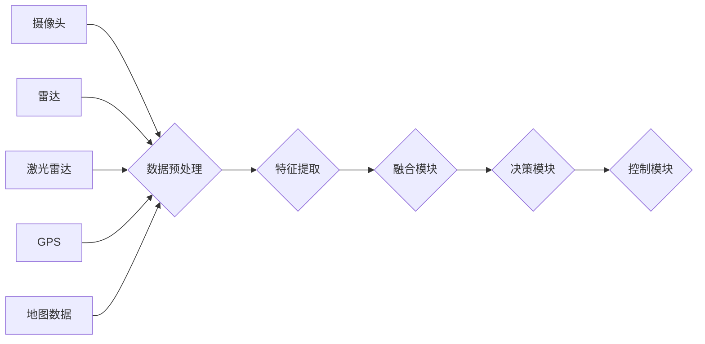

> 多模态AI, 自动驾驶, 计算机视觉, 自然语言处理, 语音识别, 传感器融合, 深度学习, 挑战

## 1. 背景介绍

自动驾驶技术作为未来交通运输的重要发展方向，近年来取得了显著进展。传统的自动驾驶系统主要依赖于单一传感器数据，例如摄像头、雷达或激光雷达，但单一传感器的数据往往存在局限性，难以应对复杂多变的驾驶环境。

多模态AI技术融合了计算机视觉、自然语言处理、语音识别等多种感知方式，能够从多角度获取环境信息，构建更加全面的驾驶场景理解，从而提升自动驾驶系统的安全性、可靠性和智能化水平。

## 2. 核心概念与联系

多模态AI的核心概念在于将不同模态的数据进行融合，以获得更丰富的环境感知和更准确的决策结果。

**多模态AI架构**



**核心概念解释:**

* **数据预处理:** 对不同模态的数据进行格式转换、噪声去除、特征提取等预处理，使其能够被后续模块有效利用。
* **特征提取:** 利用计算机视觉、自然语言处理等算法，从原始数据中提取关键特征，例如物体位置、速度、方向、道路类型等。
* **融合模块:** 将不同模态的特征进行融合，构建多模态特征表示，例如使用加权平均、注意力机制等方法。
* **决策模块:** 基于融合后的多模态特征，进行驾驶决策，例如路径规划、速度控制、避障决策等。
* **控制模块:** 将决策结果转化为车辆控制指令，例如转向、加速、制动等。

## 3. 核心算法原理 & 具体操作步骤

### 3.1  算法原理概述

多模态AI在自动驾驶中的应用主要依赖于深度学习算法，例如卷积神经网络（CNN）、循环神经网络（RNN）和Transformer等。

* **CNN:** 用于处理图像数据，提取图像特征。
* **RNN:** 用于处理序列数据，例如语音信号、文本数据等。
* **Transformer:** 用于处理文本数据，具有强大的语义理解能力。

### 3.2  算法步骤详解

1. **数据收集和预处理:** 收集来自不同传感器的数据，并进行预处理，例如格式转换、噪声去除、数据增强等。
2. **模型训练:** 利用深度学习算法，训练多模态AI模型，使其能够从多模态数据中学习特征和关系。
3. **模型评估:** 使用测试数据集评估模型的性能，例如准确率、召回率、F1-score等。
4. **模型部署:** 将训练好的模型部署到自动驾驶系统中，用于实时感知环境和决策驾驶行为。

### 3.3  算法优缺点

**优点:**

* **高精度:** 深度学习算法能够学习复杂的特征关系，提高自动驾驶系统的感知和决策精度。
* **鲁棒性:** 多模态融合能够弥补单一传感器数据不足，提高系统的鲁棒性。
* **智能化:** 多模态AI能够理解驾驶场景的语义信息，提升自动驾驶系统的智能化水平。

**缺点:**

* **数据需求:** 深度学习算法需要大量的训练数据，数据获取和标注成本较高。
* **计算复杂度:** 多模态AI模型训练和推理过程计算复杂度高，对硬件资源要求较高。
* **安全可靠性:** 多模态AI系统仍然存在安全和可靠性问题，需要进一步研究和改进。

### 3.4  算法应用领域

多模态AI在自动驾驶领域的应用场景广泛，例如：

* **环境感知:** 利用摄像头、雷达、激光雷达等传感器数据，构建完整的驾驶场景地图，识别道路、车辆、行人等物体。
* **路径规划:** 根据驾驶场景地图和目标位置，规划最优驾驶路径，避免碰撞和拥堵。
* **驾驶决策:** 根据环境感知信息和驾驶策略，进行驾驶决策，例如加速、减速、转向、停车等。
* **人机交互:** 利用语音识别、自然语言处理等技术，实现人机交互，例如语音指令、对话式交互等。

## 4. 数学模型和公式 & 详细讲解 & 举例说明

### 4.1  数学模型构建

多模态AI模型通常采用多层神经网络结构，例如CNN-RNN-Transformer等。

**CNN模型:**

* **卷积层:** 使用卷积核提取图像特征。
* **池化层:** 降低图像尺寸，提高模型鲁棒性。
* **全连接层:** 将提取的特征进行分类或回归。

**RNN模型:**

* **循环层:** 利用循环结构，处理序列数据，学习时间依赖关系。
* **全连接层:** 将RNN输出进行分类或回归。

**Transformer模型:**

* **自注意力机制:** 学习序列数据之间的关系，捕捉长距离依赖。
* **多头注意力:** 使用多个注意力头，学习不同类型的语义信息。
* **前馈网络:** 对自注意力输出进行进一步处理。

### 4.2  公式推导过程

**CNN模型的卷积操作:**

$$
y_{i,j} = \sum_{m=0}^{M-1} \sum_{n=0}^{N-1} x_{i+m,j+n} * w_{m,n} + b
$$

其中:

* $y_{i,j}$ 是卷积核输出的像素值。
* $x_{i+m,j+n}$ 是输入图像的像素值。
* $w_{m,n}$ 是卷积核的权重。
* $b$ 是偏置项。

**RNN模型的循环操作:**

$$
h_t = f(W_xh_t-1 + W_xh_t + b_x)
$$

其中:

* $h_t$ 是时间步t的隐藏状态。
* $h_{t-1}$ 是时间步t-1的隐藏状态。
* $x_t$ 是时间步t的输入。
* $W_x$ 和 $W_h$ 是权重矩阵。
* $b_x$ 是偏置项。

### 4.3  案例分析与讲解

**多模态融合案例:**

假设自动驾驶系统需要识别道路上的行人。

* **摄像头:** 提供行人的图像信息。
* **雷达:** 提供行人的距离和速度信息。

可以使用多模态融合方法，将摄像头和雷达的数据融合，提高行人识别的准确率。例如，可以使用注意力机制，将摄像头图像中的行人区域赋予更高的权重，并结合雷达数据进行距离和速度的校正。

## 5. 项目实践：代码实例和详细解释说明

### 5.1  开发环境搭建

* **操作系统:** Ubuntu 20.04
* **深度学习框架:** TensorFlow 2.0
* **编程语言:** Python 3.7

### 5.2  源代码详细实现

```python
import tensorflow as tf

# 定义CNN模型
def build_cnn_model():
    model = tf.keras.models.Sequential([
        tf.keras.layers.Conv2D(32, (3, 3), activation='relu', input_shape=(64, 64, 3)),
        tf.keras.layers.MaxPooling2D((2, 2)),
        tf.keras.layers.Conv2D(64, (3, 3), activation='relu'),
        tf.keras.layers.MaxPooling2D((2, 2)),
        tf.keras.layers.Flatten(),
        tf.keras.layers.Dense(10, activation='softmax')
    ])
    return model

# 定义RNN模型
def build_rnn_model():
    model = tf.keras.models.Sequential([
        tf.keras.layers.LSTM(128, return_sequences=True),
        tf.keras.layers.LSTM(64),
        tf.keras.layers.Dense(10, activation='softmax')
    ])
    return model

# 定义多模态融合模型
def build_multimodal_model():
    cnn_model = build_cnn_model()
    rnn_model = build_rnn_model()

    # 将CNN和RNN模型的输出进行融合
    merged_output = tf.keras.layers.Concatenate()([cnn_model.output, rnn_model.output])
    output_layer = tf.keras.layers.Dense(10, activation='softmax')(merged_output)

    model = tf.keras.models.Model(inputs=[cnn_model.input, rnn_model.input], outputs=output_layer)
    return model

# 创建多模态融合模型
multimodal_model = build_multimodal_model()

# 训练模型
multimodal_model.compile(optimizer='adam', loss='sparse_categorical_crossentropy', metrics=['accuracy'])
multimodal_model.fit(x_train, y_train, epochs=10)

```

### 5.3  代码解读与分析

* **模型构建:** 代码定义了CNN、RNN和多模态融合模型的构建函数。
* **数据输入:** 多模态融合模型接受CNN和RNN模型的输出作为输入。
* **数据融合:** 使用Concatenate层将CNN和RNN模型的输出进行拼接。
* **模型训练:** 使用Adam优化器、交叉熵损失函数和准确率指标训练模型。

### 5.4  运行结果展示

训练完成后，可以使用测试数据评估模型的性能，例如准确率、召回率、F1-score等。

## 6. 实际应用场景

### 6.1  自动驾驶场景感知

多模态AI可以帮助自动驾驶系统更全面地感知周围环境，例如识别道路、车辆、行人、交通信号灯等。

### 6.2  路径规划与决策

多模态AI可以根据环境感知信息，规划最优驾驶路径，并进行避障、加速、减速等决策。

### 6.3  人机交互

多模态AI可以实现语音识别、自然语言理解等功能，方便驾驶员与自动驾驶系统进行交互。

### 6.4  未来应用展望

未来，多模态AI将在自动驾驶领域发挥更重要的作用，例如：

* **更智能的驾驶决策:** 多模态AI可以理解驾驶场景的语义信息，做出更智能、更安全的驾驶决策。
* **更安全的驾驶体验:** 多模态AI可以提高自动驾驶系统的感知能力和鲁棒性，降低驾驶风险。
* **更人性化的驾驶体验:** 多模态AI可以实现更自然的驾驶员与车辆交互，提升驾驶体验。

## 7. 工具和资源推荐

### 7.1  学习资源推荐

* **书籍:**
    * Deep Learning by Ian Goodfellow, Yoshua Bengio, and Aaron Courville
    * Hands-On Machine Learning with Scikit-Learn, Keras & TensorFlow by Aurélien Géron
* **在线课程:**
    * TensorFlow Tutorials: https://www.tensorflow.org/tutorials
    * Deep Learning Specialization by Andrew Ng: https://www.deeplearning.ai/

### 7.2  开发工具推荐

* **深度学习框架:** TensorFlow, PyTorch, Keras
* **数据标注工具:** LabelImg, CVAT
* **仿真平台:** CARLA, SUMO

### 7.3  相关论文推荐

* **Multimodal Fusion for Autonomous Driving:** https://arxiv.org/abs/1904.09037
* **End-to-End Multimodal Learning for Autonomous Driving:** https://arxiv.org/abs/1806.05974

## 8. 总结：未来发展趋势与挑战

### 8.1  研究成果总结

多模态AI在自动驾驶领域取得了显著进展，能够有效提升自动驾驶系统的感知、决策和