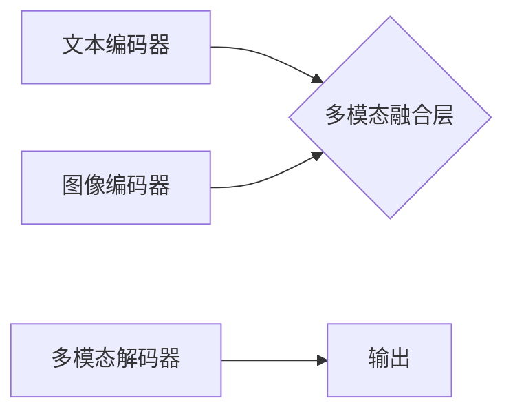

> 多模态大模型、金融科技、自然语言处理、计算机视觉、深度学习、Transformer、BERT、GPT、图像识别、文本分类、风险评估、欺诈检测

## 1. 背景介绍

近年来，人工智能（AI）技术取得了飞速发展，特别是深度学习的突破，使得多模态大模型（Multimodal Large Models，MLMs）的出现成为可能。多模态大模型能够处理多种类型的数据，例如文本、图像、音频、视频等，并从中提取有意义的信息，实现跨模态的理解和生成。

金融行业作为数据密集型行业，蕴藏着丰富的多模态数据资源，例如交易记录、客户画像、新闻报道、社交媒体评论等。利用多模态大模型，可以挖掘这些数据中的隐藏价值，提升金融服务的效率和智能化水平。

## 2. 核心概念与联系

多模态大模型的核心概念是融合不同模态数据的信息，构建一个统一的表示空间，实现跨模态的理解和交互。

**2.1 多模态数据**

多模态数据是指包含多种类型数据信息的集合，例如文本、图像、音频、视频等。

**2.2 多模态融合**

多模态融合是指将不同模态数据的信息融合在一起，形成一个更加完整的表示。

**2.3 多模态大模型**

多模态大模型是指能够处理多种类型数据，并进行跨模态理解和生成的深度学习模型。

**2.4 架构图**



## 3. 核心算法原理 & 具体操作步骤

### 3.1  算法原理概述

多模态大模型的训练主要基于深度学习的Transformer架构，通过自注意力机制学习不同模态数据之间的关系，并进行跨模态的表示学习。

### 3.2  算法步骤详解

1. **数据预处理:** 将多模态数据进行清洗、格式化和编码，例如将文本转换为词向量，将图像转换为特征图等。
2. **模态编码:** 使用不同的编码器对每个模态数据进行编码，例如使用BERT对文本进行编码，使用ResNet对图像进行编码等。
3. **多模态融合:** 将不同模态的编码结果进行融合，例如使用注意力机制学习不同模态之间的权重，并进行加权求和等。
4. **解码:** 使用解码器将融合后的多模态表示转换为最终输出，例如生成文本、识别图像等。
5. **训练:** 使用交叉熵损失函数对模型进行训练，优化模型参数，使其能够准确地进行多模态理解和生成。

### 3.3  算法优缺点

**优点:**

* 能够处理多种类型数据，提升信息利用率。
* 通过跨模态学习，能够获得更丰富的语义理解。
* 能够实现多种应用场景，例如图像字幕生成、文本问答、多模态检索等。

**缺点:**

* 数据标注成本高，训练数据量大。
* 模型复杂度高，训练时间长。
* 跨模态融合的算法设计较为复杂。

### 3.4  算法应用领域

多模态大模型在金融领域具有广泛的应用前景，例如：

* **风险评估:** 通过分析客户画像、交易记录、新闻报道等多模态数据，评估客户的信用风险和投资风险。
* **欺诈检测:** 通过分析交易行为、用户画像、网络社交等多模态数据，识别和预防金融欺诈行为。
* **客户服务:** 通过自然语言处理和图像识别技术，实现智能客服，提供更便捷高效的客户服务。
* **投资决策:** 通过分析市场数据、新闻报道、社交媒体评论等多模态数据，辅助投资决策。

## 4. 数学模型和公式 & 详细讲解 & 举例说明

### 4.1  数学模型构建

多模态大模型的数学模型通常基于Transformer架构，其核心是自注意力机制。

**4.1.1 自注意力机制**

自注意力机制能够学习序列中不同元素之间的关系，并赋予每个元素不同的权重。

**公式:**

$$
Attention(Q, K, V) = softmax(\frac{QK^T}{\sqrt{d_k}})V
$$

其中：

* $Q$：查询矩阵
* $K$：键矩阵
* $V$：值矩阵
* $d_k$：键向量的维度
* $softmax$：softmax函数

**4.1.2 Transformer架构**

Transformer架构由编码器和解码器组成，编码器用于对输入序列进行编码，解码器用于生成输出序列。

**4.1.3 多模态融合**

多模态融合通常使用注意力机制学习不同模态之间的关系，并进行加权求和。

### 4.2  公式推导过程

自注意力机制的公式推导过程如下：

1. 计算查询矩阵 $Q$、键矩阵 $K$ 和值矩阵 $V$。
2. 计算 $QK^T$ 的每个元素，并进行归一化。
3. 使用 softmax 函数对归一化后的结果进行归一化，得到每个元素的权重。
4. 将权重与值矩阵 $V$ 进行加权求和，得到最终的输出。

### 4.3  案例分析与讲解

例如，在图像字幕生成任务中，可以使用 Transformer 架构的多模态大模型，将图像特征和文本词向量作为输入，学习图像和文本之间的关系，并生成相应的字幕。

## 5. 项目实践：代码实例和详细解释说明

### 5.1  开发环境搭建

使用 Python 3.7+ 环境，安装 TensorFlow 或 PyTorch 等深度学习框架，以及必要的库，例如 transformers、torchvision 等。

### 5.2  源代码详细实现

```python
# 导入必要的库
import tensorflow as tf

# 定义模型架构
class MultimodalModel(tf.keras.Model):
    def __init__(self, text_encoder, image_encoder, fusion_layer, decoder):
        super(MultimodalModel, self).__init__()
        self.text_encoder = text_encoder
        self.image_encoder = image_encoder
        self.fusion_layer = fusion_layer
        self.decoder = decoder

    def call(self, text, image):
        text_embedding = self.text_encoder(text)
        image_embedding = self.image_encoder(image)
        fused_embedding = self.fusion_layer([text_embedding, image_embedding])
        output = self.decoder(fused_embedding)
        return output

# 实例化模型
model = MultimodalModel(
    text_encoder=tf.keras.applications.BERT(
        weights='bert-base-uncased',
        include_output_layer=False
    ),
    image_encoder=tf.keras.applications.ResNet50(
        weights='imagenet',
        include_top=False
    ),
    fusion_layer=tf.keras.layers.Concatenate(),
    decoder=tf.keras.layers.LSTM(128)
)

# 编译模型
model.compile(optimizer='adam', loss='sparse_categorical_crossentropy', metrics=['accuracy'])

# 训练模型
model.fit(
    x={'text': text_data, 'image': image_data},
    y=label_data,
    epochs=10
)
```

### 5.3  代码解读与分析

* 代码首先导入必要的库。
* 然后定义了一个多模态模型类 `MultimodalModel`，该类包含文本编码器、图像编码器、融合层和解码器。
* 在实例化模型时，使用预训练的 BERT 模型作为文本编码器，ResNet50 模型作为图像编码器，使用 Concatenate 层进行融合，使用 LSTM 层作为解码器。
* 最后，编译模型并进行训练。

### 5.4  运行结果展示

训练完成后，可以将模型应用于实际场景，例如图像字幕生成、文本问答等。

## 6. 实际应用场景

### 6.1  金融风险评估

多模态大模型可以分析客户画像、交易记录、新闻报道等多模态数据，识别潜在的风险因素，并进行风险评估。例如，可以分析客户的社交媒体评论，识别其情绪状态和风险偏好，从而更准确地评估其信用风险。

### 6.2  欺诈检测

多模态大模型可以分析交易行为、用户画像、网络社交等多模态数据，识别异常行为，并进行欺诈检测。例如，可以分析用户的交易记录和地理位置信息，识别可能存在的欺诈交易。

### 6.3  客户服务

多模态大模型可以实现智能客服，通过自然语言处理和图像识别技术，理解客户的需求，并提供相应的帮助。例如，可以利用图像识别技术识别客户上传的文档，并自动提取关键信息，提供更精准的客户服务。

### 6.4  未来应用展望

随着多模态大模型技术的不断发展，其在金融领域的应用场景将更加广泛，例如：

* **个性化金融服务:** 根据客户的多模态数据，提供个性化的金融产品和服务。
* **智能投资决策:** 利用多模态数据分析市场趋势，辅助投资决策。
* **金融监管:** 利用多模态大模型进行金融风险监测和监管。

## 7. 工具和资源推荐

### 7.1  学习资源推荐

* **书籍:**
    * 《深度学习》
    * 《自然语言处理》
    * 《计算机视觉》
* **在线课程:**
    * Coursera: 深度学习
    * edX: 自然语言处理
    * Udacity: 计算机视觉

### 7.2  开发工具推荐

* **深度学习框架:** TensorFlow, PyTorch
* **自然语言处理库:** NLTK, spaCy, Transformers
* **计算机视觉库:** OpenCV, TensorFlow Object Detection API

### 7.3  相关论文推荐

* **BERT:** Devlin, J., Chang, M. W., Lee, K., & Toutanova, K. (2018). BERT: Pre-training of deep bidirectional transformers for language understanding. arXiv preprint arXiv:1810.04805.
* **GPT:** Radford, A., Wu, J., Child, R., Luan, D., Amodei, D., & Sutskever, I. (2019). Language models are few-shot learners. OpenAI blog.
* **Vision Transformer:** Dosovitskiy, A., Beyer, L., Kolesnikov, A., Weissenborn, D., Houlsby, N., Elsen, J., ... & Fischer, A. (2020). An image is worth 16x16 words: Transformers for image recognition at scale. arXiv preprint arXiv:2010.11929.

## 8. 总结：未来发展趋势与挑战

### 8.1  研究成果总结

多模态大模型在金融领域取得了显著的成果，例如在风险评估、欺诈检测、客户服务等方面展现出强大的应用潜力。

### 8.2  未来发展趋势

* **模型规模和能力提升:** 未来多模态大模型的规模和能力将进一步提升，能够处理更复杂的多模态数据，并进行更精细的理解和生成。
* **跨模态融合算法创新:** 将探索更有效的跨模态融合算法，提升多模态大模型的性能。
* **应用场景拓展:** 多模态大模型的应用场景将更加广泛，例如个性化金融服务、智能投资决策等。

### 8.3  面临的挑战

* **数据标注成本高:** 多模态数据的标注成本较高，需要开发更有效的标注方法。
* **模型训练复杂:** 多模态大模型的训练复杂度高，需要强大的计算资源。
* **伦理和安全问题:** 多模态大模型的应用可能带来伦理和安全问题，需要加强相关