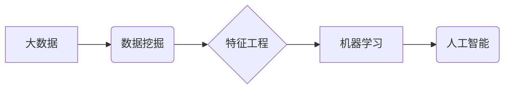

> 大数据，人工智能，机器学习，深度学习，数据挖掘，特征工程，模型训练

## 1. 背景介绍

人工智能（AI）近年来发展迅速，已渗透到各个领域，从自动驾驶到医疗诊断，从个性化推荐到金融风险控制，AI技术的应用正在改变着我们的生活。而支撑AI发展的关键因素之一就是大数据。

大数据是指海量、高速、多样化的数据，其规模、速度和复杂性远远超过传统数据处理能力。大数据蕴含着丰富的知识和价值，为AI学习提供了充足的训练数据和素材。

## 2. 核心概念与联系

**2.1 大数据与人工智能的关系**

大数据为人工智能提供了燃料，人工智能则赋予大数据新的生命力。两者相互依存，共同推动着科技进步。

* **大数据为AI提供训练数据：** AI算法的学习和训练依赖于海量数据，大数据提供了丰富的样本，帮助AI模型识别模式、学习规则，提高预测精度。
* **AI提升大数据分析能力：** AI算法可以对大数据进行高效的分析和挖掘，发现隐藏的规律和趋势，为决策提供数据支持。

**2.2 核心概念架构**



**2.3 核心概念原理**

* **大数据：** 具有海量、高速、多样化等特点的数据集合。
* **数据挖掘：** 从大数据中发现隐藏的模式、规律和知识。
* **特征工程：** 从原始数据中提取有价值的特征，用于训练机器学习模型。
* **机器学习：** 算法通过学习数据，自动发现模式和规律，进行预测和决策。
* **人工智能：** 能够模拟人类智能的计算机系统。

## 3. 核心算法原理 & 具体操作步骤

**3.1 算法原理概述**

机器学习算法的核心是通过学习数据，建立模型，并利用模型对新数据进行预测或分类。常见的机器学习算法包括：

* **监督学习：** 利用标记数据训练模型，例如分类和回归问题。
* **无监督学习：** 从未标记数据中发现模式和结构，例如聚类和降维。
* **强化学习：** 通过试错学习，在环境中获得最大奖励。

**3.2 算法步骤详解**

以监督学习为例，其基本步骤如下：

1. **数据收集和预处理：** 收集相关数据，并进行清洗、转换、特征工程等预处理操作。
2. **模型选择：** 根据具体问题选择合适的机器学习算法。
3. **模型训练：** 利用标记数据训练模型，调整模型参数，使其能够准确预测或分类。
4. **模型评估：** 使用测试数据评估模型的性能，例如准确率、召回率、F1-score等。
5. **模型部署：** 将训练好的模型部署到实际应用场景中，用于预测或分类新数据。

**3.3 算法优缺点**

不同的机器学习算法具有不同的优缺点，需要根据具体问题选择合适的算法。

* **线性回归：** 简单易懂，但对非线性关系的拟合能力有限。
* **决策树：** 可解释性强，但容易过拟合。
* **支持向量机：** 对高维数据处理能力强，但训练时间较长。
* **神经网络：** 能够处理复杂非线性关系，但训练数据量大，参数众多，容易过拟合。

**3.4 算法应用领域**

机器学习算法广泛应用于各个领域，例如：

* **图像识别：** 人脸识别、物体检测、图像分类等。
* **自然语言处理：** 文本分类、情感分析、机器翻译等。
* **推荐系统：** 商品推荐、内容推荐、用户画像等。
* **金融风险控制：** 欺诈检测、信用评分、风险评估等。

## 4. 数学模型和公式 & 详细讲解 & 举例说明

**4.1 数学模型构建**

机器学习算法通常基于数学模型，例如线性回归模型、逻辑回归模型、神经网络模型等。这些模型通过数学公式来描述数据之间的关系。

**4.2 公式推导过程**

例如，线性回归模型的目标是找到一条直线，使得这条直线与数据点之间的误差最小。

* **目标函数：** 
$$
J(\theta) = \frac{1}{2m} \sum_{i=1}^{m} (h_\theta(x^{(i)}) - y^{(i)})^2
$$

其中：

* $J(\theta)$ 是目标函数，表示模型参数 $\theta$ 的误差。
* $m$ 是训练数据的样本数量。
* $h_\theta(x^{(i)})$ 是模型预测的输出值。
* $y^{(i)}$ 是真实值。

* **梯度下降算法：** 用于优化目标函数，找到最优的模型参数 $\theta$。

$$
\theta_j := \theta_j - \alpha \frac{\partial J(\theta)}{\partial \theta_j}
$$

其中：

* $\alpha$ 是学习率。
* $\frac{\partial J(\theta)}{\partial \theta_j}$ 是目标函数对参数 $\theta_j$ 的偏导数。

**4.3 案例分析与讲解**

假设我们有一个数据集，包含房屋面积和房屋价格的信息。我们可以使用线性回归模型来预测房屋价格。

* **特征：** 房屋面积。
* **目标：** 房屋价格。

通过训练线性回归模型，我们可以得到一条直线，这条直线可以用来预测新的房屋价格。

## 5. 项目实践：代码实例和详细解释说明

**5.1 开发环境搭建**

* Python 3.x
* Jupyter Notebook
* scikit-learn

**5.2 源代码详细实现**

```python
import pandas as pd
from sklearn.linear_model import LinearRegression
from sklearn.model_selection import train_test_split

# 加载数据
data = pd.read_csv('house_data.csv')

# 分割数据
X = data[['area']]
y = data['price']
X_train, X_test, y_train, y_test = train_test_split(X, y, test_size=0.2, random_state=42)

# 创建线性回归模型
model = LinearRegression()

# 训练模型
model.fit(X_train, y_train)

# 预测测试数据
y_pred = model.predict(X_test)

# 评估模型性能
from sklearn.metrics import mean_squared_error
mse = mean_squared_error(y_test, y_pred)
print(f'Mean Squared Error: {mse}')
```

**5.3 代码解读与分析**

* 首先，我们加载数据，并将其分割成训练集和测试集。
* 然后，我们创建线性回归模型，并使用训练集训练模型。
* 接下来，我们使用测试集预测房屋价格，并评估模型性能。

**5.4 运行结果展示**

运行代码后，会输出模型的均方误差（MSE）值，该值越小，模型的预测精度越高。

## 6. 实际应用场景

大数据在AI学习中的应用场景广泛，例如：

* **医疗诊断：** 利用大数据分析患者的病历、影像数据等，辅助医生进行诊断和治疗。
* **金融风险控制：** 利用大数据分析客户的交易记录、信用评分等，识别潜在的金融风险。
* **个性化推荐：** 利用大数据分析用户的行为数据、偏好数据等，提供个性化的商品推荐、内容推荐等。
* **智能交通：** 利用大数据分析交通流量、路况等，优化交通管理，提高交通效率。

**6.4 未来应用展望**

随着大数据的规模和质量不断提升，AI学习的应用场景将更加广泛，例如：

* **自动驾驶：** 利用大数据训练自动驾驶算法，实现无人驾驶汽车的普及。
* **个性化教育：** 利用大数据分析学生的学习情况，提供个性化的学习方案。
* **精准农业：** 利用大数据分析土壤、气候等数据，提高农业生产效率。

## 7. 工具和资源推荐

**7.1 学习资源推荐**

* **书籍：**
    * 《深入理解机器学习》
    * 《Python机器学习》
    * 《人工智能：一种现代方法》
* **在线课程：**
    * Coursera
    * edX
    * Udacity

**7.2 开发工具推荐**

* **Python：** 广泛用于机器学习开发。
* **scikit-learn：** Python机器学习库。
* **TensorFlow：** 深度学习框架。
* **PyTorch：** 深度学习框架。

**7.3 相关论文推荐**

* **《ImageNet Classification with Deep Convolutional Neural Networks》**
* **《Attention Is All You Need》**
* **《BERT: Pre-training of Deep Bidirectional Transformers for Language Understanding》**

## 8. 总结：未来发展趋势与挑战

**8.1 研究成果总结**

近年来，大数据与AI技术的结合取得了显著成果，在各个领域都取得了突破性的进展。

**8.2 未来发展趋势**

* **数据规模和质量的提升：** 大数据的规模和质量将不断提升，为AI学习提供更丰富的训练数据。
* **算法模型的创新：** 新的AI算法模型将不断涌现，提高AI学习的效率和精度。
* **边缘计算的应用：** AI模型将部署到边缘设备，实现更实时、更智能的应用。

**8.3 面临的挑战**

* **数据隐私和安全：** 大数据处理涉及大量个人信息，需要保障数据隐私和安全。
* **算法偏见：** AI算法可能存在偏见，需要进行公平性和可解释性的研究。
* **人才短缺：** AI领域人才需求量大，需要加强人才培养和引进。

**8.4 研究展望**

未来，大数据与AI技术的融合将继续深入，推动科技进步和社会发展。我们需要加强基础研究，解决技术难题，并关注伦理和社会影响，确保AI技术安全、可控、可持续发展。

## 9. 附录：常见问题与解答

**9.1 如何处理大数据？**

大数据处理需要采用分布式计算、数据压缩、数据分层等技术。

**9.2 如何选择合适的机器学习算法？**

需要根据具体问题和数据特点选择合适的算法。

**9.3 如何评估机器学习模型的性能？**

可以使用准确率、召回率、F1-score等指标评估模型性能。


作者：禅与计算机程序设计艺术 / Zen and the Art of Computer Programming 
<end_of_turn>