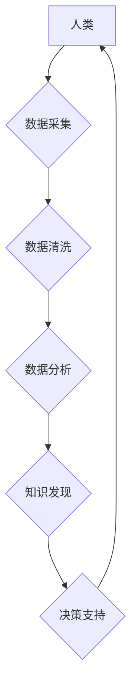

> 大数据、人工智能、人类计算、数据挖掘、机器学习、深度学习

## 1. 背景介绍

我们正处在一个数据爆炸的时代。互联网、移动设备、物联网等技术的快速发展，使得海量数据以惊人的速度涌现。这些数据蕴藏着巨大的价值，但同时也带来了新的挑战。如何有效地收集、存储、分析和利用这些数据，成为了当今社会面临的重大课题。

大数据时代，人类计算的概念应运而生。人类计算是指利用人类的智慧和创造力，结合计算机技术，共同完成复杂的任务。它强调人机协同，将人类的认知能力和计算机的计算能力有机结合，以应对大数据带来的挑战，挖掘数据价值。

## 2. 核心概念与联系

**2.1 大数据**

大数据是指规模庞大、结构复杂、更新速度快、类型多样化的数据。其特征通常被概括为“五V”：

* **Volume (体积)**：数据量巨大，难以用传统方法处理。
* **Velocity (速度)**：数据生成和更新速度快，需要实时处理。
* **Variety (多样性)**：数据类型多样，包括结构化数据、半结构化数据和非结构化数据。
* **Veracity (真实性)**：数据质量参差不齐，需要进行清洗和验证。
* **Value (价值)**：数据蕴藏着巨大的价值，需要进行挖掘和分析。

**2.2 人工智能**

人工智能 (AI) 是指模拟人类智能的计算机系统。它涵盖了多个领域，例如机器学习、深度学习、自然语言处理、计算机视觉等。

**2.3 人类计算**

人类计算是指利用人类的智慧和创造力，结合计算机技术，共同完成复杂的任务。它强调人机协同，将人类的认知能力和计算机的计算能力有机结合，以应对大数据带来的挑战，挖掘数据价值。

**2.4 人类计算与大数据的关系**

大数据时代，人类计算成为解决大数据难题的关键。

* **数据挖掘**: 人类计算可以帮助人类更好地理解和挖掘大数据中的隐藏规律和价值。
* **机器学习**: 人类可以提供机器学习算法的训练数据和反馈，帮助机器学习模型更好地学习和预测。
* **决策支持**: 人类计算可以帮助人类做出更明智的决策，例如预测市场趋势、识别潜在风险等。

**2.5 人类计算与人工智能的关系**

人类计算和人工智能是相互补充的。

* **人工智能可以帮助人类处理大量数据，释放人类的计算能力。**
* **人类可以提供人工智能算法的指导和反馈，帮助人工智能更好地理解和服务人类。**

**2.6 人类计算架构**



## 3. 核心算法原理 & 具体操作步骤

### 3.1 算法原理概述

人类计算的核心算法原理是基于人类认知能力和计算机计算能力的协同。它包括以下几个方面：

* **数据挖掘**: 利用机器学习算法从海量数据中挖掘出隐藏的规律和价值。
* **知识图谱**: 建立知识图谱，将数据转化为可理解的知识结构，方便人类进行分析和推理。
* **自然语言处理**: 利用自然语言处理技术，使计算机能够理解和处理人类语言。
* **计算机视觉**: 利用计算机视觉技术，使计算机能够“看”和理解图像和视频。

### 3.2 算法步骤详解

人类计算的具体操作步骤可以概括为以下几个阶段：

1. **数据收集**: 从各种来源收集相关数据。
2. **数据清洗**: 对收集到的数据进行清洗和预处理，去除噪声和错误数据。
3. **数据分析**: 利用机器学习算法对数据进行分析，挖掘出隐藏的规律和价值。
4. **知识构建**: 将分析结果转化为知识结构，构建知识图谱。
5. **决策支持**: 基于知识图谱和分析结果，为人类决策提供支持。

### 3.3 算法优缺点

**优点**:

* 可以有效地处理海量数据，挖掘数据价值。
* 可以帮助人类做出更明智的决策。
* 可以促进人类认知能力的提升。

**缺点**:

* 需要大量的计算资源和数据支持。
* 需要人类专家进行算法设计和模型训练。
* 存在伦理和安全方面的挑战。

### 3.4 算法应用领域

人类计算的应用领域非常广泛，包括：

* **医疗保健**: 辅助医生诊断疾病、预测患者风险、个性化治疗。
* **金融服务**: 识别欺诈行为、预测市场趋势、提供个性化金融服务。
* **教育**: 个性化学习、智能辅导、自动批改作业。
* **制造业**: 预测设备故障、优化生产流程、实现智能制造。

## 4. 数学模型和公式 & 详细讲解 & 举例说明

### 4.1 数学模型构建

在人类计算中，数学模型是描述数据关系和预测未来趋势的重要工具。常用的数学模型包括：

* **线性回归**: 用于预测连续变量，例如房价、股票价格等。
* **逻辑回归**: 用于预测分类变量，例如客户是否会购买产品、邮件是否为垃圾邮件等。
* **决策树**: 用于分类和回归问题，可以处理非线性关系。
* **支持向量机**: 用于分类问题，可以处理高维数据。

### 4.2 公式推导过程

例如，线性回归模型的公式如下：

$$y = \beta_0 + \beta_1x_1 + \beta_2x_2 + ... + \beta_nx_n + \epsilon$$

其中：

* $y$ 是预测变量
* $x_1, x_2, ..., x_n$ 是自变量
* $\beta_0, \beta_1, ..., \beta_n$ 是模型参数
* $\epsilon$ 是误差项

通过最小二乘法，可以求解模型参数，得到最佳的线性回归模型。

### 4.3 案例分析与讲解

例如，我们可以使用线性回归模型预测房价。

* 自变量：房屋面积、房屋朝向、房屋楼层等
* 预测变量：房屋价格

通过收集房屋数据，训练线性回归模型，可以得到一个预测房价的公式。

## 5. 项目实践：代码实例和详细解释说明

### 5.1 开发环境搭建

* 操作系统：Windows/macOS/Linux
* Python 版本：3.6+
* 必要的库：pandas, numpy, scikit-learn

### 5.2 源代码详细实现

```python
import pandas as pd
from sklearn.linear_model import LinearRegression

# 加载数据
data = pd.read_csv('house_data.csv')

# 选择特征和目标变量
X = data[['面积', '朝向', '楼层']]
y = data['价格']

# 创建线性回归模型
model = LinearRegression()

# 训练模型
model.fit(X, y)

# 预测房价
new_house = pd.DataFrame({'面积': [100], '朝向': ['南'], '楼层': [10]})
predicted_price = model.predict(new_house)

# 打印预测结果
print(f'预测房价: {predicted_price[0]}')
```

### 5.3 代码解读与分析

* 首先，我们加载数据并选择特征和目标变量。
* 然后，我们创建线性回归模型并训练模型。
* 最后，我们使用训练好的模型预测新房子的价格。

### 5.4 运行结果展示

运行代码后，会输出预测房价的结果。

## 6. 实际应用场景

### 6.1 医疗保健

* 辅助医生诊断疾病：利用机器学习算法分析患者的病历、影像数据等，辅助医生诊断疾病。
* 预测患者风险：根据患者的个人信息、病史等数据，预测患者患病风险，进行提前预防。
* 个性化治疗：根据患者的基因信息、生活习惯等数据，制定个性化的治疗方案。

### 6.2 金融服务

* 识别欺诈行为：利用机器学习算法分析交易数据，识别欺诈行为，防止金融损失。
* 预测市场趋势：分析市场数据，预测股票价格、汇率等市场趋势，帮助投资者做出决策。
* 提供个性化金融服务：根据客户的财务状况、投资偏好等数据，提供个性化的金融服务。

### 6.3 教育

* 个性化学习：根据学生的学习进度、学习风格等数据，提供个性化的学习内容和学习路径。
* 智能辅导：利用人工智能技术，为学生提供智能辅导，解答学生疑问，帮助学生提高学习效率。
* 自动批改作业：利用人工智能技术，自动批改学生的作业，节省教师的时间和精力。

### 6.4 未来应用展望

随着人工智能技术的不断发展，人类计算将在更多领域得到应用，例如：

* 智能制造：实现工业自动化、智能化，提高生产效率和产品质量。
* 自动驾驶：实现无人驾驶汽车，提高交通安全和效率。
* 人机交互：实现更加自然、智能的人机交互，例如语音识别、图像识别等。

## 7. 工具和资源推荐

### 7.1 学习资源推荐

* **在线课程**: Coursera, edX, Udacity 等平台提供人工智能、机器学习等方面的在线课程。
* **书籍**: 《深度学习》、《机器学习实战》等书籍可以帮助你深入了解人工智能和机器学习的知识。
* **开源项目**: TensorFlow, PyTorch 等开源项目可以帮助你实践人工智能技术。

### 7.2 开发工具推荐

* **Python**: 人工智能开发的常用编程语言。
* **Jupyter Notebook**: 用于编写和运行Python代码的交互式环境。
* **IDE**: PyCharm, VS Code 等集成开发环境可以提高开发效率。

### 7.3 相关论文推荐

* **《ImageNet Classification with Deep Convolutional Neural Networks》**: 介绍了深度卷积神经网络在图像分类方面的应用。
* **《Attention Is All You Need》**: 介绍了Transformer模型，一种新的序列建模方法。
* **《BERT: Pre-training of Deep Bidirectional Transformers for Language Understanding》**: 介绍了BERT模型，一种用于自然语言理解的预训练模型。

## 8. 总结：未来发展趋势与挑战

### 8.1 研究成果总结

人类计算在医疗保健、金融服务、教育等领域取得了显著成果，为解决大数据难题提供了新的思路和方法。

### 8.2 未来发展趋势

* **模型更加复杂**: 人工智能模型将更加复杂，能够处理更加复杂的数据和任务。
* **数据更加丰富**: 数据的种类和数量将更加丰富，为人工智能模型的训练提供更多的数据支持。
* **应用更加广泛**: 人工智能将应用于更多领域，例如自动驾驶、机器人等。

### 8.3 面临的挑战

* **算法解释性**: 人工智能模型的决策过程往往难以解释，这可能会导致信任问题。
* **数据隐私**: 人工智能模型的训练需要大量数据，如何保护数据隐私是一个重要的挑战。
* **伦理问题**: 人工智能的应用可能会带来一些伦理问题，例如算法偏见、工作岗位替代等。

### 8.4 研究展望

未来，人类计算的研究将继续深入，探索更智能、更安全、更可解释的人工智能模型，并解决人工智能带来的伦理和社会问题。

## 9. 附录：常见问题与解答

**Q1: 人类计算和人工智能有什么区别？**

**A1:** 人类计算强调人机协同，将人类的智慧和创造力与计算机的计算能力有机结合，而人工智能则侧重于模拟人类智能，使其能够独立完成某些任务。

**Q2: 人类计算有哪些应用场景？**

**A2:** 人类计算的应用场景非常广泛，包括医疗保健、金融服务、教育、制造业等。

**Q3: 如何学习人类计算？**

**A3:** 可以通过学习人工智能、机器学习等相关知识，并参与开源项目实践来