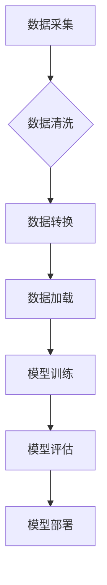

> 大数据，机器学习，深度学习，人工智能，数据挖掘，数据分析，算法，模型

## 1. 背景介绍

人工智能（AI）近年来发展迅速，取得了令人瞩目的成就。从语音识别到图像识别，从自动驾驶到医疗诊断，AI正在深刻地改变着我们的生活。然而，AI的蓬勃发展离不开一个重要的基础：大数据。

大数据是指海量、高速、多样化的数据，其规模、速度和复杂性远远超出了传统数据处理能力。大数据蕴含着丰富的知识和价值，是AI学习和训练的宝贵资源。

## 2. 核心概念与联系

**2.1 大数据特征**

大数据通常具有以下四个特征：

* **海量 (Volume):** 大数据规模庞大，难以用传统方法处理。
* **高速 (Velocity):** 数据生成和更新速度极快，需要实时处理。
* **多样化 (Variety):** 数据类型多样，包括结构化数据、非结构化数据和半结构化数据。
* **价值 (Value):** 大数据蕴含着丰富的价值，需要挖掘和分析。

**2.2 AI与大数据的关联**

AI算法需要大量的数据进行训练和学习，而大数据正是AI发展的基石。

* **数据驱动:** AI模型的性能直接取决于训练数据的质量和数量。大数据提供了海量的数据，可以训练更准确、更智能的AI模型。
* **知识发现:** 大数据分析可以帮助我们发现隐藏在数据中的模式和规律，为AI算法提供更深入的理解和指导。
* **个性化服务:** 大数据可以帮助我们了解用户的需求和偏好，为用户提供个性化的服务和体验。

**2.3 数据处理流程**



## 3. 核心算法原理 & 具体操作步骤

**3.1 算法原理概述**

机器学习算法是一种能够从数据中学习并不断改进的算法。常见的机器学习算法包括：

* **监督学习:** 利用标记数据训练模型，预测未知数据。
* **无监督学习:** 从未标记数据中发现模式和结构。
* **强化学习:** 通过试错学习，获得最大奖励。

**3.2 算法步骤详解**

以监督学习为例，其基本步骤如下：

1. **数据准备:** 收集、清洗和预处理数据。
2. **特征选择:** 选择与目标变量相关的特征。
3. **模型选择:** 选择合适的机器学习算法。
4. **模型训练:** 利用训练数据训练模型参数。
5. **模型评估:** 利用测试数据评估模型性能。
6. **模型部署:** 将训练好的模型部署到实际应用场景中。

**3.3 算法优缺点**

不同的机器学习算法具有不同的优缺点，需要根据具体应用场景选择合适的算法。

**3.4 算法应用领域**

机器学习算法广泛应用于各个领域，例如：

* **图像识别:** 人脸识别、物体检测、图像分类。
* **自然语言处理:** 语音识别、机器翻译、文本摘要。
* **推荐系统:** 商品推荐、内容推荐、用户画像。
* **医疗诊断:** 疾病预测、影像分析、药物研发。

## 4. 数学模型和公式 & 详细讲解 & 举例说明

**4.1 数学模型构建**

机器学习算法通常基于数学模型进行构建。例如，线性回归模型可以表示为：

$$y = w_0 + w_1x_1 + w_2x_2 + ... + w_nx_n + \epsilon$$

其中：

* $y$ 是目标变量。
* $x_1, x_2, ..., x_n$ 是特征变量。
* $w_0, w_1, w_2, ..., w_n$ 是模型参数。
* $\epsilon$ 是误差项。

**4.2 公式推导过程**

机器学习算法的训练过程通常 involves 寻找最优的模型参数，使得模型预测结果与真实值之间的误差最小。常用的优化算法包括梯度下降法、随机梯度下降法等。

**4.3 案例分析与讲解**

以线性回归为例，其目标是找到最优的模型参数 $w_0, w_1, ..., w_n$，使得模型预测结果与真实值之间的误差最小。可以使用梯度下降法迭代更新模型参数，直到达到收敛。

## 5. 项目实践：代码实例和详细解释说明

**5.1 开发环境搭建**

可以使用 Python 语言和相关的机器学习库，例如 scikit-learn、TensorFlow、PyTorch 等，进行机器学习项目开发。

**5.2 源代码详细实现**

```python
from sklearn.linear_model import LinearRegression
from sklearn.model_selection import train_test_split
import numpy as np

# 生成示例数据
X = np.random.rand(100, 2)
y = 2 * X[:, 0] + 3 * X[:, 1] + np.random.randn(100)

# 将数据划分为训练集和测试集
X_train, X_test, y_train, y_test = train_test_split(X, y, test_size=0.2)

# 创建线性回归模型
model = LinearRegression()

# 训练模型
model.fit(X_train, y_train)

# 预测测试集数据
y_pred = model.predict(X_test)

# 评估模型性能
from sklearn.metrics import mean_squared_error
mse = mean_squared_error(y_test, y_pred)
print(f"Mean Squared Error: {mse}")
```

**5.3 代码解读与分析**

这段代码演示了如何使用 scikit-learn 库进行线性回归模型的训练和评估。

* 首先，生成示例数据，并将其划分为训练集和测试集。
* 然后，创建线性回归模型，并使用训练数据进行模型训练。
* 最后，使用训练好的模型预测测试集数据，并评估模型性能。

**5.4 运行结果展示**

运行代码后，会输出模型的均方误差 (MSE) 值，用于评估模型的预测精度。

## 6. 实际应用场景

**6.1 医疗诊断**

* 利用大数据分析患者的病历、影像数据等，辅助医生进行疾病诊断。
* 预测患者的风险，进行早期干预。

**6.2 金融风险管理**

* 分析客户的交易数据、信用记录等，评估客户的信用风险。
* 预测市场风险，进行风险控制。

**6.3 个性化推荐**

* 分析用户的行为数据、偏好数据等，提供个性化的商品推荐、内容推荐等服务。

**6.4 智能交通**

* 利用大数据分析交通流量、路况等信息，优化交通流量，提高交通效率。
* 预警交通事故，提高交通安全。

**6.4 未来应用展望**

随着大数据的不断积累和人工智能技术的不断发展，大数据在各个领域的应用场景将会更加广泛和深入。

## 7. 工具和资源推荐

**7.1 学习资源推荐**

* **书籍:**
    * 《大数据时代》
    * 《机器学习实战》
    * 《深度学习》
* **在线课程:**
    * Coursera
    * edX
    * Udacity

**7.2 开发工具推荐**

* **Python:** 
    * scikit-learn
    * TensorFlow
    * PyTorch
* **Hadoop:** 
    * HDFS
    * MapReduce
* **Spark:** 
    * Spark SQL
    * Spark MLlib

**7.3 相关论文推荐**

* 《机器学习》
* 《深度学习》
* 《大数据分析》

## 8. 总结：未来发展趋势与挑战

**8.1 研究成果总结**

大数据和人工智能技术的快速发展，为各个领域带来了巨大的变革。大数据为AI提供了训练和学习的基石，而AI则进一步挖掘了大数据的价值。

**8.2 未来发展趋势**

* **数据规模和多样性进一步增长:** 未来，数据将更加海量、多样化，需要更加强大的数据处理和分析能力。
* **人工智能算法更加智能化:** 未来，人工智能算法将更加智能化，能够更好地理解和处理复杂数据。
* **边缘计算和云计算的融合:** 未来，边缘计算和云计算将更加融合，实现更加高效的数据处理和分析。

**8.3 面临的挑战**

* **数据隐私和安全:** 大数据处理过程中，需要保障数据隐私和安全。
* **算法偏见:** 算法训练数据可能存在偏见，导致算法输出结果存在偏差。
* **人才短缺:** 大数据和人工智能领域人才短缺，需要加强人才培养和引进。

**8.4 研究展望**

未来，大数据和人工智能领域的研究将更加深入，将更加关注数据隐私和安全、算法公平性和可解释性等问题。


## 9. 附录：常见问题与解答

**9.1 什么是大数据？**

大数据是指海量、高速、多样化的数据，其规模、速度和复杂性远远超出了传统数据处理能力。

**9.2 大数据与人工智能的关系是什么？**

AI算法需要大量的数据进行训练和学习，而大数据正是AI发展的基石。

**9.3 如何学习大数据和人工智能？**

可以学习相关书籍、在线课程、参加培训等。

**9.4 大数据和人工智能有哪些应用场景？**

大数据和人工智能应用场景广泛，例如医疗诊断、金融风险管理、个性化推荐等。


作者：禅与计算机程序设计艺术 / Zen and the Art of Computer Programming 
<end_of_turn>