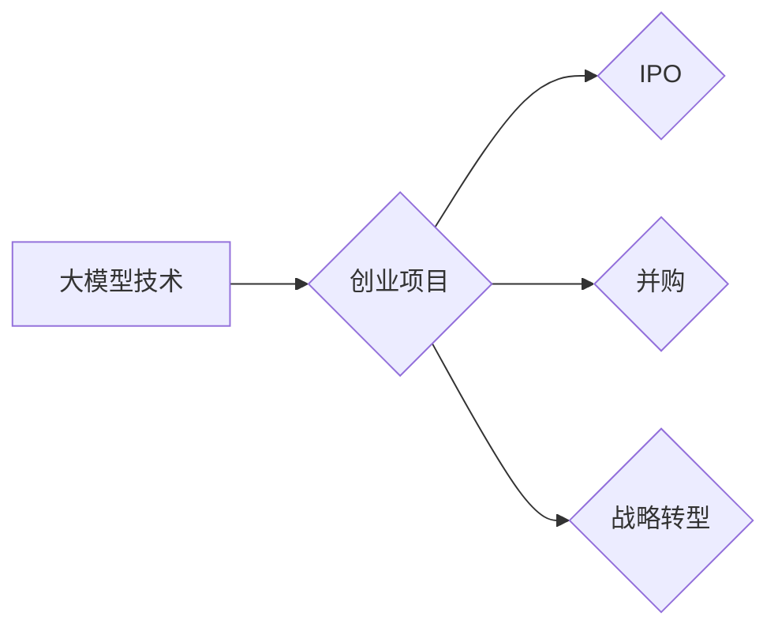

> 大模型、创业、退出策略、IPO、并购、战略转型、人工智能

## 1. 背景介绍

近年来，人工智能（AI）技术蓬勃发展，大模型的涌现更是掀起了科技领域的巨大变革。大模型，是指参数规模庞大、训练数据海量的人工智能模型，具备强大的泛化能力和学习能力，能够在自然语言处理、计算机视觉、语音识别等领域取得突破性进展。

对于创业者而言，大模型技术带来了前所未有的机遇。基于大模型的创新产品和服务层出不穷，涌现出一批以大模型为核心的科技公司。然而，创业之路充满挑战，如何选择合适的退出策略，将创业成果最大化，成为创业者需要认真思考的问题。

本篇文章将深入探讨大模型时代创业者的创业退出策略，包括IPO、并购以及战略转型，并结合实际案例进行分析，为创业者提供参考和借鉴。

## 2. 核心概念与联系

**2.1  大模型**

大模型是指参数规模庞大、训练数据海量的人工智能模型，其核心特征包括：

* **参数规模：** 大模型通常拥有数十亿甚至数千亿个参数，这使得它们能够学习更复杂的模式和关系。
* **训练数据：** 大模型需要海量的数据进行训练，才能获得强大的泛化能力和学习能力。
* **计算资源：** 训练大模型需要大量的计算资源，通常需要使用分布式计算平台。

**2.2  创业退出策略**

创业退出策略是指创业者在创业项目达到一定阶段后，选择退出创业项目的方案。常见的创业退出策略包括：

* **IPO（首次公开募股）：** 将公司上市，向公众发行股票，从而获得巨额资金。
* **并购：** 被其他公司收购，从而获得退出收益。
* **战略转型：** 将公司业务方向进行调整，寻求新的发展机遇。

**2.3  大模型与创业退出策略的联系**

大模型技术为创业者提供了新的机遇和挑战。

* **机遇：** 大模型可以帮助创业者开发出更智能、更具竞争力的产品和服务，从而提高公司的估值和退出价值。
* **挑战：** 大模型的开发和应用需要大量的资金、技术和人才，创业者需要谨慎评估风险，选择合适的退出策略。

**2.4  Mermaid 流程图**



## 3. 核心算法原理 & 具体操作步骤

### 3.1  算法原理概述

大模型的训练主要基于深度学习算法，其中Transformer模型是目前最流行的大模型架构之一。Transformer模型的核心思想是利用注意力机制，能够捕捉文本序列中长距离依赖关系，从而实现更准确的文本理解和生成。

### 3.2  算法步骤详解

大模型的训练过程可以概括为以下步骤：

1. **数据预处理：** 将原始数据进行清洗、格式化和编码，使其能够被模型理解。
2. **模型构建：** 根据具体的任务需求，选择合适的模型架构，并设置模型参数。
3. **模型训练：** 使用训练数据对模型进行训练，调整模型参数，使其能够准确地完成任务。
4. **模型评估：** 使用测试数据对模型进行评估，衡量模型的性能。
5. **模型部署：** 将训练好的模型部署到实际应用场景中。

### 3.3  算法优缺点

**优点：**

* 强大的泛化能力：大模型能够学习到更复杂的模式和关系，从而在新的数据上表现出色。
* 优秀的性能：大模型在自然语言处理、计算机视觉等领域取得了突破性进展。
* 可迁移性强：大模型可以应用于多种不同的任务和领域。

**缺点：**

* 训练成本高：大模型需要大量的计算资源和训练数据，训练成本很高。
*  interpretability 低：大模型的决策过程难以理解，缺乏可解释性。
* 偏见问题：大模型可能存在偏见问题，需要进行针对性的处理。

### 3.4  算法应用领域

大模型的应用领域非常广泛，包括：

* 自然语言处理：机器翻译、文本摘要、问答系统、聊天机器人等。
* 计算机视觉：图像识别、物体检测、图像生成等。
* 语音识别：语音转文本、语音合成等。
* 其他领域：药物研发、金融分析、风险评估等。

## 4. 数学模型和公式 & 详细讲解 & 举例说明

### 4.1  数学模型构建

大模型的训练过程可以看作是一个优化问题，目标是找到最优的模型参数，使得模型在训练数据上的损失函数最小。

损失函数通常是模型预测值与真实值的差值，常用的损失函数包括均方误差（MSE）、交叉熵损失（Cross-Entropy Loss）等。

### 4.2  公式推导过程

假设模型的预测值是 $y_i$，真实值是 $t_i$，则均方误差损失函数可以表示为：

$$
L = \frac{1}{N} \sum_{i=1}^{N} (y_i - t_i)^2
$$

其中，$N$ 是样本数量。

### 4.3  案例分析与讲解

例如，在机器翻译任务中，模型的预测值是翻译后的文本，真实值是参考翻译的文本。可以使用交叉熵损失函数来衡量模型的性能。

交叉熵损失函数可以表示为：

$$
L = -\sum_{i=1}^{N} t_i \log(y_i)
$$

其中，$t_i$ 是真实文本的词语概率分布，$y_i$ 是模型预测的词语概率分布。

## 5. 项目实践：代码实例和详细解释说明

### 5.1  开发环境搭建

大模型的开发通常需要使用Python语言和相关的深度学习框架，例如TensorFlow、PyTorch等。

需要安装Python、深度学习框架以及必要的库，例如NumPy、pandas等。

### 5.2  源代码详细实现

以下是一个使用PyTorch训练简单文本分类模型的代码示例：

```python
import torch
import torch.nn as nn
import torch.optim as optim

# 定义模型
class TextClassifier(nn.Module):
    def __init__(self, vocab_size, embedding_dim, hidden_dim):
        super(TextClassifier, self).__init__()
        self.embedding = nn.Embedding(vocab_size, embedding_dim)
        self.lstm = nn.LSTM(embedding_dim, hidden_dim)
        self.fc = nn.Linear(hidden_dim, 2)  # 2个类别

    def forward(self, x):
        x = self.embedding(x)
        x, _ = self.lstm(x)
        x = x[:, -1, :]  # 取最后一个时间步的输出
        x = self.fc(x)
        return x

# 初始化模型参数
vocab_size = 10000
embedding_dim = 128
hidden_dim = 256
model = TextClassifier(vocab_size, embedding_dim, hidden_dim)

# 定义损失函数和优化器
criterion = nn.CrossEntropyLoss()
optimizer = optim.Adam(model.parameters())

# 训练模型
for epoch in range(10):
    # ... 训练代码 ...
```

### 5.3  代码解读与分析

* 模型定义：代码定义了一个简单的文本分类模型，包含嵌入层、LSTM层和全连接层。
* 训练过程：代码展示了模型训练的基本流程，包括前向传播、损失计算、反向传播和参数更新。

### 5.4  运行结果展示

训练完成后，可以评估模型的性能，例如使用准确率、F1-score等指标。

## 6. 实际应用场景

### 6.1  自然语言处理

大模型在自然语言处理领域有着广泛的应用，例如：

* **机器翻译：** 使用大模型可以实现更高质量的机器翻译，例如Google Translate。
* **文本摘要：** 大模型可以自动生成文本摘要，例如新闻摘要、会议纪要等。
* **问答系统：** 大模型可以构建更智能的问答系统，例如搜索引擎的智能问答功能。

### 6.2  计算机视觉

大模型在计算机视觉领域也取得了突破性进展，例如：

* **图像识别：** 大模型可以识别图像中的物体、场景和人物，例如Google Photos的图像识别功能。
* **物体检测：** 大模型可以检测图像中多个物体的位置和类别，例如自动驾驶汽车的物体检测系统。
* **图像生成：** 大模型可以生成逼真的图像，例如DeepDream、DALL-E等。

### 6.3  语音识别

大模型在语音识别领域也取得了显著进展，例如：

* **语音转文本：** 大模型可以将语音转换为文本，例如语音助手Siri、Google Assistant等。
* **语音合成：** 大模型可以将文本转换为语音，例如语音播报、语音聊天机器人等。

### 6.4  未来应用展望

大模型的应用前景广阔，未来将应用于更多领域，例如：

* **医疗保健：** 大模型可以辅助医生诊断疾病、预测患者风险等。
* **教育：** 大模型可以个性化学习、自动批改作业等。
* **金融：** 大模型可以进行风险评估、欺诈检测等。

## 7. 工具和资源推荐

### 7.1  学习资源推荐

* **书籍：**
    * 《深度学习》
    * 《自然语言处理》
    * 《机器学习》
* **在线课程：**
    * Coursera
    * edX
    * Udacity

### 7.2  开发工具推荐

* **深度学习框架：**
    * TensorFlow
    * PyTorch
    * Keras
* **编程语言：**
    * Python
* **云计算平台：**
    * AWS
    * Google Cloud
    * Azure

### 7.3  相关论文推荐

* **Transformer论文：**
    * Attention Is All You Need
* **BERT论文：**
    * BERT: Pre-training of Deep Bidirectional Transformers for Language Understanding
* **GPT论文：**
    * Generative Pre-trained Transformer

## 8. 总结：未来发展趋势与挑战

### 8.1  研究成果总结

大模型技术取得了显著进展，在自然语言处理、计算机视觉、语音识别等领域取得了突破性进展。大模型的应用场景不断拓展，为各个行业带来了新的机遇。

### 8.2  未来发展趋势

* **模型规模继续扩大：** 未来大模型的规模将继续扩大，参数数量将达到数万亿甚至数千亿。
* **模型效率提升：** 研究者将致力于提高大模型的训练效率和推理效率。
* **多模态大模型：** 未来将出现能够处理多种模态数据的多模态大模型，例如文本、图像、音频等。
* **可解释性增强：** 研究者将致力于提高大模型的可解释性，使其决策过程更加透明。

### 8.3  面临的挑战

* **计算资源需求高：** 训练大模型需要大量的计算资源，成本很高。
* **数据获取困难：** 大模型需要海量的数据进行训练，获取高质量的数据是一个挑战。
* **伦理问题：** 大模型的应用可能带来伦理问题，例如偏见、隐私等。

### 8.4  研究展望

未来，大模型技术将继续发展，为人类社会带来更多福祉。研究者将继续探索大模型的潜力，解决其面临的挑战，推动大模型技术向更安全、更可靠、更可解释的方向发展。

## 9. 附录：常见问题与解答

### 9.1  Q1：大模型的训练成本很高，如何降低成本？

**A1：** 

* 使用更