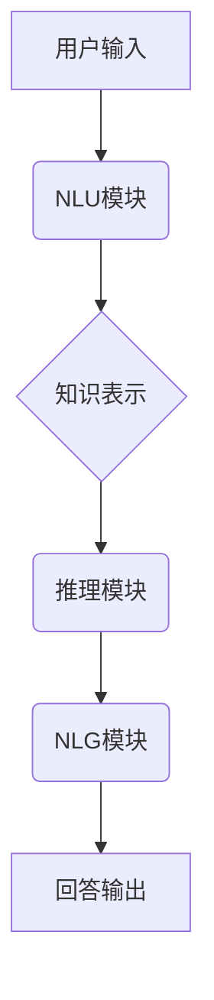

> 大模型、问答机器人、生成能力、自然语言处理、Transformer模型、预训练、微调

## 1. 背景介绍

近年来，深度学习技术取得了飞速发展，特别是Transformer模型的出现，为自然语言处理（NLP）领域带来了革命性的变革。大模型问答机器人作为一种基于深度学习的智能问答系统，凭借其强大的语言理解和生成能力，在客服、教育、搜索等领域展现出巨大的应用潜力。

传统的问答系统主要依赖于规则引擎和知识库，其回答质量受限于规则的精细度和知识库的覆盖范围。而大模型问答机器人则通过学习海量文本数据，掌握了丰富的语言知识和语义理解能力，能够生成更自然、更流畅、更符合语境的回答。

## 2. 核心概念与联系

**2.1 大模型**

大模型是指参数量达到亿级甚至万亿级的深度学习模型。这些模型通过训练海量文本数据，学习了语言的复杂结构和语义关系，具备强大的泛化能力和适应性。

**2.2 问答机器人**

问答机器人是一种能够理解用户问题并生成相应回答的智能系统。它通常由以下几个模块组成：

* **自然语言理解（NLU）模块：**负责解析用户输入的自然语言，提取关键信息和意图。
* **知识表示模块：**将知识存储和组织成可供机器人理解的形式，例如知识图谱或语义网络。
* **推理模块：**根据用户问题和知识库中的信息，进行逻辑推理，找到最合适的答案。
* **自然语言生成（NLG）模块：**将推理结果转化为自然语言，生成流畅、易懂的回答。

**2.3 生成能力**

生成能力是指模型能够根据输入信息生成新内容的能力。对于问答机器人来说，生成能力指的是能够根据用户问题和知识库信息，生成符合语境、逻辑性和准确性的回答。

**2.4 核心概念联系**

大模型问答机器人将大模型的强大生成能力与问答系统的核心模块相结合，实现了更智能、更自然、更精准的回答。



## 3. 核心算法原理 & 具体操作步骤

**3.1 算法原理概述**

大模型问答机器人的核心算法主要基于Transformer模型，它是一种基于注意力机制的深度学习模型，能够有效地捕捉文本中的长距离依赖关系。

**3.2 算法步骤详解**

1. **预训练:** 大模型在海量文本数据上进行预训练，学习语言的语法、语义和上下文关系。
2. **微调:** 将预训练模型微调到特定任务，例如问答。微调过程通常使用问答数据集，通过调整模型参数，使其能够更好地理解问题和生成答案。
3. **编码:** 将用户问题和候选答案分别编码成向量表示，以便模型进行比较和匹配。
4. **注意力机制:** 利用注意力机制，模型可以重点关注问题和答案中与答案相关的关键信息，提高回答的准确性和相关性。
5. **解码:** 根据编码后的向量表示，模型生成最终的答案。

**3.3 算法优缺点**

**优点:**

* 强大的语言理解和生成能力
* 能够处理复杂的问题和长文本
* 泛化能力强，可以应用于多种问答场景

**缺点:**

* 训练成本高，需要大量计算资源和数据
* 容易受到训练数据质量的影响
* 回答可能存在偏差或错误

**3.4 算法应用领域**

* 客服机器人
* 教育机器人
* 搜索引擎
* 虚拟助手
* 医疗诊断

## 4. 数学模型和公式 & 详细讲解 & 举例说明

**4.1 数学模型构建**

大模型问答机器人的数学模型通常基于Transformer架构，其核心是注意力机制。注意力机制可以理解为一种加权机制，它可以根据输入序列中不同元素之间的相关性，赋予不同的权重，从而突出重要信息。

**4.2 公式推导过程**

注意力机制的计算公式如下：

$$
Attention(Q, K, V) = softmax(\frac{QK^T}{\sqrt{d_k}})V
$$

其中：

* $Q$：查询矩阵
* $K$：键矩阵
* $V$：值矩阵
* $d_k$：键向量的维度
* $softmax$：softmax函数，用于归一化权重

**4.3 案例分析与讲解**

假设我们有一个句子“我爱吃苹果”，我们要计算“吃”这个词与整个句子的注意力权重。

1. 将句子编码成词向量，得到$Q$, $K$, $V$矩阵。
2. 计算$QK^T$，得到一个矩阵，每个元素代表两个词之间的相关性。
3. 对$QK^T$进行归一化，得到注意力权重矩阵。
4. 将注意力权重矩阵与$V$矩阵相乘，得到最终的注意力输出，代表“吃”这个词与整个句子的相关性。

## 5. 项目实践：代码实例和详细解释说明

**5.1 开发环境搭建**

* Python 3.7+
* PyTorch 或 TensorFlow
* CUDA 和 cuDNN

**5.2 源代码详细实现**

```python
import torch
import torch.nn as nn

class Attention(nn.Module):
    def __init__(self, d_model, num_heads):
        super(Attention, self).__init__()
        self.d_model = d_model
        self.num_heads = num_heads
        self.head_dim = d_model // num_heads

        self.query = nn.Linear(d_model, d_model)
        self.key = nn.Linear(d_model, d_model)
        self.value = nn.Linear(d_model, d_model)
        self.fc_out = nn.Linear(d_model, d_model)

    def forward(self, query, key, value, mask=None):
        batch_size = query.size(0)

        # Linear projections
        Q = self.query(query).view(batch_size, -1, self.num_heads, self.head_dim).transpose(1, 2)
        K = self.key(key).view(batch_size, -1, self.num_heads, self.head_dim).transpose(1, 2)
        V = self.value(value).view(batch_size, -1, self.num_heads, self.head_dim).transpose(1, 2)

        # Scaled dot-product attention
        scores = torch.matmul(Q, K.transpose(-2, -1)) / torch.sqrt(torch.tensor(self.head_dim, dtype=torch.float))

        if mask is not None:
            scores = scores.masked_fill(mask == 0, -1e9)

        attention_weights = torch.softmax(scores, dim=-1)

        # Weighted sum of values
        context = torch.matmul(attention_weights, V)

        # Concatenate heads and project
        context = context.transpose(1, 2).contiguous().view(batch_size, -1, self.d_model)
        output = self.fc_out(context)

        return output, attention_weights
```

**5.3 代码解读与分析**

这段代码实现了Transformer模型中的注意力机制。

* `Attention`类定义了注意力机制的结构，包括查询、键、值线性变换层以及最终的输出层。
* `forward`方法计算注意力权重和上下文向量。
* `scores`计算查询向量与键向量的点积，并进行归一化。
* `attention_weights`使用softmax函数将点积结果转换为注意力权重。
* `context`计算注意力权重与值向量的加权和，得到上下文向量。

**5.4 运行结果展示**

运行这段代码可以得到注意力权重矩阵和上下文向量，这些结果可以用于分析模型对输入序列的理解和关注点。

## 6. 实际应用场景

**6.1 客服机器人**

大模型问答机器人可以用于构建智能客服机器人，自动回答用户常见问题，例如订单查询、退换货流程等，提高客服效率和用户体验。

**6.2 教育机器人**

大模型问答机器人可以用于教育领域，例如提供个性化学习辅导、解答学生疑问、生成学习材料等，帮助学生更好地理解知识。

**6.3 搜索引擎**

大模型问答机器人可以用于搜索引擎，例如理解用户搜索意图，生成更精准的搜索结果，提高搜索效率。

**6.4 虚拟助手**

大模型问答机器人可以用于构建虚拟助手，例如帮助用户安排日程、发送邮件、控制智能家居设备等，提高生活效率。

**6.5 医疗诊断**

大模型问答机器人可以用于辅助医疗诊断，例如根据患者症状和病史，生成可能的诊断结果，帮助医生做出更准确的判断。

**6.6 未来应用展望**

随着大模型技术的不断发展，大模型问答机器人的应用场景将更加广泛，例如：

* **个性化推荐:** 根据用户的兴趣和偏好，推荐书籍、电影、音乐等内容。
* **创意写作:** 帮助用户生成故事、诗歌、剧本等创意内容。
* **跨语言交流:** 实现不同语言之间的实时翻译和交流。
* **智能决策支持:** 为企业和个人提供数据分析和决策建议。

## 7. 工具和资源推荐

**7.1 学习资源推荐**

* **书籍:**
    * 《深度学习》
    * 《自然语言处理》
    * 《Transformer模型详解》
* **在线课程:**
    * Coursera: 深度学习
    * Udacity: 自然语言处理
    * fast.ai: 深度学习

**7.2 开发工具推荐**

* **PyTorch:** 深度学习框架
* **TensorFlow:** 深度学习框架
* **HuggingFace Transformers:** 预训练模型库

**7.3 相关论文推荐**

* 《Attention Is All You Need》
* 《BERT: Pre-training of Deep Bidirectional Transformers for Language Understanding》
* 《GPT-3: Language Models are Few-Shot Learners》

## 8. 总结：未来发展趋势与挑战

**8.1 研究成果总结**

大模型问答机器人取得了显著的进展，其语言理解和生成能力不断提升，应用场景也越来越广泛。

**8.2 未来发展趋势**

* **模型规模和能力的进一步提升:** 预计未来大模型规模将继续扩大，模型能力将进一步增强，能够处理更复杂的任务。
* **多模态问答:** 将文本、图像、音频等多模态信息融合到问答系统中，实现更全面的理解和回答。
* **个性化问答:** 根据用户的个性化需求和偏好，生成更精准、更符合用户期望的回答。
* **可解释性增强:** 提高模型的透明度和可解释性，帮助用户理解模型的决策过程。

**8.3 面临的挑战**

* **数据获取和标注:** 大模型训练需要海量高质量数据，数据获取和标注成本较高。
* **模型训练和部署成本:** 大模型训练和部署需要大量的计算资源和存储空间，成本较高。
* **伦理和安全问题:** 大模型问答机器人可能存在偏见、误导和攻击等问题，需要加强伦理和安全方面的研究和监管。

**8.4 研究展望**

未来，大模型问答机器人将继续朝着更智能、更安全、更可解释的方向发展，为人类社会带来更多价值。


## 9. 附录：常见问题与解答

**9.1 如何选择合适的预训练模型？**

选择预训练模型需要根据具体任务和数据特点进行选择。例如，对于问答任务，可以选择BERT、RoBERTa等预训练语言模型。

**9.2 如何进行模型微调？**

模型微调需要使用