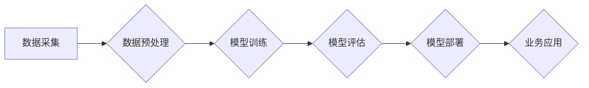

> 大模型、深度学习、自然语言处理、计算机视觉、商业应用、人工智能

## 1. 背景介绍

近年来，人工智能（AI）技术取得了飞速发展，其中大模型作为AI领域的重要突破口，展现出强大的学习和推理能力，在自然语言处理、计算机视觉、语音识别等领域取得了令人瞩目的成就。大模型的出现，标志着人工智能进入了一个新的时代，其商业应用潜力也逐渐被人们所认识和重视。

大模型是指参数规模庞大、训练数据海量的人工智能模型。与传统机器学习模型相比，大模型拥有更强的泛化能力和表达能力，能够处理更复杂的任务，并生成更精细的结果。例如，GPT-3、BERT、DALL-E等大模型在文本生成、机器翻译、图像识别等领域都取得了突破性的进展。

大模型的商业应用前景广阔，涵盖各个行业和领域。从智能客服、个性化推荐到自动写作、药物研发，大模型都能够为企业带来巨大的价值。

## 2. 核心概念与联系

大模型的训练和应用基于深度学习技术，其核心概念包括：

* **神经网络:** 大模型的核心结构是多层神经网络，通过模仿人类大脑的神经元结构和连接方式，学习数据中的模式和规律。
* **深度学习:** 深度学习是指使用多层神经网络进行训练，通过不断学习和迭代，使模型的性能不断提升。
* **迁移学习:** 迁移学习是指将预训练好的大模型应用于新的任务，通过微调模型参数，快速适应新的数据和任务。
* **数据驱动:** 大模型的训练和性能依赖于海量数据的支持，数据质量和数量直接影响模型的最终效果。

**大模型架构流程图:**

## 3. 核心算法原理 & 具体操作步骤

### 3.1  算法原理概述

大模型的训练主要基于反向传播算法，其原理是通过计算模型输出与真实值的误差，并反向传播误差信号，调整模型参数，最终使模型输出与真实值尽可能接近。

### 3.2  算法步骤详解

1. **数据准备:** 收集和预处理训练数据，包括文本、图像、音频等多种类型的数据。
2. **模型构建:** 根据任务需求选择合适的模型架构，例如Transformer、CNN、RNN等。
3. **模型训练:** 使用反向传播算法训练模型，通过不断调整模型参数，使模型输出与真实值之间的误差最小化。
4. **模型评估:** 使用测试数据评估模型的性能，例如准确率、召回率、F1-score等指标。
5. **模型部署:** 将训练好的模型部署到生产环境中，用于实际应用。

### 3.3  算法优缺点

**优点:**

* 强大的学习能力：大模型能够学习数据中的复杂模式和规律，并生成更精细的结果。
* 泛化能力强：大模型在新的数据和任务上表现良好，能够适应不同的场景。
* 可迁移性高：预训练好的大模型可以迁移到新的任务，降低训练成本和时间。

**缺点:**

* 训练成本高：大模型的训练需要大量的计算资源和时间。
* 数据依赖性强：大模型的性能依赖于海量数据的支持，数据质量和数量直接影响模型效果。
* 可解释性差：大模型的决策过程复杂，难以解释模型的输出结果。

### 3.4  算法应用领域

大模型在各个领域都有广泛的应用，例如：

* **自然语言处理:** 文本生成、机器翻译、问答系统、情感分析等。
* **计算机视觉:** 图像识别、物体检测、图像分割、视频分析等。
* **语音识别:** 语音转文本、语音合成、语音助手等。
* **推荐系统:** 商品推荐、内容推荐、用户画像等。
* **药物研发:** 药物发现、药物设计、药物安全性评估等。

## 4. 数学模型和公式 & 详细讲解 & 举例说明

### 4.1  数学模型构建

大模型的训练基于深度学习，其核心数学模型是神经网络。神经网络由多个层组成，每一层包含多个神经元。神经元之间通过连接权重进行信息传递。

**神经网络模型:**

$$
y = f(W_1x_1 + b_1)
$$

其中：

* $y$ 是模型输出
* $x_1$ 是输入数据
* $W_1$ 是连接权重
* $b_1$ 是偏置项
* $f$ 是激活函数

### 4.2  公式推导过程

反向传播算法的核心是通过计算梯度来更新模型参数。梯度表示模型输出对模型参数的敏感度。

**梯度公式:**

$$
\frac{\partial L}{\partial W} = \frac{\partial L}{\partial y} \cdot \frac{\partial y}{\partial W}
$$

其中：

* $L$ 是损失函数
* $W$ 是模型参数

### 4.3  案例分析与讲解

例如，在文本生成任务中，可以使用GPT-3等大模型进行训练。训练过程的目标是使模型生成的文本与真实文本尽可能相似。损失函数可以是交叉熵损失函数，用于衡量模型输出与真实文本之间的差异。

## 5. 项目实践：代码实例和详细解释说明

### 5.1  开发环境搭建

使用Python语言和相关的深度学习框架，例如TensorFlow、PyTorch等，搭建开发环境。

### 5.2  源代码详细实现

使用代码实现大模型的训练和应用，例如使用预训练好的BERT模型进行文本分类任务。

### 5.3  代码解读与分析

详细解释代码的逻辑和功能，包括模型架构、数据处理、训练过程、评估指标等。

### 5.4  运行结果展示

展示模型的训练结果和应用效果，例如文本分类的准确率、图像识别的精度等。

## 6. 实际应用场景

### 6.1  智能客服

大模型可以用于构建智能客服系统，自动回答用户的问题，提供24小时不间断的客户服务。

### 6.2  个性化推荐

大模型可以分析用户的行为数据和偏好，提供个性化的商品、内容和服务推荐。

### 6.3  自动写作

大模型可以辅助人类进行写作，例如生成新闻稿、撰写邮件、创作小说等。

### 6.4  未来应用展望

大模型的应用场景还在不断扩展，未来将应用于更多领域，例如医疗诊断、金融风险评估、教育教学等。

## 7. 工具和资源推荐

### 7.1  学习资源推荐

* **书籍:** 《深度学习》、《自然语言处理》
* **在线课程:** Coursera、edX、Udacity等平台提供深度学习和自然语言处理课程。
* **开源项目:** TensorFlow、PyTorch、HuggingFace等开源项目提供大模型的代码和模型。

### 7.2  开发工具推荐

* **编程语言:** Python
* **深度学习框架:** TensorFlow、PyTorch
* **云计算平台:** AWS、Azure、Google Cloud等平台提供大模型训练和部署服务。

### 7.3  相关论文推荐

* **Attention Is All You Need:** https://arxiv.org/abs/1706.03762
* **BERT: Pre-training of Deep Bidirectional Transformers for Language Understanding:** https://arxiv.org/abs/1810.04805

## 8. 总结：未来发展趋势与挑战

### 8.1  研究成果总结

大模型在人工智能领域取得了突破性的进展，展现出强大的学习和推理能力，为商业应用提供了无限可能。

### 8.2  未来发展趋势

* **模型规模进一步扩大:** 随着计算资源的提升，大模型的规模将继续扩大，模型能力将进一步提升。
* **多模态学习:** 大模型将融合文本、图像、音频等多种模态数据，实现更全面的理解和生成。
* **可解释性增强:** 研究人员将致力于提高大模型的可解释性，使模型的决策过程更加透明和可理解。

### 8.3  面临的挑战

* **训练成本高:** 大模型的训练需要大量的计算资源和时间，成本较高。
* **数据安全和隐私:** 大模型的训练依赖于海量数据，数据安全和隐私保护是一个重要挑战。
* **伦理问题:** 大模型的应用可能带来伦理问题，例如算法偏见、信息操纵等，需要引起重视和解决。

### 8.4  研究展望

未来，大模型研究将继续深入，探索更强大的模型架构、更有效的训练方法和更广泛的应用场景，为人类社会带来更多福祉。

## 9. 附录：常见问题与解答

* **什么是大模型？** 大模型是指参数规模庞大、训练数据海量的人工智能模型。
* **大模型的训练成本高吗？** 是的，大模型的训练需要大量的计算资源和时间，成本较高。
* **大模型的应用场景有哪些？** 大模型在各个领域都有广泛的应用，例如自然语言处理、计算机视觉、语音识别等。
* **大模型的可解释性如何？** 大模型的决策过程复杂，难以解释模型的输出结果。

作者：禅与计算机程序设计艺术 / Zen and the Art of Computer Programming

<end_of_turn>