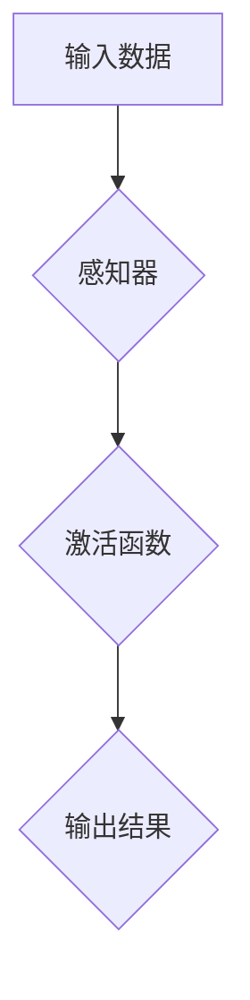

> 人工智能，神经网络，大脑，复杂系统，机器学习，深度学习

## 1. 背景介绍

人类大脑是已知宇宙中最复杂的物体，其结构和功能至今仍未完全被理解。它包含数十亿个神经元，这些神经元通过数万亿个突触相互连接，形成一个极其复杂的网络。这个网络能够处理海量信息，执行各种高级认知功能，例如学习、记忆、语言理解、决策和创造力。

近年来，人工智能（AI）领域取得了长足的进步，特别是深度学习技术的突破，使得机器能够模拟大脑的部分功能，例如图像识别、语音识别和自然语言处理。然而，与人类大脑相比，目前的AI系统仍然十分有限，其智能水平远未达到人类水平。

## 2. 核心概念与联系

### 2.1 人工神经网络

人工神经网络（ANN）是模拟大脑结构和功能的一种计算模型。它由人工神经元组成，这些神经元按照一定的规则连接在一起，形成一个网络结构。每个神经元接收来自其他神经元的输入信号，并根据这些信号进行处理，输出到其他神经元。

### 2.2 神经网络架构

神经网络的架构是指神经元之间的连接方式和组织结构。常见的网络架构包括：

* **感知器:** 最简单的网络架构，只有一个隐含层。
* **多层感知器 (MLP):** 具有多个隐含层的网络架构，能够学习更复杂的函数关系。
* **卷积神经网络 (CNN):** 特别适用于图像处理任务，能够自动学习图像特征。
* **循环神经网络 (RNN):** 能够处理序列数据，例如文本和语音。

### 2.3 激活函数

激活函数是神经网络中一个重要的组成部分，它决定了神经元的输出信号。常见的激活函数包括：

* **Sigmoid函数:** 将输入信号压缩到0到1之间。
* **ReLU函数:** 将负输入信号压缩为0，正输入信号保持不变。
* **tanh函数:** 将输入信号压缩到-1到1之间。

### 2.4 损失函数

损失函数用于衡量神经网络的预测结果与真实值的差异。常见的损失函数包括：

* **均方误差 (MSE):** 计算预测值与真实值之间的平方差。
* **交叉熵损失 (Cross-Entropy Loss):** 用于分类任务，计算预测概率分布与真实概率分布之间的差异。

### 2.5 优化算法

优化算法用于调整神经网络的参数，以最小化损失函数的值。常见的优化算法包括：

* **梯度下降 (Gradient Descent):** 根据损失函数的梯度方向更新参数。
* **Adam优化器:** 结合了动量和自适应学习率的优化算法。

**Mermaid 流程图**



## 3. 核心算法原理 & 具体操作步骤

### 3.1 算法原理概述

深度学习算法的核心原理是通过多层神经网络学习数据中的复杂特征表示。

* **特征提取:** 每层神经网络都学习提取数据的不同层次特征。
* **层次化表示:** 通过多层神经网络的叠加，最终学习到数据的抽象和高级特征表示。
* **参数学习:** 通过优化算法，调整神经网络的参数，使得网络能够准确地预测输出结果。

### 3.2 算法步骤详解

1. **数据预处理:** 将原始数据进行清洗、转换和归一化，使其适合深度学习模型的训练。
2. **网络结构设计:** 根据任务需求，选择合适的网络架构和参数设置。
3. **模型训练:** 使用训练数据训练神经网络模型，通过优化算法调整模型参数，使得模型能够准确地预测输出结果。
4. **模型评估:** 使用测试数据评估模型的性能，例如准确率、召回率和F1-score。
5. **模型调优:** 根据评估结果，调整模型参数和网络结构，以提高模型性能。
6. **模型部署:** 将训练好的模型部署到实际应用场景中，用于预测和决策。

### 3.3 算法优缺点

**优点:**

* 能够学习复杂数据中的非线性关系。
* 能够自动提取特征，无需人工特征工程。
* 性能优于传统机器学习算法。

**缺点:**

* 训练数据量要求高。
* 计算资源消耗大。
* 模型解释性差。

### 3.4 算法应用领域

深度学习算法广泛应用于各个领域，例如：

* **计算机视觉:** 图像识别、物体检测、图像分割、人脸识别。
* **自然语言处理:** 文本分类、情感分析、机器翻译、对话系统。
* **语音识别:** 语音转文本、语音搜索。
* **医疗诊断:** 病理图像分析、疾病预测。
* **金融预测:** 股票价格预测、欺诈检测。

## 4. 数学模型和公式 & 详细讲解 & 举例说明

### 4.1 数学模型构建

深度学习模型可以看作是一个复杂的函数映射，将输入数据映射到输出结果。

**输入数据:**  x = (x1, x2, ..., xn)

**输出结果:** y = f(x; W)

其中，f(x; W) 是神经网络的激活函数，W 是神经网络的参数。

### 4.2 公式推导过程

神经网络的输出结果可以通过以下公式计算:

$$
y = f(z)
$$

$$
z = W^T * x + b
$$

其中，

* y 是输出结果
* z 是神经元的激活值
* W 是权重矩阵
* x 是输入数据
* b 是偏置项

### 4.3 案例分析与讲解

**举例说明:**

假设我们有一个简单的感知器，输入数据为 x = (x1, x2)，权重矩阵为 W = [[w11, w12], [w21, w22]], 偏置项为 b = (b1, b2)。

则神经元的激活值为:

$$
z = W^T * x + b = \begin{bmatrix} w11 & w12 \end{bmatrix} * \begin{bmatrix} x1 \\ x2 \end{bmatrix} + \begin{bmatrix} b1 \\ b2 \end{bmatrix} = w11x1 + w12x2 + b1
$$

如果激活函数为 sigmoid 函数，则输出结果为:

$$
y = \frac{1}{1 + e^{-z}}
$$

## 5. 项目实践：代码实例和详细解释说明

### 5.1 开发环境搭建

* Python 3.x
* TensorFlow 或 PyTorch 深度学习框架
* Jupyter Notebook 或 VS Code 开发环境

### 5.2 源代码详细实现

```python
import tensorflow as tf

# 定义模型结构
model = tf.keras.models.Sequential([
    tf.keras.layers.Dense(128, activation='relu', input_shape=(784,)),
    tf.keras.layers.Dense(10, activation='softmax')
])

# 编译模型
model.compile(optimizer='adam',
              loss='sparse_categorical_crossentropy',
              metrics=['accuracy'])

# 训练模型
model.fit(x_train, y_train, epochs=10)

# 评估模型
loss, accuracy = model.evaluate(x_test, y_test)
print('Test loss:', loss)
print('Test accuracy:', accuracy)
```

### 5.3 代码解读与分析

* **模型结构:** 定义了一个简单的多层感知器，包含两层全连接层。第一层有 128 个神经元，使用 ReLU 激活函数。第二层有 10 个神经元，使用 softmax 激活函数，用于分类任务。
* **模型编译:** 使用 Adam 优化器，交叉熵损失函数，并设置精度作为评估指标。
* **模型训练:** 使用训练数据训练模型，训练 10 个 epochs。
* **模型评估:** 使用测试数据评估模型的性能，输出测试损失和精度。

### 5.4 运行结果展示

运行代码后，会输出测试损失和精度值。

## 6. 实际应用场景

深度学习算法在各个领域都有广泛的应用场景，例如：

* **医疗诊断:** 利用深度学习算法分析医学图像，辅助医生诊断疾病。
* **金融预测:** 利用深度学习算法预测股票价格、识别欺诈交易。
* **自动驾驶:** 利用深度学习算法实现车辆的感知、决策和控制。
* **个性化推荐:** 利用深度学习算法分析用户行为，推荐个性化商品和服务。

### 6.4 未来应用展望

随着深度学习算法的不断发展，未来将有更多新的应用场景出现，例如：

* **通用人工智能:** 开发能够像人类一样思考和学习的通用人工智能。
* **科学发现:** 利用深度学习算法加速科学研究，例如药物研发和材料科学。
* **社会治理:** 利用深度学习算法提高社会治理效率，例如智能交通和城市管理。

## 7. 工具和资源推荐

### 7.1 学习资源推荐

* **书籍:**
    * 深度学习 (Deep Learning) - Ian Goodfellow, Yoshua Bengio, Aaron Courville
    * 构建深度学习模型 (Hands-On Machine Learning with Scikit-Learn, Keras & TensorFlow) - Aurélien Géron
* **在线课程:**
    * 深度学习 Specialization - Andrew Ng (Coursera)
    * fast.ai - Practical Deep Learning for Coders
* **博客和网站:**
    * TensorFlow Blog
    * PyTorch Blog
    * Towards Data Science

### 7.2 开发工具推荐

* **深度学习框架:** TensorFlow, PyTorch, Keras
* **数据处理工具:** Pandas, NumPy
* **可视化工具:** Matplotlib, Seaborn

### 7.3 相关论文推荐

* **ImageNet Classification with Deep Convolutional Neural Networks** - Alex Krizhevsky, Ilya Sutskever, Geoffrey E. Hinton
* **Sequence to Sequence Learning with Neural Networks** - Ilya Sutskever, Oriol Vinyals, Quoc V. Le
* **Attention Is All You Need** - Ashish Vaswani, Noam Shazeer, Niki Parmar, Jakob Uszkoreit, Llion Jones, Aidan N. Gomez, Łukasz Kaiser, Illia Polosukhin

## 8. 总结：未来发展趋势与挑战

### 8.1 研究成果总结

深度学习算法取得了长足的进步，在各个领域都取得了显著的成果。

### 8.2 未来发展趋势

* **模型规模和复杂度:** 模型规模和复杂度将继续增加，例如 Transformer 模型的规模不断扩大。
* **数据效率:** 研究更有效的训练方法，降低对训练数据量的依赖。
* **可解释性:** 研究更可解释的深度学习模型，提高模型的透明度和可信度。
* **安全性和鲁棒性:** 研究更安全和鲁棒的深度学习模型，防止模型受到攻击和误用。

### 8.3 面临的挑战

* **计算资源:** 训练大型深度学习模型需要大量的计算资源，这对于资源有限的机构和个人来说是一个挑战。
* **数据获取和标注:** 训练深度学习模型需要大量的标注数据，数据获取和标注成本较高。
* **模型解释性:** 深度学习模型的决策过程十分复杂，难以解释模型的决策结果，这对于一些敏感领域来说是一个挑战。

### 8.4 研究展望

未来，深度学习研究将继续朝着更强大、更智能、更安全的方向发展。


## 9. 附录：常见问题与解答

**常见问题:**

* **什么是深度学习？**

深度学习是一种机器学习的子领域，它使用多层神经网络来学习数据中的复杂特征表示。

* **深度学习算法有哪些？**

常见的深度学习算法包括卷积神经网络 (CNN)、循环神经网络 (RNN)、生成对抗网络 (GAN) 等。

* **深度学习算法的应用场景有哪些？**

深度学习算法广泛应用于各个领域，例如计算机视觉、自然语言处理、语音识别、医疗诊断等。

* **如何学习深度学习？**

可以通过阅读书籍、在线课程、博客和网站等方式学习深度