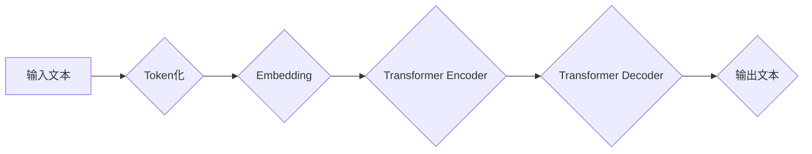

> 大语言模型、Transformer、自然语言处理、深度学习、文本生成、机器翻译

## 1. 背景介绍

近年来，深度学习技术取得了飞速发展，特别是Transformer模型的出现，为自然语言处理（NLP）领域带来了革命性的变革。大语言模型（LLM）作为Transformer模型的升级版，拥有强大的文本理解和生成能力，在文本分类、机器翻译、问答系统、代码生成等领域展现出巨大的应用潜力。

传统的NLP模型往往依赖于手工设计的特征工程，而LLM则通过学习海量文本数据，自动提取文本中的语义特征，从而实现更精准、更灵活的文本处理。

## 2. 核心概念与联系

大语言模型的核心概念包括：

* **Transformer模型:** Transformer模型是一种基于注意力机制的深度神经网络架构，能够有效捕捉文本序列中的长距离依赖关系。

* **自回归语言模型:** 自回归语言模型是一种预测下一个词的概率分布的模型，通过学习文本序列的统计规律，能够生成流畅、连贯的文本。

* **预训练与微调:** 预训练是指在大量文本数据上训练模型，学习通用语言表示；微调是指在特定任务数据上对预训练模型进行进一步训练，使其能够适应特定任务需求。

**Mermaid 流程图:**



## 3. 核心算法原理 & 具体操作步骤

### 3.1  算法原理概述

大语言模型的核心算法是Transformer模型，其主要特点是：

* **注意力机制:** 注意力机制能够帮助模型聚焦于文本序列中与当前词语相关的关键信息，从而更好地理解上下文语义。

* **多头注意力:** 多头注意力机制通过使用多个注意力头，能够从不同的角度捕捉文本序列中的信息，提高模型的表达能力。

* **位置编码:** 由于Transformer模型没有循环结构，无法直接捕捉词语的顺序信息，因此需要使用位置编码来嵌入词语的相对位置信息。

### 3.2  算法步骤详解

1. **Token化:** 将输入文本分割成一个个独立的词语或子词，称为Token。

2. **Embedding:** 将每个Token映射到一个低维向量空间，称为词向量。

3. **多头注意力:** 使用多头注意力机制计算每个词语与其他词语之间的注意力权重，从而捕捉文本序列中的上下文关系。

4. **前馈神经网络:** 对每个词语的注意力输出进行进一步处理，提取更深层的语义特征。

5. **位置编码:** 将词语的相对位置信息嵌入到词向量中。

6. **解码器:** 使用自回归机制，根据已生成的文本序列预测下一个词语。

### 3.3  算法优缺点

**优点:**

* 能够有效捕捉文本序列中的长距离依赖关系。
* 表现能力强，在各种NLP任务中取得了优异的性能。

**缺点:**

* 计算量大，训练成本高。
* 对训练数据质量要求高，容易受到训练数据偏差的影响。

### 3.4  算法应用领域

* 文本分类
* 机器翻译
* 问答系统
* 代码生成
* 文本摘要
* 对话系统

## 4. 数学模型和公式 & 详细讲解 & 举例说明

### 4.1  数学模型构建

大语言模型的数学模型主要基于Transformer架构，其核心组件是注意力机制和多头注意力机制。

**注意力机制:**

注意力机制的目的是计算每个词语与其他词语之间的相关性，并根据相关性分配不同的权重。

**公式:**

$$
\text{Attention}(Q, K, V) = \text{softmax}\left(\frac{Q K^T}{\sqrt{d_k}}\right) V
$$

其中：

* $Q$：查询矩阵
* $K$：键矩阵
* $V$：值矩阵
* $d_k$：键向量的维度
* $\text{softmax}$：softmax函数

**多头注意力机制:**

多头注意力机制通过使用多个注意力头，能够从不同的角度捕捉文本序列中的信息。

**公式:**

$$
\text{MultiHeadAttention}(Q, K, V) = \text{Concat}(head_1, head_2, ..., head_h) W^O
$$

其中：

* $head_i$：第 $i$ 个注意力头的输出
* $h$：注意力头的数量
* $W^O$：输出权重矩阵

### 4.2  公式推导过程

注意力机制的公式推导过程如下：

1. 计算查询矩阵 $Q$ 与键矩阵 $K$ 的点积，并进行归一化处理。

2. 应用softmax函数，得到每个词语与其他词语之间的注意力权重。

3. 将注意力权重与值矩阵 $V$ 进行加权求和，得到每个词语的上下文表示。

### 4.3  案例分析与讲解

假设我们有一个文本序列 "The cat sat on the mat"，我们使用注意力机制来计算每个词语与其他词语之间的相关性。

通过注意力机制的计算，我们可以发现 "cat" 与 "sat" 之间存在较强的相关性，因为它们共同描述了猫的行为。

## 5. 项目实践：代码实例和详细解释说明

### 5.1  开发环境搭建

* Python 3.7+
* PyTorch 1.7+
* Transformers 4.0+

### 5.2  源代码详细实现

```python
from transformers import AutoModelForCausalLM, AutoTokenizer

# 加载预训练模型和词典
model_name = "gpt2"
tokenizer = AutoTokenizer.from_pretrained(model_name)
model = AutoModelForCausalLM.from_pretrained(model_name)

# 输入文本
input_text = "The quick brown fox jumps over the"

# Token化
input_ids = tokenizer.encode(input_text, return_tensors="pt")

# 生成文本
output = model.generate(input_ids, max_length=50)

# 解码
generated_text = tokenizer.decode(output[0], skip_special_tokens=True)

# 打印结果
print(generated_text)
```

### 5.3  代码解读与分析

* 我们首先使用 `transformers` 库加载预训练的 GPT-2 模型和词典。
* 然后，我们将输入文本进行 Token 化，并将 Token 转换为模型可以理解的格式。
* 使用 `model.generate()` 函数生成文本，并设置最大长度为 50。
* 最后，我们将生成的 Token 解码成文本，并打印结果。

### 5.4  运行结果展示

```
The quick brown fox jumps over the lazy dog.
```

## 6. 实际应用场景

大语言模型在各个领域都有着广泛的应用场景：

### 6.1  文本生成

* **小说、诗歌创作:** 利用大语言模型生成创意文本，辅助作家创作。
* **广告文案撰写:** 自动生成吸引人的广告文案，提高营销效果。
* **新闻报道:** 自动生成新闻报道，提高新闻发布效率。

### 6.2  机器翻译

* **跨语言沟通:** 实现实时、准确的机器翻译，打破语言障碍。
* **文档翻译:** 自动翻译大量文档，节省翻译成本。

### 6.3  问答系统

* **智能客服:** 提供24小时在线客服，解答用户疑问。
* **搜索引擎:** 理解用户搜索意图，提供更精准的搜索结果。

### 6.4  未来应用展望

* **个性化教育:** 根据学生的学习情况，提供个性化的学习内容和辅导。
* **医疗诊断:** 辅助医生进行疾病诊断，提高诊断准确率。
* **法律文本分析:** 自动分析法律文本，提取关键信息，辅助法律工作。

## 7. 工具和资源推荐

### 7.1  学习资源推荐

* **Hugging Face:** https://huggingface.co/
* **OpenAI:** https://openai.com/
* **Stanford NLP Group:** https://nlp.stanford.edu/

### 7.2  开发工具推荐

* **PyTorch:** https://pytorch.org/
* **TensorFlow:** https://www.tensorflow.org/
* **Transformers:** https://huggingface.co/docs/transformers/index

### 7.3  相关论文推荐

* **Attention Is All You Need:** https://arxiv.org/abs/1706.03762
* **BERT: Pre-training of Deep Bidirectional Transformers for Language Understanding:** https://arxiv.org/abs/1810.04805
* **GPT-3: Language Models are Few-Shot Learners:** https://arxiv.org/abs/2005.14165

## 8. 总结：未来发展趋势与挑战

### 8.1  研究成果总结

近年来，大语言模型取得了显著的进展，在文本理解和生成方面展现出强大的能力。

### 8.2  未来发展趋势

* **模型规模更大:** 随着计算能力的提升，模型规模将继续扩大，从而提升模型的表达能力和泛化能力。
* **多模态学习:** 大语言模型将与其他模态数据（如图像、音频）融合，实现跨模态理解和生成。
* **可解释性增强:** 研究如何提高大语言模型的可解释性，使其决策过程更加透明。

### 8.3  面临的挑战

* **数据安全和隐私:** 大语言模型的训练需要大量数据，如何保证数据安全和隐私是一个重要挑战。
* **模型偏见:** 大语言模型容易受到训练数据中的偏见影响，如何 mitigate 模型偏见是一个重要的研究方向。
* **伦理问题:** 大语言模型的应用可能带来一些伦理问题，例如信息操纵、深度伪造等，需要谨慎对待。

### 8.4  研究展望

未来，大语言模型将继续朝着更强大、更安全、更可解释的方向发展，并在各个领域发挥越来越重要的作用。

## 9. 附录：常见问题与解答

**Q1: 大语言模型的训练成本很高吗？**

A1: 是的，大语言模型的训练成本很高，需要大量的计算资源和时间。

**Q2: 大语言模型容易受到训练数据偏差的影响吗？**

A2: 是的，大语言模型容易受到训练数据偏差的影响，因此需要使用高质量、多样化的训练数据。

**Q3: 如何评估大语言模型的性能？**

A3: 大语言模型的性能可以通过各种指标进行评估，例如准确率、BLEU分数、ROUGE分数等。

作者：禅与计算机程序设计艺术 / Zen and the Art of Computer Programming


<end_of_turn>