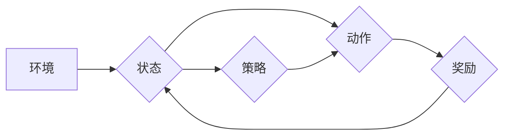

> 大语言模型、策略梯度、强化学习、Transformer、自然语言处理、深度学习

## 1. 背景介绍

近年来，深度学习在自然语言处理 (NLP) 领域取得了显著进展，其中大语言模型 (LLM) 作为一种强大的工具，在文本生成、翻译、问答等任务中展现出令人惊叹的性能。LLM 通常由 Transformer 架构构成，并通过海量文本数据进行预训练，能够捕捉语言的复杂结构和语义关系。

策略梯度方法作为一种常用的强化学习算法，在训练 LLM 中发挥着重要作用。它通过最大化模型输出的奖励信号来优化模型参数，从而使模型能够生成更符合人类期望的文本。

## 2. 核心概念与联系

### 2.1  大语言模型 (LLM)

大语言模型 (LLM) 是指参数量巨大、训练数据海量、能够理解和生成人类语言的深度学习模型。它们通常基于 Transformer 架构，并通过预训练和微调的方式进行训练。

### 2.2  强化学习 (RL)

强化学习 (RL) 是一种机器学习方法，它通过让智能体与环境交互，学习最优策略来最大化累积奖励。RL 算法的核心概念包括状态、动作、奖励、策略和价值函数。

### 2.3  策略梯度方法

策略梯度方法是一种常用的 RL 算法，它通过直接优化策略函数来学习最优策略。策略函数将状态映射到动作概率分布，策略梯度通过计算策略函数对奖励的梯度来更新策略参数。

**Mermaid 流程图**



## 3. 核心算法原理 & 具体操作步骤

### 3.1  算法原理概述

策略梯度方法的核心思想是通过最大化模型输出的奖励信号来优化模型参数。具体来说，策略梯度方法会使用一个策略函数来映射状态到动作概率分布，然后通过采样动作并与环境交互来获得奖励信号。最后，策略梯度方法会使用梯度上升算法来更新策略函数的参数，从而使模型能够生成更符合人类期望的文本。

### 3.2  算法步骤详解

1. **初始化策略函数:** 选择一个合适的策略函数，并初始化其参数。
2. **采样动作:** 根据当前策略函数，从状态空间中采样一个动作。
3. **与环境交互:** 将采样的动作与环境交互，获得奖励信号。
4. **更新策略函数:** 使用梯度上升算法更新策略函数的参数，使其朝着最大化奖励信号的方向进行调整。
5. **重复步骤2-4:** 重复上述步骤，直到策略函数收敛或达到预设的训练目标。

### 3.3  算法优缺点

**优点:**

* 能够直接优化策略函数，避免价值函数的估计误差。
* 适用于连续动作空间，可以学习更灵活的动作策略。

**缺点:**

* 训练过程可能不稳定，容易出现震荡现象。
* 需要大量的训练数据和计算资源。

### 3.4  算法应用领域

策略梯度方法广泛应用于各种强化学习任务，例如：

* 游戏 AI
* 机器人控制
* 自动驾驶
* 医疗诊断

## 4. 数学模型和公式 & 详细讲解 & 举例说明

### 4.1  数学模型构建

策略梯度方法的核心是策略函数 $\pi(a|s)$，它将状态 $s$ 映射到动作 $a$ 的概率分布。策略函数通常使用神经网络来实现，其参数为 $\theta$。

### 4.2  公式推导过程

策略梯度方法的目标是最大化累积奖励 $R$，可以使用以下公式来表示：

$$
\max_{\theta} \mathbb{E}_{\pi_{\theta}}[R]
$$

其中，$\mathbb{E}_{\pi_{\theta}}[R]$ 表示根据策略 $\pi_{\theta}$ 采样轨迹的平均奖励。

策略梯度方法使用梯度上升算法来更新策略参数 $\theta$，其更新公式为：

$$
\theta \leftarrow \theta + \alpha \nabla_{\theta} \mathbb{E}_{\pi_{\theta}}[R]
$$

其中，$\alpha$ 为学习率。

### 4.3  案例分析与讲解

假设我们有一个简单的强化学习任务，目标是训练一个机器人学习在迷宫中找到出口。

* 状态空间：迷宫中的每个位置。
* 动作空间：向上、向下、向左、向右四个方向。
* 奖励函数：到达出口时奖励 1，否则奖励 0。

我们可以使用策略梯度方法来训练机器人学习最优策略。

* 初始化策略函数：随机初始化策略函数的参数。
* 采样动作：根据策略函数，从当前位置采样一个动作。
* 与环境交互：执行采样的动作，并获得奖励信号。
* 更新策略函数：使用梯度上升算法更新策略函数的参数，使其朝着最大化奖励信号的方向进行调整。

通过重复上述步骤，机器人最终能够学习到最优策略，能够在迷宫中找到出口。

## 5. 项目实践：代码实例和详细解释说明

### 5.1  开发环境搭建

本项目使用 Python 语言进行开发，需要安装以下依赖库：

* TensorFlow 或 PyTorch
* NumPy
* Matplotlib

### 5.2  源代码详细实现

```python
import tensorflow as tf

# 定义策略网络
class PolicyNetwork(tf.keras.Model):
    def __init__(self, state_dim, action_dim):
        super(PolicyNetwork, self).__init__()
        self.dense1 = tf.keras.layers.Dense(128, activation='relu')
        self.dense2 = tf.keras.layers.Dense(action_dim, activation='softmax')

    def call(self, state):
        x = self.dense1(state)
        return self.dense2(x)

# 定义强化学习环境
class Env:
    # ...

# 初始化策略网络和环境
state_dim = 10
action_dim = 5
policy_network = PolicyNetwork(state_dim, action_dim)
env = Env()

# 训练策略网络
for episode in range(num_episodes):
    state = env.reset()
    done = False
    while not done:
        # 采样动作
        action_probs = policy_network(state)
        action = tf.random.categorical(tf.math.log(action_probs), 1)[0, 0]

        # 与环境交互
        next_state, reward, done = env.step(action)

        # 更新策略网络
        # ...

```

### 5.3  代码解读与分析

* 策略网络：使用两层全连接神经网络来实现策略函数，输出动作概率分布。
* 强化学习环境：模拟强化学习任务的环境，提供状态、动作、奖励等信息。
* 训练循环：重复采样动作、与环境交互、更新策略网络的过程，直到策略网络收敛。

### 5.4  运行结果展示

训练完成后，可以将策略网络应用于新的环境中，观察其生成的策略是否能够达到预期的效果。

## 6. 实际应用场景

策略梯度方法在自然语言处理领域有着广泛的应用场景，例如：

### 6.1  文本生成

使用策略梯度方法训练的 LLM 可以生成高质量的文本，例如故事、诗歌、新闻报道等。

### 6.2  机器翻译

策略梯度方法可以用于训练机器翻译模型，提高翻译质量和流畅度。

### 6.3  对话系统

策略梯度方法可以用于训练对话系统，使对话更加自然和人性化。

### 6.4  未来应用展望

随着深度学习技术的不断发展，策略梯度方法在自然语言处理领域的应用场景将会更加广泛，例如：

* 个性化教育
* 医疗辅助诊断
* 代码生成

## 7. 工具和资源推荐

### 7.1  学习资源推荐

* **书籍:**
    * Reinforcement Learning: An Introduction by Richard S. Sutton and Andrew G. Barto
    * Deep Reinforcement Learning Hands-On by Maxim Lapan
* **在线课程:**
    * Deep Reinforcement Learning Specialization by DeepLearning.AI
    * Reinforcement Learning by David Silver

### 7.2  开发工具推荐

* **TensorFlow:** https://www.tensorflow.org/
* **PyTorch:** https://pytorch.org/

### 7.3  相关论文推荐

* **Proximal Policy Optimization Algorithms** by John Schulman et al.
* **Trust Region Policy Optimization** by John Schulman et al.
* **Asynchronous Methods for Deep Reinforcement Learning** by Volodymyr Mnih et al.

## 8. 总结：未来发展趋势与挑战

### 8.1  研究成果总结

策略梯度方法在训练 LLM 中取得了显著进展，能够有效地学习复杂的语言模型。

### 8.2  未来发展趋势

* **更有效的策略梯度算法:** 研究更稳定、更有效的策略梯度算法，例如基于模型的策略梯度方法。
* **结合其他机器学习方法:** 将策略梯度方法与其他机器学习方法结合，例如监督学习和无监督学习，提高模型性能。
* **面向特定任务的模型设计:** 设计针对特定任务的 LLM，例如对话系统、机器翻译等，提高模型的效率和准确性。

### 8.3  面临的挑战

* **训练数据不足:** 训练 LLM 需要大量的文本数据，而高质量的文本数据往往难以获取。
* **计算资源限制:** 训练 LLM 需要大量的计算资源，这对于个人开发者和小型研究机构来说是一个挑战。
* **模型可解释性:** LLM 的决策过程往往难以理解，这对于模型的信任和应用推广来说是一个挑战。

### 8.4  研究展望

未来，策略梯度方法在 LLM 训练领域将继续发挥重要作用，并与其他机器学习方法相结合，推动 LLM 的发展和应用。


## 9. 附录：常见问题与解答

### 9.1  策略梯度方法为什么比价值函数方法更直接？

策略梯度方法直接优化策略函数，而价值函数方法需要先估计价值函数，然后根据价值函数更新策略函数。由于价值函数的估计存在误差，因此价值函数方法可能不如策略梯度方法直接有效。

### 9.2  策略梯度方法训练过程不稳定怎么办？

策略梯度方法训练过程可能不稳定，容易出现震荡现象。可以使用以下方法来缓解这个问题：

* 使用学习率衰减策略
* 使用 clipped surrogate objective
* 使用 trust region policy optimization (TRPO) 等更稳定的算法

### 9.3  如何选择合适的策略网络架构？

策略网络的架构选择取决于具体的任务和数据特点。常用的策略网络架构包括：

* 全连接神经网络
* 卷积神经网络
* Transformer

作者：禅与计算机程序设计艺术 / Zen and the Art of Computer Programming


<end_of_turn>