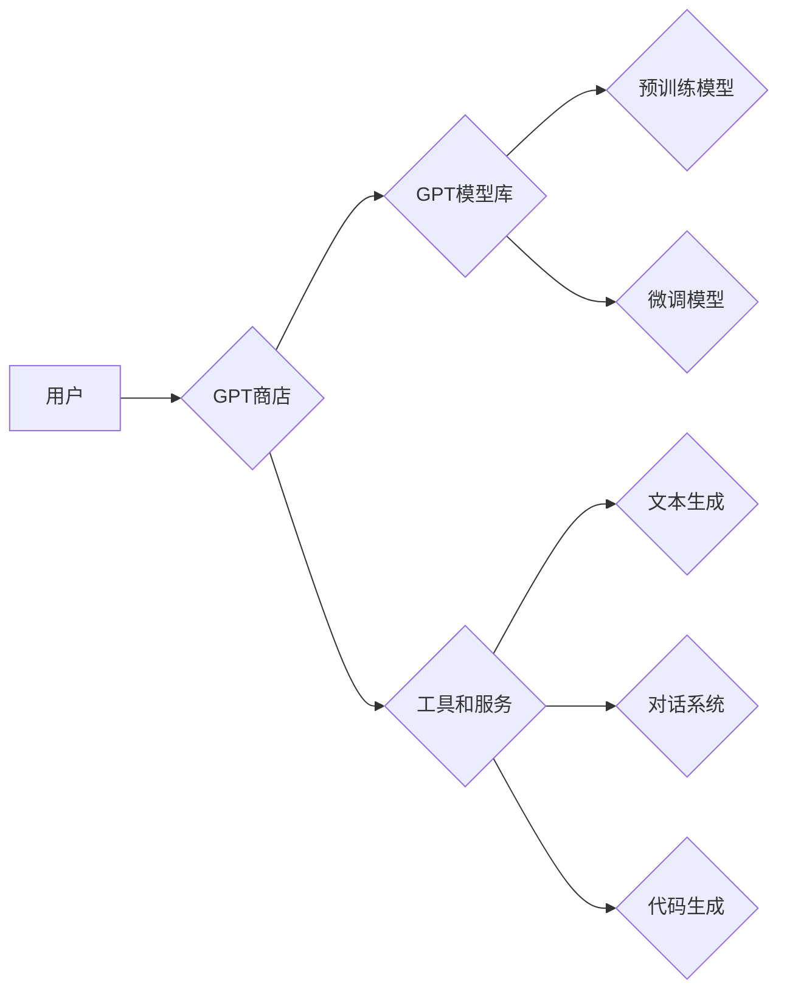

> 大语言模型，GPT，应用指南，人工智能，自然语言处理，文本生成，对话系统，代码生成

## 1. 背景介绍

近年来，人工智能（AI）领域取得了令人瞩目的进展，其中大语言模型（LLM）作为一种强大的AI技术，展现出巨大的潜力。LLM能够理解和生成人类语言，在文本生成、对话系统、机器翻译、代码生成等领域展现出令人惊叹的应用能力。

GPT（Generative Pre-trained Transformer）系列模型作为LLM的代表，由OpenAI开发，凭借其强大的文本生成能力和广泛的应用场景，迅速成为AI领域的研究热点和应用焦点。

## 2. 核心概念与联系

### 2.1  大语言模型（LLM）

大语言模型是指能够理解和生成人类语言的深度学习模型。它们通常基于Transformer架构，通过训练海量文本数据，学习语言的语法、语义和上下文关系。

### 2.2  GPT模型

GPT模型是基于Transformer架构的生成式预训练语言模型。它通过自监督学习的方式，在大量的文本数据上进行预训练，学习语言的模式和规律。

GPT模型的优势在于：

* **强大的文本生成能力:** GPT模型能够生成流畅、连贯、语义合理的文本。
* **广泛的应用场景:** GPT模型可以应用于文本生成、对话系统、机器翻译、代码生成等多个领域。
* **可微调性:** GPT模型可以根据特定任务进行微调，提高其在特定领域的性能。

### 2.3  GPT商店

GPT商店是一个基于GPT模型的应用平台，它提供了一系列基于GPT模型的工具和服务，方便用户快速构建和部署GPT应用。

**GPT商店架构**



## 3. 核心算法原理 & 具体操作步骤

### 3.1  算法原理概述

GPT模型的核心算法是Transformer架构，它通过自注意力机制学习文本的上下文关系，并使用多层编码器-解码器结构生成文本。

### 3.2  算法步骤详解

1. **预训练:** 在海量文本数据上进行预训练，学习语言的模式和规律。
2. **微调:** 根据特定任务进行微调，例如文本生成、对话系统等。
3. **文本生成:** 输入文本提示，模型根据训练知识生成相应的文本。

### 3.3  算法优缺点

**优点:**

* 强大的文本生成能力
* 广泛的应用场景
* 可微调性

**缺点:**

* 训练成本高
* 容易产生偏差和错误
* 对输入文本的依赖性强

### 3.4  算法应用领域

* 文本生成：小说、诗歌、剧本等
* 对话系统：聊天机器人、虚拟助手等
* 机器翻译：将一种语言翻译成另一种语言
* 代码生成：自动生成代码

## 4. 数学模型和公式 & 详细讲解 & 举例说明

### 4.1  数学模型构建

GPT模型的数学模型基于Transformer架构，主要包括以下几个部分：

* **嵌入层:** 将文本单词映射到向量空间。
* **自注意力层:** 学习文本单词之间的上下文关系。
* **多层感知机:** 对文本表示进行非线性变换。
* **解码器:** 根据输入文本生成目标文本。

### 4.2  公式推导过程

Transformer架构的核心是自注意力机制，其计算公式如下：

$$
Attention(Q, K, V) = \frac{exp(Q \cdot K^T / \sqrt{d_k})}{exp(Q \cdot K^T / \sqrt{d_k})} \cdot V
$$

其中：

* $Q$：查询矩阵
* $K$：键矩阵
* $V$：值矩阵
* $d_k$：键向量的维度

### 4.3  案例分析与讲解

假设我们有一个句子“我爱学习编程”，我们使用自注意力机制计算每个单词与其他单词之间的注意力权重。

例如，计算“学习”与其他单词之间的注意力权重，我们会发现“学习”与“编程”之间的注意力权重最高，因为它们在语义上密切相关。

## 5. 项目实践：代码实例和详细解释说明

### 5.1  开发环境搭建

* Python 3.7+
* PyTorch 1.7+
* CUDA 10.2+

### 5.2  源代码详细实现

```python
import torch
import torch.nn as nn

class Transformer(nn.Module):
    def __init__(self, vocab_size, embedding_dim, num_heads, num_layers):
        super(Transformer, self).__init__()
        self.embedding = nn.Embedding(vocab_size, embedding_dim)
        self.transformer_layers = nn.ModuleList([
            nn.TransformerEncoderLayer(embedding_dim, num_heads)
            for _ in range(num_layers)
        ])

    def forward(self, x):
        x = self.embedding(x)
        for layer in self.transformer_layers:
            x = layer(x)
        return x
```

### 5.3  代码解读与分析

* `Transformer`类定义了Transformer模型的结构。
* `embedding`层将单词映射到向量空间。
* `transformer_layers`是一个模块列表，包含多个`TransformerEncoderLayer`层。
* `forward`方法定义了模型的输入和输出。

### 5.4  运行结果展示

运行上述代码，可以训练一个简单的Transformer模型，并进行文本生成任务。

## 6. 实际应用场景

### 6.1  文本生成

GPT模型可以用于生成各种类型的文本，例如：

* **小说、诗歌、剧本:** GPT模型可以根据给定的主题和风格生成创意文本。
* **新闻报道、文章:** GPT模型可以根据给定的事件和信息生成新闻报道或文章。
* **广告文案、营销材料:** GPT模型可以根据给定的产品和目标客户生成吸引人的广告文案。

### 6.2  对话系统

GPT模型可以用于构建对话系统，例如：

* **聊天机器人:** GPT模型可以与用户进行自然语言对话，回答问题、提供信息。
* **虚拟助手:** GPT模型可以帮助用户完成各种任务，例如设置提醒、预订酒店。

### 6.3  代码生成

GPT模型可以用于生成代码，例如：

* **自动生成代码片段:** GPT模型可以根据给定的需求自动生成代码片段。
* **代码补全:** GPT模型可以根据用户输入的代码自动补全剩余代码。

### 6.4  未来应用展望

GPT模型在未来将有更广泛的应用场景，例如：

* **个性化教育:** 根据学生的学习进度和需求生成个性化的学习内容。
* **医疗诊断:** 辅助医生进行疾病诊断，提供个性化的治疗方案。
* **法律服务:** 辅助律师进行法律研究，生成法律文件。

## 7. 工具和资源推荐

### 7.1  学习资源推荐

* **OpenAI GPT-3 文档:** https://openai.com/api/
* **HuggingFace Transformers 库:** https://huggingface.co/transformers/
* **DeepLearning.AI 课程:** https://www.deeplearning.ai/

### 7.2  开发工具推荐

* **Jupyter Notebook:** https://jupyter.org/
* **PyCharm:** https://www.jetbrains.com/pycharm/

### 7.3  相关论文推荐

* **Attention Is All You Need:** https://arxiv.org/abs/1706.03762
* **BERT: Pre-training of Deep Bidirectional Transformers for Language Understanding:** https://arxiv.org/abs/1810.04805

## 8. 总结：未来发展趋势与挑战

### 8.1  研究成果总结

GPT模型在文本生成、对话系统、代码生成等领域取得了显著的成果，展现出强大的应用潜力。

### 8.2  未来发展趋势

* **模型规模和性能提升:** 未来GPT模型的规模和性能将继续提升，能够生成更流畅、更准确的文本。
* **多模态学习:** GPT模型将与其他模态数据（例如图像、音频）进行融合，实现多模态理解和生成。
* **可解释性增强:** 研究人员将致力于提高GPT模型的可解释性，使模型的决策过程更加透明。

### 8.3  面临的挑战

* **数据偏见和公平性:** GPT模型的训练数据可能存在偏见，导致模型生成带有偏见的文本。
* **安全性和隐私性:** GPT模型可能被用于生成恶意内容，例如虚假新闻、网络攻击。
* **伦理问题:** GPT模型的应用引发了伦理问题，例如人工智能的责任和义务。

### 8.4  研究展望

未来研究将重点关注解决GPT模型面临的挑战，使其更加安全、可靠、公平和可解释。


## 9. 附录：常见问题与解答

### 9.1  GPT模型训练需要多大的计算资源？

GPT模型的训练需要大量的计算资源，例如数百甚至数千个GPU。

### 9.2  如何使用GPT模型进行文本生成？

可以使用GPT模型的API或开源库进行文本生成。

### 9.3  GPT模型是否可以理解人类的情感？

目前GPT模型只能模拟人类语言，并不能真正理解人类的情感。


作者：禅与计算机程序设计艺术 / Zen and the Art of Computer Programming 
<end_of_turn>