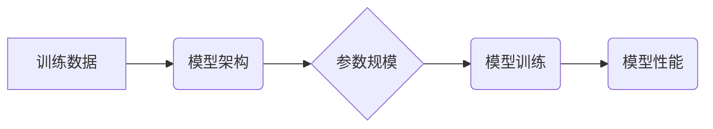

> 大语言模型、尺度定律、深度学习、参数规模、性能提升、计算资源、应用场景

## 1. 背景介绍

近年来，大语言模型（LLM）在自然语言处理领域取得了令人瞩目的成就。从文本生成、翻译到问答和代码编写，LLM展现出强大的能力，深刻地改变了我们与语言交互的方式。

然而，LLM的训练和部署需要大量的计算资源和时间。随着模型规模的不断扩大，训练成本也呈指数级增长。因此，理解LLM性能提升与规模之间的关系，即所谓的“尺度定律”，对于推动LLM的发展至关重要。

## 2. 核心概念与联系

**2.1 尺度定律**

尺度定律是指模型性能随着模型参数规模的增加而呈指数级或超线性增长。简单来说，模型参数越多，模型的性能通常越好。

**2.2 模型架构**

大语言模型通常基于Transformer架构，其核心是自注意力机制，能够捕捉文本序列中长距离依赖关系。

**2.3 训练数据**

高质量的训练数据是LLM训练的关键。大量的文本数据可以帮助模型学习语言的语法、语义和上下文关系。

**2.4 计算资源**

训练大型LLM需要大量的计算资源，包括GPU和TPU等加速器。

**Mermaid 流程图**



## 3. 核心算法原理 & 具体操作步骤

**3.1 算法原理概述**

LLM的训练基于深度学习的监督学习方法。模型通过学习大量的文本数据，预测下一个词的概率。

**3.2 算法步骤详解**

1. **数据预处理:** 将文本数据清洗、分词、标记等预处理操作。
2. **模型构建:** 根据预设的模型架构，构建LLM模型。
3. **模型训练:** 使用训练数据，通过反向传播算法，更新模型参数，使模型预测的下一个词与真实词尽可能接近。
4. **模型评估:** 使用测试数据，评估模型的性能，例如困惑度、BLEU分数等。
5. **模型调优:** 根据评估结果，调整模型参数、学习率等超参数，进一步提高模型性能。

**3.3 算法优缺点**

**优点:**

* 能够学习复杂的语言模式。
* 性能随着参数规模的增加而提升。
* 可应用于多种自然语言处理任务。

**缺点:**

* 训练成本高，需要大量的计算资源和时间。
* 容易受到训练数据质量的影响。
* 缺乏可解释性，难以理解模型的决策过程。

**3.4 算法应用领域**

* 文本生成
* 机器翻译
* 问答系统
* 代码生成
* 聊天机器人

## 4. 数学模型和公式 & 详细讲解 & 举例说明

**4.1 数学模型构建**

LLM通常使用softmax函数来预测下一个词的概率。

**公式:**

$$
P(w_t | w_{1:t-1}) = \frac{exp(s_t)}{\sum_{k=1}^{V} exp(s_k)}
$$

其中：

* $w_t$ 是当前预测的词。
* $w_{1:t-1}$ 是前一个词的序列。
* $s_t$ 是模型对当前词的预测得分。
* $V$ 是词汇表的大小。

**4.2 公式推导过程**

softmax函数将模型的预测得分转换为概率分布，使得每个词的概率在0到1之间，且所有词的概率之和为1。

**4.3 案例分析与讲解**

假设模型预测“今天天气”后，下一个词可能是“晴朗”，“阴天”或“多云”。softmax函数会根据模型的预测得分，计算出每个词的概率，例如：

* “晴朗”的概率为0.6
* “阴天”的概率为0.3
* “多云”的概率为0.1

## 5. 项目实践：代码实例和详细解释说明

**5.1 开发环境搭建**

使用Python语言和深度学习框架TensorFlow或PyTorch搭建开发环境。

**5.2 源代码详细实现**

```python
import tensorflow as tf

# 定义模型架构
model = tf.keras.Sequential([
    tf.keras.layers.Embedding(input_dim=vocab_size, output_dim=embedding_dim),
    tf.keras.layers.LSTM(units=hidden_size),
    tf.keras.layers.Dense(units=vocab_size, activation='softmax')
])

# 编译模型
model.compile(optimizer='adam', loss='sparse_categorical_crossentropy', metrics=['accuracy'])

# 训练模型
model.fit(x_train, y_train, epochs=num_epochs, batch_size=batch_size)

# 评估模型
loss, accuracy = model.evaluate(x_test, y_test)
```

**5.3 代码解读与分析**

代码实现了一个简单的基于LSTM的LLM模型。

* Embedding层将词向量化。
* LSTM层捕捉文本序列的长距离依赖关系。
* Dense层输出每个词的概率分布。

**5.4 运行结果展示**

训练完成后，可以使用模型对新的文本进行预测。

## 6. 实际应用场景

**6.1 文本生成**

LLM可以用于生成各种类型的文本，例如小说、诗歌、新闻报道等。

**6.2 机器翻译**

LLM可以用于将文本从一种语言翻译成另一种语言。

**6.3 问答系统**

LLM可以用于构建问答系统，能够回答用户提出的问题。

**6.4 代码生成**

LLM可以用于生成代码，例如Python、Java等编程语言的代码。

**6.5 聊天机器人**

LLM可以用于构建聊天机器人，能够与用户进行自然语言交互。

**6.6 未来应用展望**

LLM在未来将应用于更多领域，例如教育、医疗、法律等。

## 7. 工具和资源推荐

**7.1 学习资源推荐**

* 深度学习书籍：
    * 《深度学习》
    * 《动手学深度学习》
* 在线课程：
    * Coursera
    * edX

**7.2 开发工具推荐**

* 深度学习框架：
    * TensorFlow
    * PyTorch
* 自然语言处理库：
    * NLTK
    * SpaCy

**7.3 相关论文推荐**

* 《Attention Is All You Need》
* 《BERT: Pre-training of Deep Bidirectional Transformers for Language Understanding》
* 《GPT-3: Language Models are Few-Shot Learners》

## 8. 总结：未来发展趋势与挑战

**8.1 研究成果总结**

近年来，LLM取得了显著的进展，在各种自然语言处理任务上取得了优异的性能。

**8.2 未来发展趋势**

* 模型规模的进一步扩大
* 训练效率的提升
* 可解释性和鲁棒性的增强
* 多模态LLM的开发

**8.3 面临的挑战**

* 计算资源的限制
* 训练数据质量的提升
* 伦理和社会影响的评估

**8.4 研究展望**

未来，LLM将继续朝着更强大、更安全、更可解释的方向发展，为人类社会带来更多价值。

## 9. 附录：常见问题与解答

**9.1 如何选择合适的LLM模型？**

选择合适的LLM模型取决于具体的应用场景和需求。

**9.2 如何训练自己的LLM模型？**

训练自己的LLM模型需要大量的计算资源、数据和专业知识。

**9.3 如何评估LLM模型的性能？**

可以使用困惑度、BLEU分数等指标来评估LLM模型的性能。


作者：禅与计算机程序设计艺术 / Zen and the Art of Computer Programming 
<end_of_turn>