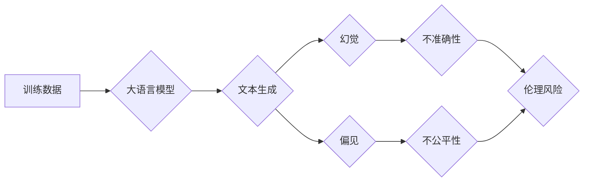

> 大语言模型、幻觉、偏见、伦理、安全、应用指南

## 1. 背景介绍

近年来，大语言模型（LLM）在自然语言处理领域取得了令人瞩目的成就，展现出强大的文本生成、翻译、摘要和问答能力。这些模型通过学习海量文本数据，掌握了语言的复杂规律，并能够生成逼真、流畅的文本。然而，随着LLM应用的广泛，一些潜在问题也逐渐浮出水面，其中幻觉和偏见问题尤为突出。

**1.1 幻觉现象**

幻觉是指LLM生成文本时，出现与真实世界不符、甚至完全虚构的内容。这种现象可能源于模型训练数据中的偏差或噪声，也可能与模型本身的结构和算法有关。例如，LLM可能会生成不存在的人物、事件或地点，或者编造虚假的故事和信息。

**1.2 偏见问题**

偏见是指LLM生成文本时，反映出训练数据中存在的社会、文化或个人偏见。这种偏见可能表现为对特定种族、性别、宗教或政治观点的歧视或偏袒，也会导致模型生成不公平、不准确甚至有害的文本。

## 2. 核心概念与联系

**2.1 核心概念**

* **大语言模型 (LLM):** 训练数据量巨大，参数数量庞大的深度学习模型，能够理解和生成人类语言。
* **幻觉:** LLM生成文本时，出现与真实世界不符、甚至完全虚构的内容。
* **偏见:** LLM生成文本时，反映出训练数据中存在的社会、文化或个人偏见。

**2.2 联系**

幻觉和偏见问题是LLM应用中不可忽视的挑战。它们不仅会影响模型的准确性和可靠性，还会带来伦理和社会风险。

**2.3 Mermaid 流程图**



## 3. 核心算法原理 & 具体操作步骤

**3.1 算法原理概述**

LLM通常基于Transformer架构，利用自注意力机制学习文本的上下文关系。训练过程通过最大化预测下一个词的概率来优化模型参数。

**3.2 算法步骤详解**

1. **数据预处理:** 将文本数据清洗、分词、标记等预处理。
2. **模型构建:** 根据Transformer架构构建LLM模型，包括编码器和解码器。
3. **模型训练:** 使用预处理后的数据训练模型，优化模型参数。
4. **模型评估:** 使用测试数据评估模型性能，例如困惑度、BLEU分数等。
5. **模型部署:** 将训练好的模型部署到实际应用场景中。

**3.3 算法优缺点**

* **优点:** 能够生成流畅、逼真的文本，在文本生成、翻译、摘要等任务中表现出色。
* **缺点:** 容易产生幻觉和偏见，训练成本高，需要大量计算资源。

**3.4 算法应用领域**

* **自然语言处理:** 文本生成、翻译、摘要、问答、对话系统等。
* **人工智能:** 机器学习、深度学习、计算机视觉等。
* **其他领域:** 教育、医疗、金融、娱乐等。

## 4. 数学模型和公式 & 详细讲解 & 举例说明

**4.1 数学模型构建**

LLM通常使用概率模型来表示文本的生成过程。一个常见的模型是条件语言模型，它根据输入文本序列预测下一个词的概率。

**4.2 公式推导过程**

假设我们有一个文本序列 $x = (x_1, x_2, ..., x_T)$，其中 $x_i$ 表示第 $i$ 个词。条件语言模型的目标是学习一个概率分布 $P(x_{T+1}|x_1, x_2, ..., x_T)$，即给定前 $T$ 个词，预测下一个词 $x_{T+1}$ 的概率。

可以使用最大似然估计来训练条件语言模型。最大似然估计的目标是找到模型参数，使得模型生成的文本序列与真实文本序列的概率最大。

**4.3 案例分析与讲解**

例如，假设我们有一个文本序列 "The cat sat on the mat"，我们想要预测下一个词。根据条件语言模型，我们可以计算每个词的概率，然后选择概率最高的词作为预测结果。

$$
P(\text{cat}| \text{The}) > P(\text{dog}| \text{The})
$$

因此，模型预测下一个词为 "cat"。

## 5. 项目实践：代码实例和详细解释说明

**5.1 开发环境搭建**

* Python 3.7+
* TensorFlow 或 PyTorch
* CUDA 和 cuDNN (可选)

**5.2 源代码详细实现**

```python
import tensorflow as tf

# 定义模型架构
model = tf.keras.Sequential([
    tf.keras.layers.Embedding(input_dim=vocab_size, output_dim=embedding_dim),
    tf.keras.layers.LSTM(units=hidden_size),
    tf.keras.layers.Dense(units=vocab_size, activation='softmax')
])

# 编译模型
model.compile(optimizer='adam', loss='sparse_categorical_crossentropy', metrics=['accuracy'])

# 训练模型
model.fit(x_train, y_train, epochs=epochs)

# 预测文本
text = "The cat sat on the"
predictions = model.predict(text)
```

**5.3 代码解读与分析**

* 代码首先定义了一个基于LSTM的LLM模型架构。
* 然后，模型使用Adam优化器、交叉熵损失函数和准确率指标进行编译。
* 接着，模型使用训练数据进行训练。
* 最后，模型可以用来预测文本序列的下一个词。

**5.4 运行结果展示**

训练好的模型可以用来生成文本，例如：

```
The cat sat on the mat.
The cat sat on the floor.
The cat sat on the table.
```

## 6. 实际应用场景

**6.1 文本生成**

LLM可以用于生成各种类型的文本，例如小说、诗歌、剧本、新闻报道等。

**6.2 翻译**

LLM可以用于机器翻译，将一种语言翻译成另一种语言。

**6.3 摘要**

LLM可以用于文本摘要，提取文本的关键信息并生成简短的摘要。

**6.4 未来应用展望**

LLM在未来将有更广泛的应用场景，例如：

* **个性化教育:** 根据学生的学习进度和需求，生成个性化的学习内容。
* **医疗诊断:** 分析患者的病历和症状，辅助医生进行诊断。
* **法律服务:** 分析法律文件，提供法律建议。

## 7. 工具和资源推荐

**7.1 学习资源推荐**

* **书籍:**
    * 《深度学习》
    * 《自然语言处理》
* **在线课程:**
    * Coursera: 自然语言处理
    * edX: 深度学习

**7.2 开发工具推荐**

* **TensorFlow:** 开源深度学习框架
* **PyTorch:** 开源深度学习框架
* **Hugging Face:** 提供预训练的LLM模型和工具

**7.3 相关论文推荐**

* **BERT:** Pre-training of Deep Bidirectional Transformers for Language Understanding
* **GPT-3:** Language Models are Few-Shot Learners
* **T5:** Text-to-Text Transfer Transformer

## 8. 总结：未来发展趋势与挑战

**8.1 研究成果总结**

近年来，LLM取得了显著进展，在文本生成、翻译、摘要等任务中表现出色。

**8.2 未来发展趋势**

* **模型规模和能力的提升:** 未来LLM模型将更加庞大，拥有更强的语言理解和生成能力。
* **多模态学习:** LLM将与其他模态数据（例如图像、音频）进行融合，实现更全面的信息理解。
* **可解释性和安全性:** 研究者将更加关注LLM的透明度和安全性，开发可解释的模型和防止攻击的机制。

**8.3 面临的挑战**

* **数据偏见和幻觉:** 训练数据中的偏见和噪声会导致LLM生成不准确、甚至有害的文本。
* **计算资源消耗:** 训练大型LLM模型需要大量的计算资源，这对于资源有限的机构或个人来说是一个挑战。
* **伦理和社会影响:** LLM的应用可能带来伦理和社会风险，例如信息操纵、隐私泄露等。

**8.4 研究展望**

未来研究将集中在解决LLM的挑战，例如开发更鲁棒的训练方法、降低模型的计算成本、提高模型的可解释性和安全性，以及探索LLM在更多领域的应用。

## 9. 附录：常见问题与解答

**9.1 如何解决LLM的幻觉问题？**

* 使用更优质、更全面的训练数据。
* 开发更有效的训练方法，例如对抗训练、知识蒸馏等。
* 在模型输出前进行文本校正和验证。

**9.2 如何解决LLM的偏见问题？**

* 使用去偏见的数据预处理方法。
* 在训练过程中加入公平性约束。
* 对模型输出进行偏见检测和修正。

**9.3 如何评估LLM的性能？**

可以使用困惑度、BLEU分数、ROUGE分数等指标来评估LLM的性能。

**9.4 如何部署LLM模型？**

可以使用云平台、容器化技术等方式部署LLM模型。


作者：禅与计算机程序设计艺术 / Zen and the Art of Computer Programming 
<end_of_turn>