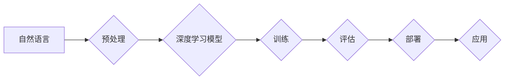

> 大语言模型、机器学习、自然语言处理、深度学习、Transformer、BERT、GPT、应用指南

## 1. 背景介绍

近年来，人工智能（AI）技术取得了飞速发展，其中大语言模型（LLM）作为一种重要的AI应用，展现出强大的潜力，在自然语言处理（NLP）领域取得了突破性进展。LLM能够理解和生成人类语言，并完成各种复杂的任务，例如文本生成、翻译、问答、摘要等。

随着LLM技术的不断成熟，其应用场景也越来越广泛，涵盖了各个领域，例如教育、医疗、金融、娱乐等。为了帮助开发者更好地理解和应用LLM，本文将从LLM的背景介绍、核心概念、算法原理、数学模型、项目实践、实际应用场景等方面进行深入探讨，并提供一些工具和资源推荐，帮助开发者快速入门并掌握LLM应用技能。

## 2. 核心概念与联系

**2.1 自然语言处理（NLP）**

NLP是人工智能的一个分支，旨在使计算机能够理解、处理和生成人类语言。NLP的任务包括文本分类、情感分析、机器翻译、问答系统等。

**2.2 深度学习（Deep Learning）**

深度学习是机器学习的一种高级形式，它利用多层神经网络来模拟人类大脑的学习过程。深度学习在图像识别、语音识别、自然语言处理等领域取得了显著成果。

**2.3 大语言模型（LLM）**

LLM是一种基于深度学习的强大语言模型，它被训练在海量文本数据上，能够理解和生成人类语言。LLM通常具有以下特点：

* **参数量大：**LLM通常拥有数十亿甚至数千亿个参数，这使得它们能够学习到更复杂的语言模式。
* **预训练：**LLM通常使用预训练方法进行训练，即在大量文本数据上进行预训练，然后在特定任务上进行微调。
* **多任务学习：**LLM能够执行多种NLP任务，例如文本生成、翻译、问答等。

**2.4 Transformer**

Transformer是一种新型的深度学习架构，它在NLP领域取得了突破性进展。Transformer的核心是注意力机制，它能够捕捉文本序列中单词之间的长距离依赖关系。

**2.5 BERT、GPT**

BERT和GPT是两种著名的LLM，它们都基于Transformer架构。BERT是一种双向语言模型，它能够理解上下文信息；GPT是一种单向语言模型，它擅长文本生成。

**2.6 流程图**



## 3. 核心算法原理 & 具体操作步骤

### 3.1 算法原理概述

LLM的核心算法原理是深度学习，特别是Transformer架构。Transformer通过注意力机制捕捉文本序列中单词之间的长距离依赖关系，从而能够更好地理解上下文信息。

### 3.2 算法步骤详解

1. **数据预处理：** 将原始文本数据进行清洗、分词、标记等预处理操作，使其能够被模型理解。
2. **模型构建：** 根据Transformer架构构建深度学习模型，并设置模型参数。
3. **模型训练：** 使用预训练方法训练模型，即在海量文本数据上进行预训练，然后在特定任务上进行微调。
4. **模型评估：** 使用测试数据评估模型的性能，并根据评估结果进行模型调优。
5. **模型部署：** 将训练好的模型部署到生产环境中，以便进行实际应用。

### 3.3 算法优缺点

**优点：**

* 能够理解和生成人类语言。
* 性能优异，在各种NLP任务中取得了突破性进展。
* 可迁移性强，可以应用于多种领域。

**缺点：**

* 训练成本高，需要大量的计算资源和数据。
* 容易受到训练数据的影响，可能存在偏差和错误。
* 解释性差，难以理解模型的决策过程。

### 3.4 算法应用领域

LLM在各个领域都有广泛的应用，例如：

* **教育：** 自动生成学习材料、提供个性化辅导。
* **医疗：** 辅助诊断、分析医学文献。
* **金融：** 风险评估、欺诈检测。
* **娱乐：** 生成故事、创作剧本。

## 4. 数学模型和公式 & 详细讲解 & 举例说明

### 4.1 数学模型构建

LLM通常使用Transformer架构，其核心是注意力机制。注意力机制可以捕捉文本序列中单词之间的长距离依赖关系，从而更好地理解上下文信息。

### 4.2 公式推导过程

注意力机制的计算公式如下：

$$
Attention(Q, K, V) = softmax(\frac{QK^T}{\sqrt{d_k}})V
$$

其中：

* $Q$：查询矩阵
* $K$：键矩阵
* $V$：值矩阵
* $d_k$：键向量的维度
* $softmax$：softmax函数

### 4.3 案例分析与讲解

假设我们有一个句子“我爱学习编程”，我们想要计算“学习”这个词与其他词之间的注意力权重。

1. 将句子转换为词嵌入向量。
2. 计算查询矩阵 $Q$、键矩阵 $K$ 和值矩阵 $V$。
3. 计算注意力权重矩阵，即 $softmax(\frac{QK^T}{\sqrt{d_k}})$。
4. 将注意力权重矩阵与值矩阵相乘，得到最终的注意力输出。

通过分析注意力权重矩阵，我们可以看到“学习”这个词与“编程”这个词之间的注意力权重较高，说明这两个词在语义上相关。

## 5. 项目实践：代码实例和详细解释说明

### 5.1 开发环境搭建

* Python 3.7+
* TensorFlow 或 PyTorch
* CUDA 和 cuDNN（可选，用于GPU加速）

### 5.2 源代码详细实现

```python
import tensorflow as tf

# 定义Transformer模型
class Transformer(tf.keras.Model):
    def __init__(self, vocab_size, embedding_dim, num_heads, num_layers):
        super(Transformer, self).__init__()
        self.embedding = tf.keras.layers.Embedding(vocab_size, embedding_dim)
        self.transformer_layers = [
            tf.keras.layers.MultiHeadAttention(num_heads=num_heads, key_dim=embedding_dim)
            for _ in range(num_layers)
        ]
        self.dense = tf.keras.layers.Dense(vocab_size)

    def call(self, inputs):
        # ...
        return outputs

# 训练模型
model = Transformer(vocab_size=..., embedding_dim=..., num_heads=..., num_layers=...)
model.compile(optimizer='adam', loss='sparse_categorical_crossentropy', metrics=['accuracy'])
model.fit(train_data, train_labels, epochs=10)

```

### 5.3 代码解读与分析

* **Embedding层：** 将单词转换为词嵌入向量。
* **MultiHeadAttention层：** 计算单词之间的注意力权重。
* **Transformer层：** 叠加多个MultiHeadAttention层和FeedForward网络层，形成多层Transformer网络。
* **Dense层：** 将输出向量转换为预测概率分布。

### 5.4 运行结果展示

训练完成后，可以使用测试数据评估模型的性能，并可视化注意力权重矩阵来分析模型的决策过程。

## 6. 实际应用场景

### 6.1 文本生成

LLM可以用于生成各种类型的文本，例如故事、诗歌、文章、代码等。

### 6.2 机器翻译

LLM可以用于将文本从一种语言翻译成另一种语言。

### 6.3 问答系统

LLM可以用于构建问答系统，能够回答用户提出的问题。

### 6.4 聊天机器人

LLM可以用于构建聊天机器人，能够与用户进行自然语言对话。

### 6.5 未来应用展望

LLM的应用场景还在不断扩展，未来可能会应用于更多领域，例如：

* **个性化教育：** 提供个性化的学习材料和辅导。
* **医疗诊断辅助：** 辅助医生进行诊断和治疗。
* **法律文本分析：** 分析法律文本，提供法律建议。

## 7. 工具和资源推荐

### 7.1 学习资源推荐

* **书籍：**
    * 《深度学习》
    * 《自然语言处理》
* **在线课程：**
    * Coursera
    * edX
* **博客和论坛：**
    * TensorFlow Blog
    * PyTorch Blog

### 7.2 开发工具推荐

* **TensorFlow：** 开源深度学习框架。
* **PyTorch：** 开源深度学习框架。
* **Hugging Face：** 提供预训练LLM模型和工具。

### 7.3 相关论文推荐

* **BERT：** Devlin et al. (2018)
* **GPT：** Radford et al. (2019)
* **Transformer：** Vaswani et al. (2017)

## 8. 总结：未来发展趋势与挑战

### 8.1 研究成果总结

LLM在NLP领域取得了显著成果，能够理解和生成人类语言，并完成各种复杂的任务。

### 8.2 未来发展趋势

* **模型规模更大：** 随着计算资源的不断发展，LLM的规模将会越来越大，性能将会进一步提升。
* **多模态学习：** LLM将与其他模态数据（例如图像、音频）进行融合，实现多模态理解和生成。
* **可解释性增强：** 研究人员将致力于提高LLM的解释性，使其决策过程更加透明。

### 8.3 面临的挑战

* **数据偏见：** LLM容易受到训练数据的影响，可能存在数据偏见问题。
* **计算成本高：** 训练大型LLM需要大量的计算资源，成本较高。
* **安全风险：** LLM可能被用于生成虚假信息或进行恶意攻击。

### 8.4 研究展望

未来研究将集中在解决LLM面临的挑战，例如：

* 开发更公平、更鲁棒的训练方法。
* 降低LLM的训练成本。
* 提高LLM的安全性。


## 9. 附录：常见问题与解答

**Q1：如何选择合适的LLM模型？**

**A1：** 选择合适的LLM模型需要根据具体的应用场景和需求进行考虑。例如，如果需要进行文本生成任务，可以选择GPT模型；如果需要进行问答系统，可以选择BERT模型。

**Q2：如何训练自己的LLM模型？**

**A2：** 训练自己的LLM模型需要准备大量的文本数据、强大的计算资源和专业的机器学习知识。

**Q3：LLM的安全性如何保证？**

**A3：** 为了保证LLM的安全性，需要采取多种措施，例如：

* 使用高质量的训练数据。
* 开发安全的训练方法。
* 对模型进行安全评估和测试。

**Q4：LLM的未来发展趋势是什么？**

**A4：** LLM的未来发展趋势包括模型规模更大、多模态学习、可解释性增强等。

**Q5：如何学习LLM相关知识？**

**A5：** 可以通过阅读相关书籍、在线课程、博客和论坛等方式学习LLM相关知识。


作者：禅与计算机程序设计艺术 / Zen and the Art of Computer Programming 
<end_of_turn>