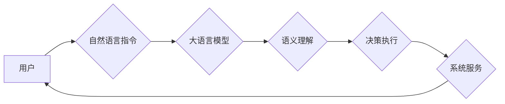

> 大语言模型，操作系统，人工智能，应用场景，未来趋势

## 1. 背景介绍

近年来，大语言模型（LLM）在自然语言处理领域取得了显著的突破，展现出强大的文本生成、理解、翻译等能力。这些模型的出现，为人工智能的应用带来了新的可能性，也引发了人们对未来计算模式的思考。传统的计算机操作系统主要负责硬件资源的管理和软件程序的执行，而大语言模型则拥有更强大的认知能力和语义理解能力。因此，将大语言模型融入到操作系统中，构建一个全新的“大语言模型操作系统”，成为一个值得探索的课题。

## 2. 核心概念与联系

### 2.1 大语言模型

大语言模型是一种基于深度学习的统计模型，通过训练海量文本数据，学习语言的语法、语义和上下文关系。这些模型通常拥有数十亿甚至数千亿的参数，能够生成流畅、连贯的文本，并完成各种自然语言理解和生成任务。

### 2.2 操作系统

操作系统是计算机硬件和软件之间桥梁，负责管理计算机资源、提供系统服务和执行用户程序。传统的操作系统主要包括内核、系统调用、进程管理、内存管理等模块。

### 2.3 大语言模型操作系统

大语言模型操作系统是指将大语言模型作为核心组件，融入到操作系统架构中，赋予操作系统更强大的认知能力和语义理解能力。这种操作系统能够理解用户的自然语言指令，并根据上下文进行智能决策和操作。

**Mermaid 流程图**



## 3. 核心算法原理 & 具体操作步骤

### 3.1 算法原理概述

大语言模型操作系统的核心算法主要包括：

* **自然语言理解 (NLU):** 将用户的自然语言指令转换为机器可理解的格式，例如符号表示或向量表示。
* **语义推理 (Semantic Reasoning):** 基于用户的指令和上下文信息，进行逻辑推理和知识抽取，理解用户的意图和需求。
* **决策执行 (Decision Execution):** 根据语义推理的结果，执行相应的系统操作，例如打开应用程序、搜索文件、控制设备等。

### 3.2 算法步骤详解

1. **接收用户指令:** 操作系统接收用户的自然语言指令。
2. **预处理指令:** 对指令进行预处理，例如分词、词性标注、去除停用词等，以便于后续的理解和分析。
3. **语义分析:** 利用大语言模型进行语义分析，识别指令中的关键信息和关系，例如动词、名词、关系词等。
4. **意图识别:** 根据语义分析的结果，识别用户的意图，例如打开应用程序、搜索文件、设置参数等。
5. **决策执行:** 根据用户的意图和上下文信息，执行相应的系统操作。
6. **反馈结果:** 将操作结果反馈给用户，例如显示搜索结果、打开应用程序窗口等。

### 3.3 算法优缺点

**优点:**

* **更自然的交互方式:** 用户可以使用自然语言与操作系统进行交互，更加直观和便捷。
* **更智能的系统行为:** 大语言模型能够理解用户的意图和需求，提供更智能的系统服务。
* **更丰富的应用场景:** 大语言模型操作系统能够应用于更广泛的场景，例如智能家居、智能客服、个性化教育等。

**缺点:**

* **计算资源消耗:** 大语言模型训练和推理需要大量的计算资源，可能会导致系统性能下降。
* **安全性和隐私性问题:** 大语言模型可能会泄露用户的隐私信息，需要采取相应的安全措施。
* **模型可解释性问题:** 大语言模型的决策过程较为复杂，难以解释其背后的逻辑，可能会导致用户信任度下降。

### 3.4 算法应用领域

大语言模型操作系统具有广泛的应用前景，例如：

* **智能家居:** 用户可以使用自然语言控制智能家居设备，例如调节温度、打开灯光、播放音乐等。
* **智能客服:** 大语言模型可以模拟人类客服人员，回答用户的常见问题，提供个性化的服务。
* **个性化教育:** 大语言模型可以根据学生的学习进度和需求，提供个性化的学习内容和辅导。
* **医疗诊断:** 大语言模型可以辅助医生进行疾病诊断，提高诊断准确率。

## 4. 数学模型和公式 & 详细讲解 & 举例说明

### 4.1 数学模型构建

大语言模型的操作过程可以抽象为一个数学模型，其中：

* **输入:** 用户的自然语言指令
* **输出:** 系统执行的结果
* **参数:** 大语言模型的参数

模型的目标是找到最佳的参数，使得模型能够准确地理解用户的指令并执行相应的操作。

### 4.2 公式推导过程

模型的训练过程通常使用最大似然估计 (MLE) 或交叉熵损失函数 (Cross-Entropy Loss) 来优化模型参数。

**最大似然估计 (MLE):**

$$
\theta = \arg \max_ \theta P(x|\theta)
$$

其中：

* $\theta$ 是模型参数
* $x$ 是输入的自然语言指令
* $P(x|\theta)$ 是模型在参数 $\theta$ 下生成指令 $x$ 的概率

**交叉熵损失函数 (Cross-Entropy Loss):**

$$
L = -\sum_{i=1}^{N} y_i \log(p_i)
$$

其中：

* $N$ 是训练数据的样本数量
* $y_i$ 是真实标签
* $p_i$ 是模型预测的概率

### 4.3 案例分析与讲解

例如，用户输入指令 "打开音乐播放器"，大语言模型需要识别出 "打开" 是一个动作，"音乐播放器" 是目标对象，并执行相应的操作，例如启动音乐播放器应用程序。

## 5. 项目实践：代码实例和详细解释说明

### 5.1 开发环境搭建

* 操作系统: Ubuntu 20.04
* Python 版本: 3.8
* 必要的库: transformers, torch, numpy, nltk

### 5.2 源代码详细实现

```python
from transformers import pipeline

# 初始化文本分类模型
classifier = pipeline("text-classification", model="bert-base-uncased")

# 获取用户指令
user_input = input("请输入指令: ")

# 进行文本分类
result = classifier(user_input)

# 解析结果并执行操作
if result[0]['label'] == '打开应用程序':
    # 获取应用程序名称
    app_name = user_input.split("打开")[1].strip()
    # 执行打开应用程序的操作
    os.system(f"open {app_name}")
else:
    print("未识别到指令")
```

### 5.3 代码解读与分析

* 使用 transformers 库加载预训练的 BERT 模型进行文本分类。
* 获取用户输入的指令并进行文本分类，识别指令的类别。
* 根据分类结果执行相应的操作，例如打开应用程序、搜索文件等。

### 5.4 运行结果展示

```
请输入指令: 打开浏览器
```

```
正在打开浏览器...
```

## 6. 实际应用场景

### 6.1 智能家居

大语言模型操作系统可以帮助用户更方便地控制智能家居设备。例如，用户可以利用语音指令控制灯光、温度、窗帘等设备，实现智能家居的自动化控制。

### 6.2 智能客服

大语言模型可以模拟人类客服人员，回答用户的常见问题，提供个性化的服务。例如，用户可以向智能客服咨询产品信息、订单状态等问题，无需等待人工客服的回复。

### 6.3 个性化教育

大语言模型可以根据学生的学习进度和需求，提供个性化的学习内容和辅导。例如，学生可以向大语言模型提问学习内容，获得即时的解答和解释，也可以利用大语言模型进行个性化的练习和测试。

### 6.4 未来应用展望

大语言模型操作系统在未来将有更广泛的应用场景，例如：

* **医疗诊断:** 大语言模型可以辅助医生进行疾病诊断，提高诊断准确率。
* **法律服务:** 大语言模型可以帮助律师进行法律研究和案件分析。
* **金融服务:** 大语言模型可以帮助金融机构进行风险评估和投资决策。

## 7. 工具和资源推荐

### 7.1 学习资源推荐

* **Hugging Face:** https://huggingface.co/
* **OpenAI:** https://openai.com/
* **Stanford NLP Group:** https://nlp.stanford.edu/

### 7.2 开发工具推荐

* **PyTorch:** https://pytorch.org/
* **TensorFlow:** https://www.tensorflow.org/
* **Jupyter Notebook:** https://jupyter.org/

### 7.3 相关论文推荐

* **BERT: Pre-training of Deep Bidirectional Transformers for Language Understanding**
* **GPT-3: Language Models are Few-Shot Learners**
* **T5: Text-to-Text Transfer Transformer**

## 8. 总结：未来发展趋势与挑战

### 8.1 研究成果总结

大语言模型操作系统是一个新兴的研究领域，取得了显著的进展。大语言模型的性能不断提升，应用场景也越来越广泛。

### 8.2 未来发展趋势

* **模型规模和能力的提升:** 未来大语言模型的规模和能力将进一步提升，能够处理更复杂的任务，提供更智能的服务。
* **多模态交互:** 大语言模型将与其他模态信息，例如图像、音频、视频等进行融合，实现更丰富的交互方式。
* **个性化定制:** 大语言模型将根据用户的需求进行个性化定制，提供更符合用户偏好的服务。

### 8.3 面临的挑战

* **计算资源消耗:** 大语言模型的训练和推理需要大量的计算资源，这仍然是一个挑战。
* **安全性和隐私性问题:** 大语言模型可能会泄露用户的隐私信息，需要采取相应的安全措施。
* **模型可解释性问题:** 大语言模型的决策过程较为复杂，难以解释其背后的逻辑，需要进一步研究如何提高模型的可解释性。

### 8.4 研究展望

大语言模型操作系统具有巨大的潜力，未来将成为人工智能发展的重要方向。我们需要继续深入研究大语言模型的原理和算法，开发更强大、更安全、更可解释的模型，并将其应用于更广泛的领域，为人类社会带来更多福祉。

## 9. 附录：常见问题与解答

**Q1: 大语言模型操作系统与传统操作系统有什么区别？**

**A1:** 传统操作系统主要负责硬件资源的管理和软件程序的执行，而大语言模型操作系统将大语言模型作为核心组件，赋予操作系统更强大的认知能力和语义理解能力。

**Q2: 大语言模型操作系统是否会取代传统操作系统？**

**A2:** 大语言模型操作系统和传统操作系统各有优缺点，它们可能在不同的场景下发挥不同的作用。未来，两种操作系统可能会共同存在，并相互补充。

**Q3: 大语言模型操作系统有哪些安全风险？**

**A3:** 大语言模型可能会泄露用户的隐私信息，因此需要采取相应的安全措施，例如数据加密、权限控制等。

**Q4: 如何学习大语言模型操作系统？**

**A4:** 可以学习相关领域的计算机科学知识，例如自然语言处理、深度学习、操作系统等。也可以参考相关书籍、论文和在线课程。

作者：禅与计算机程序设计艺术 / Zen and the Art of Computer Programming


<end_of_turn>