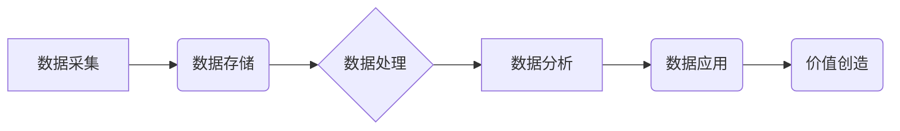

> 平台经济、数据价值、评估体系、数据驱动、商业模式、算法模型、价值链

## 1. 背景介绍

平台经济作为一种新型的经济模式，其核心在于通过搭建平台连接用户和提供商，实现资源的共享和价值的创造。数据作为平台经济的基石，蕴藏着巨大的价值潜力。然而，如何准确评估平台数据价值，并将其转化为实际收益，是平台经济发展面临的重大挑战。

传统的商业模式往往以产品或服务为核心，而平台经济则以数据为核心，数据价值的评估体系也因此显得尤为重要。一个完善的数据价值评估体系能够帮助平台企业：

* **科学决策：** 为平台的战略规划、产品开发、市场营销等决策提供数据支撑，提高决策的准确性和效率。
* **资源优化：** 识别和挖掘数据中的价值，优化资源配置，提高资源利用率。
* **商业模式创新：** 基于数据价值的评估，探索新的商业模式，创造新的价值。
* **风险控制：** 评估数据风险，制定相应的风险控制措施，保障平台的稳定运行。

## 2. 核心概念与联系

**2.1 数据价值的定义**

数据价值是指数据能够为企业或个人创造的经济、社会或其他方面的价值。它是一个多维度的概念，包括：

* **信息价值：** 数据能够提供的信息量和价值。
* **决策价值：** 数据能够支持决策，提高决策的准确性和效率。
* **创新价值：** 数据能够激发创新，创造新的产品、服务或商业模式。
* **运营价值：** 数据能够优化运营流程，提高运营效率。

**2.2 平台经济的数据价值链**

平台经济的数据价值链是指数据从采集、存储、处理到应用的全过程，每个环节都蕴藏着不同的价值。



**2.3 数据价值评估体系**

数据价值评估体系是一个系统化的框架，用于量化和评估数据的价值。它通常包括以下几个方面：

* **数据质量评估：** 评估数据的准确性、完整性、一致性和时效性等指标。
* **数据量评估：** 评估数据的规模和数量。
* **数据特征评估：** 评估数据的类型、结构和分布等特征。
* **数据应用场景评估：** 评估数据在不同应用场景中的价值。

## 3. 核心算法原理 & 具体操作步骤

**3.1 算法原理概述**

数据价值评估算法通常基于机器学习和数据挖掘技术，通过分析数据特征和应用场景，预测数据的潜在价值。常见的算法包括：

* **回归分析：** 建立数据价值与特征之间的线性关系模型，预测数据的价值。
* **决策树：** 通过构建决策树模型，根据数据的特征进行分类，并评估不同类别数据的价值。
* **神经网络：** 利用多层神经网络模型，学习数据特征之间的复杂关系，预测数据的价值。

**3.2 算法步骤详解**

1. **数据收集和预处理：** 收集平台数据，并进行清洗、转换和特征工程等预处理操作。
2. **模型选择和训练：** 选择合适的算法模型，并根据训练数据进行模型训练。
3. **模型评估和优化：** 使用测试数据评估模型的性能，并通过调整模型参数进行优化。
4. **数据价值预测：** 将训练好的模型应用于新的数据，预测数据的价值。

**3.3 算法优缺点**

* **优点：** 能够量化评估数据价值，提供数据驱动的决策支持。
* **缺点：** 算法模型的准确性依赖于训练数据的质量，数据价值评估结果存在一定的误差。

**3.4 算法应用领域**

数据价值评估算法广泛应用于平台经济的各个领域，例如：

* **用户画像：** 评估用户数据的价值，构建用户画像，进行精准营销。
* **内容推荐：** 评估内容数据的价值，推荐用户感兴趣的内容。
* **广告投放：** 评估广告数据的价值，优化广告投放策略。
* **风险控制：** 评估用户行为数据的价值，识别潜在风险，进行风险控制。

## 4. 数学模型和公式 & 详细讲解 & 举例说明

**4.1 数学模型构建**

数据价值评估模型可以构建为一个回归模型，将数据特征作为输入，数据价值作为输出。

**4.2 公式推导过程**

假设数据特征向量为 X，数据价值为 Y，则回归模型可以表示为：

$$Y = f(X, \theta)$$

其中，f() 为回归函数，θ 为模型参数。

**4.3 案例分析与讲解**

例如，评估用户数据的价值，可以构建一个回归模型，将用户特征（例如年龄、性别、兴趣爱好等）作为输入，用户活跃度作为输出。通过训练模型，可以得到用户特征与活跃度的关系，并预测新用户的活跃度。

## 5. 项目实践：代码实例和详细解释说明

**5.1 开发环境搭建**

* Python 3.x
* Jupyter Notebook
* scikit-learn

**5.2 源代码详细实现**

```python
from sklearn.linear_model import LinearRegression
from sklearn.model_selection import train_test_split

# 数据加载和预处理
# ...

# 特征选择
X = data[['age', 'gender', 'interest']]

# 目标变量
y = data['active_users']

# 数据分割
X_train, X_test, y_train, y_test = train_test_split(X, y, test_size=0.2)

# 模型训练
model = LinearRegression()
model.fit(X_train, y_train)

# 模型评估
# ...

# 数据预测
# ...
```

**5.3 代码解读与分析**

* 代码首先加载数据并进行预处理。
* 然后选择用户特征作为输入，用户活跃度作为输出。
* 使用线性回归模型进行训练，并评估模型性能。
* 最后使用训练好的模型预测新用户的活跃度。

**5.4 运行结果展示**

* 模型评估结果，例如R-squared值、均方误差等。
* 预测结果，例如新用户的活跃度预测值。

## 6. 实际应用场景

**6.1 用户画像**

平台可以利用数据价值评估算法，构建用户画像，了解用户的兴趣爱好、消费习惯等信息，为用户提供个性化的服务和推荐。

**6.2 内容推荐**

平台可以评估内容数据的价值，推荐用户感兴趣的内容，提高用户粘性和活跃度。

**6.3 广告投放**

平台可以评估广告数据的价值，优化广告投放策略，提高广告效果。

**6.4 风险控制**

平台可以评估用户行为数据的价值，识别潜在风险，进行风险控制。

**6.5 未来应用展望**

随着数据量的增长和算法的进步，数据价值评估体系将更加完善，应用场景也将更加广泛。例如，可以用于评估数据的隐私价值、安全价值等。

## 7. 工具和资源推荐

**7.1 学习资源推荐**

* 书籍：《数据科学》、《机器学习》
* 在线课程：Coursera、edX、Udacity

**7.2 开发工具推荐**

* Python
* scikit-learn
* TensorFlow

**7.3 相关论文推荐**

* [Data Value Assessment: A Survey](https://arxiv.org/abs/2006.09734)
* [A Framework for Data Value Assessment](https://dl.acm.org/doi/10.1145/3442188.3445971)

## 8. 总结：未来发展趋势与挑战

**8.1 研究成果总结**

数据价值评估体系的研究取得了显著进展，已经形成了较为完善的理论框架和实践方法。

**8.2 未来发展趋势**

* **更加精准的评估方法：** 发展更加精准的数据价值评估方法，能够更准确地量化数据价值。
* **更加全面的价值评估：** 评估数据的不仅仅是经济价值，还包括社会价值、环境价值等。
* **更加智能化的评估系统：** 利用人工智能技术，构建更加智能化的数据价值评估系统。

**8.3 面临的挑战**

* **数据质量问题：** 数据价值评估的准确性依赖于数据质量，如何保证数据质量是一个挑战。
* **数据隐私问题：** 数据价值评估需要使用用户数据，如何保护用户隐私是一个重要问题。
* **标准化问题：** 目前数据价值评估缺乏统一的标准，需要建立行业标准。

**8.4 研究展望**

未来，数据价值评估体系将继续发展，成为平台经济发展的重要支撑。


## 9. 附录：常见问题与解答

**9.1 如何评估数据的价值？**

数据价值评估需要考虑数据的质量、量、特征和应用场景等因素。可以使用回归分析、决策树等算法进行评估。

**9.2 如何保护用户隐私？**

在数据价值评估过程中，需要采取措施保护用户隐私，例如匿名化处理数据、加密传输数据等。

**9.3 数据价值评估的标准是什么？**

目前，数据价值评估缺乏统一的标准，需要行业共同制定标准。

作者：禅与计算机程序设计艺术 / Zen and the Art of Computer Programming 


<end_of_turn>