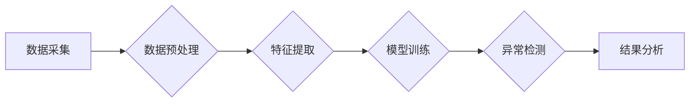

> 异常检测, Anomaly Detection, 机器学习, Machine Learning, 数据挖掘, Data Mining, 统计学, Statistics, 监督学习, Unsupervised Learning, 算法原理, 代码实例, Python

## 1. 背景介绍

在当今数据爆炸的时代，异常检测作为一种重要的数据挖掘技术，在各个领域发挥着越来越重要的作用。异常检测是指从大量数据中识别出与众不同的数据点，这些数据点可能代表着异常事件、欺诈行为、系统故障等。

异常检测技术广泛应用于：

* **金融领域**: 识别欺诈交易、信用风险评估
* **网络安全**: 检测入侵行为、恶意软件攻击
* **医疗领域**: 发现异常医疗记录、诊断疾病
* **工业领域**: 预防设备故障、识别生产异常

传统的异常检测方法主要依赖于手工特征工程，需要专家对数据进行深入分析和理解，效率低下且难以适应复杂的数据场景。随着机器学习技术的快速发展，基于机器学习的异常检测方法逐渐成为主流，能够自动学习数据特征，提高检测精度和效率。

## 2. 核心概念与联系

异常检测的核心是识别数据中的异常点，这些异常点与正常数据点在特征分布上存在显著差异。

**核心概念**:

* **正常数据**: 符合预期模式的数据，占数据总量的绝大部分。
* **异常数据**: 与正常数据分布明显不同的数据，可能代表着异常事件或错误。
* **异常率**: 异常数据占总数据量的比例。

**异常检测流程**:



## 3. 核心算法原理 & 具体操作步骤

### 3.1  算法原理概述

常见的异常检测算法包括：

* **基于统计学的算法**: 
    * **Z-score**: 计算数据点与均值的距离，超过一定阈值的点被视为异常点。
    * **IQR**: 计算数据点的四分位间距，超过一定范围的点被视为异常点。
* **基于机器学习的算法**:
    * **k-近邻 (k-NN)**: 计算数据点与最近k个邻居的距离，距离超过一定阈值的点被视为异常点。
    * **Isolation Forest**: 通过随机选择特征和分割数据，将异常点孤立出来。
    * **One-Class SVM**: 使用支持向量机构建一个边界，将正常数据点包含在内，异常点位于边界外。
    * **Autoencoder**: 使用自动编码器学习数据特征，异常点在编码后的特征空间中与正常数据点分布不同。

### 3.2  算法步骤详解

以 Isolation Forest 算法为例，详细说明其步骤：

1. **随机选择特征**: 从所有特征中随机选择一个特征。
2. **随机选择分割点**: 在选定的特征上随机选择一个分割点。
3. **分割数据**: 将数据点根据分割点进行分割，将数据点分成两部分。
4. **重复步骤1-3**: 重复上述步骤，直到数据点被分割成孤立的点。
5. **计算异常分数**: 每个数据点的异常分数等于被分割的次数。异常分数越高，表示该数据点越可能是异常点。

### 3.3  算法优缺点

| 算法 | 优点 | 缺点 |
|---|---|---|
| Z-score | 简单易实现 | 对异常数据分布敏感 |
| IQR | 对异常值鲁棒性强 | 对数据分布敏感 |
| k-NN | 容易理解 | 容易受到噪声影响 |
| Isolation Forest | 效率高，对高维数据适用 | 难以解释 |
| One-Class SVM | 性能优异 | 训练时间长 |
| Autoencoder | 可以学习复杂特征 | 训练复杂度高 |

### 3.4  算法应用领域

不同的异常检测算法适用于不同的应用场景。例如，Z-score 和 IQR 算法适用于数据分布较为正常的场景，而 Isolation Forest 和 One-Class SVM 算法适用于数据分布复杂或异常数据较少的情况。

## 4. 数学模型和公式 & 详细讲解 & 举例说明

### 4.1  数学模型构建

**Z-score**:

$$
Z = \frac{x - \mu}{\sigma}
$$

其中：

* $x$ 是数据点
* $\mu$ 是数据均值
* $\sigma$ 是数据标准差

**IQR**:

$$
IQR = Q_3 - Q_1
$$

其中：

* $Q_3$ 是数据第三四分位数
* $Q_1$ 是数据第一四分位数

### 4.2  公式推导过程

Z-score 的推导过程：

1. 首先，计算数据点与均值的差值。
2. 然后，将差值除以标准差，得到 Z-score。
3. Z-score 的值表示数据点与均值的距离，单位为标准差。

IQR 的推导过程：

1. 首先，计算数据的三分位数。
2. 然后，将第三四分位数减去第一四分位数，得到 IQR。

### 4.3  案例分析与讲解

**案例**: 假设有一组数据，均值为 10，标准差为 2。

* 数据点 12 的 Z-score 为：

$$
Z = \frac{12 - 10}{2} = 1
$$

* 数据点 8 的 Z-score 为：

$$
Z = \frac{8 - 10}{2} = -1
$$

* 数据点 12 的 Z-score 为 1，表示该数据点比均值高 1 个标准差。
* 数据点 8 的 Z-score 为 -1，表示该数据点比均值低 1 个标准差。

## 5. 项目实践：代码实例和详细解释说明

### 5.1  开发环境搭建

* Python 3.x
* Scikit-learn 库
* Matplotlib 库

### 5.2  源代码详细实现

```python
import numpy as np
from sklearn.ensemble import IsolationForest
from sklearn.datasets import make_blobs
import matplotlib.pyplot as plt

# 生成样本数据
X, y = make_blobs(n_samples=100, centers=2, cluster_std=0.5, random_state=0)

# 训练 Isolation Forest 模型
model = IsolationForest(contamination=0.1)
model.fit(X)

# 预测异常点
y_pred = model.predict(X)

# 可视化结果
plt.scatter(X[:, 0], X[:, 1], c=y_pred, cmap='viridis')
plt.title('Isolation Forest Anomaly Detection')
plt.show()
```

### 5.3  代码解读与分析

* 使用 `make_blobs` 函数生成两个簇的样本数据。
* 使用 `IsolationForest` 类创建异常检测模型，`contamination` 参数设置异常数据比例。
* 使用 `fit` 方法训练模型。
* 使用 `predict` 方法预测异常点，输出结果为 -1 (异常) 或 1 (正常)。
* 使用 `matplotlib` 库可视化结果，将异常点和正常点用不同的颜色区分。

### 5.4  运行结果展示

运行代码后，会生成一个散点图，其中异常点用红色标记，正常点用蓝色标记。

## 6. 实际应用场景

### 6.1  金融领域

* **欺诈交易检测**: 识别信用卡欺诈、网络支付欺诈等异常交易行为。
* **信用风险评估**: 识别高风险客户，降低贷款风险。

### 6.2  网络安全

* **入侵检测**: 检测网络攻击、恶意软件入侵等异常行为。
* **流量分析**: 识别异常流量，防止 DDoS 攻击。

### 6.3  医疗领域

* **疾病诊断**: 识别异常医疗记录，辅助医生诊断疾病。
* **药物不良反应监测**: 识别药物不良反应，提高药物安全。

### 6.4  未来应用展望

随着人工智能技术的不断发展，异常检测技术将应用于更多领域，例如：

* **工业生产**: 预防设备故障，提高生产效率。
* **智能家居**: 检测异常行为，保障家居安全。
* **自动驾驶**: 检测道路异常情况，提高驾驶安全。

## 7. 工具和资源推荐

### 7.1  学习资源推荐

* **书籍**:
    * Anomaly Detection: A Survey
    * Introduction to Machine Learning
* **在线课程**:
    * Coursera: Machine Learning
    * edX: Anomaly Detection

### 7.2  开发工具推荐

* **Python**: 广泛应用于数据科学和机器学习领域。
* **Scikit-learn**: Python 的机器学习库，提供多种异常检测算法。
* **TensorFlow**: 深度学习框架，可以用于构建自定义异常检测模型。

### 7.3  相关论文推荐

* **Isolation Forest**:
    * Liu, F., Ting, K. M., & Zhou, Z. H. (2008). Isolation forest. In Data mining (pp. 413-423). Springer, Berlin, Heidelberg.
* **One-Class SVM**:
    * Schölkopf, B., & Smola, A. J. (2002). Learning with kernels: Support vector machines, regularisation, optimization, and beyond. MIT press.

## 8. 总结：未来发展趋势与挑战

### 8.1  研究成果总结

异常检测技术近年来取得了显著进展，特别是基于机器学习的异常检测方法取得了突破性进展。

### 8.2  未来发展趋势

* **深度学习**: 将深度学习技术应用于异常检测，提高检测精度和效率。
* **联邦学习**: 在保护数据隐私的前提下，利用联邦学习技术进行异常检测。
* **解释性AI**: 提高异常检测模型的解释性，帮助用户理解模型的决策过程。

### 8.3  面临的挑战

* **数据质量**: 异常检测算法对数据质量要求较高，数据噪声和缺失值会影响检测效果。
* **异常类型多样性**: 现实世界中的异常类型多样，难以用单一的算法进行检测。
* **可解释性**: 许多机器学习模型难以解释，这使得异常检测结果难以被用户接受。

### 8.4  研究展望

未来，异常检测技术将朝着更智能、更可解释、更安全的方向发展。


## 9. 附录：常见问题与解答

**Q1: 如何选择合适的异常检测算法？**

**A1:** 选择合适的异常检测算法需要根据具体应用场景和数据特点进行考虑。例如，对于数据分布较为正常的场景，可以使用 Z-score 或 IQR 算法；对于数据分布复杂或异常数据较少的情况，可以使用 Isolation Forest 或 One-Class SVM 算法。

**Q2: 如何评估异常检测模型的性能？**

**A2:** 常见的评估指标包括准确率、召回率、F1-score 等。

**Q3: 如何处理异常数据？**

**A3:** 处理异常数据的方法包括：删除异常数据、修正异常数据、进行异常分析等。

**Q4: 如何提高异常检测模型的精度？**

**A4:** 可以通过以下方法提高异常检测模型的精度：

* 提高数据质量
* 使用更复杂的算法
* 结合多个算法进行融合
* 使用迁移学习技术

**Q5: 异常检测技术有哪些伦理问题？**

**A5:** 异常检测技术可能会导致数据隐私泄露、算法偏见等伦理问题。因此，在应用异常检测技术时，需要考虑伦理问题，并采取相应的措施进行规避。


作者：禅与计算机程序设计艺术 / Zen and the Art of Computer Programming 
<end_of_turn>