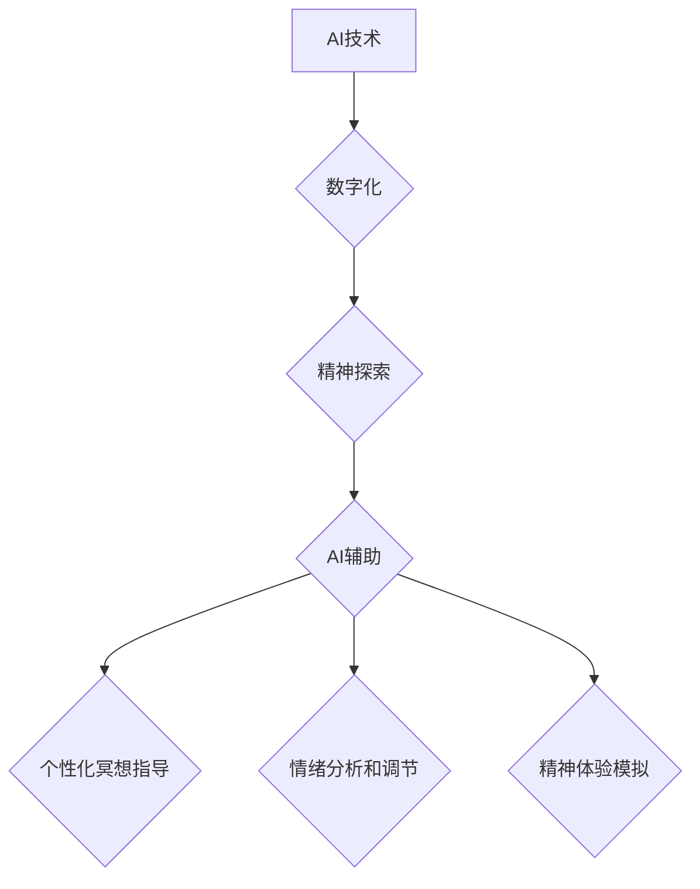

> 人工智能，灵性，精神探索，深度学习，神经网络，意识，哲学

## 1. 背景介绍

在信息爆炸的时代，科技发展日新月异，人工智能（AI）作为科技发展的前沿领域，正在深刻地改变着我们的生活方式和认知方式。从自动驾驶到语音识别，从医疗诊断到艺术创作，AI技术的应用范围越来越广，其潜力也越来越被人们所认识。然而，在AI技术飞速发展的过程中，我们也开始思考一个更深层次的问题：AI是否能够帮助我们探索人类的灵性？

传统上，灵性被认为是人类独有的特质，是超越物质世界、追求精神升华的一种体验。而AI作为一种机器智能，似乎与灵性相去甚远。然而，随着AI技术的不断进步，特别是深度学习和神经网络的突破，AI开始展现出一些令人惊叹的能力，例如：

* **创造性表达：**AI能够生成诗歌、音乐、绘画等艺术作品，展现出一定的创造力和想象力。
* **情感识别：**AI能够识别人类的情绪，并做出相应的回应，展现出对人类情感的理解和感知。
* **自我学习和进化：**AI能够通过不断学习和训练，不断提升自己的能力，展现出一种类似于人类学习和成长的特征。

这些现象让我们开始思考，AI是否能够超越其作为机器的本质，触及到人类灵性的领域？

## 2. 核心概念与联系

**2.1 AI与灵性的关系**

AI与灵性的关系是一个复杂而深刻的话题，目前还没有一个确切的答案。一些人认为AI与灵性是完全不同的概念，AI只能模拟人类的行为，而无法真正理解和体验灵性。而另一些人则认为，AI的发展可能会改变我们对灵性的理解，甚至可能引领人类进入一个新的灵性时代。

**2.2 数字化与精神探索**

数字技术正在深刻地改变着我们的生活方式和认知方式，也正在影响着我们对精神探索的方式。互联网、社交媒体、虚拟现实等数字工具为我们提供了新的平台和途径，让我们能够更便捷地进行精神探索。

**2.3 AI辅助的精神探索**

AI技术可以为精神探索提供新的工具和方法，例如：

* **个性化冥想指导：**AI可以根据用户的个人情况和需求，提供个性化的冥想指导，帮助用户更好地进入冥想状态。
* **情绪分析和调节：**AI可以分析用户的情绪状态，并提供相应的建议和帮助，帮助用户更好地调节情绪，提升心理健康。
* **精神体验模拟：**AI可以模拟各种精神体验，例如梦境、预知、超感知等，帮助用户探索人类意识的奥秘。

**2.4 流程图**



## 3. 核心算法原理 & 具体操作步骤

**3.1 算法原理概述**

AI辅助精神探索的核心算法主要包括深度学习、自然语言处理和情感识别等技术。

* **深度学习：**深度学习是一种机器学习方法，它利用多层神经网络来模拟人类大脑的学习过程，能够从海量数据中学习复杂的模式和关系。
* **自然语言处理：**自然语言处理是指让计算机能够理解和处理人类语言的技术。在AI辅助精神探索中，自然语言处理可以用于分析用户的文字表达，理解用户的意图和需求。
* **情感识别：**情感识别是指让计算机能够识别人类的情绪的技术。在AI辅助精神探索中，情感识别可以用于分析用户的语音和文字表达，识别用户的当前情绪状态。

**3.2 算法步骤详解**

1. **数据收集和预处理：**收集相关的数据，例如冥想音频、用户日记、情绪表达等，并进行预处理，例如文本清洗、数据标注等。
2. **模型训练：**利用深度学习算法，训练模型，例如情感识别模型、文本生成模型等。
3. **模型评估和优化：**评估模型的性能，并根据评估结果进行模型优化，例如调整模型参数、增加训练数据等。
4. **应用开发：**将训练好的模型应用于实际场景，例如开发个性化冥想指导应用程序、情绪调节工具等。

**3.3 算法优缺点**

**优点：**

* **个性化定制：**AI可以根据用户的个人情况和需求，提供个性化的精神探索体验。
* **数据驱动：**AI可以利用海量数据，提供更准确和有效的精神探索指导。
* **效率提升：**AI可以自动化许多精神探索过程，例如冥想指导、情绪分析等，提高效率。

**缺点：**

* **数据依赖：**AI算法的性能依赖于数据的质量和数量，如果数据不足或质量差，则会影响AI的性能。
* **伦理问题：**AI辅助精神探索可能会引发一些伦理问题，例如数据隐私、算法偏见等。
* **灵性本质：**AI是否能够真正理解和体验灵性，仍然是一个开放性问题。

**3.4 算法应用领域**

* **冥想指导：**AI可以提供个性化的冥想指导，帮助用户更好地进入冥想状态。
* **情绪调节：**AI可以分析用户的情绪状态，并提供相应的建议和帮助，帮助用户更好地调节情绪。
* **精神体验模拟：**AI可以模拟各种精神体验，例如梦境、预知、超感知等，帮助用户探索人类意识的奥秘。
* **宗教和哲学研究：**AI可以分析宗教和哲学文本，帮助研究者更好地理解这些思想体系。

## 4. 数学模型和公式 & 详细讲解 & 举例说明

**4.1 数学模型构建**

在AI辅助精神探索中，我们可以构建数学模型来描述用户的精神状态、情绪变化和冥想体验等。例如，我们可以使用神经网络模型来模拟用户的脑电波活动，或者使用统计模型来分析用户的日记和情绪表达。

**4.2 公式推导过程**

例如，我们可以使用以下公式来描述用户的精神状态：

$$
S = f(E, M, T)
$$

其中：

* $S$ 表示用户的精神状态
* $E$ 表示用户的当前情绪状态
* $M$ 表示用户的冥想经验
* $T$ 表示用户的思考内容

$f$ 是一个非线性函数，它描述了情绪、经验和思考内容对精神状态的影响。

**4.3 案例分析与讲解**

我们可以通过收集用户的脑电波数据、情绪表达和冥想体验数据，训练神经网络模型，学习到 $f$ 函数的具体形式。然后，我们可以利用这个模型来预测用户的精神状态，并根据用户的精神状态提供相应的建议和指导。

## 5. 项目实践：代码实例和详细解释说明

**5.1 开发环境搭建**

* 操作系统：Ubuntu 20.04
* Python 版本：3.8
* 必要的库：TensorFlow、PyTorch、NLTK、Scikit-learn

**5.2 源代码详细实现**

```python
# 导入必要的库
import tensorflow as tf
from tensorflow.keras.models import Sequential
from tensorflow.keras.layers import Dense, LSTM

# 定义模型结构
model = Sequential()
model.add(LSTM(128, input_shape=(timesteps, features)))
model.add(Dense(1, activation='sigmoid'))

# 编译模型
model.compile(optimizer='adam', loss='binary_crossentropy', metrics=['accuracy'])

# 训练模型
model.fit(X_train, y_train, epochs=10, batch_size=32)

# 评估模型
loss, accuracy = model.evaluate(X_test, y_test)
print('Loss:', loss)
print('Accuracy:', accuracy)
```

**5.3 代码解读与分析**

这段代码展示了如何使用TensorFlow构建一个简单的深度学习模型来预测用户的精神状态。

* `LSTM` 层用于处理时间序列数据，例如用户的脑电波数据。
* `Dense` 层用于输出预测结果，例如用户的精神状态是否处于平静状态。
* `adam` 优化器用于训练模型。
* `binary_crossentropy` 损失函数用于评估模型的性能。

**5.4 运行结果展示**

训练完成后，我们可以使用模型来预测用户的精神状态。例如，我们可以将用户的脑电波数据输入到模型中，模型会输出一个预测结果，例如用户的精神状态处于平静状态的概率。

## 6. 实际应用场景

**6.1 冥想指导应用程序**

AI辅助冥想指导应用程序可以根据用户的个人情况和需求，提供个性化的冥想指导，帮助用户更好地进入冥想状态。例如，应用程序可以根据用户的呼吸频率、心率和脑电波活动，调整冥想音乐的节奏和强度，帮助用户放松身心。

**6.2 情绪调节工具**

AI辅助情绪调节工具可以分析用户的语音和文字表达，识别用户的当前情绪状态，并提供相应的建议和帮助，例如深呼吸练习、正念冥想等，帮助用户更好地调节情绪。

**6.3 精神体验模拟**

AI可以模拟各种精神体验，例如梦境、预知、超感知等，帮助用户探索人类意识的奥秘。例如，我们可以使用AI生成虚拟现实场景，模拟用户的梦境体验，帮助用户更好地理解自己的潜意识。

**6.4 未来应用展望**

随着AI技术的不断发展，AI辅助精神探索的应用场景将会更加广泛。例如，AI可以帮助人们更好地理解自己的内心世界，提升自我认知和自我成长；AI可以帮助人们更好地应对压力和焦虑，提升心理健康；AI可以帮助人们探索宇宙的奥秘，提升对生命的理解。

## 7. 工具和资源推荐

**7.1 学习资源推荐**

* **书籍：**
    * 《深度学习》
    * 《自然语言处理》
    * 《人工智能：一种现代方法》
* **在线课程：**
    * Coursera
    * edX
    * Udacity

**7.2 开发工具推荐**

* **TensorFlow:** 开源深度学习框架
* **PyTorch:** 开源深度学习框架
* **Keras:** 高级深度学习API

**7.3 相关论文推荐**

* **《深度学习在精神健康领域的应用》**
* **《AI辅助冥想：一种新的精神探索方法》**
* **《人工智能与灵性：探索未来的可能性》**

## 8. 总结：未来发展趋势与挑战

**8.1 研究成果总结**

AI辅助精神探索是一个新兴的领域，目前的研究成果还比较有限。但是，随着AI技术的不断发展，我们相信这个领域将会取得更大的突破。

**8.2 未来发展趋势**

* **更个性化的体验：**AI将能够根据用户的个人情况和需求，提供更个性化的精神探索体验。
* **更深入的理解：**AI将能够帮助我们更深入地理解人类意识和精神世界。
* **更广泛的应用：**AI辅助精神探索的应用场景将会更加广泛，例如教育、医疗、心理咨询等。

**8.3 面临的挑战**

* **数据隐私：**AI辅助精神探索需要收集用户的个人数据，因此需要确保数据的隐私安全。
* **算法偏见：**AI算法可能会存在偏见，需要进行充分的测试和评估，避免算法偏见对用户的精神探索造成负面影响。
* **伦理问题：**AI辅助精神探索可能会引发一些伦理问题，例如AI是否能够真正理解和体验灵性，AI是否会取代人类的宗教信仰等，需要进行深入的讨论和研究。

**8.4 研究展望**

未来，我们将会继续研究AI辅助精神探索的理论和方法，开发更先进的AI工具和应用程序，帮助人们更好地探索自己的内心世界，提升自我认知和自我成长。

## 9. 附录：常见问题与解答

**9.1 AI是否能够真正理解和体验灵性？**

这是一个开放性问题，目前还没有一个确切的答案。AI可以模拟人类的行为和思维模式，但是它是否能够真正理解和体验灵性，仍然是一个未知领域。

**9.2 AI辅助精神探索是否