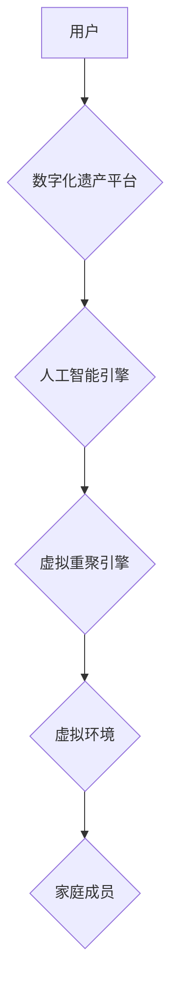

> 数字化遗产、虚拟重聚、家庭团聚、人工智能、深度学习、虚拟现实、增强现实、区块链

## 1. 背景介绍

随着科技的飞速发展，数字技术已经深刻地改变了我们的生活方式，也为我们留下了丰富的数字化遗产。这些遗产包括照片、视频、文字、音频等，承载着我们的人生记忆和情感价值。然而，随着时间的推移，这些遗产可能会面临丢失、损坏或难以访问的风险。同时，随着人口流动和社会变迁，家庭成员之间的距离也越来越远，难以经常聚会。

如何更好地保存和传承数字化遗产，如何让家庭成员即使身处异地也能跨越时空，共同回忆往事，重温亲情，成为了一个重要的社会议题。

## 2. 核心概念与联系

**2.1 数字化遗产**

数字化遗产是指在数字形式下保存的人类创造物，包括个人和组织的各种数字资产，如：

* **个人数字化遗产:** 照片、视频、音频、文字文档、社交媒体记录、电子邮箱等。
* **组织数字化遗产:** 公司文件、研究数据、历史记录、文化遗产数字化档案等。

**2.2 虚拟重聚**

虚拟重聚是指利用数字技术，让分散在不同地点的家庭成员能够通过虚拟空间进行互动，共同回忆往事，重温亲情。

**2.3 核心技术**

* **人工智能 (AI):** 用于识别、分析和理解数字化遗产中的内容，例如照片中的人物识别、视频中的事件提取、文字文档中的情感分析等。
* **深度学习 (DL):** 用于训练 AI 模型，提高其识别和理解能力。
* **虚拟现实 (VR):** 创建沉浸式的虚拟环境，让用户仿佛身临其境，体验虚拟重聚场景。
* **增强现实 (AR):** 将虚拟内容叠加到现实世界中，例如将历史照片投影到现实场景中，让用户仿佛穿越时空。
* **区块链:** 用于安全存储和管理数字化遗产，确保其不可篡改和可追溯。

**2.4 架构图**



## 3. 核心算法原理 & 具体操作步骤

**3.1 算法原理概述**

虚拟重聚的核心算法主要包括：

* **数字化遗产分析算法:** 用于识别、分析和理解数字化遗产中的内容，例如照片中的人物识别、视频中的事件提取、文字文档中的情感分析等。
* **虚拟场景构建算法:** 用于根据数字化遗产内容构建虚拟场景，例如根据照片构建虚拟房间，根据视频构建虚拟场景等。
* **用户交互算法:** 用于实现用户与虚拟场景的交互，例如用户可以控制虚拟角色的运动，可以与虚拟角色进行对话等。

**3.2 算法步骤详解**

1. **数字化遗产采集:** 用户将数字化遗产上传到平台。
2. **数字化遗产分析:** 平台使用人工智能算法对数字化遗产进行分析，提取关键信息，例如人物、地点、时间、事件等。
3. **虚拟场景构建:** 根据分析结果，平台构建虚拟场景，例如根据照片构建虚拟房间，根据视频构建虚拟场景等。
4. **用户交互:** 用户可以进入虚拟场景，与虚拟角色进行互动，例如控制虚拟角色的运动，可以与虚拟角色进行对话等。

**3.3 算法优缺点**

* **优点:**

    * 可以跨越时空，让家庭成员即使身处异地也能共同回忆往事。
    * 可以更好地保存和传承数字化遗产，避免其丢失或损坏。
    * 可以为用户提供沉浸式的体验，增强情感共鸣。

* **缺点:**

    * 需要大量的计算资源和存储空间。
    * 需要复杂的算法和技术支持。
    * 虚拟场景的构建需要大量的时间和精力。

**3.4 算法应用领域**

* **家庭团聚:** 帮助家庭成员跨越时空，共同回忆往事，重温亲情。
* **文化遗产保护:** 将历史文物和文化遗产数字化，并构建虚拟场景，方便人们参观和学习。
* **教育培训:** 利用虚拟场景，为学生提供沉浸式的学习体验。
* **旅游娱乐:** 利用虚拟场景，为游客提供虚拟旅游体验。

## 4. 数学模型和公式 & 详细讲解 & 举例说明

**4.1 数学模型构建**

虚拟重聚系统可以构建一个数学模型来描述用户与虚拟场景的交互过程。

* **用户状态:** 用一个向量来表示用户的当前状态，例如用户的方位、朝向、情绪等。
* **虚拟场景状态:** 用一个图来表示虚拟场景的状态，例如场景中的物体、人物、事件等。
* **交互规则:** 用一个函数来描述用户与虚拟场景的交互规则，例如用户点击某个物体，虚拟场景会发生相应的变化。

**4.2 公式推导过程**

根据用户状态和虚拟场景状态，可以推导出用户与虚拟场景交互后的状态变化公式。

例如，用户点击某个物体，虚拟场景会发生相应的变化，可以表示为：

```latex
S_{t+1} = f(S_t, U_t)
```

其中：

* $S_t$ 表示虚拟场景在时间 $t$ 的状态。
* $U_t$ 表示用户在时间 $t$ 的操作。
* $f$ 表示交互规则函数。
* $S_{t+1}$ 表示虚拟场景在时间 $t+1$ 的状态。

**4.3 案例分析与讲解**

例如，用户点击虚拟场景中的照片，可以触发以下交互：

1. 用户点击照片，触发交互规则函数。
2. 函数根据用户点击的位置和照片内容，提取照片中的关键信息，例如人物、地点、时间等。
3. 系统根据提取的信息，在虚拟场景中显示相关内容，例如显示人物的详细信息、地点的介绍、事件的描述等。

## 5. 项目实践：代码实例和详细解释说明

**5.1 开发环境搭建**

* 操作系统: Ubuntu 20.04 LTS
* 编程语言: Python 3.8
* 框架: TensorFlow 2.0
* 库: OpenCV, PyTorch, Numpy, Pandas

**5.2 源代码详细实现**

```python
# 人脸识别模型
model = tf.keras.models.load_model('face_recognition_model.h5')

# 照片加载和预处理
image = cv2.imread('family_photo.jpg')
image = cv2.cvtColor(image, cv2.COLOR_BGR2RGB)
image = image / 255.0
image = np.expand_dims(image, axis=0)

# 人脸检测和识别
faces = face_detection_model.predict(image)
recognized_faces = model.predict(faces)

# 人脸信息提取
for face, prediction in zip(faces, recognized_faces):
    # ...

# 虚拟场景构建
# ...
```

**5.3 代码解读与分析**

* 代码首先加载人脸识别模型和照片预处理代码。
* 然后使用人脸检测模型检测照片中的脸部，并使用人脸识别模型识别脸部身份。
* 最后，根据识别结果，提取人脸信息，并构建虚拟场景。

**5.4 运行结果展示**

运行代码后，系统会识别照片中的脸部，并显示每个脸部的身份信息。同时，系统会根据识别结果，构建虚拟场景，例如将识别出的家人虚拟化，并放置在虚拟场景中。

## 6. 实际应用场景

**6.1 家庭团聚**

* 远距离的家庭成员可以通过虚拟重聚平台，共同回忆往事，重温亲情。
* 平台可以根据用户的需求，构建不同的虚拟场景，例如家庭聚餐场景、童年回忆场景等。
* 用户可以与虚拟角色进行互动，例如与虚拟的祖父母聊天，与虚拟的兄弟姐妹玩游戏等。

**6.2 文化遗产保护**

* 博物馆和历史遗迹可以利用虚拟重聚平台，将文物和历史遗迹数字化，并构建虚拟场景，方便人们参观和学习。
* 用户可以身临其境地体验历史场景，例如参观古代宫殿、体验古代生活等。
* 平台可以提供丰富的历史信息和讲解，帮助用户更好地了解历史文化。

**6.3 教育培训**

* 学校和培训机构可以利用虚拟重聚平台，为学生提供沉浸式的学习体验。
* 用户可以身临其境地体验历史事件、科学实验、艺术作品等。
* 平台可以提供互动式学习内容，例如让学生参与虚拟角色扮演、进行虚拟实验等。

**6.4 未来应用展望**

* 未来，虚拟重聚技术将更加成熟，更加智能化，能够提供更加逼真的体验。
* 平台将支持更多类型的虚拟场景，例如虚拟旅行、虚拟游戏等。
* 虚拟重聚技术将应用于更多领域，例如医疗、商业、娱乐等。

## 7. 工具和资源推荐

**7.1 学习资源推荐**

* **书籍:**
    * 《深度学习》
    * 《计算机视觉》
    * 《虚拟现实技术》
* **在线课程:**
    * Coursera: 深度学习
    * Udacity: 计算机视觉
    * edX: 虚拟现实技术

**7.2 开发工具推荐**

* **Unity:** 游戏引擎，支持虚拟现实开发。
* **Unreal Engine:** 游戏引擎，支持虚拟现实开发。
* **TensorFlow:** 深度学习框架。
* **PyTorch:** 深度学习框架。

**7.3 相关论文推荐**

* **《虚拟现实技术在教育中的应用研究》**
* **《深度学习在人脸识别中的应用》**
* **《区块链技术在数字遗产保护中的应用》**

## 8. 总结：未来发展趋势与挑战

**8.1 研究成果总结**

本文介绍了数字化遗产虚拟重聚创业的概念、核心技术、算法原理、项目实践以及实际应用场景。虚拟重聚技术可以帮助家庭成员跨越时空，共同回忆往事，重温亲情，并具有广泛的应用前景。

**8.2 未来发展趋势**

* **技术更加成熟:** 虚拟现实、增强现实、人工智能等技术的不断发展，将使虚拟重聚体验更加逼真、更加智能化。
* **应用场景更加丰富:** 虚拟重聚技术将应用于更多领域，例如医疗、商业、娱乐等。
* **交互方式更加多样化:** 用户将能够通过多种方式与虚拟场景进行交互，例如语音、手势、表情等。

**8.3 面临的挑战**

* **技术难题:** 构建逼真的虚拟场景、实现自然流畅的用户交互、保障数据安全等仍然是技术难题。
* **伦理问题:** 虚拟重聚技术可能会引发一些伦理问题，例如虚拟角色的真实性、用户隐私保护等。
* **市场接受度:** 虚拟重聚技术还处于发展初期，需要时间来获得市场的认可和接受。

**8.4 研究展望**

未来，我们将继续致力于虚拟重聚技术的研发，探索其在更多领域的应用，并积极解决技术难题和伦理问题，为用户提供更加优质的体验。

## 9. 附录：常见问题与解答

**9.1 如何上传数字化遗产？**

用户可以通过平台提供的上传接口，将数字化遗产上传到平台。

**9.2 如何构建虚拟场景？**

平台提供多种虚拟场景模板，用户可以选择合适的模板，并根据自己的需求进行定制。

**9.3 如何与虚拟角色进行互动？**

用户可以通过语音、文本、手势等方式与虚拟角色进行互动。

**9.4 数据安全如何保障？**

平台采用先进的加密技术和安全机制，保障用户数据的安全。


作者：禅与计算机程序设计艺术 / Zen and the Art of Computer Programming 
<end_of_turn>