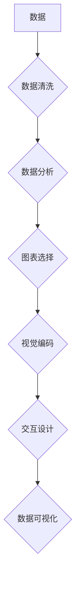

> 数据可视化, 数据分析, 图表类型, 算法原理, 代码实现, Python, Matplotlib, Seaborn, Tableau

## 1. 背景介绍

在海量数据时代，有效地理解和分析数据至关重要。数据可视化作为一种强大的工具，能够将复杂的数据转化为直观易懂的图形和图表，帮助我们快速发现数据中的模式、趋势和异常。数据可视化不仅可以辅助数据分析，还可以用于数据探索、数据沟通和数据决策等多个领域。

随着技术的不断发展，数据可视化技术也取得了长足的进步。从传统的柱状图、折线图到更复杂的交互式图表，数据可视化工具和技术不断丰富，为我们提供了更灵活、更强大的数据呈现方式。

## 2. 核心概念与联系

数据可视化涉及到多个核心概念，包括数据类型、图表类型、视觉编码、交互设计等。这些概念相互关联，共同构成了数据可视化的完整体系。

**数据类型:** 数据可视化处理的数据类型多种多样，包括数值型、分类型、时间型等。不同的数据类型需要采用不同的图表类型进行呈现。

**图表类型:** 图表类型是数据可视化的核心组成部分，常见的图表类型包括柱状图、折线图、饼图、散点图、地图等。不同的图表类型擅长呈现不同的数据特征。

**视觉编码:** 视觉编码是指将数据映射到图形的视觉属性，例如颜色、大小、形状、位置等。通过合理的视觉编码，可以使数据更加直观易懂。

**交互设计:** 交互设计是指用户可以与图表进行交互，例如放大、缩小、筛选、过滤等。交互设计可以增强用户体验，并帮助用户更深入地理解数据。

**Mermaid 流程图:**



## 3. 核心算法原理 & 具体操作步骤

### 3.1  算法原理概述

数据可视化算法主要涉及数据处理、图表生成和交互设计等方面。

**数据处理:** 数据处理包括数据清洗、数据转换和数据聚合等步骤。数据清洗是指去除数据中的错误、缺失和重复数据；数据转换是指将数据转换为适合可视化的格式；数据聚合是指将数据进行分组和汇总。

**图表生成:** 图表生成是指根据数据和图表类型生成相应的图形和图表。常见的图表生成算法包括柱状图算法、折线图算法、饼图算法等。

**交互设计:** 交互设计是指设计用户与图表交互的方式，例如鼠标点击、拖动、缩放等。交互设计算法需要考虑用户体验和数据可读性。

### 3.2  算法步骤详解

**数据处理步骤:**

1. **数据收集:** 从各种数据源收集数据。
2. **数据清洗:** 去除数据中的错误、缺失和重复数据。
3. **数据转换:** 将数据转换为适合可视化的格式。
4. **数据聚合:** 将数据进行分组和汇总。

**图表生成步骤:**

1. **图表选择:** 根据数据特征和可视化目标选择合适的图表类型。
2. **视觉编码:** 将数据映射到图形的视觉属性，例如颜色、大小、形状、位置等。
3. **图表布局:** 确定图表元素的布局和位置。
4. **图表生成:** 使用图表生成算法生成相应的图形和图表。

**交互设计步骤:**

1. **交互方式设计:** 设计用户与图表交互的方式，例如鼠标点击、拖动、缩放等。
2. **交互逻辑设计:** 设计用户交互的逻辑流程。
3. **交互效果设计:** 设计交互效果，例如动画、提示等。

### 3.3  算法优缺点

**优点:**

* 数据可视化算法能够有效地将复杂的数据转化为直观易懂的图形和图表，帮助我们快速发现数据中的模式、趋势和异常。
* 数据可视化算法可以用于数据分析、数据探索、数据沟通和数据决策等多个领域。

**缺点:**

* 数据可视化算法需要一定的专业知识和经验，才能选择合适的图表类型和视觉编码方式。
* 数据可视化算法可能会受到数据质量和数据量的影响，需要进行数据清洗和数据聚合等步骤。

### 3.4  算法应用领域

数据可视化算法广泛应用于各个领域，例如：

* **商业分析:** 分析销售数据、市场趋势和客户行为。
* **金融分析:** 分析股票价格、投资回报和风险评估。
* **科学研究:** 分析实验数据、研究结果和模型预测。
* **医疗保健:** 分析患者数据、疾病流行和医疗资源分配。
* **教育:** 分析学生成绩、学习进度和教学效果。

## 4. 数学模型和公式 & 详细讲解 & 举例说明

### 4.1  数学模型构建

数据可视化算法中，数学模型通常用于描述数据之间的关系、图表元素的布局和交互逻辑。例如，可以使用线性回归模型来预测数据趋势，可以使用圆形布局算法来排列图表元素，可以使用贝叶斯网络来描述交互逻辑。

### 4.2  公式推导过程

**线性回归模型:**

假设我们有一组数据点 $(x_1, y_1), (x_2, y_2), ..., (x_n, y_n)$, 我们想要找到一条直线 $y = mx + c$ 来拟合这些数据点。

线性回归模型的目标是找到最佳的 $m$ 和 $c$ 值，使得误差最小。误差可以定义为每个数据点到直线的距离。

可以使用最小二乘法来求解 $m$ 和 $c$ 的最佳值。最小二乘法的原理是，找到一条直线，使得所有数据点到直线的距离的平方和最小。

**公式推导:**

$$
\begin{aligned}
m &= \frac{\sum_{i=1}^{n}(x_i - \bar{x})(y_i - \bar{y})}{\sum_{i=1}^{n}(x_i - \bar{x})^2} \\
c &= \bar{y} - m\bar{x}
\end{aligned}
$$

其中，$\bar{x}$ 和 $\bar{y}$ 分别是 $x$ 和 $y$ 的平均值。

### 4.3  案例分析与讲解

**案例:**

假设我们有一组数据，表示不同温度下的水煮沸时间。

| 温度 (°C) | 煮沸时间 (分钟) |
|---|---|
| 100 | 1 |
| 90 | 2 |
| 80 | 3 |
| 70 | 4 |

我们可以使用线性回归模型来预测不同温度下的水煮沸时间。

**分析:**

根据上述数据，我们可以使用最小二乘法求解 $m$ 和 $c$ 的最佳值。然后，我们可以使用公式 $y = mx + c$ 来预测不同温度下的水煮沸时间。

## 5. 项目实践：代码实例和详细解释说明

### 5.1  开发环境搭建

本项目使用 Python 语言进行开发，需要安装以下软件：

* Python 3.x
* Matplotlib
* Seaborn

可以使用 pip 命令安装这些软件：

```
pip install matplotlib seaborn
```

### 5.2  源代码详细实现

```python
import matplotlib.pyplot as plt
import seaborn as sns

# 数据
x = [100, 90, 80, 70]
y = [1, 2, 3, 4]

# 创建散点图
plt.figure(figsize=(8, 6))
sns.scatterplot(x=x, y=y, color='blue', marker='o', s=80)

# 添加标题和标签
plt.title('水煮沸时间与温度的关系')
plt.xlabel('温度 (°C)')
plt.ylabel('煮沸时间 (分钟)')

# 显示图形
plt.show()
```

### 5.3  代码解读与分析

* `import matplotlib.pyplot as plt`: 导入 Matplotlib 库，并使用别名 `plt` 进行引用。
* `import seaborn as sns`: 导入 Seaborn 库，并使用别名 `sns` 进行引用。
* `x = [100, 90, 80, 70]`: 定义温度数据。
* `y = [1, 2, 3, 4]`: 定义煮沸时间数据。
* `plt.figure(figsize=(8, 6))`: 创建一个新的图形窗口，设置窗口大小为 8x6 英寸。
* `sns.scatterplot(x=x, y=y, color='blue', marker='o', s=80)`: 使用 Seaborn 库的 `scatterplot` 函数创建散点图，设置颜色为蓝色、标记为圆形、点的大小为 80。
* `plt.title('水煮沸时间与温度的关系')`: 设置图形标题。
* `plt.xlabel('温度 (°C)')`: 设置 x 轴标签。
* `plt.ylabel('煮沸时间 (分钟)')`: 设置 y 轴标签。
* `plt.show()`: 显示图形。

### 5.4  运行结果展示

运行上述代码，将生成一个散点图，展示温度与水煮沸时间之间的关系。

## 6. 实际应用场景

数据可视化在各个领域都有广泛的应用场景，例如：

### 6.1  商业分析

* **销售分析:** 使用柱状图和折线图展示销售额、产品销量和市场份额的变化趋势。
* **客户分析:** 使用散点图和热力图展示客户特征、购买行为和客户满意度。
* **营销分析:** 使用饼图和地图展示营销活动效果、目标客户分布和市场覆盖率。

### 6.2  金融分析

* **股票分析:** 使用折线图和K线图展示股票价格走势、技术指标和交易量。
* **风险分析:** 使用散点图和热力图展示投资组合风险、资产配置和市场波动。
* **财务分析:** 使用柱状图和饼图展示财务报表数据、利润结构和现金流量。

### 6.3  科学研究

* **数据探索:** 使用散点图、箱线图和热力图探索实验数据、研究结果和模型预测。
* **可视化模型:** 使用三维图形和交互式图表可视化科学模型、数据结构和算法流程。
* **科学传播:** 使用图表和动画将科学研究成果以直观易懂的方式呈现给大众。

### 6.4  未来应用展望

随着人工智能、大数据和云计算技术的不断发展，数据可视化技术将迎来更加广泛的应用场景和发展机遇。

* **人工智能驱动的可视化:** 利用人工智能算法自动生成数据可视化，并提供个性化和智能化的可视化体验。
* **沉浸式可视化:** 使用虚拟现实和增强现实技术，构建沉浸式的可视化环境，增强用户体验和数据理解能力。
* **实时可视化:** 利用实时数据流和云计算平台，实现对实时数据的可视化分析和监控。

## 7. 工具和资源推荐

### 7.1  学习资源推荐

* **书籍:**
    * 《数据可视化：设计与实践》
    * 《Storytelling with Data: A Data Visualization Guide for Business Professionals》
    * 《The Visual Display of Quantitative Information》
* **在线课程:**
    * Coursera: Data Visualization Specialization
    * edX: Data Visualization with Tableau
    * Udemy: Data Visualization with Python

### 7.2  开发工具推荐

* **Python 库:**
    * Matplotlib
    * Seaborn
    * Plotly
    * Bokeh
* **商业工具:**
    * Tableau
    * Power BI
    * Qlik Sense

### 7.3  相关论文推荐

* **"The Visual Display of Quantitative Information" by Edward Tufte**
* **"Designing Data-Intensive Applications" by Martin Kleppmann**
* **"Information Visualization